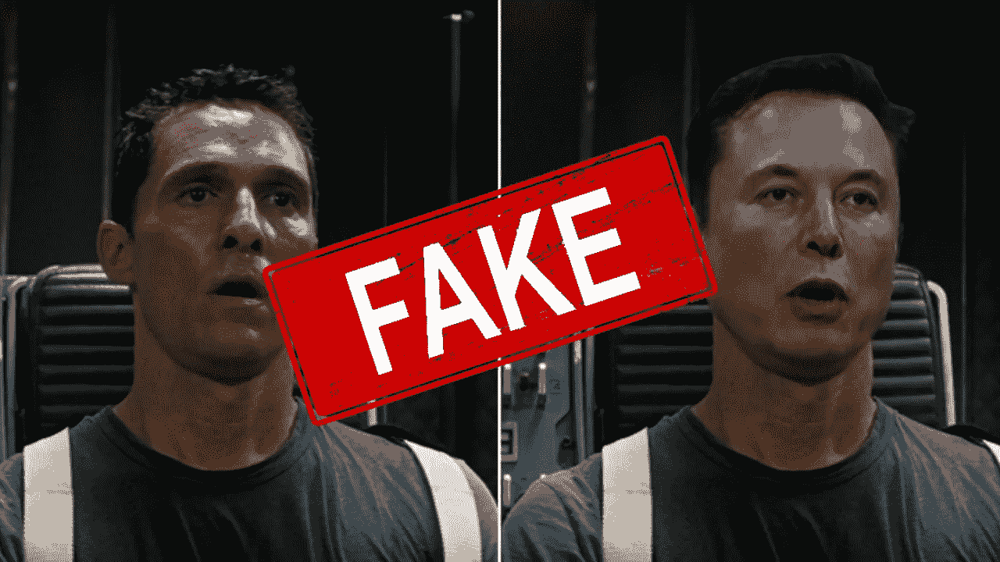
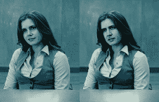
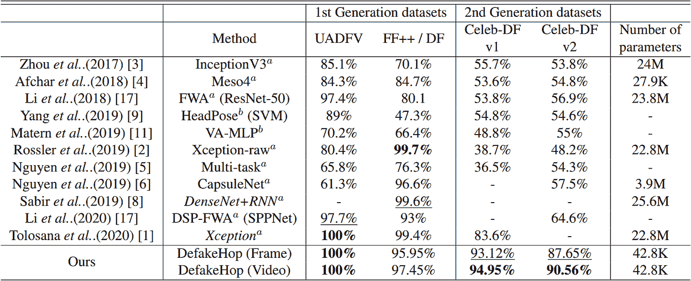
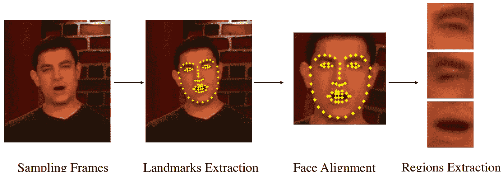
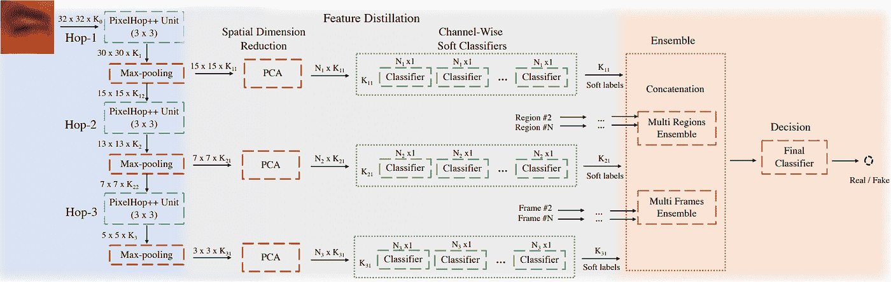
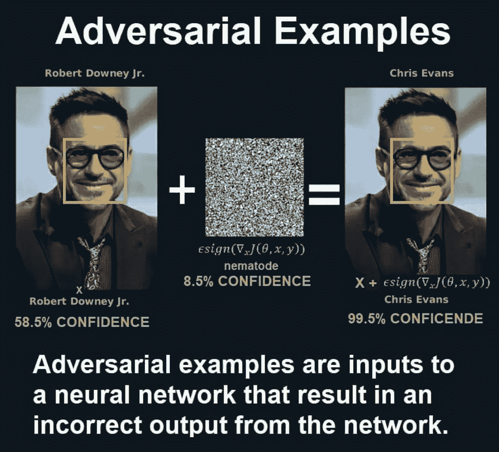
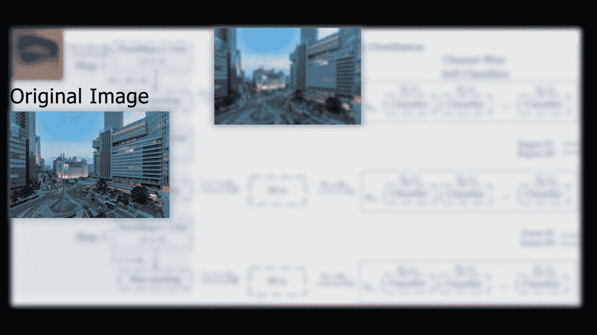
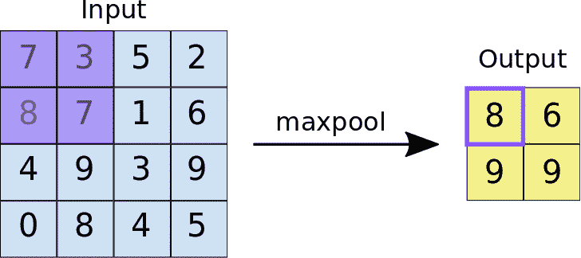
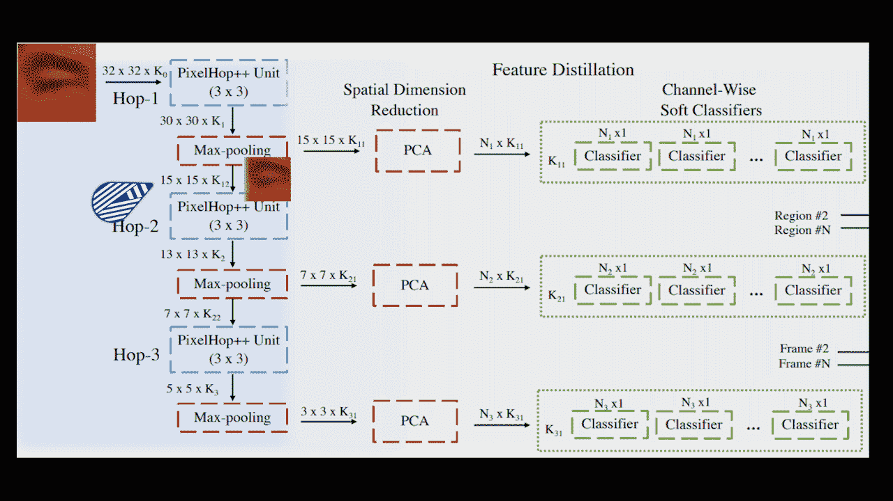
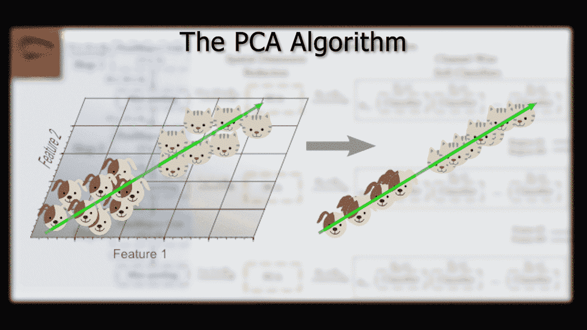

# 2021 年如何识破深度假

> 原文：<https://pub.towardsai.net/how-to-spot-a-deep-fake-in-2021-3067ebb218fe?source=collection_archive---------3----------------------->

## [计算机视觉](https://towardsai.net/p/category/computer-vision)

## 突破性的美国陆军技术使用人工智能寻找 deepfakes。

> *原载于*[*louisbouchard . ai*](https://www.louisbouchard.ai/spot-deepfakes/)*，前两天看了我的博客***！**

*虽然它们似乎一直都在那里，但第一个现实的 deepfake 直到 2017 年才出现。它从有史以来第一个自动生成的相似的假图像发展到今天的带有声音的视频中的一模一样的某人的复制品。*

**

*事实是，我们再也看不出真正的视频或图片与假的之间的区别了。我们如何区分什么是真实的，什么不是？如果一个人工智能可以完全生成音频文件或视频文件，它们如何在法庭上用作证据？那么，这篇新论文可能会提供这些问题的答案。这里的答案可能再次是人工智能的使用。“当我看到它时，我会相信它”这句话可能很快就会变成“当人工智能告诉我相信它时，我会相信它……”我会假设你们都看过 deepfakes，并对它们有所了解。这对于本文来说已经足够了。*

*关于它们是如何产生的更多信息，我邀请你观看我制作的解释 deepfakes 的视频，因为这个视频将重点介绍如何识别它们。*

*更准确地说，我将报道美国 DEVCOM 陆军研究实验室的一篇新论文，题为“DEFAKEHOP:一种轻型高性能 DEEPFAKE 探测器”*

**

*来自 DeepFakeHop 模型的结果。[陈，洪硕等，(2021)](https://arxiv.org/abs/2103.06929)*

*的确，它们可以在所有数据集中以超过 90%的准确率检测 deepfakes，甚至在一些基准数据集上达到 100%的准确率。更不可思议的是他们探测模型的规模。正如您所看到的，这个 DeFakeHop 模型只有 4 万个参数，而其他产生更差精度的技术有大约 2000 万个参数！这意味着他们的模型要小 500 倍，同时性能优于之前的最先进技术。这使得模型可以在你的手机上快速运行，并允许你在任何地方检测深度假货。*

*你可能认为你可以区分一张真实的照片或一张伪造的照片，但是如果你记得几周前我分享的研究，它清楚地表明大约 50%的参与者失败了。这基本上是对一张照片是不是假的随机猜测。*

*麻省理工学院有一个网站可以测试你识别假货的能力。我自己试过，我可以说做起来很有趣。有音频文件，视频，图片等。链接在下面的描述中。如果你尝试它，请让我知道你做得有多好！如果你知道任何其他有趣的应用程序来测试自己或帮助我们尽最大努力发现 deepfakes 的研究，请在评论中链接它们。我很想试试它们！*

**

*现在，如果我们回到纸上能够比我们更好地检测它们，问题是:这个微小的机器学习模型如何能够实现这一点，而人类却不能？*

*DeepFakeHop 分四步工作。*

# *第一步:*

**

*DeepFakeHop 模型的第一步。【陈，洪硕等，(2021)*

*首先，他们使用另一个模型从每个视频帧中提取 68 个不同的面部标志。提取这 68 个点是为了了解人脸的位置，对其进行重新居中、定向和调整大小，使它们更加一致，然后从图像中提取人脸的特定部分。这些是我们将发送给网络的图像的“补丁”,包含特定的个人面部特征，如眼睛、嘴、鼻子。这是使用另一个名为 OpenFace 2.0 的模型完成的。它可以实时准确地执行面部标志检测、头部姿态估计、面部动作单元识别和眼睛注视估计。这些都是 32 乘 32 的小块，将被一个接一个地发送到实际网络中。这使得该模型超级有效，因为它只处理少数微小的图像，而不是完整的图像。如果你对 OpenFace2.0 感兴趣，可以在下面的参考资料中找到更多细节。*

# *步骤 2 到 4(从左到右，蓝色、绿色、橙色):*

**

*DeepFakeHop 模型。【陈，洪硕等，(2021)*

*更准确地说，补丁被发送到第一个名为 Hop-1 的 PixelhHop++单元，如您所见。蓝色代表第一步。这是一种叫做萨博变换的算法来降维。它将获取 32 乘 32 的图像，并将其缩小为图像的缩小版本，但使用多个通道来表示从 Saab 变换中学习的不同滤波器的响应。您可以将 Saab 变换视为一个卷积过程，其中使用 PCA 降维算法找到核，而不需要反向传播来学习这些权重。我将在一分钟后回到 PCA 降维算法，因为它将在下一阶段重复。这些滤波器经过优化，以代表图像中的不同频率，基本上由不同程度的细节激活。与用反向传播训练的基本卷积相比，Saab 变换被证明能很好地抵抗敌对攻击。您还可以在下面的参考资料中找到有关北京汽车股份有限公司转型的更多信息。如果你不习惯卷积的工作方式，我强烈建议你观看我制作的介绍卷积的视频:*

*我说过萨博变形对对抗性攻击很有效。当我们通过改变几个像素或添加人类看不到的噪声来改变机器学习模型处理图像的结果，从而“攻击”一幅图像时，这些对抗性攻击就会发生。*

**

*对抗性攻击示例。*

*为了简单起见，我们基本上可以将这个 PixelHop++单元视为一个典型的 3 乘 3 卷积，因为我们不看训练过程。当然，它的工作方式有点不同，但是它会使解释更加简单，因为这个过程是可比较的。然后，重复“跳跃”步骤三次，以获得具有集中的一般信息和更多通道的越来越小的图像版本。正如我前面说过的，这些通道只是输入图像通过滤镜的输出或响应，滤镜根据图像的细节程度做出不同的反应。每个滤波器使用一个新通道。*

*因此，我们获得了各种结果，这些结果给出了关于图像包含什么的精确信息，但是这些结果越来越小，包含网络中发送的精确图像所特有的更少的空间细节，因此具有关于图像实际包含什么的更一般和有用的信息。最初的几个图像仍然相对较大，从 32 乘 32 开始，这是补丁的初始大小，因此包含了所有的细节。然后，它下降到 15 乘 15，最后到 7 乘 7 的图像，这意味着我们最终几乎没有空间信息。15 乘 15 的图像看起来就像初始图像的模糊版本，但仍然包含一些空间信息，而 7 乘 7 的图像基本上是非常通用和宽泛的图像版本，几乎没有任何空间信息。就像卷积神经网络一样，我们越深入，我们就有越多的通道，这意味着我们有更多的过滤器对不同的刺激做出反应，但它们每个都越小，以 5x5 大小的图像结束。*

**

*输入图像的低频和高频版本示例。[陈，洪硕等(2021)](https://arxiv.org/abs/2103.06929)*

*允许我们在许多方面有更广阔的视野，即使是较小版本的图像也能保留许多独特的有价值的信息。*

*图像变得更小，因为每个 PixelHop 单元后面都有一个 max-pooling 步骤。*

**

*最大池可视化。*

*他们只是简单地取每个 2 乘 2 像素的正方形的最大值，每一步将图像尺寸缩小四分之一。*

**

*较高与较低的图像尺寸示例，在 Hop-2 之前和 Hop-3 之前。【陈，洪硕，等(2021)*

*然后，正如您在上面显示的完整模型中所看到的，来自每个最大池层的输出被发送，以便使用 PCA 算法进一步降维。绿色的是第三步。PCA 算法主要采用当前尺寸，例如，在第一步中为 15 乘 15，并且最小化该尺寸，同时保持输入图像的至少 90%的强度。*

**

*PCA 算法的一个简单例子。*

*这里有一个非常简单的 PCA 如何降维的例子，猫和狗的二维点在一条线上降维为一维，让我们可以添加一个阈值，轻松构建分类器。每一跳分别为我们提供每通道 45、30 和 5 个参数，而不是具有 15×15、7×7 和 3×3 大小的图像，这将为我们提供同样顺序的 225、49 和 9 个参数。这是一种更紧凑的表示，同时最大限度地提高了它所包含的信息的质量。所有这些步骤都被用来压缩信息，使网络超快。*

*您可以将此视为在裁剪图像的不同细节级别上挤压所有有用的汁液，以最终决定它是否是伪造的，在决定过程中使用详细和一般信息(橙色中的步骤 4)。*

*我很高兴看到对抗这些深度假货的研究也在进步，我很兴奋地看到未来会发生什么。请在评论中告诉我你认为 deepfakes 的主要后果和关注点。*

*它会影响法律、政治、公司、名人、普通人吗？嗯，几乎每个人…*

*让我们进行一次讨论，以分享意识，并传播小心谨慎的信息，不幸的是，我们不能再相信我们所看到的。这是一项不可思议又危险的新技术。*

*请不要滥用这项技术，保持道德上的正确。这里的目标是帮助改进这项技术，而不是出于错误的原因使用它。*

# *观看视频*

*来我们的 [**Discord 社区与我们聊天:** **一起学习 AI**](https://discord.gg/learnaitogether)和*分享你的项目、论文、最佳课程、寻找 Kaggle 队友等等！**

*如果你喜欢我的工作，并想与人工智能保持同步，你绝对应该关注我的其他社交媒体账户( [LinkedIn](https://www.linkedin.com/in/whats-ai/) ， [Twitter](https://twitter.com/Whats_AI) )，并订阅我的每周人工智能 [**简讯**](http://eepurl.com/huGLT5) ！*

# *支持我:*

*   *支持我的最好方式是成为这个网站的成员，或者如果你喜欢视频格式，在[**YouTube**](https://www.youtube.com/channel/UCUzGQrN-lyyc0BWTYoJM_Sg)**上订阅我的频道。***
*   ***在经济上支持我在 [**Patreon**](https://www.patreon.com/whatsai) **的工作。*****
*   ***跟着我到这里。***

# ***参考***

*   ***测试你的 deepfake 检测能力:[https://detectfakes.media.mit.edu/](https://detectfakes.media.mit.edu/)***
*   ***DeepFakeHop:陈，洪硕，等，(2021)，“DeepFakeHop:一种轻量级高性能 Deepfake 检测器”ArXiv abs/2103.06929***
*   ***萨博变换:Kuo，C.-C. Jay 等人(2019)，“通过前馈设计的可解释卷积神经网络。”j .维斯。Commun。图像表示。***
*   ***OpenFace 2.0: T. Baltrusaitis，a .扎德，Y. C. Lim 和 L. Morency，“OpenFace 2.0:面部行为分析工具包”，2018 年第 13 届 IEEE 自动人脸与手势识别国际会议(FG 2018)，2018 年，第 59–66 页，doi: 10.1109/FG.2018.00019***