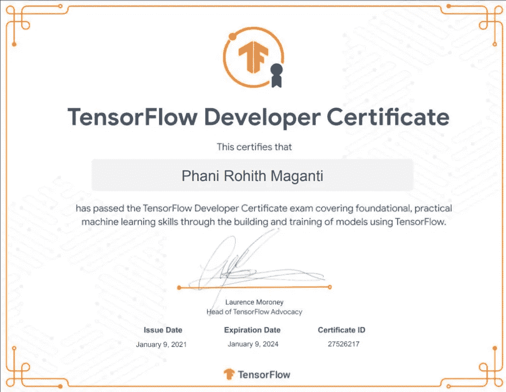
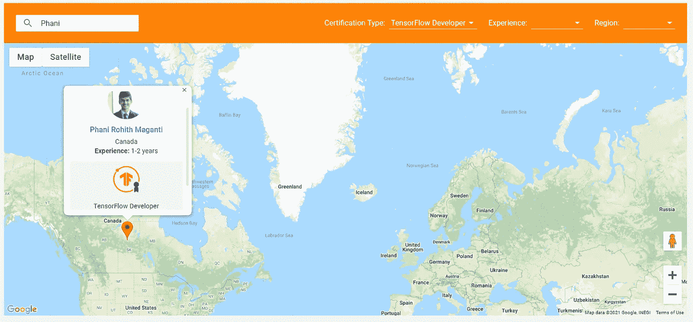

# 如何通过 TensorFlow 开发者认证考试(2021)

> 原文：<https://pub.towardsai.net/how-to-succeed-at-the-tensorflow-developer-certification-exam-2021-5ec190fc96c0?source=collection_archive---------2----------------------->

## [机器学习](https://towardsai.net/p/category/machine-learning)，[教育](https://towardsai.net/p/category/education)

## 通过 TensorFlow 开发者认证的资源

图片作者来自[国书](https://www.credential.net/a2fb2be0-618e-474d-9333-f82aaa768216#gs.tuvw8u)

TensorFlow 开发者认证使用 TensorFlow 2.x 测试用户对 TensorFlow 开发者技能、构建和训练神经网络、图像分类、自然语言处理、时间序列、序列和预测**的理解。让我们来看看这次考试的重点。**

## 涵盖的章节:

1.考试费用

2.定期津贴

3.认证的有效期

4.谁可以参加考试？

5.考试期间允许的资源。

6.考试时间限制

7.我用来清除考试的资源

8.结果

现在让我们深入了解这些部分:

1.  **考试费用:** $100 美元(一次)

*   从购买之日起，您将有六个月的时间参加考试。六个月后，您的购买将到期，您必须再次购买。
*   如果你第一次尝试没有通过，你必须等 14 天后才能重考。
*   如果第二次尝试没有通过，必须等两个月再重考。
*   如果试了三次还是没有通过，必须等一年再重考。

**2。** [**津贴:**](https://www.tensorflow.org/extras/cert/TF_Education_Stipend.pdf)

为了确保每个人都有这个机会，TensorFlow 提供了数量有限的津贴，相当于考试费用的 50%。

*   金额: **$50** ，考试费用的 50%。
*   尝试:一次证书购买包含**一次尝试。**
*   如果你有兴趣，填写这张申请表， [**TensorFlow 教育助学金**](https://services.google.com/fb/forms/tensorflowcertificatestipend/) **。您的选择将在提交申请表的**4–6 周**内得到通知。**
*   津贴到期:津贴必须在收到后 90 天内使用。一旦您用收到的津贴购买了考试，从购买之日起，您将有六个月的时间在考试到期前参加考试。
*   注意:如果你有兴趣获得助学金，一年只能申请一次。请不要在一年内提交一份以上的申请。如果你提交了一个以上的订单，在未来的几年里，他们将不再考虑你每年的津贴。

**3。认证有效期:**

*   从您收到数字徽章之日起，您的认证有效期最长为 36 个月。换证需要重新写一遍考试。

**4。** **谁可以参加考试？**

*   该证书面向希望展示使用 TensorFlow 构建和训练模型的实用机器学习技能的学生、开发人员、数据科学家或机器学习工程师。
*   作为个人，你必须接受测试，这个证书不是给企业或合法组织的。

**5。** **考试期间允许的资源:**

*   你可以使用你在 ML 开发工作中通常会用到的任何学习资源。

**6。考试时间限制:**

*   **五个小时**:您将有五个小时的时间来完成考试，如果您在完成考试之前点击了提交按钮，考试将自动提交，并将根据您提交的问题和测试的模型进行评分。

**7。我用来通过考试的资源:**

## a.[深度学习 AI 的 TensorFlow 开发者证书](https://www.coursera.org/professional-certificates/tensorflow-in-practice?network=g&utm_source=gg&creativeid=394071295328&matchtype=e&adgroupid=78610081341&gclid=EAIaIQobChMI98aIr8Tu7gIVg_7jBx2wSg8GEAAYASAAEgIkQfD_BwE&keyword=courseera&utm_content=91-BrandedSearch-CA&hide_mobile_promo=&utm_campaign=91-BrandedSearch-CA&campaignid=7851943161&devicemodel=&adpostion=&utm_medium=sem&device=c)课程:

协助:2010 年 10 月(强制)

这一专业是最有用的资源，因为它涵盖了本次考试所需的所有基本概念。本课程包括解释概念的视频、优秀文章和论文的参考、测验和最重要的部分、***、****实验室，他们要求我们解决代码，这是本课程最具互动性的部分。*

*如果我必须选择一个对这个认证最有用的资源，我会说是这个课程，它足以通过考试。*

***持续时间(最少 4 周):***

*这个专业有四门课程。如果您已经了解 MLP、CNN、rnn 和 LSTMs，您可能不需要四周时间来完成此专业。如果您不知道这些概念，您可能需要至少 4 周的时间来完成本专业的 4 门课程。*

*注意:根据每天/每周花费的时间，完成此专业的持续时间会有所不同。*

## *b.[深度学习专业化](https://www.coursera.org/specializations/deep-learning?utm_source=deeplearningai&utm_medium=institutions&utm_campaign=SocialYoutubeDLSC1W1L1):*

*协助:7/10(可选)*

*学习基础知识打下坚实的基础总是很重要的。这门课程帮助你在深度学习领域打下坚实的基础。本课程涵盖深度学习进化，使用超参数调整、正则化和优化来提高神经网络的性能。本课程还介绍了卷积神经网络(CNN)和递归神经网络(RNNs)的发展和需求。*

## *c.[皮查姆:](https://www.tutorialspoint.com/pycharm/index.htm)*

*协助:2010 年 10 月(强制)*

*很遗憾，***无法使用 google colab 参加本次考试*** *。* ***考试必须在 PyCharm IDE*** 中进行。PyCharm IDE 是 python 最流行的 IDE。对于这个考试，您必须在您的本地设备上安装 PyCharm IDE，并确保您有足够的 RAM 来运行 DL 算法。要知道你的系统是否有能力，去这个[链接](https://www.tutorialspoint.com/pycharm/index.htm)安装 PyCharm 的**社区**版。尝试像 MLP、CNN、RNNs 这样的神经网络架构，如果需要花费很长时间(超过 40-50 分钟)来训练，那么你可能必须找到任何其他具有更大 RAM 大小的设备，如果你有 GPU (VRAM)，那么你完全不必担心。*

*一旦您支付了考试费，您将收到一份详细的讲义，上面有使用 PyCharm 参加考试的说明。我强烈建议你通读讲义中的所有章节。*

*需要关注的事项:*

1.  ***PyCharm 版本:**确保你安装的 ***Pycharm 版本*** 和讲义上呈现的 python 版本相同；否则，你可能会面临下载插件和开始考试的问题。*
2.  ***故障排除:**你可能会在考试过程中甚至开始前卡壳，所以我 ***强烈推荐*** 在出题前阅读这一节。由于保密的合规性，我不能透露我在哪里卡住，并在考试中失去了 30 -40 分钟来找出它。讲义的故障排除部分提供了解决方案。所以，这也有可能发生在你身上。然后打开讲义，转到 ***故障排除*** 部分，在那里您可能会找到解决问题的选项。*
3.  ***常见问题:**本部分涵盖了您在开始考试和 PyCharm 常规查询时可能遇到的所有问题。*

***8。结果:***

*如果您通过了考试，您将在 3-5 个工作日内通过您注册的电子邮件地址收到证书。提交考试后，分数将在[考生门户](https://app.trueability.com/user_sessions/new)中更新。如果您通过了考试，您将会收到一封电子邮件，告知您添加到 [TensorFlow 证书网](https://developers.google.com/certification/directory/tensorflow)。在这里可以找到通过认证的 TensorFlow 开发者列表。如果您不想将自己添加到此网络，可以选择退出。如果你第一次没有通过，你必须等 14 天后重考。*

**

*图片作者来自 [TensorFlow 证书网](https://developers.google.com/certification/directory/tensorflow)*

*如果你准备考试，可以去这个[网址](https://app.trueability.com/google-certificates/tensorflow-developer)购买考试，祝你考试顺利。*

**感谢阅读到最后。如有错误或建议，欢迎不吝赐教。**

*如果你想联系我，请通过 LinkedIn 联系我。*

*参考资料:*

* [## 获得 TensorFlow 开发者证书— TensorFlow

### 这个证书的目标是为世界上的每个人提供机会，展示他们在 ML 的专业知识在…

www.tensorflow.org](https://www.tensorflow.org/certificate)*