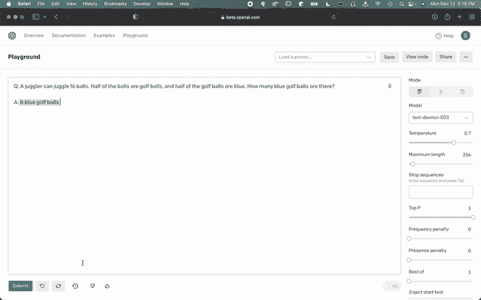
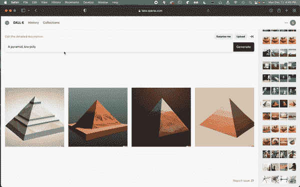

# 如何跟 ChatGPT |提示解释

> 原文：<https://pub.towardsai.net/how-to-talk-to-chatgpt-prompting-explained-91cb732e238a?source=collection_archive---------2----------------------->

## 什么是快速工程师，以及如何提高它…

## 观看视频

[ChatGPT](https://youtu.be/AsFgn8vU-tQ) ， [GPT-3](https://youtu.be/gDDnTZchKec) ， [DALLE](https://youtu.be/rdGVbPI42sA) ，中途，[稳定扩散](https://youtu.be/RGBNdD3Wn-g) …

所有这些人工智能模型有什么共同点？除非你读了我的文章，否则创建起来太昂贵，理解起来太复杂；)，它们都是像我们这样的普通人可以用来产生惊人结果甚至通过提示创造产品的模型。

提示几乎是你现在掌握这些新的大而强大的生成模型所需的唯一技能，无论是生成酷的故事，惊人的图像，还是任何酷的功能，如文本摘要或自动视频编辑工具。随着时间的推移，这些模型的结果只会越来越好，但通常很难得到您想要的确切结果。虽然这也只是在改进，但是利用这些大型模型潜力的最好方法是成为一名更好的 prompt 工程师。

但是什么是提示工程师呢？此外，在过去一分钟左右的时间里，我一直在谈论的这个提示性的东西是什么，我们如何才能学习这个技能并变得更好？！这正是我们在这篇文章中想要表达的意思…

提示是人类与人工智能对话的方式。这是一种告诉人工智能我们想要什么以及我们如何想要它的方式，通常通过语言来完成。例如，您可能想要生成一个图像，但是没有任何东西可以将其作为示例显示。你会怎么做？你会和你雇佣的艺术家做同样的事情:试着用最好的词语描述你想要的东西，如果你会画画的话，画一些草图。今天最强大的人工智能也是如此。正如我们在我之前关于单词嵌入的[视频中看到的](https://youtu.be/bof9EdygMSo)，人工智能可以理解单词，尽管它们理解单词的方式与我们不同。这就是即时工程发挥作用的地方。提示工程的任务是找到从人工智能获得最佳结果的提示。

一个提示工程师会把你的想法翻译成 AI 能理解的文字:它是“人类语言”和“AI 语言”之间的翻译器。你可以把 prompt engineering 看成是一个专家级的谷歌人。许多人被雇佣是因为他们知道如何很好地使用谷歌，并得到他们问题的答案，相比之下，你的父亲可能很难找到他想要的东西。那是因为你知道谷歌的搜索框在期待什么，哪些关键词是好的或不好的，而你爸爸不知道。他在打字，就好像他在向另一个人提问，而这是机器无法理解的。

文本提示是与语言模型对话的一种方式。理解这一点的最好方法是看一个简单的例子。让我们请 [GPT-3](https://youtu.be/gDDnTZchKec) 来解决一个数学问题。

我们可以看到它会得到错误的结果。然而，我们可以进一步使它适应人工智能，就像简单地加上“让我们一步一步地思考”，它会成功的。

用 [DALLE 2](https://youtu.be/rdGVbPI42sA) 制作的样品。

图像提示非常相似；我们可以用文字向文本到图像的模型描述图像，看看它创造了什么。我们看到，当我们改变不同的描述符时，模型生成的图像也随之改变。prompt engineering 背后的目标是优化这一点。

我们相信学习这项新技能是很重要的，因为大型模型只会变得更加可用和更加强大。很明显，人们会因为使用和掌握它们而获得报酬，我们希望帮助你们实现这一点。为此，与我的朋友[桑德](https://twitter.com/SanderSchulhoff)和[走向 AI](https://twitter.com/towards_AI) 一起，我们正在建立一个名为[学习提示](https://learnprompting.org/)的提示课程，在这里你可以学到很多好的提示实践和酷的技巧，甚至可以从专家那里获得专门针对你正在处理的模型的提示，无论是 [ChatGPT](https://youtu.be/AsFgn8vU-tQ) ，midway 还是其他什么。查看一下，了解更多关于提示的信息，并从该领域的专家那里获得真知灼见。

这是一项正在进行的开源工作，我们的目标是不断改进课程，并随着时间的推移添加新的酷部分。如果你想通过这个平台贡献并与更多的人分享你的知识，我们会很高兴。加入 Discord 上的[一起学习人工智能](https://www.louisbouchard.ai/learn-ai-together/)社区，了解我们新课程的更多信息，并与我们聊天！

感谢您的阅读，

路易斯（号外乐团成员）

## 参考

学习提示:[https://learnprompting.org/](https://learnprompting.org/)
我们的推特账号:[https://twitter.com/Whats_AI](https://twitter.com/Whats_AI)https://twitter.com/SanderSchulhoff[https://twitter.com/towards_AI](https://twitter.com/towards_AI)[https://twitter.com/learn_prompting](https://twitter.com/learn_prompting)
不和:[https://www.louisbouchard.ai/learn-ai-together/](https://www.louisbouchard.ai/learn-ai-together/)