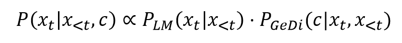

# 如何驯服语言模型

> 原文：<https://pub.towardsai.net/how-to-tame-a-language-model-6dd521de630a?source=collection_archive---------6----------------------->

## [自然语言处理](https://towardsai.net/p/category/nlp)

*来源:图片由* [*迈克尔·捷兹奇*](https://unsplash.com/@lazycreekimages) *上* [*下*](https://unsplash.com/photos/dbpLrMALyiM)

现代神经语言模型具有惊人的能力，从回答问题到分析和总结长篇文章，以及产生类似人类的生成文本。这些系统在面向客户的应用中变得越来越受欢迎，因此对于企业来说，学习如何利用这一前沿技术并确保它行为良好并产生预期的内容是至关重要的。

不幸的是，用于训练大型语言模型的大型语料库充满了污言秽语、种族主义和其他我们希望我们的模型远离的不受欢迎的特征。因此，模型本身经常产生有害的输出。一个众所周知的例子是微软的名为 [Tay](https://www.theverge.com/2016/3/24/11297050/tay-microsoft-chatbot-racist) 的 Twitter 聊天机器人，它在发布后不到 24 小时就开始产生有毒内容[1]。此外，像 GPT-2 这样的语言模型已经被证明[会产生有毒的语言](https://toxicdegeneration.allenai.org/)，即使提示是中性的【2】。显然，产生类似人类的文本可能是一把双刃剑。

在本帖中，我们将回顾一些消除语言模型的建议方法。

这些方法一般可分为两类，即基于数据的解毒和基于解码的解毒[3]。

注意:本文中讨论的方法可能也适用于受控文本生成中的类似问题。然而，像防止你的语言模型产生假新闻这样的问题需要额外的组件，比如事实检查，它们肯定值得一个完整的帖子，但是它们不会在这里讨论。

# 基于数据的解毒

也许消除语言模型的第一个想法是使用不包含不想要的属性的更高质量的训练数据。这种方法可能是可行的，但这意味着我们将显著减少训练集的大小，这将损害模型的性能。

然而，通过一些修改，我们可以使用这个想法，而不需要减少数据集的大小。基于数据的解毒包括用于语言模型的额外的预训练阶段，这意味着解毒模型。*域自适应预训练* (DAPT)建议在对完整数据集进行训练之后，在去毒数据集上增加一个训练阶段[4]。另一种名为*属性条件*的方法涉及一个训练阶段，其中根据内容是有毒还是无毒向文档添加前缀。当生成新的内容时，我们会在前面加上所需的*控制代码*，在我们的例子中它是“无毒的”。

# 基于解码的解毒

基于解码的解毒旨在通过调整解码策略来减轻语言模型的不期望的行为。这些方法的好处是，它们不一定需要大型语言模型的额外培训阶段，因此可以应用于您选择的任何语言模型，即使资源不足。

*词汇转换*方法为词汇中的每个标记分配毒性分数。这些分数然后被合并到每一步下一个单词的概率分布的定义中，选择无毒的单词而不是有毒的单词。

*单词过滤*是一种类似但更简单的方法。我们定义了一组单词，由于亵渎或毒性，这些单词在任何情况下都不应该由语言模型说出。然后，在解码过程中，我们要么重新定义概率分布，使这些记号的概率为零，要么在选择了不想要的记号时重新采样。

优步·艾在最近的一篇论文中提出的另一种方法称为*即插即用语言模型(PPLM)，*在解码过程中使用毒性鉴别器。来自鉴别器的梯度流回并移动解码器的隐藏状态，以产生具有期望属性的文本。[5]

最后，Salesforce 最近的一篇论文提出了一种使用*生成鉴别器* ( *GeDi* s)来指导生成过程的方法。使用相反控制代码(即毒性和非毒性)的两个简单语言模型用于确定上下文中每个潜在下一个单词的毒性。两个模型的概率之间的对比用于改变大型语言模型的概率分布。[6]最后，以“无毒”控制代码为条件的最终语言模型的分布由以下公式给出:

正如我们从公式中看到的，原始语言模型可以按原样使用，然后使用生成鉴别器修改概率。

使用基于解码的解毒方法可以比作让一只老鼠试图驾驭一头大象。我们希望利用一个大的语言模型，通过使用非常小的模型来确保期望的输出，同时引入最小量的额外成本和开销。

*来源:图片由* [*南安*](https://unsplash.com/@bepnamanh) *上* [*下*](https://unsplash.com/photos/QJbyG6O0ick)

# 结论

总而言之，随着越来越多的 NLP 系统暴露在公众面前，对语言模型进行解毒是一项越来越重要的任务。对于这个问题，我们已经看到了一些具有不同优缺点的创造性解决方案，在不久的将来，很可能会增加新的方法来获得对“野生”语言模型的进一步控制。

菲利普·坦诺(Philip Tannor)是一家公司的联合创始人兼首席执行官，该公司为组织提供工具来检查和监控他们基于机器学习的系统。Philip 在数据科学领域拥有丰富的背景知识，并拥有 NLP、图像处理、时间序列、信号处理等项目的经验。Philip 拥有电子工程硕士学位以及物理和数学学士学位，尽管他几乎不记得任何与计算机科学或算法无关的学习内容。

*如果您有兴趣了解更多关于如何控制您的生产机器的学习模型，请随时联系***。**

# *参考*

*[1][https://www . the verge . com/2016/3/24/11297050/tay-微软-聊天机器人-种族主义者](https://www.theverge.com/2016/3/24/11297050/tay-microsoft-chatbot-racist)*

*[https://toxicdegeneration.allenai.org/](https://toxicdegeneration.allenai.org/)*

*[3]萨姆·盖曼、苏钦·古鲁兰根、马腾·萨普、叶筋·崔和诺亚·史密斯(2020 年)。真实毒性提示:评估语言模型中的神经毒性退化。*em NLP 的调查结果**

*[4] Suchin Gururangan、Ana Marasovi ' c、Swabha Swayamdipta、Kyle Lo、Iz Beltagy、Doug Downey 和 Noah A. Smith (2020 年)。不要停止预训练:使语言模型适应领域和任务。ArXiv，abs/2004.10964。*

*[5] Sumanth Dathathri、Andrea Madotto、Janice Lan、Jane Hung、Eric Frank、Piero Molino、Jason Yosinski 和 Rosanne Liu。(2020).即插即用语言模型:控制文本生成的简单方法。*

*[6]b . Krause，a . got mare，a . McCann，b . Keskar，n . Joty，s .，Socher，r .，& Rajani，N. (2020 年)。GeDi:生成鉴别器引导的序列生成*。arXiv 预印本 arXiv:2009.06367* 。*