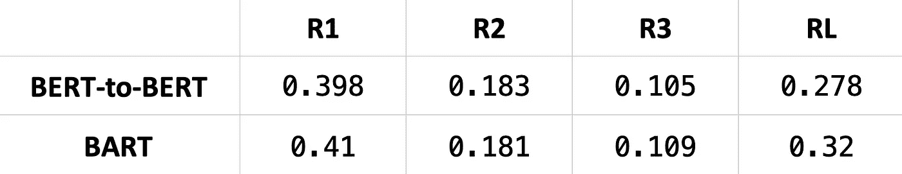

# 如何训练一个 Seq2Seq 摘要模型，使用“BERT”作为编码器和解码器！！(伯特 2 伯特)

> 原文：<https://pub.towardsai.net/how-to-train-a-seq2seq-summarization-model-using-bert-as-both-encoder-and-decoder-bert2bert-2a5fb36559b8?source=collection_archive---------1----------------------->

*BERT 是一个众所周知的强大的预训练“编码器”模型。让我们看看如何将它用作“解码器”来形成编码器-解码器架构。*

照片由[亚伦·伯顿](https://unsplash.com/@aaronburden?utm_source=medium&utm_medium=referral)在 [Unsplash](https://unsplash.com?utm_source=medium&utm_medium=referral) 上拍摄

Transformer 架构由两个主要构建模块组成，即编码器和解码器组件，我们将它们堆叠在一起，形成 seq2seq 模型。(你可以在我的[上一篇文章](/how-to-train-a-seq2seq-text-summarization-model-with-sample-code-ft-huggingface-pytorch-8ba97492f885)中了解更多)从头开始训练一个基于 transformer 的模型通常很难，因为它需要大型数据集和高 GPU 内存。因此，有[许多预先训练好的模型](https://medium.com/mlearning-ai/what-are-the-differences-in-pre-trained-transformer-base-models-like-bert-distilbert-xlnet-gpt-4b3ea30ef3d7)有着不同的目标。

首先，**编码器**模型(例如，BERT、RoBERTa、FNet、…)学习如何从它们读取的文本创建固定大小的表示。这种表示可用于训练网络进行分类、翻译、总结等。其次，基于**解码器**的型号(如 GPT 家族)具有发电能力。通过在顶部添加一个线性层(也称为“语言模型头”)，使他们能够预测下一个令牌，这是可能的。最后，**编码器-解码器**型号(BART、Pegasus、MASS……)能够根据编码器的表示调节解码器的输出。它可用于摘要和翻译等任务。这是通过从编码器到解码器的交叉注意连接来实现的。

在这个故事中，我想展示如何使用仅编码器模型的预训练权重来给我们一个微调的开端。在这个例子中，我们将训练一个以 BERT 作为编码器和解码器的摘要模型。

Huggingface 库前段时间引入了一个新的 API，使得混合和匹配不同的预训练模型成为可能。它非常灵活，让我们的工作变得超级简单！但是，在开始编写代码之前，让我们先看看这个概念。要使 BERT(一个编码器模型)在 seq2seq 设置下工作，应该做些什么？

图二。(左)BERT 等纯编码器模型与(右)BART 等同时具有编码器和解码器的网络的高级方案。

请记住，为了简单起见，图 2 中演示的网络中的其他元素已被删除！为了做一个简单的比较，**编码器专用**模型(左)的每个块(层)由一个自我关注和一个线性层组成。同时，**编解码**网络(右)在每层也有交叉注意连接。交叉关注层使模型能够根据输入来调节预测。

显而易见，直接将 BERT 模型用作解码器是不可能的，因为构建模块并不相同！理论上，很容易添加额外的连接，并使用 BERT 权重设置解码器的适用部分。然后，我们需要微调模型来训练这些连接和语言模型头部权重。(注意:语言模型头部位置在输出和最后一个线性层之间——它不包括在图 2 中)

我们可以使用 Huggingface 的`EncoderDecoderModel`对象来混合和匹配不同的预训练模型。它将通过调用`.from_encoder_decoder_pretrained()`方法并指定编码器/解码器模型来添加所需的连接和权重。在下面的例子中，我们使用 BERT-base 作为编码器和解码器。

代码 1。加载预训练模型的代码。

由于 BERT 模型不是为文本生成而设计的，我们需要做一些配置。因此，下一步是设置标记器，并指定句首和句尾标记，以正确指导训练和推理过程。它应该在模型的配置和它的 tokenizer 对象中定义。

代码 2。将 bos 和 eos 令牌添加到 model 和 tokenizer 中。

现在我们可以使用拥抱脸的 [Seq2Seq Trainer](https://huggingface.co/docs/transformers/main_classes/trainer#transformers.Seq2SeqTrainer) 对象，使用`Seq2SeqTrainingArguments()`参数来微调模型。您可以更改和试验许多配置，以获得适合您模型的完美组合。请注意，以下值不是最佳选择，仅用于测试！如果你没有 GPU 内存的话，`fp16`值是很重要的一个。它将使用半精度数字，这减少了内存的使用。要研究的另一个有用变量是`learning_rate`、`batch_size`。

代码 3。Hugingface 的 seq2seq Trainer 对象。

我不打算经历整个微调过程，因为我已经提到了如何使用`datasets`库来加载数据。这里有一个到 [Google Colab 笔记本](https://github.com/NLPiation/tutorial_notebooks/blob/main/summarization/hf_BERT-BERT_training.ipynb)的链接(我已经将代码复制/粘贴到我的 GitHub 帐户，以确保链接保持有效)，这是我从`[patrickvonplaten/bert2bert_cnn_daily_mail](https://huggingface.co/patrickvonplaten/bert2bert_cnn_daily_mail)` hub 检查点获取的。笔记本将检查整个微调过程，以训练模型进行总结。

# 结果

我们可以看到在 CNN/DM 数据集上微调的 BERT-to-BERT 模型性能。我使用了数据集中枢上的可用检查点，使用了波束搜索解码方法。使用 ROUGE 评分标准计算结果。

图 3。比较 BERT-base 和 BART-base 的结果。

BART 模型是文本摘要中的 SOTA 模型，并且 BERT seq2seq 网络保持得相当好！只有 1%的差异通常不会转化为句子质量的巨大变化。

# 最后的话，

混合搭配的方法可以产生令人兴奋的实验。例如，可以将 BERT 连接到 GPT-2，以使用 BERT 的能力创建文本的强大表示，并使用 GPT 的能力生成高质量的句子。在为所有问题选择 SOTA 模型之前，最好对自定义数据集使用不同的网络。使用 BERT(与 BART 相比)的主要区别是 512 个令牌输入序列长度限制(与 1024 个相比)。因此，如果数据集的输入序列较小，则 BERT-to-BERT 模型是一个不错的选择。训练更小的模型会更有效，并且需要更少的资源，例如数据和 GPU 内存。

> 我每周给 NLP 的书呆子发一份时事通讯。如果您想了解自然语言处理的最新发展，可以考虑订阅。
> [阅读更多，订阅](https://nlpiation.github.io/) —加入酷孩子俱乐部，立即报名！