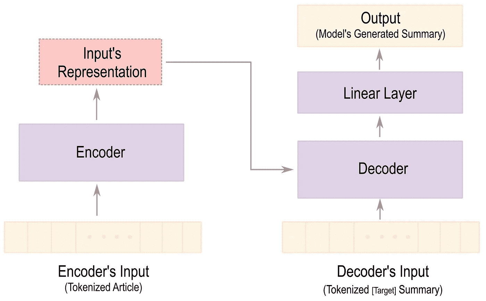
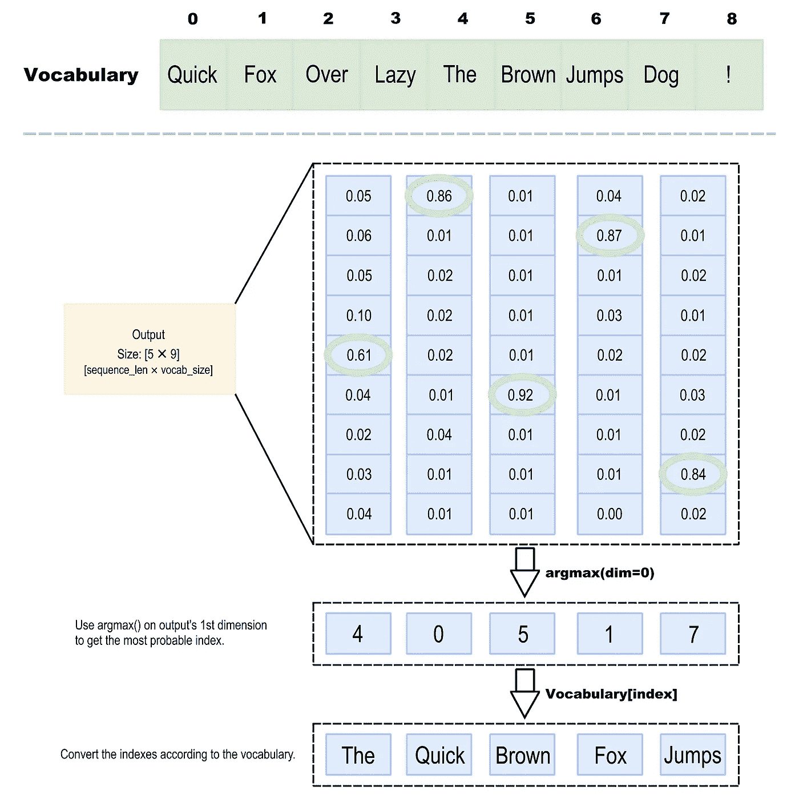

# 如何用示例代码训练 Seq2Seq 文本摘要模型(Ft。拥抱脸/PyTorch)

> 原文：<https://pub.towardsai.net/how-to-train-a-seq2seq-text-summarization-model-with-sample-code-ft-huggingface-pytorch-8ba97492f885?source=collection_archive---------0----------------------->

## [自然语言处理](https://towardsai.net/p/category/nlp)

*介绍系列的第 2 部分，使用 HuggingFace 用示例代码训练一个文本摘要模型(或任何 seq 2 seq/编码器-解码器架构)。*

照片由[亚伦·伯顿](https://unsplash.com/@aaronburden?utm_source=medium&utm_medium=referral)在 [Unsplash](https://unsplash.com?utm_source=medium&utm_medium=referral) 上拍摄

这篇文章旨在让你更深入地理解序列对序列(seq2seq)网络，以及如何训练它们用于自动文本摘要。我将使用 Transformer 体系结构，但不详细介绍它的实现细节，以使本文专注于培训部分。(已经有许多[资源](https://jalammar.github.io/illustrated-transformer/) [可用](https://medium.com/inside-machine-learning/what-is-a-transformer-d07dd1fbec04))我们将利用 [Huggingface](https://huggingface.co/docs/transformers/index) 库，它托管主要的最先进的 NLP 模型。

> ⚠️我推荐阅读本系列的“[记号化简介](https://nlpiation.medium.com/how-to-use-huggingfaces-transformers-pre-trained-tokenizers-e029e8d6d1fa)”故事和第一部分“[文本摘要简介](/a-full-introduction-on-text-summarization-using-deep-learning-with-sample-code-ft-huggingface-d21e0336f50c?source=your_stories_page----------------------------------------)”(尤其是如果你是 NLP、编码器-解码器架构或文本摘要的新手)，在那里我写了编码器-解码器架构的基础知识。

# 什么是培训？

这意味着通过展示几个例子来调整模型的权重，以做出准确的预测。根据任务的不同，有不同的算法来训练神经网络。我们将进行监督学习，这意味着通过提供源(文章)和目标(摘要)样本进行学习来训练模型。

这个过程从向模型提供输入(文章)并生成摘要开始。然后，我们可以使用损失函数(这里是交叉熵)将生成的摘要与目标摘要进行比较，以计算它们有多接近，以及我们需要改变多少权重来使用优化器(Adam with Weight Decay)生成更好的摘要。这是一个迭代过程，将根据历元数重复进行。

一个时期意味着对数据集中的每个样本进行一次上述过程。因此，10 个时期意味着模型将在训练期间看到每个样本 10 次。此外，还有批处理的概念，这意味着将数据以大于 1 的批量传递给模型，并对它们的损失进行平均，而不是一个样本一个样本地输入。这将加快训练过程。

# 它是如何工作的？

在深入研究代码并假设 batch_size 为 1 之前，让我们快速浏览一下图 1。如果你读过第一部分的故事，你应该熟悉这个图的大部分。(*)用什么建筑？* " subsection)主要区别(与推断相比)在于，在训练过程中，整个目标摘要将被提供给解码器，因此模型可以了解好的摘要是什么样的。

图一。编解码模型体系结构综述。

输出是大小为[generated _ sequence _ length×vocabulary _ size]的张量，其中第一维的每个索引表示来自所生成的摘要的一个标记，第二维的每个索引表示来自标记器的词汇表的一个单词及其成为下一个标记的概率。图 2 中示出了具有五个记号的生成摘要的样本输出张量。每个标记的可能性数量与词汇大小(9)相同。为了找到生成的摘要标记，我们将选择拥有最高概率的索引，并且可以使用该索引从词汇表中找到单词。

图二。对于长度为 5 个标记、词汇量为 9 的样本序列“快速的棕色狐狸跳跃”,模型的输出看起来像什么。

# 让我们看看代码！

**数据集—**hugging face 公司提供了一个名为“数据集”的伟大工具，让你可以快速加载和操作你的数据。我们将使用 CNN/DailyMail [2]数据集，它是摘要任务的标准基准。让我们从加载数据集开始。我只用了 1%的数据集来加速这个过程。(如果您想要训练您的模型，您应该通过移除 *[0:1%]* 部分来使用整个数据集)

> 如果您对基于变压器的预训练模型(如 BERT、BART、XLNet、MASS 等)的差异感到困惑，请阅读故事“ [*基于变压器的预训练模型*](https://medium.com/mlearning-ai/what-are-the-differences-in-pre-trained-transformer-base-models-like-bert-distilbert-xlnet-gpt-4b3ea30ef3d7) 有何不同”，指出它们的差异。

代码 1。正在加载 CNN/DM 数据集。

下一步是准备基于模型的数据集，除了查看。如图 1 所示，标记化的*输入*(文章)和*解码器输入*(目标摘要)以及它们的注意掩码(掩码可以使用它来忽略一些标记)加上标签参数(与目标摘要相同)。*process _ data _ to _ model _ inputs()*函数将使用 BART 的[1] tokenizer 对象将数据集转换为所需的格式。它还将填充标记更改为-100，以确保不相关的标记不会影响丢失值。然后，我们将把提到的函数映射到数据集变量，设置正确的格式，并使用 PyTorch 的 DataLoader 函数创建一个迭代对象来批处理数据集。

代码 2。正在准备数据集。

请记住，上面的代码只演示了训练集的映射和 set_fromat 过程。如果可能的话，也应该对其他装置如*验证*和*测试*进行测试。文章和摘要长度变量依赖于模型的设计选择。BART 最多可以接受 1024 个令牌作为输入，但是我们将序列长度限制设置为 512，以减少内存消耗。同样的想法也适用于选择批量大小，如果您有足够的资源，应该使用更大的数字。

**模型—** 我们使用 Huggingface 的 BART 实现，这是一个预先训练好的基于 transformer 的 seq2seq 模型。让我们从加载模型及其预训练权重开始。

代码 3。加载模型，并根据图 1 进行分割。

BART 的文本摘要微调模型使用*BartForConditionalGeneration*模块加载，并将使用 *from_pretrained()* 调用下载权重。该模型将被发送到 GPU(如果有的话),我们将根据图 1 中突出显示的组件对其进行分割。

> **⚠️关于分割模型的注释:**我这样做是为了让连接和数据流更加清晰。这只是为了教学目的，向您展示该模型如何在引擎盖下工作。在现实中，你可以很容易地调用模型对象，它会照顾一切本身，而不是分裂它。(我们将在实现验证循环时看到它)

**损失函数和优化器—** 训练需要的另外两个模块是交叉熵损失和 AdamW 优化器，它们可以分别从 PyTorch 和 Huggingface 加载。还选择线性调度器来辅助优化器在训练期间改变学习速率。在预热期间，调度程序会将学习率从零增加到指定值，然后再降低到零。

代码 4。定义损失函数和优化器。

**训练循环—** 现在，是时候编写主循环了。它只是负责向模型提供一批数据，并使用损失函数将其生成的摘要与所需的目标摘要进行比较。并且重复这个过程！

代码 5。主训练循环。

主循环从将批处理放到 GPU(如果可用)开始，然后绕过标记化的文章，通过编码器获得表示。编码器的输出将与目标摘要一起提供给解码器，并使用最后一个线性图层进行处理，以获得模型的最终预测。

> **提醒**:这个过程可以(也应该！)通过调用`model(**batch)`直接得到 ***lm_head_output*** 来完成。

循环的其余部分将计算当前批次的损失值并调整模型的参数。最后，向优化器和调度器发送一个信号，表明当前步骤已经完成，并通过重置梯度使优化器为下一步做好准备。

**验证循环—** 难题的最后一块是在每个时期后进行验证循环，以确保模型不会过度拟合，并评估其在看不见的数据上的性能。此外，您可以在下面的代码中看到使用模型对象本身来计算损失是多么容易。

代码 6。验证循环。

> *⚠️的完整实现可在 Github 上的* [*笔记本*](https://github.com/NLPiation/tutorial_notebooks/blob/main/summarization/hf_BART_train_breakdown.ipynb) *中获得。*

# 最后的话，

这是涵盖摘要任务的系列文章的第 2 部分，我在其中解释了在训练 seq2seq(编码器-解码器)模型期间发生的事情。我建议您浏览一下笔记本内容，因为有些部分在这里没有提到，您可以在 Google Colab 实例上运行代码并查看输出。

> 我每周给 NLP 的书呆子发一份时事通讯。如果您想了解自然语言处理的最新发展，可以考虑订阅。
> [阅读更多，订阅](https://nlpiation.github.io/) —加入酷孩子俱乐部，立即报名！

## 参考

[1] Lewis，Mike，等人，“Bart:自然语言生成、翻译和理解的去噪序列间预训练”arXiv 预印本 arXiv:1910.13461 (2019)。
[2]纳拉帕蒂，拉梅什，等，“使用序列到序列的 rnns 和超越序列的抽象文本摘要” *arXiv 预印本 arXiv:1602.06023* (2016)。