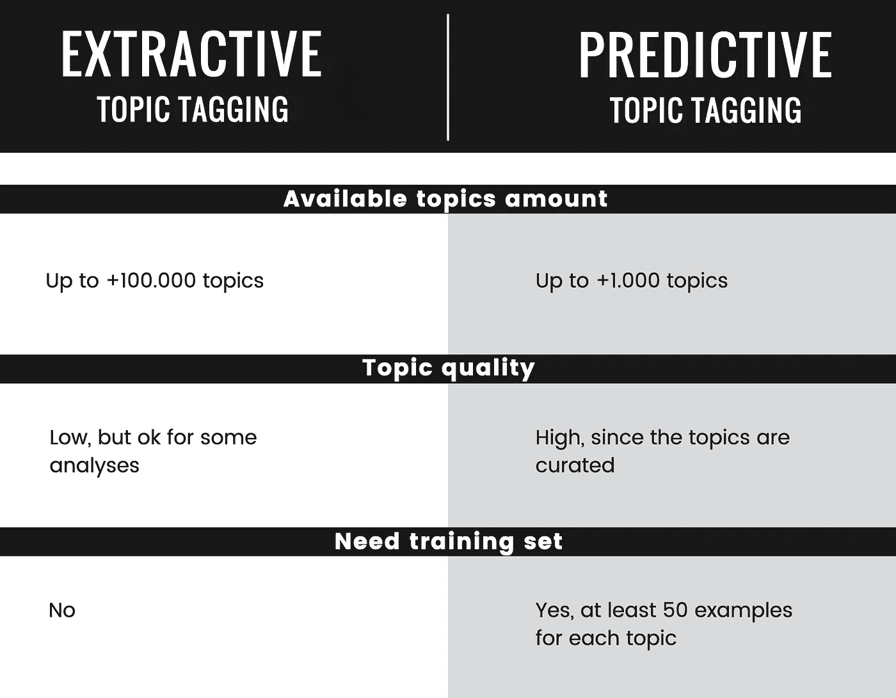
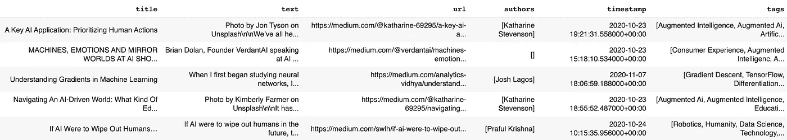
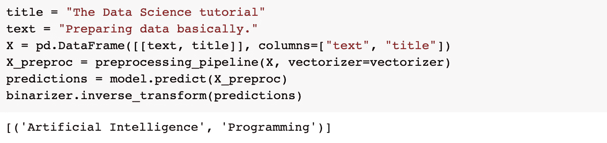
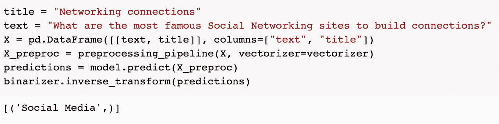
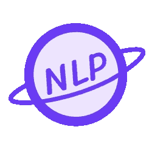

# 如何训练一个主题标注模型来给文章分配高质量的主题

> 原文：<https://pub.towardsai.net/how-to-train-a-topic-tagging-model-to-assign-high-quality-topics-to-articles-46b7ebbf0ba8?source=collection_archive---------0----------------------->


Gabriel Sollmann 在 [Unsplash](https://unsplash.com?utm_source=medium&utm_medium=referral) 上的照片

## [自然语言处理](https://towardsai.net/p/category/nlp)

## 从训练集创建到训练模型

主题标记是将主题分配给各种形式的内容的过程，最广泛的是文本。我们通常在报纸上看到作者标记的文章，作为一种组织知识的形式，并使内容更容易被最想要它的读者发现。此外，它可以用来分析大量的文本数据，如互联网博客(每个博客使用不同的标签或根本不使用标签)的文章流或社交帖子。

# 抽取式与预测式主题标注

我们可以区分两种类型的主题标注。让我们以下面的文字为例:

> 加密货币让你可以购买商品和服务，或者交易获利。下面更多的是什么是加密货币，如何购买，如何保护自己。

*   抽取式主题标记通过检测文本中包含的关键词并使用它们的规范化形式作为主题来工作。通常，这些主题通过使用开源知识库中的类别来丰富，如 [Wiki Data](https://www.wikidata.org/wiki/Wikidata:Main_Page) 。前面的例子预测的主题可能是像 M *oney、Business、Give、工资、价格、帮助、买家、工作、商店、服务*这样的东西。
*   预测主题标记通过用每个主题的几个文本示例训练分类模型，与预定义的主题集一起工作。训练集可以从网上搜集，因为每篇带有标签的文章都是潜在的训练样本。该示例预测的主题可能是类似于*比特币、加密货币、密码、区块链技术、密码学、贸易、网络安全、信息安全、安全、隐私、区块链、经济学、经济。*

下面是对抽取式和预测式主题标记的简要比较，包括优缺点。



抽取式和预测式主题标注比较。图片由作者提供。

由于本文的目标是教授如何预测高质量的主题，我们将重点关注如何执行**预测主题标记**。为了训练主题标注模型，我们需要训练数据。例如，在线发布的文章带有与其作者相关联的标签，这确保了数据具有良好的质量。Medium 是这类文章的一个很好的来源，让我们刮 Medium 来构建一个训练集。完整的代码可以在这个[实验室](https://colab.research.google.com/drive/1GYDTNl5xky340HItg4g2jvrKr5tAgsQ4?usp=sharing)中找到。

# 抓取媒体以获取训练数据

我们将需要 [newspaper3k](https://github.com/codelucas/newspaper) 从 HTML 中提取文章数据，并需要 [langdetect](https://github.com/Mimino666/langdetect) 只保存英文文章。

下一步是定义一个函数，该函数从文章的 URL 中抓取文章，用 newspaper3k 解析该文章以提取其标题和文本内容，并使用一些启发式方法获取文章标签。

既然我们知道了如何从 URL 中抓取一篇文章，我们需要一个地方来找到所有带有我们感兴趣的标签的文章。为此，我们可以抓取按标签和日期组织的介质的存档页面。例如，日期为 2020 年 1 月 15 日的主题人工智能的存档页面是[https://medium . com/tag/Artificial-Intelligence/archive/2020/01/15](https://medium.com/tag/artificial-intelligence/archive/2020/01/15)。我们可以将 URL 结构概括为*https://medium.com/tag/<标签>/存档/ <年> / <月> / <日>* 并生成一个随机日期的存档页面列表，供特定标签抓取。要从这些归档页面中获取实际的文章 URL，我们只需要使用一个有效的 CSS 选择器。

让我们定义一些标签来刮，我们从这六个开始。

现在我们可以把所有的片段粘在一起，开始为每个标签收集 50 篇文章。记住执行温和的刮擦，并在请求之间等待一段时间！

最后，我们把刮下来的文章保存在一个熊猫数据框中。在下一节中，训练我们的机器学习模型将会很有用。

# 训练主题标记模型

我们需要 P [和 as](https://github.com/pandas-dev/pandas) 和 [NumPy](https://github.com/numpy/numpy) 进行数据操作，NLTK 进行文本规范化，而 [Sklearn](https://github.com/scikit-learn/scikit-learn) 用于机器学习模型。

这就是我们的数据框架和抓取的数据应该看起来的样子。



熊猫数据框包含带标签的文章。图片由作者提供。

首先要做的是从抓取的文章中移除我们没有抓取的所有标签(即，我们只保留我们之前定义的六个标签，因为它们是我们有足够数据来训练模型的唯一标签)，并对标签应用 [MultiLabelBinarizer](https://scikit-learn.org/stable/modules/generated/sklearn.preprocessing.MultiLabelBinarizer.html) 以将其转换为支持的多标签格式。

为了让你有个概念，这是一个 MultiLabelBinarizer 如何工作的例子，摘自 Sklearn 文档。

```
**>>>** mlb.fit_transform([{'sci-fi', 'thriller'}, {'comedy'}])
array([[0, 1, 1],
       [1, 0, 0]])
**>>>** list(mlb.classes_)
['comedy', 'sci-fi', 'thriller']
```

我们现在可以为我们的模型准备数据了。该模型将从文章的标题和正文中预测主题，我们将标题和正文连接起来。然后，使用标准的文本处理对该文本进行清理，如将其转换为小写字母、替换不良字符以及删除停用词。

然后，清理后的文本由[tfidf 矢量器](https://scikit-learn.org/stable/modules/generated/sklearn.feature_extraction.text.TfidfVectorizer.html)进行转换。除了通常用于信息检索之外，TF-IDF 还被发现用于文档分类。在文档中利用 TF-IDF 而不是原始记号频率减少了出现非常频繁的记号的影响，因此从经验上讲，比出现在一小部分文档中的记号信息更少。

现在我们已经准备好了训练数据，我们可以训练我们的模型了。我们的问题是一个[多标签分类问题](https://scikit-learn.org/stable/modules/multiclass.html#multilabel-classification)，也就是说，我们想要用所有可能标签的子集来标记每个样本。我们可以通过为每个主题训练一个二元分类器来做到这一点，这正是 [MultiOutputClassifier](https://scikit-learn.org/stable/modules/multiclass.html#multioutputclassifier) 所做的。

我们到终点了！让我们用一些模拟句子来试试这个模型。



经过训练的模型成功地预测了人工智能和编程主题。图片由作者提供。



经过训练的模型成功预测了社交媒体话题。图片由作者提供。

预测的主题与文本输入一致。干得好！

# 可能的改进

在本教程中，我们抓住了重点，但我们忽略了许多方面。

*   **使用合适的指标评估模型，并训练验证-测试分割数据集。**我们应该评估模型的精确度、召回率和 F1 值，这样我们才能知道模型的改变是否有益。通常，F1-score 用作多标签分类设置中的优化指标，但是您应该根据模型的使用情况来选择指标。例如，如果模型帮助人类为文章分配类别，召回可能比精确度更重要，因为总有人可以修复预测错误。
*   **微调每个二元分类器的分类阈值**。记得在验证集上调整这个参数来优化您的度量。
*   **从多个网站获取训练数据**。在本教程中，我们只收集了中等，但还有许多其他网站可以收集数据。
*   **使用分类法更好地准备训练数据**。我们数据科学家倾向于在模型上花太多时间，而在数据质量上花很少时间。我们的训练集由文章和标签组成，这些文章和标签由各自的作者分配，但是作者通常受限于可以分配的标签数量。这意味着作者经常必须根据标签的可见性和它们的特异性的一些逻辑，在许多似乎合理的标签中选择分配哪些标签。因此，我们的训练集是肮脏的，因为有似是而非的标签没有分配给文章！为了解决这个问题，我们可以构建一个主题分类法并用它来清理数据集，每当我们看到分配了更多的特定标签时，就分配更多的通用标签。例如，如果一篇文章的标签是*机器学习*，我们可以推断它也谈到了*人工智能*，因为*人工智能*是*机器学习*的上位词。

# 主题标签的用例示例

在其他文章中，我搜集了著名公司网站的博客部分，并应用主题标签来分析这些公司写了些什么。

[](https://medium.com/@chiusanofabio94/content-marketing-analysis-with-nlp-github-vs-gitlab-b9ee114d5fb7) [## 使用 NLP 的快速内容营销分析:GitHub 与 GitLab

### 为什么 GitHub 发布是关于游戏的，GitLab 是关于 Ux 设计的？

medium.com](https://medium.com/@chiusanofabio94/content-marketing-analysis-with-nlp-github-vs-gitlab-b9ee114d5fb7) [](https://medium.com/@chiusanofabio94/fast-content-marketing-analysis-with-nlp-pocket-vs-evernote-e0f92d754f72) [## 使用 NLP 的快速内容营销分析:Pocket vs Evernote

### 口袋出版有什么 Evernote 没有的，反之亦然？

medium.com](https://medium.com/@chiusanofabio94/fast-content-marketing-analysis-with-nlp-pocket-vs-evernote-e0f92d754f72) 

# 结论

预测主题标记是一种预测文章高质量主题的解决方案，训练一个质量不错的模型相当容易。然而，根据我的经验，在可能的改进部分中提出的行动极大地提高了最终模型的质量。可能的用例来源于对大量文本的自动分析，如社交媒体分析或竞争对手分析。

感谢您花时间阅读这篇文章。如果你喜欢这篇文章并想看更多，请一定要拍下这篇文章！



NLPlanet 标志。

*在*[*LinkedIn*](https://www.linkedin.com/company/nlplanet)*[*Twitter*](https://twitter.com/nlplanet_)*[*脸书*](https://www.facebook.com/NLPlanet-113393687828458) *和*[*Telegram*](https://t.me/nlplanet)*上关注应用自然语言处理的最新故事并加入 NLPlanet 社区。***