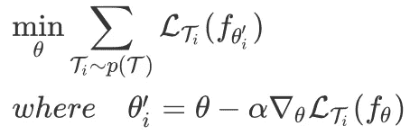
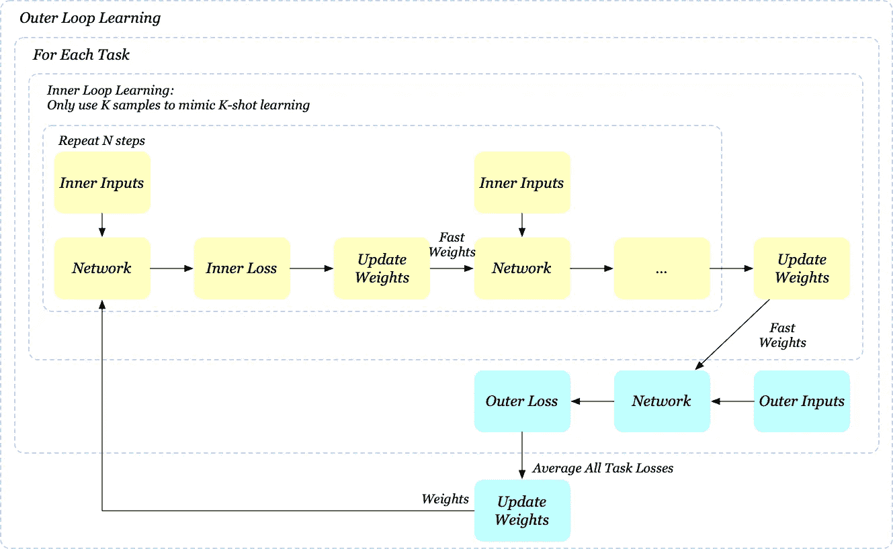
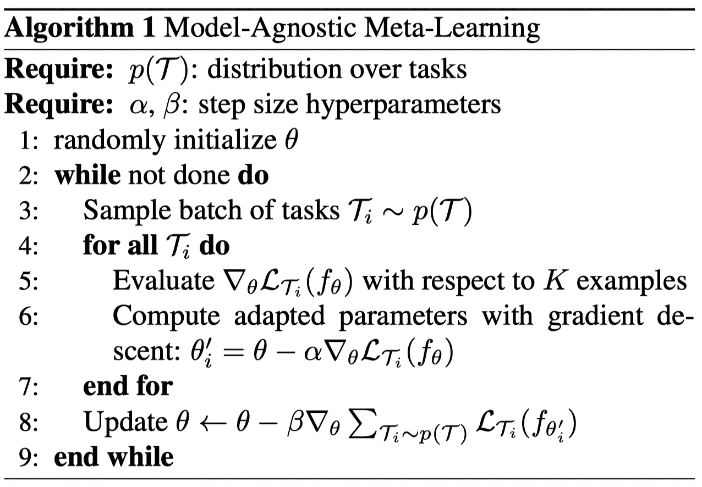
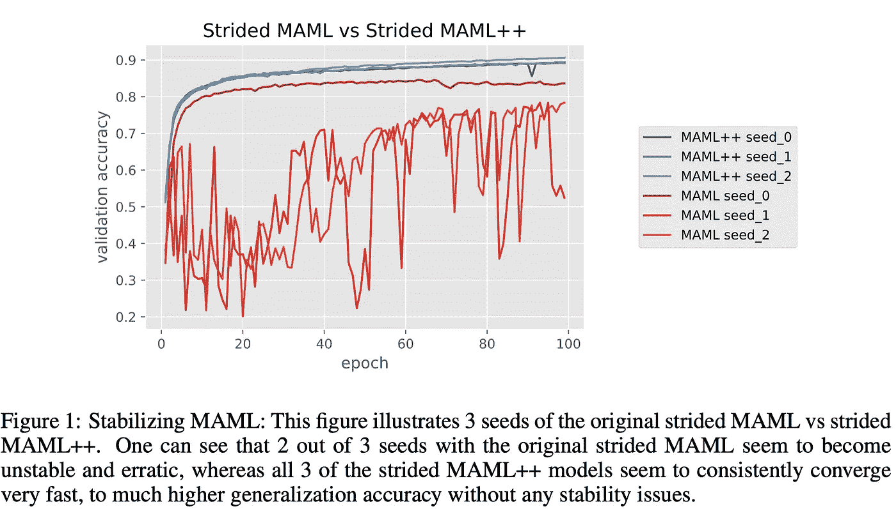
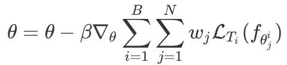
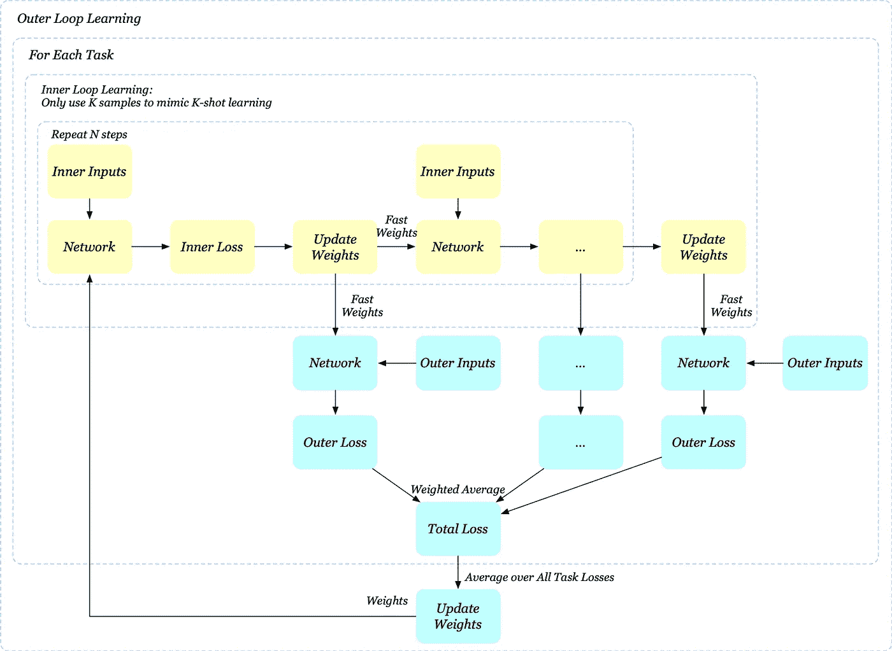
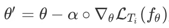
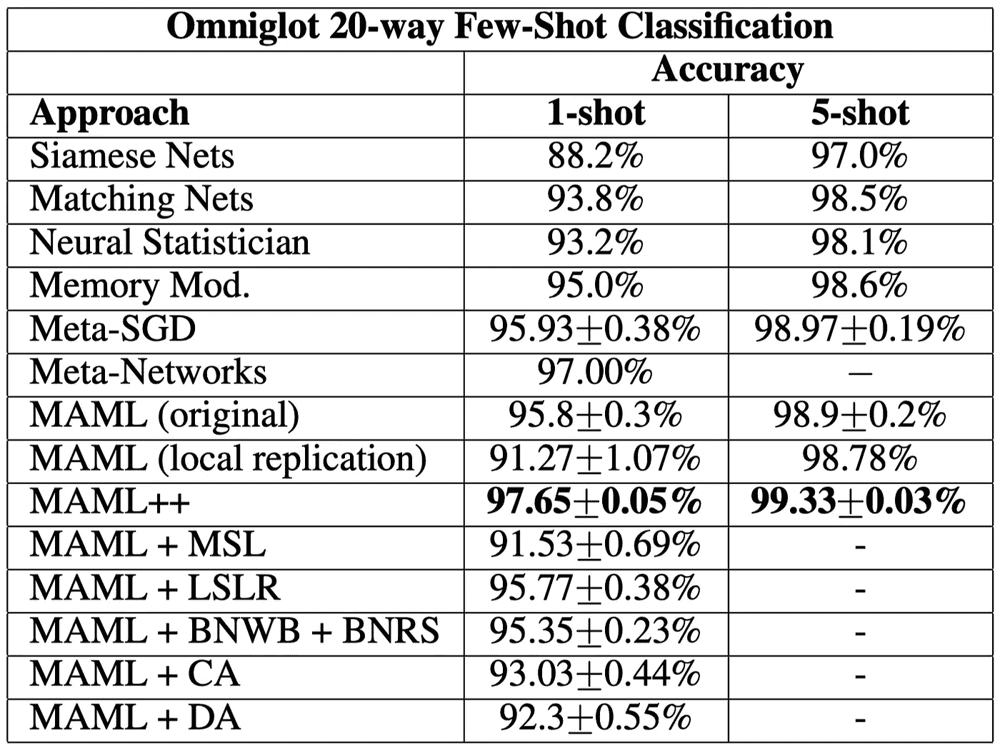
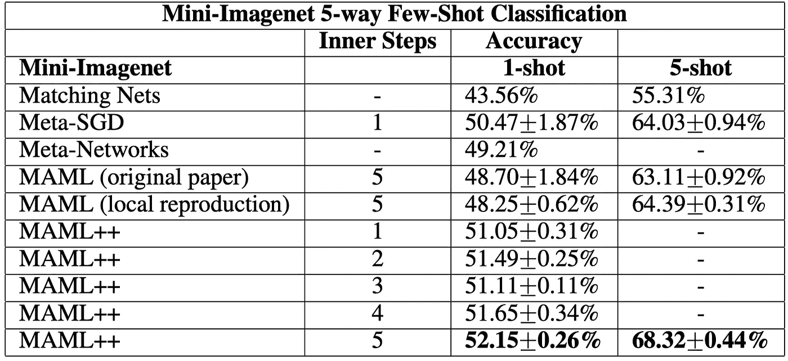

# 如何训练 MAML(模型不可知元学习)

> 原文：<https://pub.towardsai.net/how-to-train-maml-model-agnostic-meta-learning-90aa093f8e46?source=collection_archive---------0----------------------->

## [机器学习](https://towardsai.net/p/category/machine-learning)

## 对 MAML 和更多的详细解释

来源:Pixabay

# 介绍

**M**odel-**A**gnostic**M**eta-**L**earning(MAML)自 2017 年由 Finn 等人首次提出以来，在元学习领域越来越受欢迎。它是一种简单、通用和有效的优化算法，不会对模型结构或损失函数施加任何约束。因此，它可以与任意网络和不同类型的损失函数相结合，这使得它适用于各种不同的学习过程。

这篇文章由两部分组成:我们首先解释 MAML，提出一个详细的讨论和可视化的学习过程。然后，我们描述了原始 MAML 的一些潜在问题，并根据安托尼乌等人的工作解决了这些问题。

# MAML

与模型无关的元学习算法(MAML)的示意图，该算法针对可以快速适应新任务的表示θ进行了优化。来源:Finn 等人的《深度网络快速适应的模型不可知元学习》

MAML 背后的想法很简单:它优化一组参数，使得当针对特定任务 *i* 采取梯度步骤时，参数 *θᵢ* 接近任务 *i* 的最优参数。因此，这种方法的目的是学习一种广泛适用于任务分配 *p(T)* 中所有任务的内部特征，而不是单一任务。这是通过最小化从任务分布 *p(T)* 中采样的任务的总损失来实现的

情商。(1).单步内循环学习的简单说明。我们也可以更新θᵢ'几次。

注意，我们实际上并没有在这里定义一组额外的变量 *θᵢ'* 。 *θᵢ'* 是通过从 *θ* w.r.t. task *i* 开始采取一个(或几个)梯度步骤来计算的——这一步骤通常被称为内环学习，与我们优化 Eq 的外环学习相反。(1).为了更好地理解，如果我们将内循环学习视为相对于任务 *i* 的微调 *θ* ，那么等式。(1)同样地说，我们优化一个目标，期望模型在各自的微调之后在每个任务上做得很好。

还有一点值得注意的是，优化情商的时候。(1)我们最终将计算 Hessian-矢量积，即使用共轭梯度法也是昂贵的。Finn 等人在监督学习问题上使用 MAML 的一阶近似进行了一些实验，其中省略了这些二阶导数(这可以通过停止计算*【∇_θ(l_tᵢ(f(θ】*)的梯度来编程实现)。注意，所得到的方法仍然在更新后的参数值 *θᵢ'* 处计算元梯度，这提供了有效的元学习。实验证明，该方法的性能与用全二阶导数获得的性能几乎相同，这表明 MAML 的大部分改进来自更新后参数值处的目标梯度，而不是通过梯度更新的微分的二阶更新。

## MAML 可视化

MAML 可视化。这里，我们将中间参数θᵢ'称为快速权重。内环学习采取 n 个梯度步骤来计算最终的快速权重，基于此，外环学习计算外层任务损失，*l_tᵢ(f(θᵢ')】*

注意，如果内循环学习被重复 *N* 次，MAML 仅使用最终权重进行外循环学习。正如我们将在后面看到的，这可能会很麻烦，当 *N* 很大时会导致不稳定的学习。

## 算法

现在，应该很容易看到算法

MAML 的伪代码。来源:Finn 等人的《深度网络快速适应的模型不可知元学习》

# MAML++

在这一节中，我们将集中讨论原始 MAML 的几个问题，并提出相应的潜在解决方案和最终的 MAML++算法。所有这些贡献最初是由安托尼乌等人[2]在 ICLR 2019 年提出的。

## 训练不稳定性

来源:安托尼乌等人《如何训练你的 MAML》

MAML 训练可能不稳定，这取决于神经网络架构和整体超参数设置。例如，安托尼乌等人发现，简单地用步长卷积层替换最大池层会使其变得不稳定，如图 1 所示。他们推测不稳定性是由梯度退化(梯度爆炸或梯度消失)引起的，而梯度退化又是由深层网络引起的。为了看到这一点，我们回头看看 MAML 的形象。假设网络是标准的 4 层卷积网络，后面是单个线性层，如果我们重复内循环学习 *N* 次，那么推理图总共由 *5N* 层组成，没有任何跳跃连接。由于原始 MAML 仅使用最终权重进行外环学习，反向传播必须通过所有层，这使得梯度退化有意义。

**解决方案:多步损耗优化(MSL)**

我们可以采用 GoogLeNet 的类似思想，通过计算每个内部步骤后的外部损失来缓解梯度退化问题。具体来说，我们有外环更新

其中 *β* 是学习率，L_Tᵢ(f(θ_j^i)表示在 *j* 内步更新之后使用基网络权重时任务 *i* 的外部损失，并且 *wⱼ* 表示在步骤 *j* 的外部损失的重要性权重。为了更好的比较，我们也将这个过程可视化

MAML++可视化。我们在每一个内部步骤之后计算外部损失，最后取它们的加权平均值

在实践中，我们用对损失的相等贡献来初始化所有损失，但是随着迭代的增加，我们减少早期步骤的贡献，并慢慢增加后面步骤的贡献。这样做是为了确保随着训练的进行，最终的步骤损失得到优化器更多的关注，从而确保它达到尽可能低的损失。如果不进行退火，最终损耗可能会高于原始配方。

## 二阶导数成本

MAML 通过完全忽略它来降低二阶导数成本。在某些情况下，这可能会损害最终的泛化性能。

**解决方案:导数级退火(DA)**

安托尼乌等人[2]建议在训练阶段的前 50 个时期使用一阶梯度，然后在训练阶段的剩余时间切换到二阶梯度。一个有趣的观察是，这种导数级退火没有显示出爆炸或递减梯度的事件，与更不稳定的仅二级 MAML 相反。在开始使用二阶导数之前使用一阶导数可以作为一种强有力的预训练方法，学习不太可能产生梯度爆炸/减弱问题的参数。

## 缺少批量标准化统计累积

MAML 在批量标准化中不使用运行统计。而是使用当前批次的统计数据。这导致批量标准化效率较低，因为学习到的参数必须适应不同任务的各种不同平均值和标准偏差。

## 解决方案:每步批量标准化运行统计数据、每步批量标准化权重和偏差(BNRS + BNWB)

在 MAML 的上下文中，批处理规范化的一个简单实现将在内循环学习的所有更新步骤中累积运行的批处理统计数据。不幸的是，这将导致优化问题，并可能减慢或完全停止优化。这个问题源于一个错误的假设:当我们维护跨网络的所有内环更新共享的运行统计时，我们假设初始模型及其所有更新的迭代具有相似的特征分布。显然，这种假设是远远不正确的。一个更好的替代方法是存储每一步的运行统计数据，并为每个内循环迭代学习每一步的批处理规范化参数。

## 共享内循环学习率

影响泛化和收敛速度的一个问题是对所有参数和所有更新步骤使用共享学习速率的问题。具有固定的学习率需要进行多次超参数搜索，以找到特定数据集的正确学习率，这可能在计算上是昂贵的，取决于如何进行搜索。此外，虽然梯度是数据拟合的有效方向，但是固定的学习速率可能容易导致在少触发机制下的过拟合。

**解:学习每层每步的学习率(LSLR)**

为了避免潜在的过度拟合，一种方法是以最大化泛化能力而不是数据拟合的方式来确定所有学习因子。李等人[3]提出学习的基础网络中每个参数的学习率。内环更新现在变成了

其中 *α* 是具有与 L_Tᵢ(f(θ相同大小的可学习参数的向量)，而∘表示逐元素乘积。由此产生的方法，即 Meta-SGD，已被证明实现了比 MAML 更好的泛化性能，但代价是增加了学习参数和计算开销。注意，我们没有把积极性的约束放在学习速率 *α* 上。因此，我们不应该期望内部更新方向遵循梯度方向。

考虑到 Meta-SGD 的诱导成本，安托尼乌等人[2]提出学习网络中每一层的学习率，以及学习基础网络在采取步骤时的每次适应的不同学习率。例如，假设基本网络具有 *L* 层，并且内循环学习包括 *N* 步更新，我们现在引入 *LN* 用于内循环学习速率的附加可学习参数。

## 固定外环学习速率

MAML 使用具有固定学习速率的亚当来优化元目标。一些文献表明，退火学习速率对泛化性能至关重要。此外，有一个固定的学习率可能意味着你必须花更多的时间来调整学习率。

**解:元优化器学习速率(CA)的余弦退火**

安托尼乌等人[2]提出在元优化器上应用余弦退火调度(Loshchilov & Hutter[4])。余弦退火调度被定义为

其中 *β_{min}* 表示最小学习率*，β_{max}* 表示初始学习率， *T* 为当前迭代次数*，T_{max}* 为最大迭代次数。当 *T=0* 时，学习率 *β=β_{max}* 。曾经 *T=T_{max}* ， *β=β_{min}* 。实际上，我们可能希望将 *T* 绑定为 *T_{max}* 以避免重启。

# MAML++的实验结果

最后，我们给出了一些完整的实验结果。

我们首先展示了个人在 20 路 Omniglot 任务中对 MAML 的改进。

20-way 表示每个任务有 20 个类。1-shot 表示我们只使用 1 个样本进行内循环学习和测试，而 5-shot 使用 5 个样本。来源:安托尼乌等人《如何训练你的 MAML》

我们可以看到，每步批量归一化和运行统计(BNWB+BNRS)和学习每层每步学习率(LSLR)收获最多。

我们也在迷你图像网络任务中展示了 MAML

来源:安托尼乌等人《如何训练你的 MAML》

我们可以看到，随着内部步骤数量的增加，性能会有所提高。值得注意的是，即使是 1 步 MAML++优于原来的 5 步 MAML。

如图 1 所示(在我们讨论 MAML++的开始)，与 MAML 相比，MAML++收敛到最佳泛化性能的速度也快得多

# 参考

1.  切尔西·芬恩，彼得·阿贝耳，谢尔盖·莱文。用于深度网络快速适应的模型不可知元学习
2.  安特雷亚·安托尼乌，哈里森·爱德华兹和阿莫斯·斯托基。如何训练你的 MAML
3.  、周、、和。Meta-SGD:学会快速学习
4.  伊利亚·洛希洛夫和弗兰克·哈特。SGDR:带有热重启的随机梯度下降