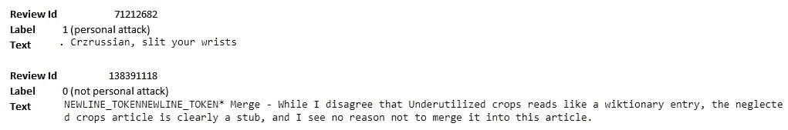
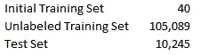
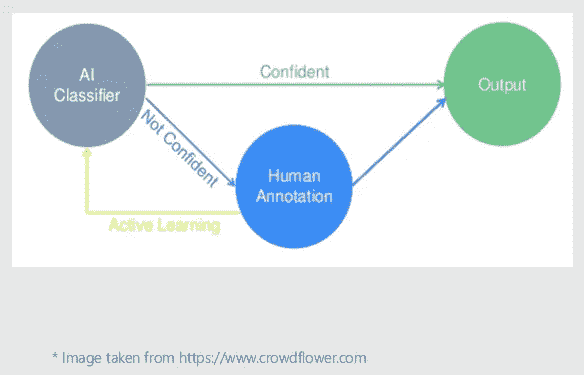
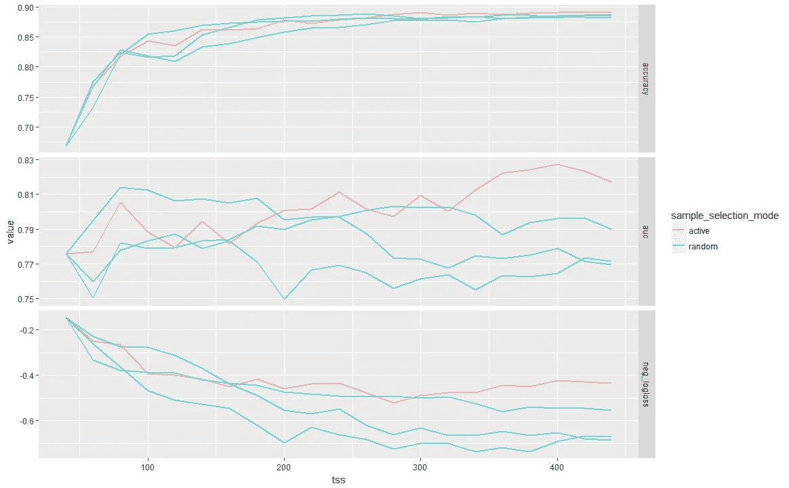

# 如何使用主动学习来迭代改进您的机器学习模型

> 原文：<https://pub.towardsai.net/how-to-use-active-learning-to-iteratively-improve-your-machine-learning-models-1c6164bdab99?source=collection_archive---------0----------------------->

## [机器学习](https://towardsai.net/p/category/machine-learning)

# **简介**

在本文中，我将解释如何使用主动学习来迭代地提高机器学习模型的性能。这种技术适用于任何模型，但是出于本文的目的，我将说明如何改进二进制文本分类器。本文涵盖的所有材料都基于微软题为“使用 R 和 Python 进行可扩展数据科学、机器学习和 AI”的 2018 Strata 数据大会教程。

我假设读者熟悉机器学习环境中的主动学习概念。如果没有，那么[这篇](https://en.wikipedia.org/wiki/Active_learning_(machine_learning))维基百科文章的导语部分就是一个很好的介绍。

重现本文给出的结果的代码是[这里是](https://github.com/hsm207/Strata2018/tree/blog)。

# 方法学

## 资料组

我们将通过构建一个在 [Wikipedia Detox](https://meta.m.wikimedia.org/wiki/Research:Detox/Data_Release) 数据集上训练的二进制文本分类器来验证主动学习的概念，以检测评论是否构成人身攻击。这里有几个例子来说明这个问题:

训练集有 115，374 个标记示例。我们将这个训练集分成三个集合，即初始训练集、未标记训练集和测试集，如下所示:

此外，标签在初始训练集中均匀分布，但在测试集上，只有 13%的标签为 1。

我们以这种方式分割训练集，以模拟真实世界的条件。这种分裂对应于这样的情况:我们有 10，285 个高质量的已标记示例，并且需要决定我们需要标记 105，089 个“未标记”示例中的哪一个，以获得更多的训练数据来训练我们的分类器。因为标记数据是昂贵的，所以挑战在于识别将对我们的模型的性能有最大贡献的例子。

我们将看到，相对于在无标签训练集上的随机采样，主动学习是一种更好的采样策略。

最后，使用手套词嵌入将评论转换成 50 维嵌入。

## 抽样策略

我们将使用的抽样策略是不确定性抽样和基于池的抽样的组合。它是这样工作的:

1.  从未标记的训练集中随机选择 1，000 个样本
2.  使用欧几里德距离作为距离度量，在这 1，000 个样本上构建一个分层聚类(这是汇集部分)
3.  将分级分类的输出分成 20 组
4.  对于每组，选择具有最高[熵](http://www.di.fc.ul.pt/~jpn/r/maxent/maxent.html)的样本，即挑选模型最不确定的观察值

选择上面的数字是为了模拟我们一次只能获得 20 个高质量标签的情况，例如放射科医师一天只能处理 20 个医学图像。我们不会对整个未标记的训练集进行聚类，因为计算熵需要进行模型推断，而这在大型数据集上可能需要很长时间。

对样本进行聚类的原因是为了最大化将要发送进行标记的样本的多样性。例如，如果我们简单地从这 1000 个样本中挑选出具有最高熵的前 20 个例子，那么如果这些例子形成一个紧密的组，我们就有挑选非常相似的例子的风险。在这种情况下，最好只从这组中挑选一个例子，其余的从另一组中挑选，因为不同的例子有助于模型更好地学习。

## 模型

我们将使用快速树来构建分类器，将评论的矢量嵌入作为输入。FastTrees 是 FastRank 的实现，fast rank 是梯度推进算法的变体。这个[链接](https://docs.microsoft.com/en-us/machine-learning-server/r-reference/microsoftml/rxfasttrees)有更多的细节。

## 评估指标

由于测试集不平衡，我们将使用 AUC 作为主要评估指标。

## 实施细节

下面的图表说明了主动学习在这个实验中的作用:

首先，我们将在初始训练集上训练我们的模型。然后，我们将使用该模型和之前描述的采样策略来识别未标记训练集中的 20 个评论，其分类是最不确定的，即不确定的。这些评论将被“发送”给人类进行标记。现在，我们可以扩展我们的初始训练集，以包括这些来自人类的新标记样本，并重新训练我们的模型(从头开始)。这是实验的主动学习部分。我们将重复扩展初始训练集的步骤 20 次迭代，并在每次迭代结束时在测试集上评估模型的性能。

# 结果

作为比较，我们可以通过从我们的未标记训练集中随机选取任意 20 个例子来迭代扩展我们的初始训练集。下图根据训练集(tss)的大小，使用不同的指标，将我们的方法(主动)与 3 次随机采样(随机)进行了比较。

我们看到随机抽样最初优于我们的主动学习方法。然而，在 300 的训练集规模左右，主动学习方法在 AUC 方面开始远远超过随机采样。

在实践中，您可能希望继续扩展初始训练集，直到模型改进(如 AUC 增加)相对于标记成本的比率低于预定阈值。

# 验证结果

为了确保我们的结果不是侥幸，我们可以模拟 20 次迭代的随机采样策略 100 次，并计算它产生比我们的主动学习方法更大的 AUC 的次数。我的模拟结果只产生了一个随机抽样比主动学习给出更高 AUC 的例子。这表明主动学习的结果在 5%的水平上具有统计学意义。最后，随机抽样和主动学习之间的 AUC 的平均差异是-0.03。

# 结论

如果您有大量未标记的数据，但对这些数据进行标记的预算有限，那么采用主动学习方法来识别这些未标记数据中的哪些数据需要发送进行人工标记，可以在给定的预算约束下最大化模型性能。

如果你有任何问题，请在评论中告诉我。

# 参考

*   [使用 R 和 Python 进行可扩展的数据科学、机器学习和 AI](https://conferences.oreilly.com/strata/strata-ca-2018/public/schedule/speaker/221674)；Inchiosa 等人。艾尔。2018
*   [主动学习(机器学习)](https://en.wikipedia.org/wiki/Active_learning_(machine_learning))；维基百科。2019 年 6 月 17 日访问。