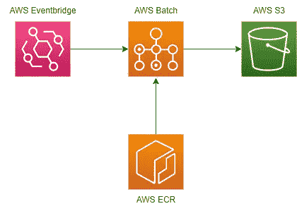

# 如何使用 AWS 进行网页抓取

> 原文：<https://pub.towardsai.net/how-to-use-aws-for-web-scraping-f8e4b40993f5?source=collection_archive---------1----------------------->

## 使用 AWS 批处理进行可伸缩抓取

埃里克·普劳泽特在 [Unsplash](https://unsplash.com/?utm_source=medium&utm_medium=referral) 上拍摄的照片

几个月前，我决定辞职去旅行。接下来是一个夏天的冒险，然后，一瞬间，我发现自己回到了细雨蒙蒙的伦敦，准备考虑重新进入就业市场。自然地，我想知道我是否能收集一些数据来帮助引导我的思考。

在[的上一篇文章](https://medium.com/@jontyhabs/how-to-automate-job-searches-with-python-9a1b04b33036)中，我探索了如何使用 Reed API 以编程方式搜索相关的工作列表。但是如果我想让我的搜索保持新鲜呢？在本文中，我们将使用 AWS 来安排我们的代码每天获取和存储这些工作列表。

你可能已经注意到这篇文章的标题有点骗人。使用 API 并不是真正的 web 抓取，但是如果它是一个选项，它会可靠得多。然而，从根本上来说，这篇文章是关于建立一个可伸缩的机制来重复调用互联网，所以它可以很容易地应用于 web 抓取。

> **免责声明:本文仅用于教育目的。我们不鼓励任何人抓取网站，尤其是那些可能有条款和条件反对此类行为的网站。**

## 先决条件

要在家里复制这一点，你需要一个 AWS 帐户，掌握 python，Reed 的 API 密匙(你可以在这里注册)，以及安装 Docker Desktop 的能力。AWS 对完成的解决方案每天收取我 12 美分。

## 为什么是 AWS 批处理？

需求非常简单——我有一些从 API 获取工作列表的代码，我希望这些代码每天都运行。鉴于我不想让我的笔记本电脑全天候运行，我需要使用 AWS(或其他云计算服务)。

为了最大限度地降低成本和工作量，我需要一个无服务器或托管的解决方案。AWS Lambda 是一种非常简单的方法，但是每个 Lambda 最多只能运行 15 分钟，不幸的是，这对我来说太短了。我的代码运行需要 20 分钟，即使不需要，我也想要一个可伸缩的解决方案。如果我决定大幅度扩大我的求职范围，这种方法同样有效。设计一个依赖我的代码的系统从来都不是一个好主意，永远不会变得更慢。

我可以设计一些混乱的方式来触发连续的 lambdas，直到全部工作完成，但是当理想情况下，我想要一些灵活的东西时，我会创建一个非常具体的解决方案。

输入 [**AWS 批次**](https://aws.amazon.com/batch/) 。这项出色的服务允许您运行和安排批处理作业，而无需担心基础设施。我们只需要定义工作和我们想要的资源，剩下的就交给 AWS 了。

*本文大部分是技术教程，所以如果你对具体细节不感兴趣，可以去* [*我的下一个故事*](https://medium.com/@jontyhabs/jobs-in-data-what-the-data-tells-us-about-skills-and-salaries-fc2c030ef7cb) ，*那里我会分析数据来了解工作薪水、技能、趋势等等！*

## 绕道去码头

[通风视图](https://unsplash.com/@ventiviews)对[防溅板](https://unsplash.com/?utm_source=medium&utm_medium=referral)拍照

AWS Batch 不会像 Lambda 那样执行简单的 python 脚本。AWS 批处理通过执行 Docker 映像来工作。

如果你不熟悉 Docker，基本上有三点需要理解:

*   一个 **Docker 容器**类似于一个轻量级虚拟机。它本质上是一个独立的系统，包含我们运行给定应用程序所需的一切。例如，我们的容器将需要包含 python 的安装。
*   一个 **Docker 图像**是一个可以用来创建容器的模板。它是一个多层文件，包含创建该容器所需的一切。容器是一个图像的可运行实例，虽然图像是不可变的，但是它可以产生几个独立的容器。
*   一个 **Dockerfile** 是一个文本文件，它包含一组简单的指令，用于定义 Docker 映像的创建。

## 创建 Docker 图像

首先，[安装 Docker 桌面](https://docs.docker.com/desktop/windows/install/)。

在[上一篇文章](https://medium.com/@jontyhabs/how-to-automate-job-searches-with-python-9a1b04b33036)中，我们有两个脚本:一个用于搜索 jobs 数据库并返回清单的基本细节(`reed_summary_fetcher.py`)，另一个用于遍历这些清单以获取它们的完整细节(`reed_details_fetcher.py`)。提醒一下，这是第一个脚本:

这是第二个:

我们需要为每个脚本创建不同的 Docker 映像，所以首先，在您的笔记本电脑上为每个脚本创建一个本地文件夹。每个本地文件夹都有三个组成部分:脚本、python 包的 requirements.txt 文件和 Docker 文件(按照惯例，它总是被简单地命名为 *Dockerfile* ，没有扩展名)。以下是第一个脚本的 docker 文件:

这套简单的说明将告诉 Docker 如何制作图像:

*   从包含所有 python 设置的现有公共映像开始
*   创建一个名为`app`的新目录，将本地工作目录中的所有文件添加到映像中，并将`app`定义为工作目录
*   安装我们需要的任何 python 包
*   运行 python 脚本

您的 requirements.txt 文件只需要以下 python 包:requests、boto3 和 datetime。

除了要运行的 python 文件的名称之外，第二个 python 脚本的 Dockerfile(获取清单细节)是相同的。

要测试这是否有效，请打开一个终端并运行:

`docker build -t <image name> .`

如果成功，当你输入`docker images`时，你应该能看到你的图像。你可以通过输入`docker rmi <image name or ID>`来删除它。

## 设置 AWS 命令行界面(CLI)

AWS Batch 无法使用您笔记本电脑上的 Docker 映像。我们需要将您的图像放入亚马逊的图像存储 ECR。由于没有办法将图像拖放到 AWS 中，我们必须使用命令行界面。

如果你以前没有用过这个，你首先需要在你的本地机器上安装客户端。接下来，您需要导航到 AWS 中的 IAM 部分来生成一个密钥对(除非您已经有了一个)。这个密钥对对于验证您的本地机器和您的 AWS 帐户之间的连接是必需的。出于安全原因，最好为 IAM 角色而不是根用户生成访问密钥。最后，您可以配置您的 AWS CLI，方法是在本地机器上的终端中键入`aws configure`，并在出现提示时提供您的密钥对和区域。你可以在这里得到更详细的说明[。](https://docs.aws.amazon.com/cli/latest/userguide/cli-configure-quickstart.html#cli-configure-quickstart-creds-create)

您只需配置一次 AWS CLI 之后，它将能够自动认证。

## 使用亚马逊的弹性容器注册中心(ECR)

导航到 AWS 中的 ECR 控制台，并选择“创建新存储库”。一个存储库可以包含多个映像，但是通常的最佳实践是一个存储库包含一个映像(或者同一映像的所有不同开发版本)。因此，我们将需要一个存储库用于第一个脚本(我称之为 mine **reed-summary** )和一个存储库用于第二个脚本(我称之为 mine **reed-details** )。你可以只输入一个名字，其他的都是默认的。

如果你点击进入你的新存储库，有一个方便的按钮，上面写着“查看推送命令”。点击这个按钮可以获得您需要在本地终端上运行的命令集。这些命令执行以下操作:

*   验证与 AWS 的连接
*   在当地建立你的形象
*   用您的 ECR 存储库标记您的映像(加上一个常规标记来表示这是映像的最新版本)
*   将您的映像推送到您的存储库

如果因为任何原因，这些命令看不到，你可以在这里得到它们[，你也可以从 ECR 存储库主页得到存储库 URI。](https://docs.aws.amazon.com/AmazonECR/latest/userguide/docker-push-ecr-image.html)

记住要做两次——我们有两个 python 脚本，每个脚本都需要放入自己的映像中，存储在自己的 ECR 存储库中。

## 使用 AWS 批处理-概述

我们已经有了我们的图像——创建小 python 框来运行我们的脚本的模板——现在我们只需要 AWS 运行它们的方法。

我们的基本设置如下图所示:Eventbridge 触发器将告诉 Batch 运行一个作业；Batch 将从 ECR 中获取我们的图像，并将其作为一个容器运行；该容器将运行我们的 python 代码，python 代码将从 Reed API 获取数据并保存到 s3。

作者图表

这听起来很简单，但是在它的内部，AWS Batch 有以下组件:

*   一个**计算环境**定义了你的工作将在其上运行的基础设施
*   **作业定义**通过陈述相关的 docker 映像和其他配置来定义作业——您想要执行的任务
*   **作业**是**作业定义**的运行实例
*   **作业队列**将作业传递到相关的计算环境中执行

是时候再次动手了！

## AWS 批处理—网络、安全性和角色

任何令人兴奋的 AWS 服务的无聊序言——所有的设置都是为了确保我们的各种组件可以安全地相互通信。文档[非常好，所以我们将快速浏览一下。](https://docs.aws.amazon.com/batch/latest/userguide/get-set-up-for-aws-batch.html)

*   AWS Batch 需要知道将计算资源放在哪里，所以创建一个 VPC(指令[在这里](https://docs.aws.amazon.com/batch/latest/userguide/get-set-up-for-aws-batch.html#create-a-vpc)或[在这里](https://docs.aws.amazon.com/vpc/latest/userguide/VPC_Scenario2.html))。确保它有一个公共子网。
*   您需要一个安全组来为您的计算环境把关入站和出站流量。[在你的新 VPC 里创造一个](https://docs.aws.amazon.com/batch/latest/userguide/get-set-up-for-aws-batch.html#create-a-base-security-group)。默认情况下，向导应该向所有 IP 建议一个通用出站规则，而不建议入站规则；这对我们来说很好。(在现实世界中，如果我们的 Reed API 端点坚持一组静态的 IP 地址，我们将进一步完善这条规则。)

在我们的用例中有三个不同的 IAM 角色。

*   **服务角色**管理 AWS 批处理调用其他 AWS 服务所需的权限。例如，Batch 需要使用其他 AWS 服务来管理每个作业的计算资源。该角色将在我们设置计算环境时自动创建。
*   **执行角色**管理 ECS 代理调用其他 AWS 服务所需的权限。例如，从 ECR 中提取图像。按照此处的说明[设置该角色*ecstaxecutionrole*。](https://docs.aws.amazon.com/AmazonECS/latest/developerguide/task_execution_IAM_role.html)
*   **任务角色**授予正在运行的容器更多的权限。在现实世界的场景中，我们有许多作业都运行不同的映像用于不同的目的，每个作业可能有不同的作业角色，同时共享相同的最小执行角色。

我们需要我们的容器能够向 S3 写对象，所以我们需要创建一个作业角色。转到 IAM 控制台中的**创建角色**向导，选择“AWS 服务任务”作为可信实体，选择弹性容器服务作为用例，选择 *AmazonS3FullAccess* 和*ecstaxecutionrole*作为您的策略。我把这个角色命名为 **s3-put-iam** 。

## AWS 批处理—设置计算环境

在 AWS 控制台中搜索**批处理**，转到**计算环境**，然后点击**创建**。

这里的几乎所有内容都可以保持默认，包括 AWS 提供的创建服务角色。使用 Fargate 选项可以最大程度地简化无服务器操作。

在**网络**部分，选择我们的新 VPC 及其公共子网(我们的计算资源将需要访问互联网以获取我们的数据)，以及我们的新安全组。

## AWS 批处理-设置作业定义

从侧边栏进入**工作定义**控制台，点击**创建**。我们没有做任何繁重的工作，所以单节点选项对我们有好处。选择 Fargate 平台类型，并选择我们之前创建的*ecstakexecutionrole*。我们还需要启用公共 IP，这样我们就可以享受出站互联网访问。

再往下，提供**簧片-总结**图像的位置(URI)。提供我们的*S3-put-iam**角色作为作业角色，并提供环境变量配置中的 Reed API 键作为`API_KEY`(因为这是 python 代码所期望的)。*

*您需要设置其中两个作业定义——一个用于**钢筘汇总**图像，一个用于**钢筘详细信息**图像。*

## *AWS 批处理-设置作业队列*

*从侧边栏进入**作业队列**控制台，点击**创建**。您只需要命名您的作业队列并选择计算环境。*

*您可以为作业队列和作业定义设置优先级，让 AWS 知道哪些作业优先，但是因为我们每天只运行两个连续的作业，所以可以忽略这一点。*

## *计划作业*

*您可以在**批次**中的**作业**部分提交一个新作业，点击**提交新作业**，选择作业定义和作业队列(其他保持默认)。这是检查一切是否正常的好方法——AWS Batch**仪表板**概述了提交到每个队列的作业，而**作业**部分显示正在运行或最近运行的作业。您可以通过单击这些作业来查找作业日志，以便解决任何问题。如果您需要更改作业定义，Batch 允许您进行版本修订，这是跟踪更改的好方法。*

*有点违背直觉，为了让这些作业按计划运行，我们需要脱离 Batch，进入 AWS **Eventbridge** 。该服务允许我们为其他服务创建触发器。*

*在 Eventbridge 中创建规则非常简单。出于我们的目的，我们需要两个规则，每个工作(图像)一个。为了简单起见，我使用一个 cron 表达式来每天运行一次每个作业，开始时间间隔为一小时(以确保第一个作业已经完成)。例如，`10 2 ** ? *`将作业安排在每天早上 02:10。在实际场景中，我们会给第一个作业一个基于时间的触发器，并设置第二个作业在第一个作业成功完成后运行。*

## *包扎*

*做一件极其简单的事情——每天运行两个小 python 脚本——可能感觉需要相当大的努力。而且……的确如此。如果不是 AWS Lambda 的超时限制，我们也不会为 Batch 费心，这篇文章也会短很多。*

*但是一旦我们设置好批处理，我们就有了一个非常可扩展的解决方案。我可以将数以千计的作业按优先级排序。如果我的工作变得更加繁重，我可以扩展我的计算环境。如果有必要，我甚至可以管理自己的资源，选择 AWS 提供的任何类型的计算机，包括 GPU，如果我的任务需要它们的话。*

## *接下来呢？*

*在我的 AWS 批处理作业每天运行五个月后，我分析了产生的数据，以了解英国数据部门的职称、工资和技能。前往我的[下一篇文章](https://medium.com/@jontyhabs/jobs-in-data-what-the-data-tells-us-about-skills-and-salaries-fc2c030ef7cb)了解更多信息！*