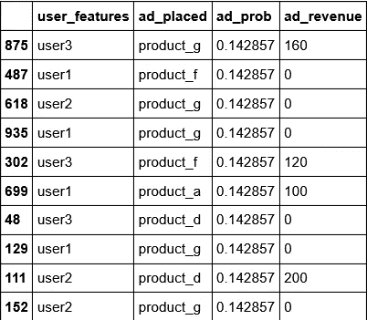
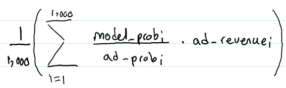
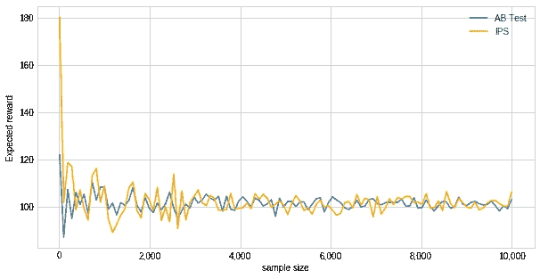
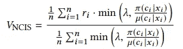
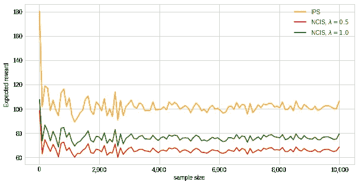
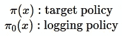
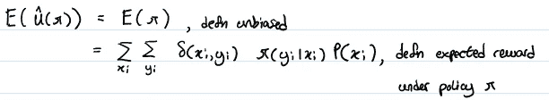
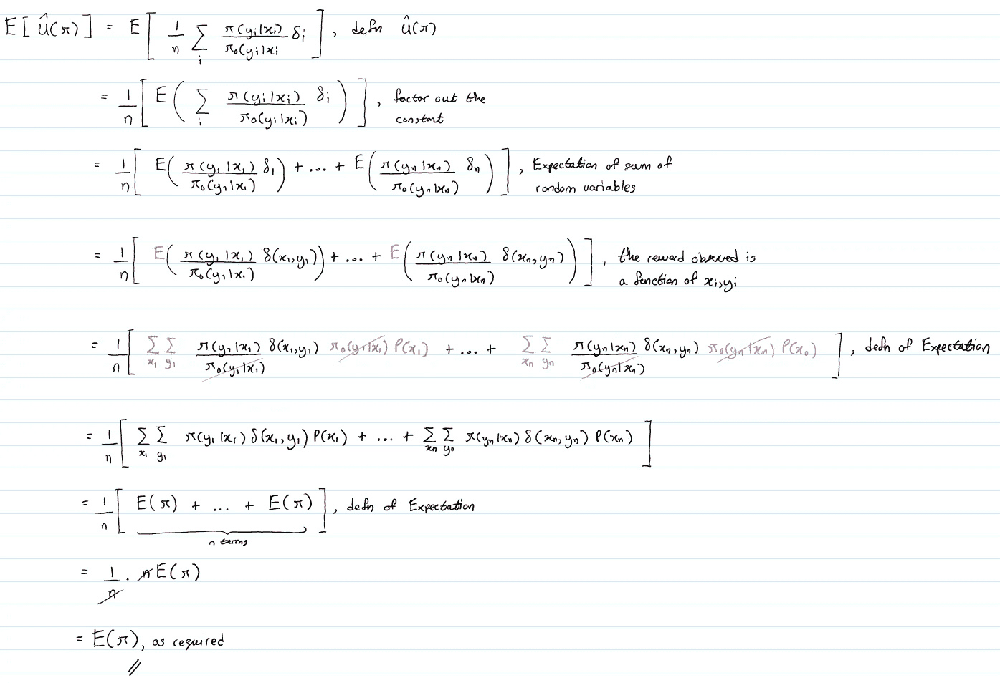

# 如何使用反事实评估来评估在线 AB 测试结果

> 原文：<https://pub.towardsai.net/how-to-use-counterfactual-evaluation-to-approximate-online-ab-test-results-a1f29d6963a1?source=collection_archive---------0----------------------->

# 介绍

在这篇文章中，我将解释一个原则性的方法，在一个在线 AB 测试中，仅使用离线数据来估计模型的预期性能。这对于帮助决定应该优先使用在线 AB 测试来验证哪组模型增强非常有用。

所有复制本文中图形的代码都可以在[这里](https://github.com/hsm207/counterfactual_eval)找到。

# 动机

想象一下，你为一家电子商务网站工作，任务是构建一个算法，在用户主页上向用户推荐网站的小部件。这些建议的商业目标是增加网站的收入。你将如何着手开发这样一个算法？

构建推荐系统的传统方法包括使用一些信息检索指标来评估模型，例如 precision@k、recall@k 和 NDCG@k。这被称为离线评估。然后，在这些指标上得分较高的模型将进入下一阶段，即在线 AB 测试，在该阶段，将根据实际业务目标对模型进行评估，例如最大化收入、最大化观看时间等。

这种方法的缺点是没有理由期望任何离线指标与业务指标很好地相关。所以，完全有可能一个在线下测评阶段成绩很好的车型，在线上 AB 测试阶段表现很差。

难道不能跳过线下评测阶段，直接进入线上 AB 测试阶段吗？这是不实际的，原因如下:

1.  一个真正糟糕的模式可能会导致用户集体放弃网站。
2.  将模型集成到生产环境中是一个耗时的过程，因此我们应该只将它保存到有很大机会满足给定业务目标的潜在模型中。

理想情况下，我们希望对模型在真实数据上的预期性能进行可靠的估计，而不必在生产中部署模型。所谓可靠，我们的意思是估计值是模型真实性能的一个很好的近似值。

这样的估计量存在吗？

# 问题陈述

为了简单起见，让我们假设我们需要向用户推荐七个产品广告中的一个。每个广告，如果被用户点击，将产生不同数额的收入。

由于我们正在处理合成数据，我们知道当前算法的真实性能给出了 63.30 的平均收入。让我们称当前算法为日志策略。

现在，我们开发了一种新的算法。姑且称之为目标政策。我们想知道目标策略是否比日志策略更好。

如果目标策略已经部署到生产中，它的平均收益将是 100.99，因此目标策略确实优于日志策略。关键问题是:有没有一种方法可以让我们不必部署到生产环境中就能得出相同的结论？

# 反向倾向得分(IPS)估计量

## 定义

假设我们已经设置了日志记录策略，以便它为推荐的每个广告记录以下内容:

图 1:日志策略保存的日志样本

图 1 显示了日志策略记录了它用来生成推荐的特征(`user_features`)、实际上最终被推荐给用户的广告(`ad_placed`)、广告被推荐给用户的概率(`ad_prob`)以及特定推荐的结果(`ad_revenue`)。假设我们有 1000 个这类日志条目。

通过设计，我们能够询问我们的目标策略，告诉我们在给定用户特征 x 的情况下推荐广告 Y 的概率。让我们称这个概率为`model_prob`，并为我们日志中的每个条目计算它。

然后，我们可以定义以下估计量:

图 2:目标策略的反向倾向分数(IPS)估计器的定义

图 2 定义了 IPS 估计量来估计目标政策的预期绩效，即平均收入。请注意，计算它所需的所有值都可以在不将目标策略部署到生产环境的情况下获得:

*   `ad_prob`和`ad_revenue`的值来自日志记录策略保存的日志
*   `model_prob`的值是目标策略离线训练后的预测结果。

下一节将展示根据日志计算的 IPS 估计器将允许我们得出结论，目标策略比日志记录策略更好。

## 结果

在我们的 1，000 个条目日志上计算图 2 中定义的 IPS 估计值，得出的平均收入为 103.46(非常接近 100.99 的真实性能)，而日志记录策略的平均收入为 63.43。因此，我们应该有信心将我们的目标策略部署到生产环境中，并进行 AB 测试，将其与日志策略进行比较，作为最终验证。

此示例假设我们有一个包含 1，000 个条目的日志来计算目标策略的预期回报的 IPS 估计值。如果我们有更多或更少的日志条目，我们的结论会有什么变化？它与实际进行在线 AB 测试相比如何？

图 3:在不同的日志大小下，使用 IPS estimator 和 AB 测试评估目标策略的比较

图 3 显示 IPS 估计器很好地跟踪了 AB 测试的结果。样本大小是指我们记录生产中目标策略(AB 测试)或日志策略(IPS)性能的条目数量。两种方法都很快收敛到真实目标策略的平均收益，因为在大约 4000 个样本大小后，预期回报相当稳定。

这里的结论是，记录日志策略建议的日志越多，我们就越有信心使用 IPS 估计器计算的任何目标策略的预期回报将与在线 AB 测试结果一致。

## 为什么有效

这种方法是可行的，因为 IPS 估计量是目标保单平均收入的无偏估计量。证明这一点很简单，有兴趣的读者可以参考附录部分的细节。

# 其他评估者

除了 IPS 估计量之外，还有许多估计量被提议作为目标政策预期回报的估计量。这些估计量在偏差和方差权衡方面与 IPS 估计量不同。

例如，[1]提出了一种称为归一化上限重要性抽样(NCIS)的估计量。该估计器引入了一个名为 *λ* 的参数，试图控制估计器的方差:

图 NCIS 估计量的定义。来源:[1]

这是我们数据集上估计量的样子:

图 IPS 与 NCIS 评估者的行为

图 5 显示，相对于 IPS 估计量，NCIS 估计量确实具有较低的方差(不太起伏的曲线),但并不收敛于真实的预期回报，即，与 IPS 估计量相比，NCIS 估计量具有较低的方差但较高的偏差。

然而，[1]认为，只要偏差不影响候选目标策略的相对顺序，NCIS 就是一个很好的标准，可以用来从一组目标策略中挑选哪些策略转移到在线 AB 测试。

# 个案研究

[2]展示了本文中讨论的思想的一些有趣的真实世界用例。特别是:

*   使用 IPS estimator 来决定将哪个策略部署到 Yahoo FrontPage 以向用户推荐故事
*   使用 IPS estimator 来决定将哪个策略部署到 Bing 拼写器，以选择查询的单词重构，即自动更正

由于所使用的日志记录策略，这两个案例研究值得注意。前者有一个日志策略，随机地向用户统一推荐故事(与本文中使用的例子相同)，而后者没有。然而，在这两种情况下，IPS 估计器能够准确地估计目标策略的预期回报

# 结论

本文讨论了使用反事实评估来离线评估目标策略背后的主要概念。关键的先决条件是要有足够详细的历史日志，以便能够对目标策略的预期性能进行可靠的估计，而不必经历将其部署到生产环境的麻烦。

如果你有任何问题，请在评论中告诉我。我也有兴趣听听其他离线方法评估目标策略的案例研究。

# 参考

[1] [在线评估，对播放列表推荐算法进行决策。](http://pchandar.github.io/static/Gruson2019-a2c9a8576182dcb33019d20a7c7a51b7.pdf)格鲁森等人。艾尔。2019

[2] [SIGIR 2016 搜索、推荐、广告投放反事实评估与学习教程](http://www.cs.cornell.edu/~adith/CfactSIGIR2016/)。约阿希姆和斯瓦米纳森。2016

# 附录

## 附录 IPS 估计量是一个无偏估计量

本节将说明 IPS 估计量是一个无偏估计量。

首先，我们定义一些符号:

图 a 1.1:IPS 估计量的定义

其中:

图 A1.2:表示目标和日志策略的符号

为了说明 IPS 估计量是无偏的，我们需要证明:

图 A1.3:证明的最终目标

所以，我们开始吧:

图 a 1.4:IPS 估计量无偏的证明

如果有任何步骤不清楚，请在评论中告诉我。