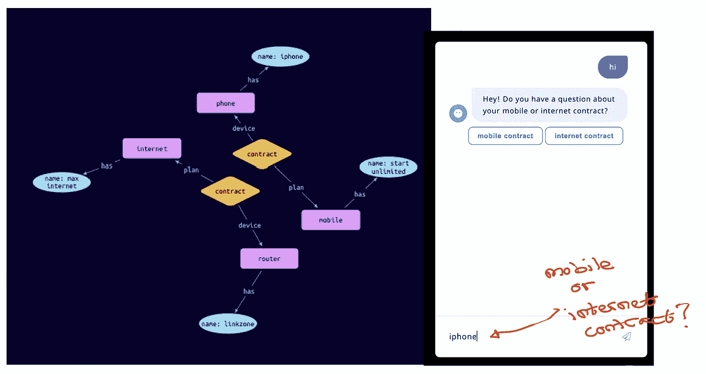
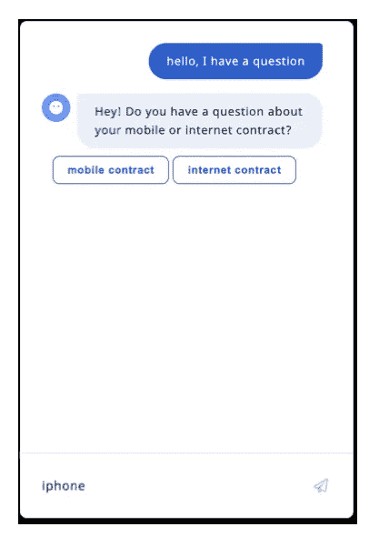
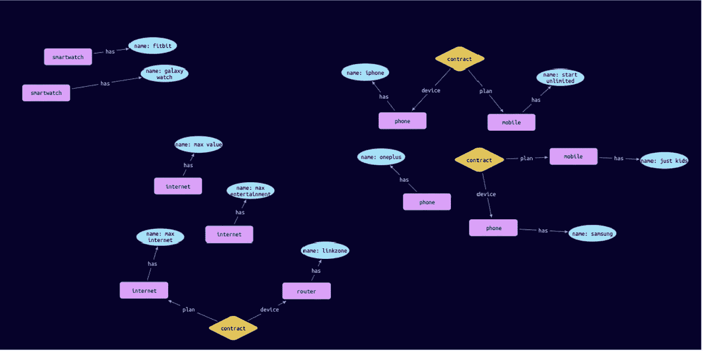
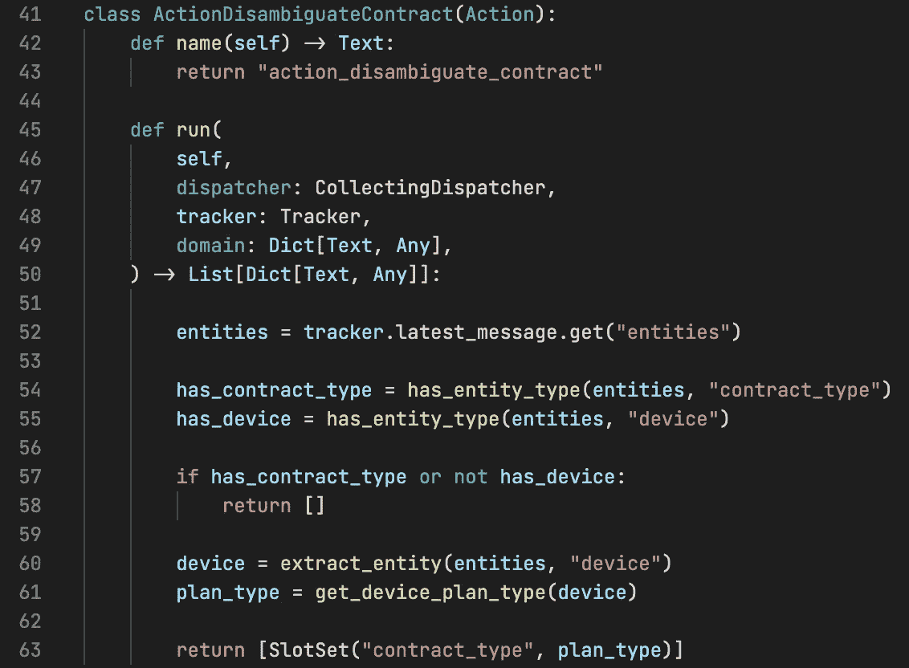
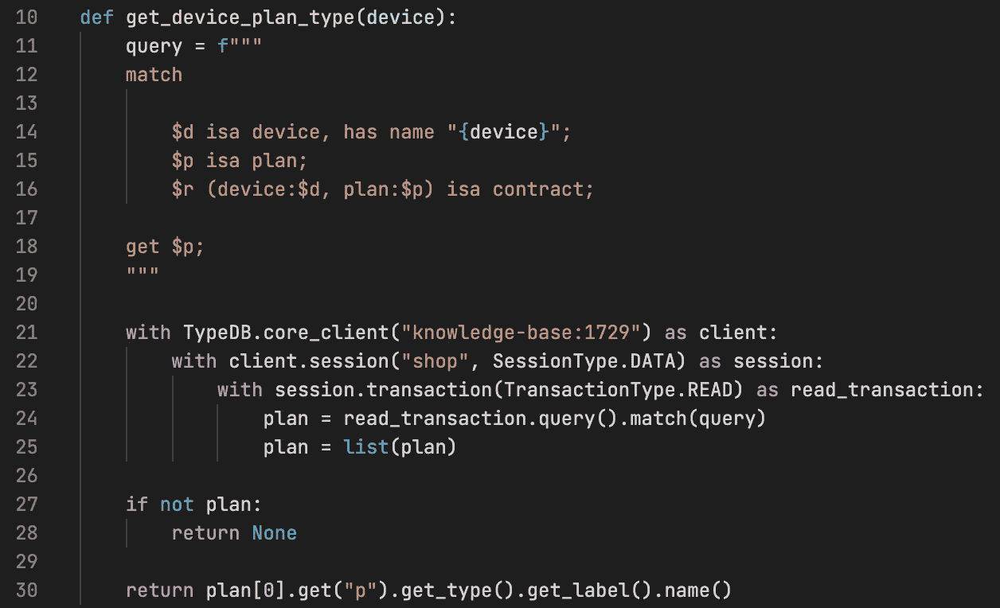
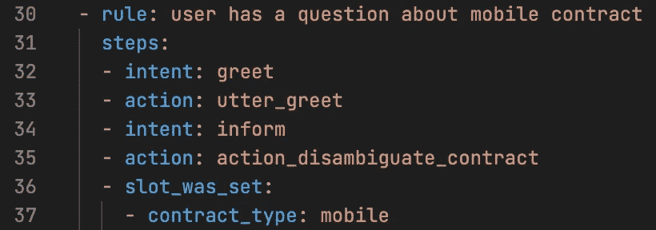

# 如何使用知识图来构建聊天机器人，以解析模糊的用户话语

> 原文：<https://pub.towardsai.net/how-to-use-knowledge-graphs-to-build-chatbots-that-can-parse-ambiguous-user-utterances-eb25fbbf9f6?source=collection_archive---------0----------------------->

## [自然语言处理](https://towardsai.net/p/category/nlp)

# 介绍

在本文中，我将解释聊天机器人如何使用知识图来解析从歧义话语中提取的实体。

我们将使用 [Rasa](https://rasa.com/) 作为示例聊天机器人，使用 [TypeDB](https://vaticle.com/) 作为示例知识图。我假设用户熟悉这些工具的工作方式。否则，人们可以参考各自工具的快速入门指南。

本文中重现结果的代码可以在[这里](https://github.com/hsm207/rasa_kg)找到。

# 问题陈述

假设您的任务是为一家电信公司构建聊天机器人，以改善他们的客户体验。这意味着机器人应该能够处理诸如账单支付、普通客户查询、在线购买等事情。

所以，假设有这样一句话:

> 我想买一部 iphone

很明显，用户的意图是购买设备，单词“iPhone”就是该设备。因此，注释这个话语的意图和实体是简单的。

现在，考虑下面的话语:

> 苹果手机

如果没有额外的语境，很难理解如何理解上述话语。

假设话语“iPhone”出现在以下上下文中:

图 1:示例对话

图 1 显示用户想问一个问题。机器人通过要求用户澄清他们的问题是关于移动还是互联网合同来做出响应(让我们假设机器人只能处理这些类型的问题)，并为用户提供几个按钮来表明他们的意图。

让我们想象一下，用户不确定他们拥有哪个合同:他们从该公司获得了一部 iPhone，但不确定它是通过移动合同还是互联网合同，因为……iPhone 是一种可以用来上网冲浪的移动设备。

因此，用户没有点击任何一个按钮，而是决定键入“iPhone ”,希望机器人足够聪明，能够找出正确的合同。

我们如何将这样的“智能”构建到聊天机器人中？

意图或实体注释都不是可行的选项，因为话语只有一个单词，所以它缺少上下文，即周围的单词，以使意图分类或实体提取工作良好。

一个显而易见的解决方案是使意图分类和实体提取与上下文相关，例如，根据用户的话语和对话中的先前`n`话轮来训练意图分类器和实体提取器。如果您正在使用的聊天机器人框架支持它，或者您愿意投资自己构建该功能所需的资源，这是一个不错的选择。

如果上市时间是一个关键因素，那么您需要尽可能地利用现有的解决方案。在这种情况下，通过知识图构建推理功能是更好的选择。

# 解决办法

## 概观

使用知识图来帮助聊天机器人解决不明确的实体包括 3 个步骤:

1.  定义知识图
2.  编写逻辑代码以解析实体
3.  调用歧义消除逻辑

## 步骤 1:定义知识图

本文将使用下面的知识图表来演示该解决方案是如何工作的:

图 2:一家电信公司的知识图示例

图 2 显示电信公司有 3 种设备:智能手表、路由器和电话。它有两种类型的计划:移动和互联网。“合同”将计划与设备联系起来。

在我们试图解决的问题的背景下，我们可以对图 2 中的知识图进行相关的观察:

1.  有一份合同规定，一部“三星”手机附带“儿童专用”手机套餐。
2.  有一份合同规定“iPhone”手机附带“无限启动”移动计划。
3.  有一份合同规定“链接区”路由器附带“最大互联网”互联网计划。
4.  智能手表没有合同
5.  “一加”手机没有合约

因此，如果用户在被问及是否有关于移动或互联网合同的问题时回答“iPhone”，那么可以合理地假设他们指的是移动合同。同样，如果他们回答“链接区”，那么他们可能指的是互联网合同。

让我们看看如何实现这个逻辑。

## 步骤 2:编写逻辑代码来解析实体

Rasa 的[自定义动作](https://rasa.com/docs/rasa/2.x/custom-actions)特性允许执行任意代码。因此，这是实现自定义实体解析逻辑的好地方。下面是实现这一点的代码:

图 3:如何消除用户对移动和互联网合同问题的答案的歧义

如果用户点击了图 1 中的任何一个按钮，那么`contract_type`槽就会被正确的实体填充。这意味着我们不需要做任何事情，可以退出自定义操作(第 58 行)。

如果用户没有点击任何一个按钮，并且他们的话语包含一个`device`实体，例如“iPhone”、“有 iPhone 的那个”等等，那么我们计算出设备计划的类型(第 61 行)并且相应地设置`contract_type`槽。

以下是计算设备计划的函数:

图 4:如何确定设备的计划类型

第 12–18 行是我们将发送到知识图的查询，返回设备的计划。

如果查询返回一个计划，那么我们返回计划的类型(第 30 行)。否则，我们返回`None`(第 28 行)。请注意，我们假设一个设备只有一种规划类型。

剩下的就是在对话过程中调用这个自定义操作。

## 步骤 3:调用歧义消除逻辑

这一步很简单:我们只需在用户表达了他们的偏好后插入对定制动作的调用。

例如，如果我们使用以下规则实现了图 1 中的对话:

图 5:图 1 中对话的实现

然后，我们需要将其更改为:

图 6:支持实体解析的图 5 的更新

请注意，我们必须做的唯一更改是调用我们在图 3 中定义的自定义操作(第 35 行)。

# 演示

如果用户点击“移动合同”，应该会发生以下情况:

图 7:用户点击“移动合同”

如果用户点击“互联网合同”:

图 8:用户点击“互联网合同”

由于一个“iPhone”连接到一个移动计划，当用户说出“iPhone”时，我们期望得到与图 7 相同的结果。如果用户键入“链接区域”，类似的推理也适用:

图 9:如果用户说出连接到移动计划的设备

图 10:如果用户说出一个连接到互联网计划的设备

由于“一加”手机与任何计划都无关，我们预计该机器人无法理解用户的意图:

图 11:当用户说出没有连接到移动或互联网计划的设备时

# 结论

本文展示了聊天机器人如何使用知识图来解析具有多种“含义”的实体。

虽然解析逻辑可以在没有知识图的情况下实现，但是使用它的好处是可以将逻辑委托给外部的专门服务。应用程序(即聊天机器人开发者)不再负责对其进行编码。这在可维护性、可伸缩性和支持更复杂的解析逻辑方面有巨大的好处。

我希望这篇文章对你有用。