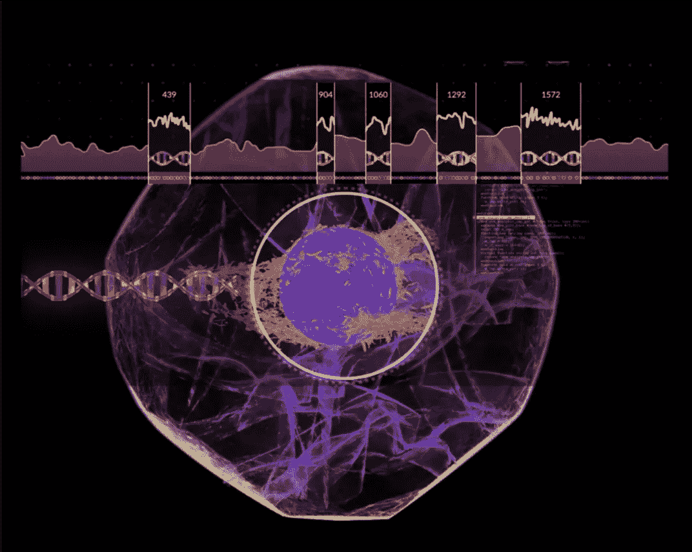
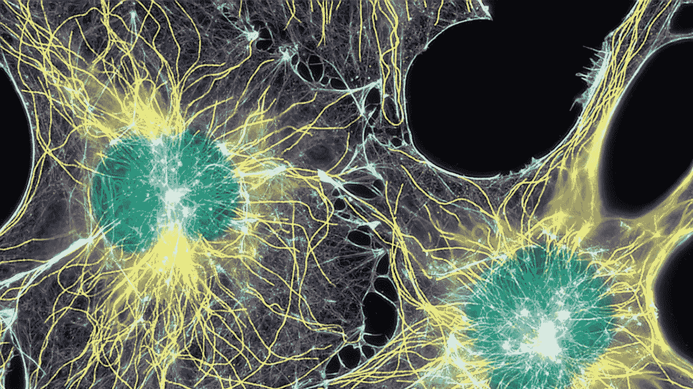
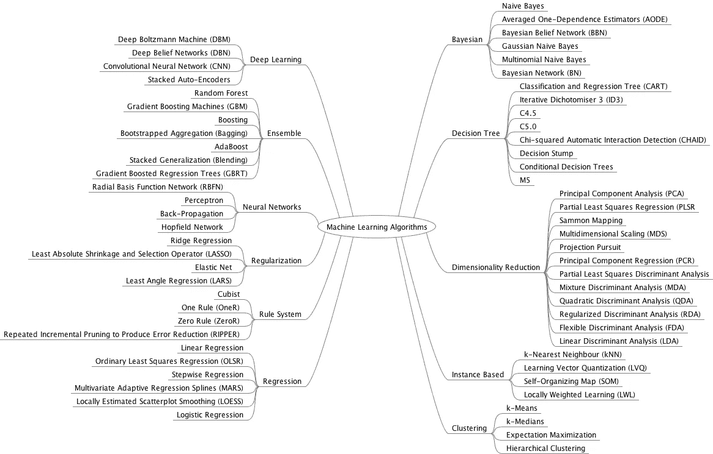
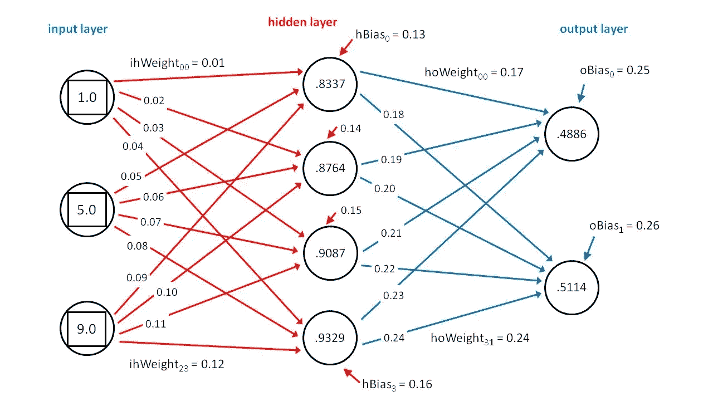

# 如何在生物信息学研究中使用机器学习

> 原文：<https://pub.towardsai.net/how-to-use-machine-learning-in-bioinformatics-research-part-1-144a7c5290c9?source=collection_archive---------1----------------------->

## 生物信息学中的机器学习|第一部分

生物信息学中的机器学习

我正在进行生物信息学的本科研究，我对机器学习和深度学习有着极大的热情。我的热情迫使我搜索关于集成机器学习和深度学习技术来解决生物信息学中的问题。所以我想分享我的知识来支持其他研究人员，帮助他们避免我在研究工作早期遇到的困难。

# 什么是生物信息学？

生物信息学

生物信息学可以定义为“应用计算工具来组织、分析、理解、可视化和存储与生物大分子相关的信息”(Luscombe 等人，2001；Pevsner，2015)。

简单地说，生物信息学是应用算法、工具和技术来管理和分析生物数据。它是所有其他领域如计算机科学、生物学、统计学、物理学、化学等的地方。整合解决生物学问题。

# 生物信息学中的机器学习

生物信息学中的机器学习

在几个生物学领域中，机器学习技术被应用于从数据中提取知识。

1.  基因组学
2.  蛋白基因组学
3.  微阵列
4.  系统生物学
5.  演变
6.  文本挖掘

# (1)基因组学

基因组学

基因组学是生物信息学中最重要的领域之一。可用序列的数量呈指数增长。为了获得有用的信息，需要对这些数据进行处理。这些都是与基因组研究相关的活跃领域。

1.  从基因组序列中提取基因的位置和结构
2.  调控元件和非编码 RNA 基因的鉴定
3.  用于基因功能和 RNA 二级结构预测的序列信息

# (2)蛋白质组学

蛋白基因组学

如果基因包含信息，蛋白质就是将信息转化为生命的工人。蛋白质在生命过程中起着非常重要的作用，它们的三维结构是其功能的一个关键特征。这些都是与蛋白质组学研究相关的活跃领域。

1.  蛋白质结构预测
2.  蛋白质功能预测

# (3)微阵列

微阵列

计算方法在生物学中的另一个有趣的应用是复杂实验数据的管理。微阵列论文是收集这类数据的最著名的(但不是唯一的)领域。这些是与微阵列研究相关的活跃领域。

1.  预处理复杂的实验数据，以供机器学习算法适当使用
2.  数据分析，这取决于我们在寻找什么，如表达模式识别，分类
3.  遗传网络诱导

# (4)系统生物学

系统生物学

系统生物学是生物学和机器学习合作的另一个领域。模拟细胞内发生的生命过程是非常复杂的。这些都是与系统生物学研究相关的活跃领域。

1.  模拟生物网络，如遗传网络、信号转导网络和代谢途径

# (5)进化

演变

进化，尤其是进化树重建也利用了机器学习技术。系统进化树是生物进化的示意图。这些都是与进化研究相关的活跃领域。

1.  进化树构建(传统上)——基于不同的特征(形态特征、代谢特征等。)
2.  系统进化树构建(现在)-基于不同基因组之间的比较(多重序列比对，其中优化技术非常有用)

# (6)文本挖掘

文本挖掘

将计算技术应用于日益增长的数据量的一个副作用是可用出版物的增加。这提供了一个新的有价值的信息来源，其中需要文本挖掘技术进行知识提取。这些都是与文本挖掘研究相关的活跃领域。

1.  功能注释
2.  蜂窝位置预测
3.  蛋白质相互作用分析

# (7)其他应用

其他应用

除了所有这些应用，计算技术还被用来解决其他问题。

1.  用于 PCR 的有效引物设计，
2.  生物图像分析
3.  蛋白质的反向翻译

# 为什么是机器学习？

机器学习

机器学习用于通过使用示例数据或过去的经验来优化性能标准。优化标准可以是，

1.  (建模问题)中预测模型提供的准确性
2.  (最优化问题)中适应度或评价函数的值

## (1)建模问题

建模问题

在建模问题中,“学习”一词指的是运行计算机程序，通过使用训练数据或过去的经验来归纳模型。ML 在建立计算模型时使用统计理论，因为它的目标是从样本中进行推断。有两个主要步骤。

1.  通过处理大量数据来归纳模型(学习)
2.  表示模型并有效地进行推理(推论)

值得注意的是，学习和推理算法的效率，以及它们的空间和时间复杂性以及它们的透明性和可解释性，可能与它们的预测准确性一样重要。

## (2)最优化问题

优化问题

它的任务是在多个(有时是指数大小的)可能解的空间中找到一个最优解。根据找到的解决方案的类型，有两类优化方法。

1.  精确方法= >达到收敛时输出最优解
2.  近似方法= >输出一个候选解，但不保证是最优解

# 最终想法

最终想法

我希望在我的下一系列博客中讨论监督分类、聚类、概率图模型和优化。希望你能和我保持联系。

我要特别感谢我的大学讲师 C. T .温尼格博士

谢谢大家！！！…未完待续…