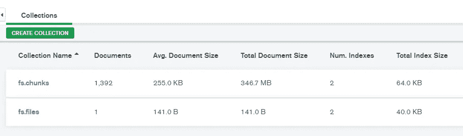

# 如何使用 MongoDB 存储和检索 ML 模型

> 原文：<https://pub.towardsai.net/how-to-use-mongodb-to-store-and-retrieve-ml-models-2a8a831e7326?source=collection_archive---------0----------------------->

## [机器学习](https://towardsai.net/p/category/machine-learning)，[数据科学](https://towardsai.net/p/category/data-science)

## 使用 MongoDB 的 GridFS 特性来存储和检索机器学习模型


来源:mongoDB.com

如果你正在寻找一个数据库来存储你的机器学习模型，那么这篇文章就是为你准备的。你可以使用 **MongoDB** 来存储和检索你的机器学习模型。不多说了，让我们直奔主题吧。

# MongoDB

MongoDB 是一个非常流行的 NoSQL 数据库。在 MongoDB 中，数据以类似 JSON 的文档形式存储。更具体地说，文档是以 BSON 对象的形式存储的，它只不过是用 JSON 格式表示的二进制数据。

> MongoDB 中的**文档**和**集合**分别类似于关系数据库(RDBMS)中的**记录**和**表**。

如果您已经在使用 MongoDB，那么您必须知道 BSON 文档的大小限制是 16 MB。也就是说，如果文件大小超过 16 MB，就不能存储。这对你来说也意味着，如果你的机器学习模型大小超过 16 MB，你就不能使用 MongoDB 文档存储。

参考下面的例子，当模型大小小于 16 MB 时，从 MongoDB 存储和检索。

```
from bson.binary import Binary
from bson import ObjectId
import pymongo, gridfs
from gridfs import GridFS
from pymongo import MongoClientMONGO_HOST = "127.0.0.1"
MONGO_PORT = 27017
MONGO_DB = "myDB"model_file = 'keras_model.h5'myclient = pymongo.MongoClient(MONGO_HOST, MONGO_PORT)
mydb = myclient[MONGO_DB]
mycol = mydb['mycollection']# Store model as binary document
with open(model_file, "rb") as f:
    encoded = Binary(f.read())mycol.insert_one({"filename": model_file, "file": encoded, "description": "Keras model" })# Retrieve and store the ML model from MongoDB
data = mycol.find_one({'filename': 'keras_model.h5'})
with open("keras_model_fromMongo.h5", "wb") as f:
    f.write(data['file'])
```

我知道你一定在想什么。**模型大小超过 16 MB 怎么办？这是一个非常合理的问题。不要惊讶，有时模型大小会以千兆字节为单位(例如 transformer 模型)。在这种情况下，MongoDB 提供了 GridFS API，可以用来存储大于 16 MB 的文档。让我们在下一节看看 GridFS。**

# GridFS

GridFS 是一个文件系统，用于存储和检索大于 BSON 文档 16 MB 大小限制的文档。即使文件小于 16 MB，也可以使用它。

## GridFS 如何存储数据

GridFS 把文件分成所谓的**块**，每个块作为一个文档单独存储。默认情况下，每个卡盘的大小为 255 KB。只有最后一个区块可以是 255 KB 或更小。

GridFS 使用两个集合(表)块和文件来存储文件。从下图中可以看出，GridFS 将这两个集合添加到默认的 bucket **fs 中。**

*   **chunks** :这个集合存储所有包含二进制格式数据的块。
*   **files:** 这个集合存储文件的元数据。

请参考关于 [**组块**](https://docs.mongodb.com/manual/core/gridfs/#the-chunks-collection) 和 [**文件**](https://docs.mongodb.com/manual/core/gridfs/#the-files-collection) 的官方文档，了解这两个集合中的字段及其描述等更多详细信息。

本文的主要目标是使用 GridFS 来存储和检索机器学习模型。现在，让我们来看看一些代码。

## 将 ML 模型存储到 MongoDB 中

首先，您需要导入所需的库并初始化一些变量，如 **MONGO_HOST** 、 **MONGO_PORT** 和 **MONGO_DB** 。接下来，创建 MongoClient 对象 **myclient** ，用于连接到特定的数据库(本例中为‘mydb’)。然后，创建一个 GridFS 实例，在特定数据库上运行。最后，使用 GridFS 对象的 **put()** 方法将模型存储到 MongoDB 中。

注意， **put()** 方法返回 **ObjectId** ，然后在从 MongoDB 中检索模型时使用它。

```
import io 
import pymongo, gridfs
from gridfs import GridFS
from pymongo import MongoClientMONGO_HOST = "127.0.0.1"
MONGO_PORT = 27017
MONGO_DB = "mydb"myclient = pymongo.MongoClient(MONGO_HOST, MONGO_PORT)
mydb = myclient[MONGO_DB]
fs = gridfs.GridFS(mydb)model_name = 'tf_model.h5'with io.FileIO(model_name, 'r') as fileObject:
    docId = fs.put(fileObject, filename=model_name)
```

一旦运行上面的代码，它会将 **tf_model.h5** 模型存储到 MongoDB 中。如前所述，数据被分割成**块**并将存储在 **fs.chunks** 中，元信息将存储在 **fs.files** 中。

对于上面的例子， **tf_model.h5 i** 的大小约为 347 MB，显然大于 16 MB。当使用 GridFS 存储这个模型时，它被分成 1392 个块，并作为文档存储。建议您探究 **fs.chunks** 和 **fs.files** 的内容，以了解如何操作。



## 从 MongoDB 检索 ML 模型

要从 MongoDB 中检索 ML 模型，除了最后一个步骤之外，您需要遵循与前面相同的步骤。您需要将想要从 MongoDB 检索的文件(模型)的 **ObjectId** 传递给 GridFS 的 **get()** 方法。这将把模型从 MongoDB 下载到本地机器，名为**keras _ model _ from mongo . H5 .**

```
import io
import pymongo, gridfs
from bson import ObjectIdMONGO_HOST = "127.0.0.1"
MONGO_PORT = 27017
MONGO_DB = "mydb"con = pymongo.MongoClient(MONGO_HOST, MONGO_PORT)
db = con[MONGO_DB]
fs = gridfs.GridFS(db)with open(’keras_model_fromMongo.h5’, 'wb’) as fileObject:
    fileObject.write(fs.get(ObjectId(**docId**))
                     .read() )
```

注意，GridFS 的使用不仅限于存储和检索机器学习模型。你可以用它来存储任何类型的文件，如文本文件，图像，视频等。

*最初发表于*[***python 简化版***](https://pythonsimplified.com/how-to-use-mongodb-to-store-and-retrieve-ml-models/)**2021 年 2 月 9 日。**

**阅读更多关于 Python 和数据科学的有趣文章，* [***订阅***](https://pythonsimplified.com/home/) *到我的博客*[***pythonsimplified.com******。*** 你也可以在](http://www.pythonsimplified.com/)[**LinkedIn**](https://www.linkedin.com/in/chetanambi/)**上联系我。***

# *结论*

*MongoDB BSON 文档有一个 16 MB 的大小限制，所以它不能用来存储任何大于这个限制的文档。您知道使用 GridFS API，您可以将大型对象(包括机器学习模型)存储到 MongoDB 中。您还通过示例了解了如何从 MongoDB 存储和检索模型。*

*我希望你喜欢阅读这篇文章。如果你喜欢我的文章并想订阅 Medium，你可以在这里这样做:*

*[](https://chetanambi.medium.com) [## Chetan Ambi -介质

### 阅读 Chetan Ambi 在媒体上的文章。数据科学|机器学习| Python。参观 https://pythonsimplified.com/…

chetanambi.medium.com](https://chetanambi.medium.com)* 

# *参考*

*[1].[https://docs.mongodb.com/manual/core/gridfs/](https://docs.mongodb.com/manual/core/gridfs/)*