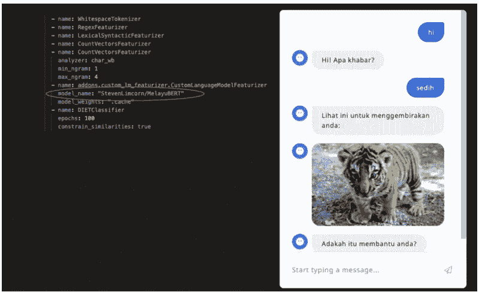
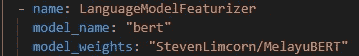
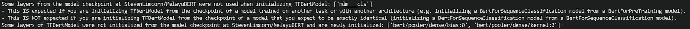
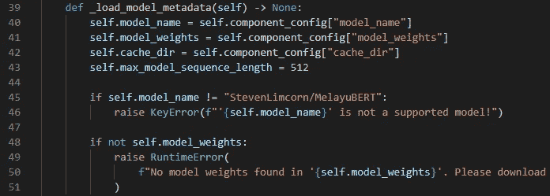
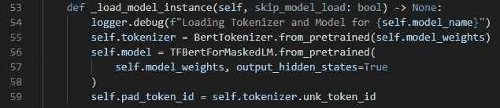
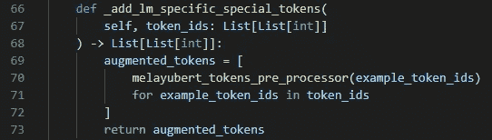
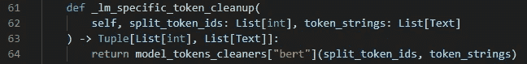
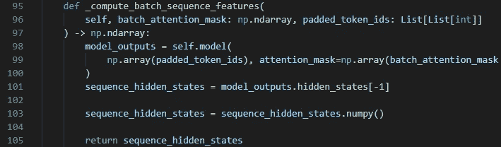
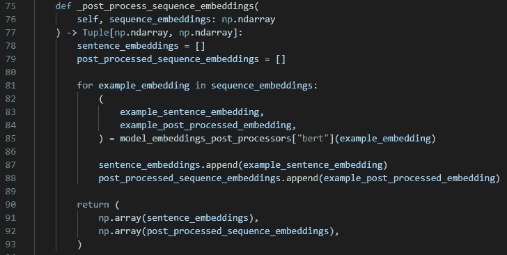
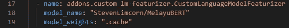

# 如何使用 Rasa 来构建一个理解巴哈萨梅拉尤语的机器人

> 原文：<https://pub.towardsai.net/how-to-use-rasa-to-build-a-bot-that-understands-bahasa-melayu-ab97bcb6f546?source=collection_archive---------1----------------------->

## [自然语言处理](https://towardsai.net/p/category/nlp)

## 关于扩展 LanguageModelFeaturizer 组件以使用其他预训练模型的教程

# 介绍

在本文中，我将解释如何扩展 Rasa 的[语言模型特征器](https://rasa.com/docs/rasa/components#languagemodelfeaturizer)组件，以使用 HuggingFace 的[模型库](https://huggingface.co/models)上的其他模型。

我假设读者熟悉使用 Rasa 构建聊天机器人。如果不是这样，那么[在 YouTube 上观看这些系列视频](https://www.youtube.com/playlist?list=PL75e0qA87dlEjGAc9j9v3a5h1mxI2Z9fi)来快速跟上进度。

重现本文中描述的结果的代码可以在[这里](https://github.com/hsm207/rasa_moodbot/tree/melayu)找到。

# 问题陈述

假设你的任务是构建一个聊天机器人，它将用马来语与用户互动。

因为你刚刚开始，你没有很多现实世界的对话来训练 [NLU 模型](https://rasa.com/docs/rasa/glossary#nlu)。然而，有很多用马来语进行的对话(如社交媒体)。我们如何利用这些对话来改进 NLU 模式？

# 解决办法

一个解决方案是在马来语语料库上训练一个语言模型，该语言模型近似于你期望你的用户对你的机器人说出的话语。然后，您可以将语言模型视为一个特征化器，并将这些特征输入到[饮食分类器](https://rasa.com/docs/rasa/components#dietclassifier)中进行进一步的“微调”。

如果语言模型是使用 Hugging Face 的 [transformers](https://huggingface.co/transformers/) 库构建的，那么它可以使用[LanguageModelFeaturizer](https://rasa.com/docs/rasa/components#languagemodelfeaturizer)组件集成到 NLU 模型的预测管道中。

本文的其余部分假设我们有兴趣使用 [Melayu BERT](https://huggingface.co/StevenLimcorn/MelayuBERT) 模型作为特征。

# 扩展或重用 LanguageModelFeaturizer 组件？

因为 Melayu BERT 基于 BERT 模型，所以使用 LanguageModelFeaturizer 组件的合理方法是这样配置它:

图 1:配置 LanguageModelFeaturizer 以使用 Melayu BERT

尽管培训运行成功，但日志显示:

图 2: Melayu BERT 与 BERT 不“兼容”

这是因为`model_name: "bert"`参数对应于 [TFBertModel](https://huggingface.co/transformers/model_doc/bert.html#tfbertmodel) 架构，而 Melayu BERT 模型是使用 [TFBertForMaskedLM](https://huggingface.co/transformers/model_doc/bert.html#transformers.TFBertForMaskedLM) 架构实现的。

更谨慎的方法是子类化`LanguageModelFeaturizer`来定义如何从基于 TFBertForMaskedLM 架构的模型中提取特征。这有助于避免由于模型缺少关键层而意外引入错误。

# 实施细节

TFBertForMaskedLM 模型与 TFBertModel 有许多相似之处。这意味着我们可以重用`LanguageModelFeaturizer`类中的大多数现有方法。

这些是我们需要覆盖的唯一方法:

1.  `_load_model_metadata`
2.  `_load_model_instance`
3.  `_add_lm_specifc_special_tokens`
4.  `_lm_specific_token_cleanup`
5.  `_compute_batch_sequence_features`
6.  `_post_process_sequence_embeddings`

我们将创建一个名为`CustomLanguageModelFeaturizer`的类来覆盖上面的方法。这个类将在名为`addons`的文件夹中名为`custom_lm_featurizer.py`的模块中定义。

## 步骤 1:如何加载模型的元数据

`_load_model_metadata`控制如何处理`LanguageModelFeaturizer`中的配置。

假设我们希望组件失败，如果`model_name`不是`StevenLimcorn/MelayuBERT`并且模型的权重没有被下载。这是该方法的实现方式:

图 3:如何处理组件的配置参数

## 步骤 2:如何加载模型

`_load_model_instance`定义组件记号赋予器、模型和填充记号。这很容易实现:

图 4:定义组件的标记器、模型和填充标记

## 步骤 3:添加语言模型特定的标记

我们知道，伯特模型需要添加[CLS]和[SEP]标记作为其输入的一部分。这部分由`_add_lm_specific_special_tokens`方法处理:

图 5:添加[CLS]和[SEP]标记

## 步骤 4:清理令牌

我们还知道，BERT 的 tokenize 有时会将一个单词分解成多个单词。例如，在 [bert-base-uncased](https://huggingface.co/bert-base-uncased) 模型中，单词“草莓”将被标记为“稻草”和“# #浆果”。

`_lm_specific_token_cleanup`该方法将删除“##”，这样我们就有了更具可读性的内容，以防我们想要将令牌缝合在一起，以便在下游进行进一步处理:

图 6:清理单词块标记化的令牌

## 第五步:如何提取特征

我们希望 DIET 分类器使用 Melayu BERT 的最后隐藏状态作为一个特征来执行意图分类和/或实体提取。我们在`_compute_batch_sequence_features`方法中定义了这种行为:

图 7:定义使用 Melayu BERT 中的哪些特性

## 步骤 6:如何使用这些功能

一旦我们从 Melayu BERT 中提取了特征，我们需要告诉 DIET Classifier 如何使用它进行意图分类和实体提取。这是在`post_process_sequence_embeddings`中完成的:

图 8:如何使用特征进行意图分类(句子嵌入)和实体提取(后期处理序列嵌入)

给定来自 Melayu BERT 的最后一个隐藏状态，用于意图分类和实体提取的特征是[CLS]令牌的矢量表示。用于实体提取的特性是除了[CLS]和[SEP]标记之外的所有特性。这个逻辑与 TFBertModel 的预定义[后处理器相同，这也是我们决定重用它的原因(见第 85 行)。](https://github.com/RasaHQ/rasa/blob/0d97d427fd342b3f0fab4eaabc3d5169249dbf61/rasa/nlu/utils/hugging_face/transformers_pre_post_processors.py#L116-L134)

# 使用

下面的代码片段显示了如何将`CustomLanguageModelFeaturizer`组件作为 NLU 管道的一部分:

图 9:配置`CustomLanguageModelFeaturizer component`

图 9 假设模型工件已经下载到一个名为`.cache`的文件夹中。

# 结论

本文描述了一种使用自定义 LanguageModelFeaturizer 组件的方法，以将 TFBertForMaskedLM 模型用作 Rasa 中的特征。类似的方法可以适用于使用 transformers 库创建的任何模型。

如果你有任何问题，请在评论中告诉我。