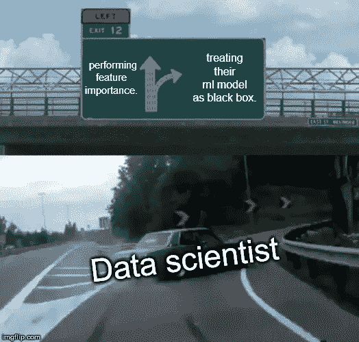
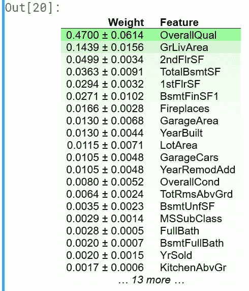

# 如何使用 scikit-learn 'eli5 '库计算排列重要性？

> 原文：<https://pub.towardsai.net/how-to-use-scikit-learn-eli5-library-to-compute-permutation-importance-9af131ece387?source=collection_archive---------0----------------------->

## “eli5”|[对 AI](https://towardsai.net/) 的特征排列重要性

## 了解 scikit-learn 的“eli5”库的工作原理，以计算样本房屋数据集的特征重要性并解释其结果

抄送:福布斯

大多数数据科学家(ML guys)将他们的机器学习模型视为黑盒。他们不知道引擎盖下发生了什么事情。
他们加载数据，进行手动数据清理&准备他们的数据以适应 ml 模型。然后训练他们的模型&预测目标值(回归问题)。

**但是他们不知道，他们的模型认为哪些特性是重要的？**

为了回答上述问题，排列的重要性就显现出来了。

# 这是什么？

置换重要性是一种算法，它为数据集的每个特征变量计算重要性分数
，
通过计算模型对特征值随机置换的敏感度来确定重要性度量。

# 它是如何工作的？

这个概念非常简单:
我们通过计算置换特征后模型预测误差的增加来衡量特征的重要性。
如果打乱某个特征的值会增加模型误差，则该特征是“重要的”,因为在这种情况下，模型依赖于该特征进行预测。
如果混洗某个特征的值而不改变模型误差，则该特征“不重要”,因为在这种情况下，模型会忽略该特征进行预测。

# 我应该计算训练或测试数据(验证数据)的重要性吗？

这个问题的答案是，我们总是在测试数据上测量排列的重要性。
基于训练数据的排列重要性是垃圾。基于训练数据的排列重要性使我们错误地认为特征对于预测是重要的，而实际上模型只是过度拟合，特征根本不重要。

# Eli 5—scikit-learn 库:-

eli5 是一个 scikit 学习库，用于计算排列重要性。

## 使用 eli5 前要小心:-

**1。**模型拟合后，计算排列重要性。

**2。**我们总是计算测试数据(验证数据)的排列重要性。

**3。**Eli 5 的输出是 HTML 格式。所以，我们只能在 ipython 笔记本(即 Jupiter 笔记本，google collab & kaggle 内核等)中使用它。

# 现在，让我们对代码进行一些测试😋

我构建了一个基本模型(RandomForestRegressor)来预测房屋数据集的销售价格。
这是一个很好的数据集示例，用于显示排列的重要性，因为该数据集有许多特征。
因此，我们可以看到哪些特性在预测值时会产生影响，哪些不会。

*现在，我们使用‘Eli 5’库来计算排列重要性。*

*你可以在下面看到上面代码的输出:-*

# 解释结果:-

功能的重要性自上而下递减。
每一行中的第一个数字显示了由于该特征的重组而导致的模型性能的降低。
第二个数字是对特征列的不同重组的性能降低的随机性的度量。
在预测销售价格时，房屋数据集的总体质量特征对模型的影响最大。

## *你可以把住房数据设置进去。来自我的 GitHub 个人资料的 csv 格式*
链接:-[https://GitHub . com/abhinavsp 0730/housing _ data/blob/master/home-data-for-ml-course . zip](https://github.com/abhinavsp0730/housing_data/blob/master/home-data-for-ml-course.zip)

## 你也可以得到。我的 GitHub 概要文件中的 ipnyb 文件(kaggle 内核)链接:-

## [https://github . com/abhinavsp 0730/housing _ data/blob/master/kernel 659579854 a(2)。ipynb](https://github.com/abhinavsp0730/housing_data/blob/master/kernel659579854a(2).ipynb)

## 谢谢你

## 如果你喜欢我的文章，那么鼓掌，跟我来，❤️.

