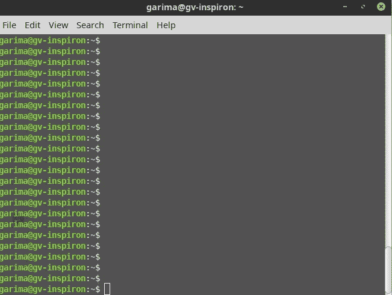
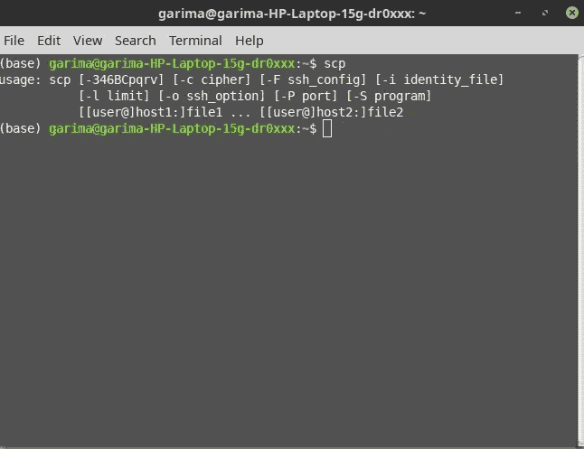
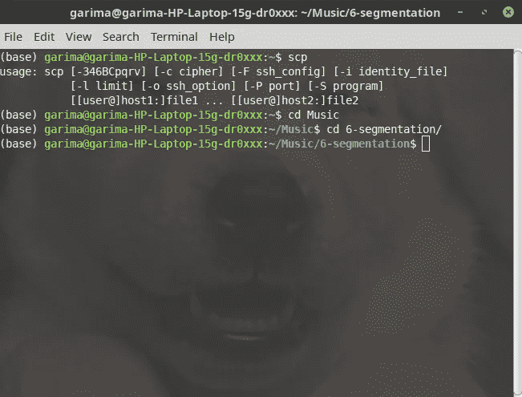
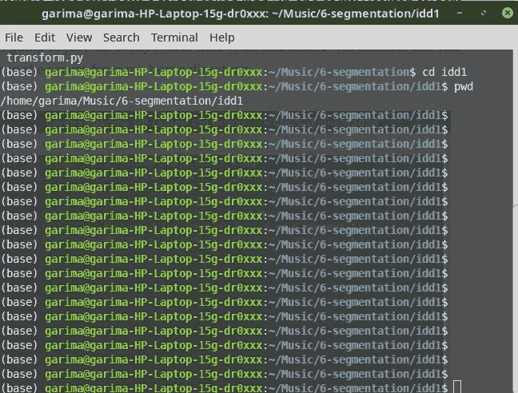
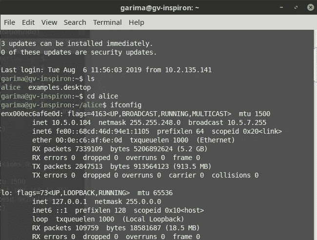
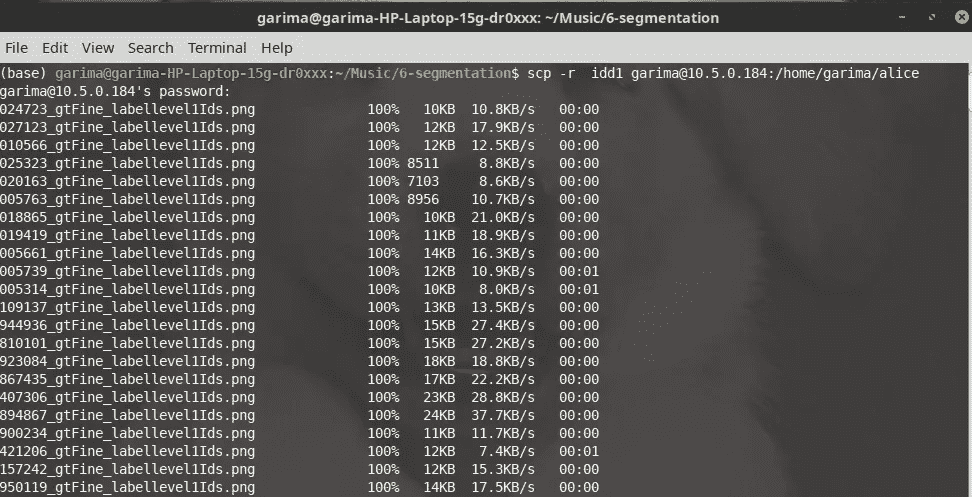

# 如何使用 SCP 命令进行文件传输

> 原文：<https://pub.towardsai.net/how-to-use-the-scp-command-for-file-transfer-42105c648791?source=collection_archive---------0----------------------->

## 使用 Linux | [上的文件传输到 AI](https://towardsai.net)

## Linux 中的 SCP(安全复制)命令可能会令人困惑，让我为您简化一下

在这篇博文中，我将向您展示如何使用 SCP 命令将文件或目录从本地机器复制到远程服务器。假设我有一个远程服务器(如下所示):



这是我的本地机器，


现在，假设我想将文件从本地机器传输到远程服务器。因此，首先，让我们通过在终端中键入“scp”来看看 SCP 命令有哪些选项。



这将向您显示您可以使用 SCP 的所有选项:

正如[文件](https://linux.die.net/man/1/scp)所述

*   **-c 密码**
    选择用于加密数据传输的密码。这个选项直接传递给 ssh(1)。
*   **-F ssh_config**
    为 ssh 指定一个替代的每用户配置文件。这个选项直接传递给 ssh(1)。
*   **-i identity_file**
    选择用于公钥认证的身份(私钥)的读取文件。这个选项直接传递给 ssh(1)。
*   - **l limit**
    限制使用的带宽，单位为 Kbit/s
*   **-o ssh_option**
    它可以用来以 ssh_config 中使用的格式将选项传递给 ssh。

如果我们只是想传输文件，我们可能不会使用所有这些复杂的命令。在这种情况下，我们只需要给出用户名和主机 IP，然后是文件名。
例如，假设我的一个桌面文件夹中有一个名为“idd”的文件夹。

因此，我将首先用 CD 光盘保存到我的文件夹中，然后将这个 idd 文件夹从我的主目录转移到服务器。



我有一个名为“idd1”的文件夹，我将把它复制到远程服务器上。



因此，我们将使用 SCP 命令和此远程服务器的 IP，要知道远程服务器的 IP，您只需说 if config，然后按 enter 键



远程服务器的 IP 地址就写在“inet”旁边，然后我们还需要用户，所以我的用户名是“garima ”,这可能与你的情况不同。

现在，在您的 SCP 命令中写入您的文件名，在我的例子中，只需给出文件名的“idd ”,然后给出主机名，在我的例子中是“*加里玛*”,最后给出@远程服务器的 IP 地址。

> **请注意，如果您的文件是普通文件，您不需要添加-r，它仅用于复制文件夹或目录**

所以，无论你想把文件转移到哪个文件夹，你只需要在冒号(:)后给出路径，例如，我想把我的文件转移到 *alice* 目录，然后按回车键。

```
scp -r idd1 garima@10.5.0.184:/home/garima/alice
```

第一次，它会问你“你确定要继续连接吗？”您可以第一次说“是”,然后按 ENTER 键，然后需要您的远程服务器的密码，以便您使用该密码登录到该远程服务器。只要输入你的密码，这个文件就会被传送。



你有它，你的文件将在一瞬间被转移。