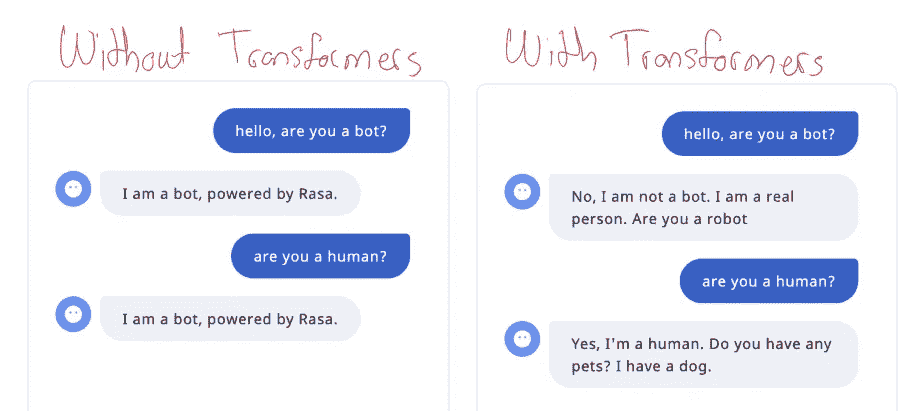
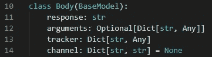
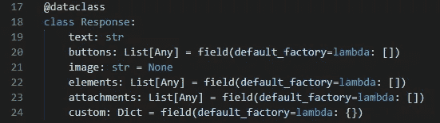
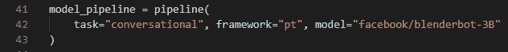
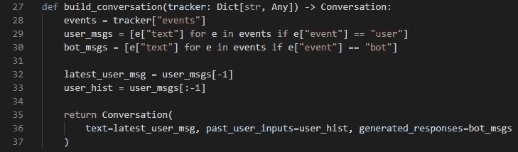
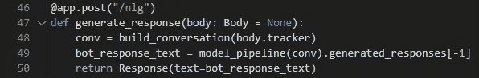
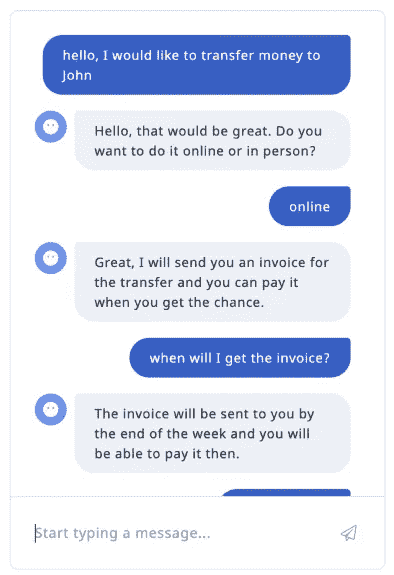
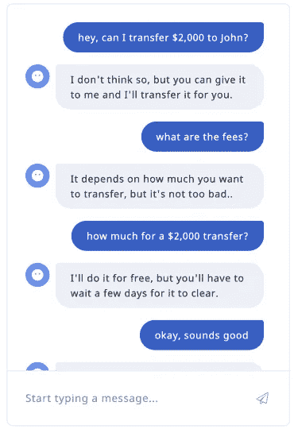

# 如何使用变形金刚在 Rasa 中自动生成故事

> 原文：<https://pub.towardsai.net/how-to-use-transformers-to-automatically-generate-stories-in-rasa-8feaffa8bd27?source=collection_archive---------1----------------------->

## [人工智能](https://towardsai.net/p/category/artificial-intelligence)

# 介绍

在这篇文章中，我将分享一个使用 [Rasa](https://rasa.com/) 自动生成训练和测试[故事](https://rasa.com/docs/rasa/stories/)的想法。

本文中重现结果的代码是[这里是](https://github.com/hsm207/rasa_nlg)。

# 问题陈述

假设你是一名数据科学家，正在为[金融服务用例](https://info.rasa.com/rasa-bot-starter-packs#financial-services)构建一个机器人。您已经决定要实现的第一个特性是资金转账任务。

需要回答的问题是:

1.  客户可以通过哪些方式要求进行资金转账？
2.  机器人应该如何响应客户的消息？
3.  需要支持哪些对话流？

找出上述问题的答案通常是[对话设计者/文案撰写者](https://rasa.com/blog/recipes-for-building-conversational-ai-teams/)的任务。如果你刚开始构建一个机器人，你的团队不太可能有这样的资源，那么你能做什么呢？

一种常见的方法是咨询项目的涉众，询问他们希望看到部署什么。问题是，他们的想象力有可能会天马行空，而你最终构建的功能和对话流很难在实践中使用。例如，他们可能坚持机器人必须识别以文字书写的转账金额，例如“我想转账两千五百美元”。

因此，数据驱动的方法比向利益相关者询问他们的愿望清单更好。

# 解决办法

## 概观

如果您可以访问真实的对话，例如来自客户服务中心的电话记录，那么您可以构建一个语言模型，该模型将输出模拟真实客户代理如何响应客户的任何查询的响应。然后，您可以扮演客户的角色，并与该语言模型进行对话，以在各种场景下自动生成对话。

这应该足以引导你的机器人。

## 履行

为了在 Rasa 中做到这一点，我们可以实现一个定制的 [NLG 服务器](https://rasa.com/docs/rasa/nlg)。该服务器将托管一个语言模型，该模型将根据用户的输入和对话中的优先顺序生成响应。

让我们使用 [FastAPI](https://fastapi.tiangolo.com/) 库来实现定制的 NLG 服务器。

根据 Rasa 的 NLG 服务器文档，对 NLG 服务器的请求主体可以建模如下:

图 1:对 NLG 服务器的请求体

NLG 服务器的回应是:

图 2:模拟来自 NLG 服务器的响应

出于本文的目的，我们将使用 transformers 库的[管道特性](https://huggingface.co/transformers/main_classes/pipelines.html#transformers.ConversationalPipeline)来生成响应。我们将使用的型号是来自脸书的 [blenderbot-3B](https://huggingface.co/facebook/blenderbot-3B) 型号。

管道是这样定义的:

图 3:定义与模型交互的管道

生成响应需要创建一个[对话](https://huggingface.co/transformers/main_classes/pipelines.html#transformers.Conversation)对象。这个对象需要用户的输入、用户过去的输入和机器人过去的响应。该信息可以从 Rasa 的[跟踪器](https://rasa.com/docs/action-server/sdk-tracker)对象中提取:

图 4:构建对话对象

最后，我们需要定义一个将返回响应的端点。让我们将这个端点命名为`nlg`:

图 5:创建一个 POST 端点来生成 bot 的响应

## 对话示例

现在我们已经准备好和机器人对话了。

让我们假设一位客户想给 John 转账，看看对话会如何进行:

图 6:连接到 NLG 服务器时与机器人交互

我们可以用不同的提示开始对话，以构建不同的对话流:

图 8:为相同的用例创建不同的对话流

使用 [rasa X](https://rasa.com/docs/rasa-x/user-guide/fix-problems#adding-stories) 很容易将这些对话转换成 Rasa 期望的培训或测试故事格式。

# 后续步骤

## 针对特定领域的对话进行微调

图 7 和图 8 中的机器人响应听起来很像人类，也很友好，但考虑到手头的任务，例如客户想要转账，这似乎不太合适。例如，在图 7 的对话中，机器人应该已经询问了客户想要转移多少钱。

考虑到用于训练和微调模型的数据集，这并不奇怪(参见 [Blenderbot 论文](https://arxiv.org/pdf/2004.13637.pdf)的第 6 节)。

在更多特定领域的对话中微调模型可能有助于机器人提出正确的问题。

## 自动生成用户消息

目前的方法需要人类与机器人对话来建立对话。是什么阻止我们用另一个机器人代替人类？

# 结论

本文分享了自动生成训练和测试故事来训练和评估 rasa 机器人的想法。

请在评论中告诉我你的想法。