# 如何使用 Weka 预测甲状腺疾病

> 原文：<https://pub.towardsai.net/how-to-use-weka-to-predict-thyroid-disease-e8571c9330d4?source=collection_archive---------1----------------------->


[阿德里安·金](https://unsplash.com/@adriensking?utm_source=unsplash&utm_medium=referral&utm_content=creditCopyText)在 [Unsplash](/s/photos/neck-biology?utm_source=unsplash&utm_medium=referral&utm_content=creditCopyText) 上的照片

## [机器学习](https://towardsai.net/p/category/machine-learning)

## 一.数据集信息

本文中使用的测试和训练数据集可以在以下位置找到:

[https://archive.ics.uci.edu/ml/datasets/thyroid+disease](https://archive.ics.uci.edu/ml/datasets/thyroid+disease)

这是我们将使用的两个数据集的描述:

#适合训练人工神经网络的甲状腺数据库

*   * 3 个类别
    ** 3772 个培训实例，3428 个测试实例
    **包括成本数据(由 Peter Turney 捐赠)

# 二。下载数据

到这里下载数据

[https://archive . ics . UCI . edu/ml/机器学习数据库/甲状腺疾病/](https://archive.ics.uci.edu/ml/machine-learning-databases/thyroid-disease/)

具体来说，你必须下载下图所示的两个文件:

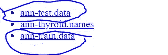

如您所见，两个数据集已经放入两个。名为 ann-test 和 ann-train 的数据文件。将这些文件保存在电脑的文件夹中。打开 excel。

在 excel 中，点击**文件→打开→浏览**

浏览至 ann-train.data 并打开它。它会给你下面的菜单。单击定界，点击下一步，并选择空格作为分隔符。完成以下两个步骤后，单击“完成”。

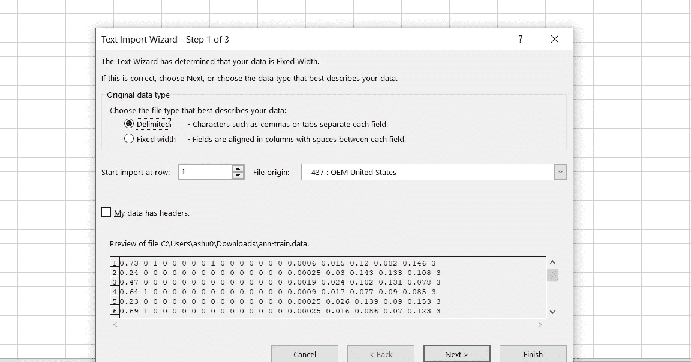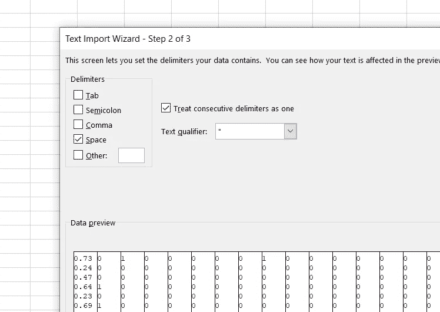

一旦你完成，数据将会被拆分。此时，我在顶部插入了一行。

在这一行，我输入了数字 100-120。要轻松做到这一点，您可以使用一个公式。输入 100 作为第一列的名称。在下一个单元格中，输入 A1+1。将公式拖到末尾。 ***不包括最后一列。***

最后一列是我们将要预测的类标识符。它由 3 类组成:1、2、3。

我们需要将这些类重新映射到一个字符串变量:a，b，c。

转到数据中的一个空单元格，制作一个小表格

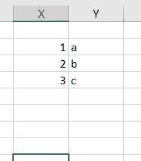

在数据的最后一列，我们将执行 vlookup，将类值从 1，2，3 重新映射到 a，b，c，如下所示:

```
=VLOOKUP(V2,$X$2:$Y$4,2,0) --> Note here the $X$2:$Y$4 has $ signs around it to fix the lookup table shown in the picture so it doesn't change.  V2 is the first row of the data in the class column, in my data the value was 3\.  The vlookup will show the value c in the formula column.
```

重新映射值后，复制→将值粘贴回列中，这样公式就不再存在了。现在删除 V 列，使它不存在。命名您的类列，以便您可以识别它。

这种重新映射的原因是使你的类成为一个字符串/名义变量，而不是一个数字变量。您可以在 Weka 中使用数值-标称过滤器来实现这一点，这不在本文的讨论范围之内。

现在将您的 excel 文件保存为 ann-train.csv。

对测试文件重复该过程，并将其保存为 ann-test.csv。

# 三。软件

本文使用的 ML 软件是 Weka。它是免费使用的。Weka 是新西兰怀卡托大学开发的基于 GUI 的机器学习软件。

[](https://en.wikipedia.org/wiki/Weka_%28machine_learning%29) [## Weka(机器学习)-维基百科

### 新西兰怀卡托大学开发的怀卡托知识分析环境(Weka)是免费的…

en.wikipedia.org](https://en.wikipedia.org/wiki/Weka_%28machine_learning%29) 

可以从以下网址下载:

[https://www.cs.waikato.ac.nz/ml/weka/](https://www.cs.waikato.ac.nz/ml/weka/)

# 四。培养

下载安装后，weka，在电脑上打开。我只需在 windows 搜索中搜索“weka”并点击它。

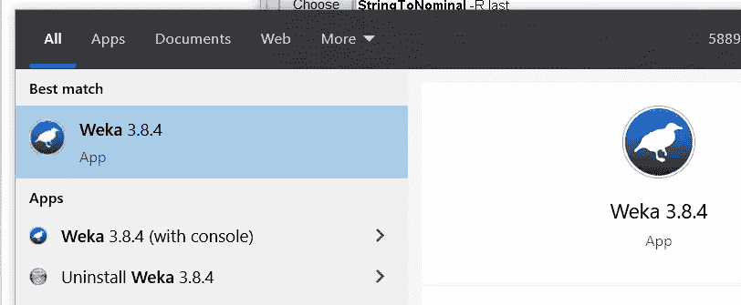

当您打开 Weka 时，您将看到以下图像:

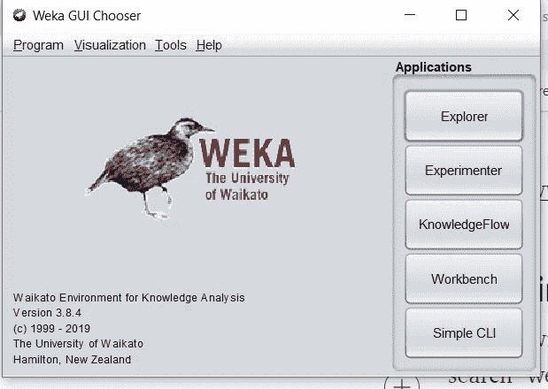

点击“资源管理器”按钮。

现在点击打开文件(见下图):

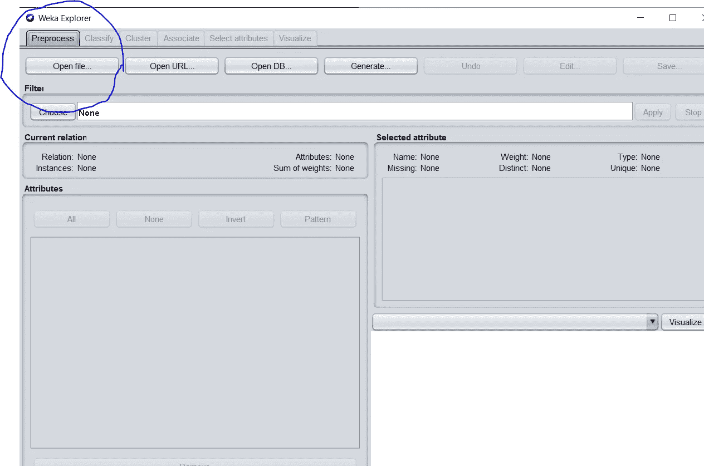

浏览到文件 ann-train。在我的例子中，它被称为 ann-train(2 ),因为我的计算机上有两个副本。

在下面你可以快速看到每一列的分布和重要的统计数据。最后一栏是你的班级栏。

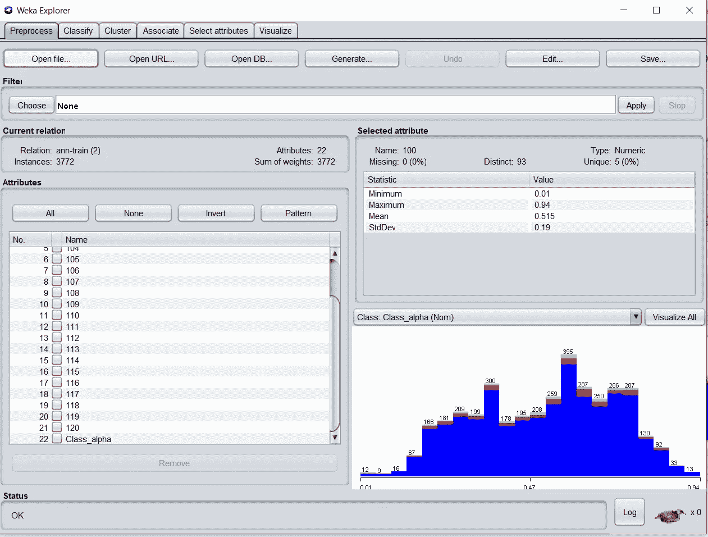

如果您想查看班级分布，请单击左侧窗口中显示您的列名的班级列:

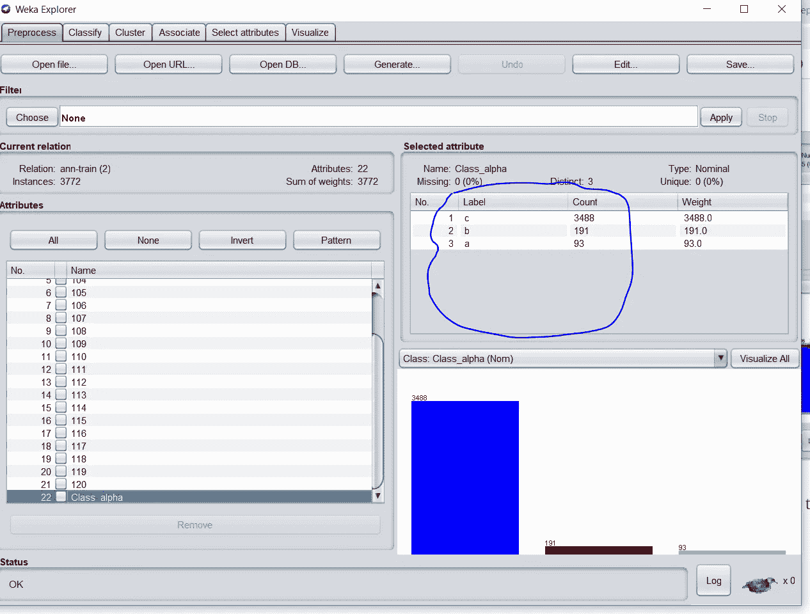

你可以很快看到，类别分布严重偏向类别 C，在数据集中是 3。

点击顶部的“分类”按钮:

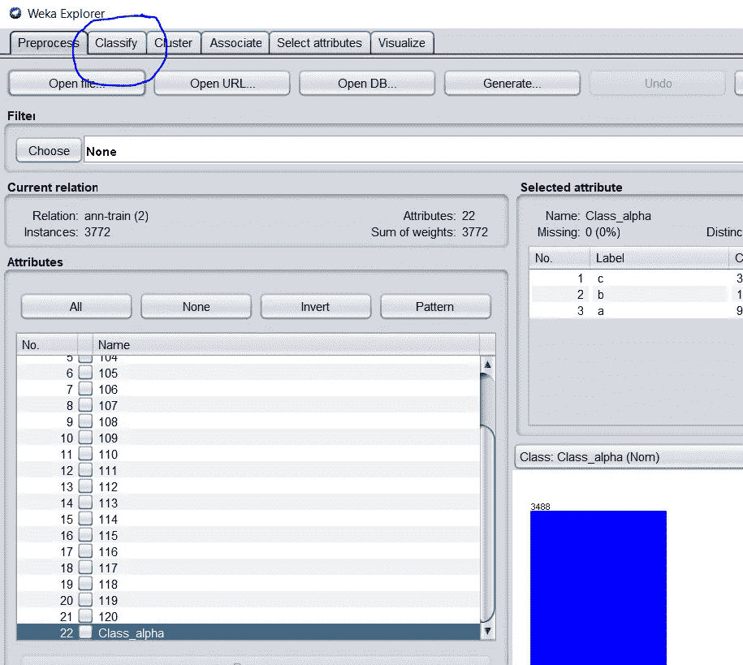

您将看到下面的窗口:

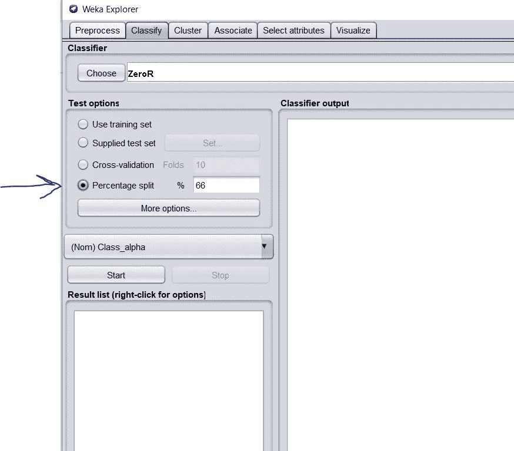

在这个窗口中，我使用了百分比吐%66。这是机器学习中的标准做法。当 Weka 运行您的模型时，它将获取您的训练数据，并将其分为 66%的训练和 34%的测试，以便它可以使用训练数据测试模型。然后，另一个 ann-test 数据文件将被用作新数据，模型将不得不执行这些数据，而无需查看之前的数据。

好，那么接下来，转到“选择按钮”。转到决策树，点击 J48。这是我想使用的决策树:

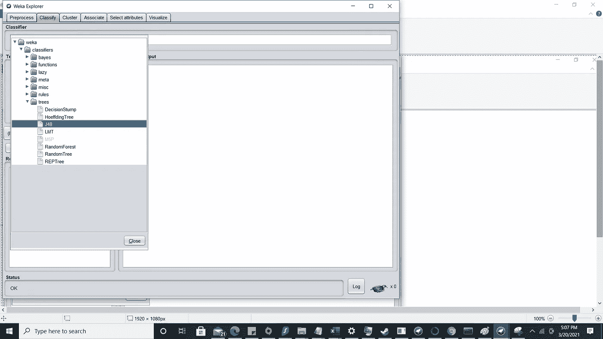

你可以在这里了解更多。它的基本工作原理是对列的信息增益进行排序，并一遍又一遍地拆分它们。

[](https://en.wikipedia.org/wiki/C4.5_algorithm) [## C4.5 算法

### C4.5 是由 Ross Quinlan 开发的用于生成决策树的算法。C4.5 是昆兰的扩展…

en.wikipedia.org](https://en.wikipedia.org/wiki/C4.5_algorithm) 

回到维卡。选择 J48 后，请确保在百分比分割下的下拉列表中选择了类别列，如下图所示:

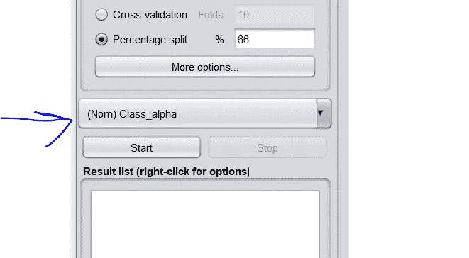

接下来，点击开始，让 Weka 为你建一棵树。

Weka 为您构建树，输出准确度，在本例中是 99.844%，然后给您一个混淆矩阵。混淆矩阵允许你看到什么被错误地分类。正如你从下面看到的，只有两个实例被错误分类。

你阅读这个矩阵的方式是这样的:

1.你矩阵的右边是这个班的情况。顶部或“矩阵的列”是模型对它的分类。该模型将两个实例归类为 b，而实际上它们是 a。

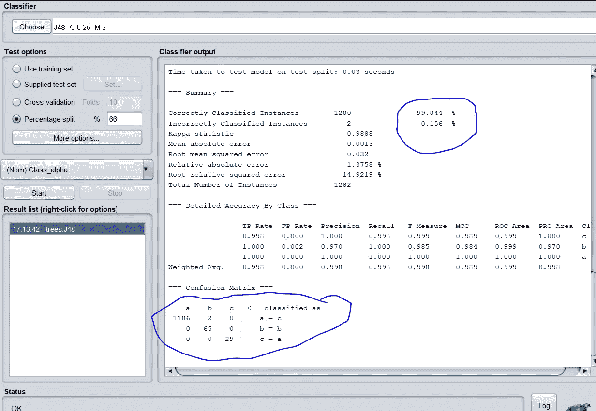

# 动词 （verb 的缩写）测试数据

是时候用从未见过的数据来检验这个模型了。

> "是时候用从未见过的数据来检验这个模型了."

在同一屏幕上，单击“提供的测试集”单选按钮。点击“设置”按钮，如下所示:

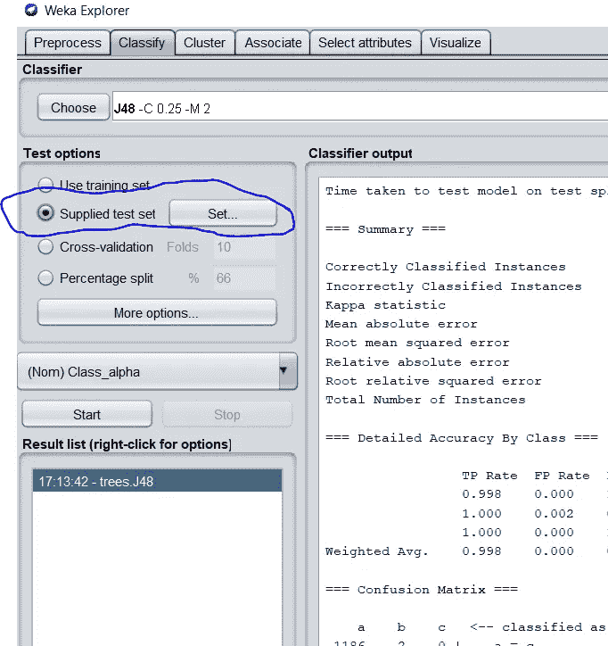

单击“设置”按钮后，将弹出一个浏览窗口:

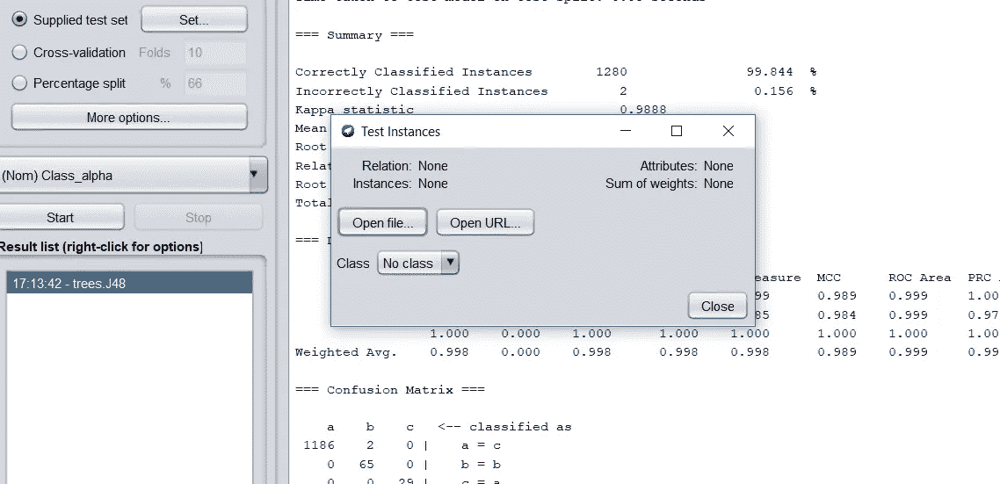

点击 open-file，转到你之前保存的 ann-test.csv。

如果您收到此错误消息，请单击“是”

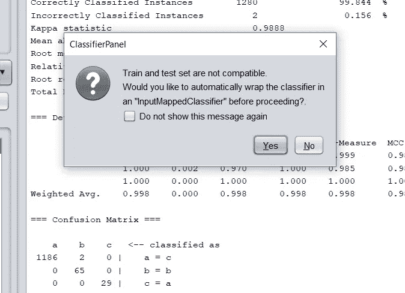

该模型将在数据集上运行，并给出如下所示的结果:

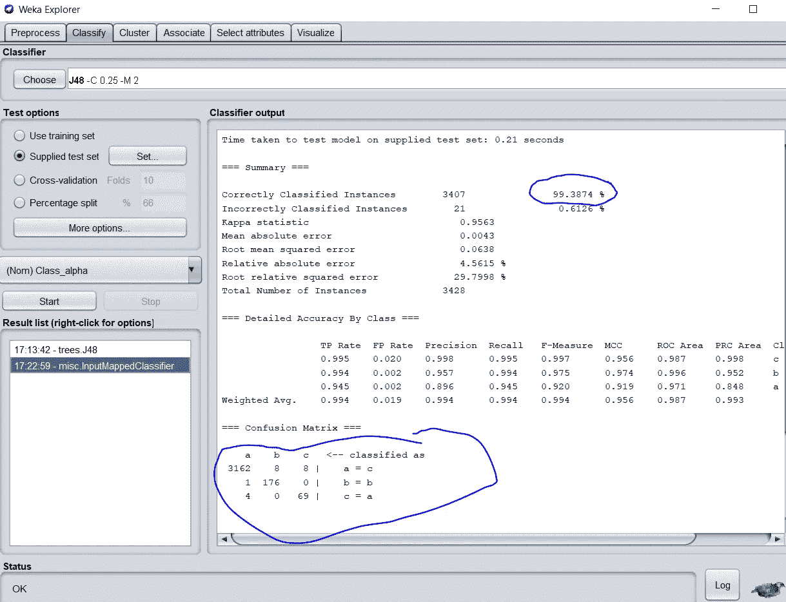

正如您所看到的，该模型以 99.3874%的异常准确性运行。

这太棒了。让我们来看看混淆矩阵:

它将 b 中的 8 个实例错误地分类为 a。它将 4 个实例分类为 a，而它们应该是 c。它还将 1 个实例分类为 a，而它是 a。最后，当它们是 a 时，它将 8 个实例分类为 c。

## **六世。结论:**

值得注意的是，B 和 C 的正确分类率很高。176 例 B 分类正确，69 例 C 分类正确。这很关键，因为这意味着只有一小部分较小的类被错误地分类到 a 中。有时，如果类变量像这样倾斜，决策树会将较小的类错误地分类到最大的类中。然而，在这种情况下，它没有这样做。

在 99.3874%，这是一个非常有用的数据模型。

感谢您的阅读。

参考资料:

1.  /ml/机器学习数据库/甲状腺疾病索引。(未注明)。检索于 2021 年 3 月 20 日，来自[https://archive . ics . UCI . edu/ml/machine-learning-databases/甲状腺疾病/](https://archive.ics.uci.edu/ml/machine-learning-databases/thyroid-disease/)