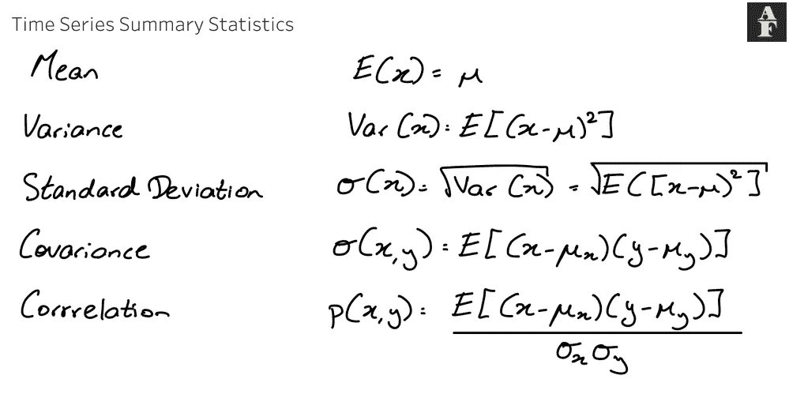
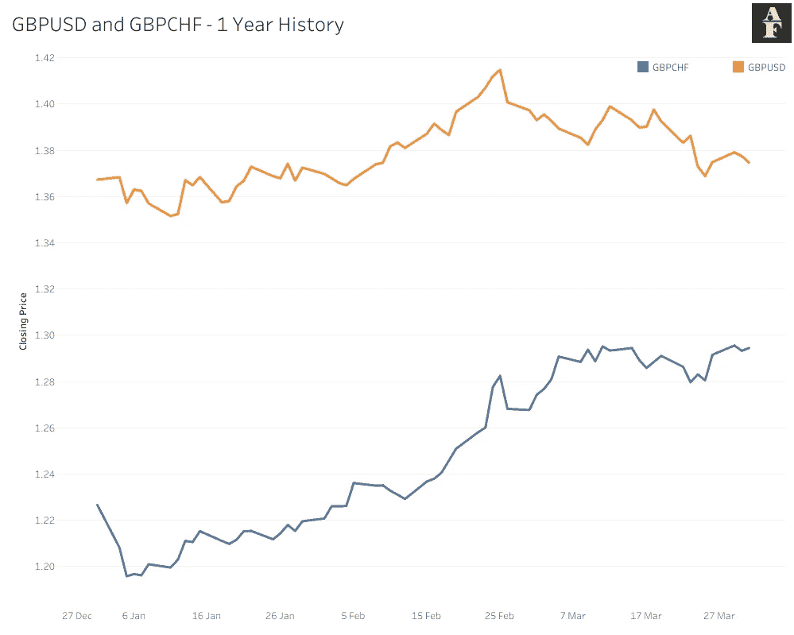
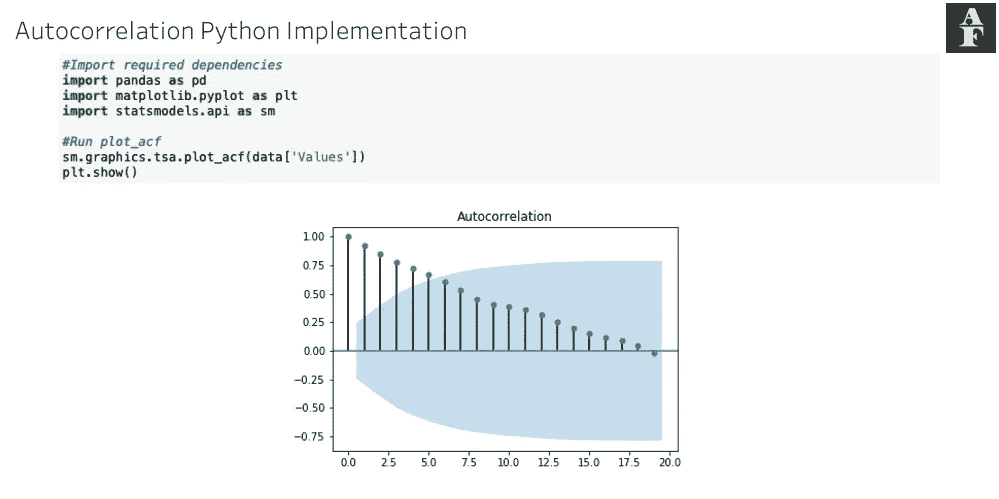
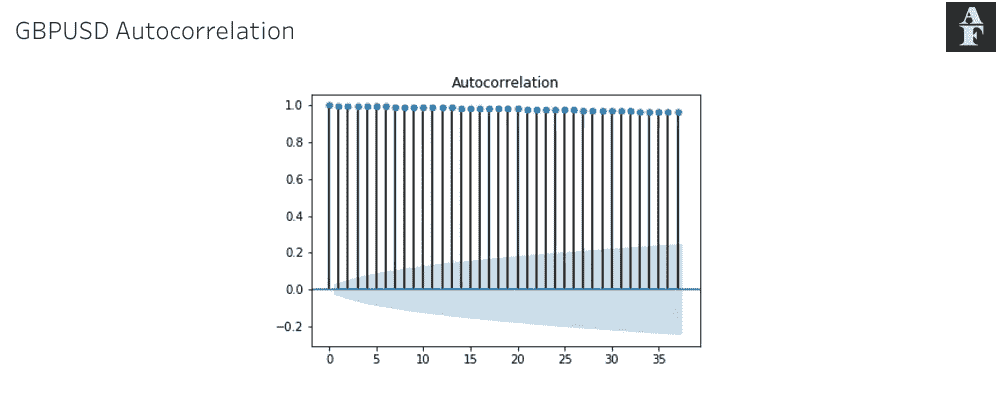
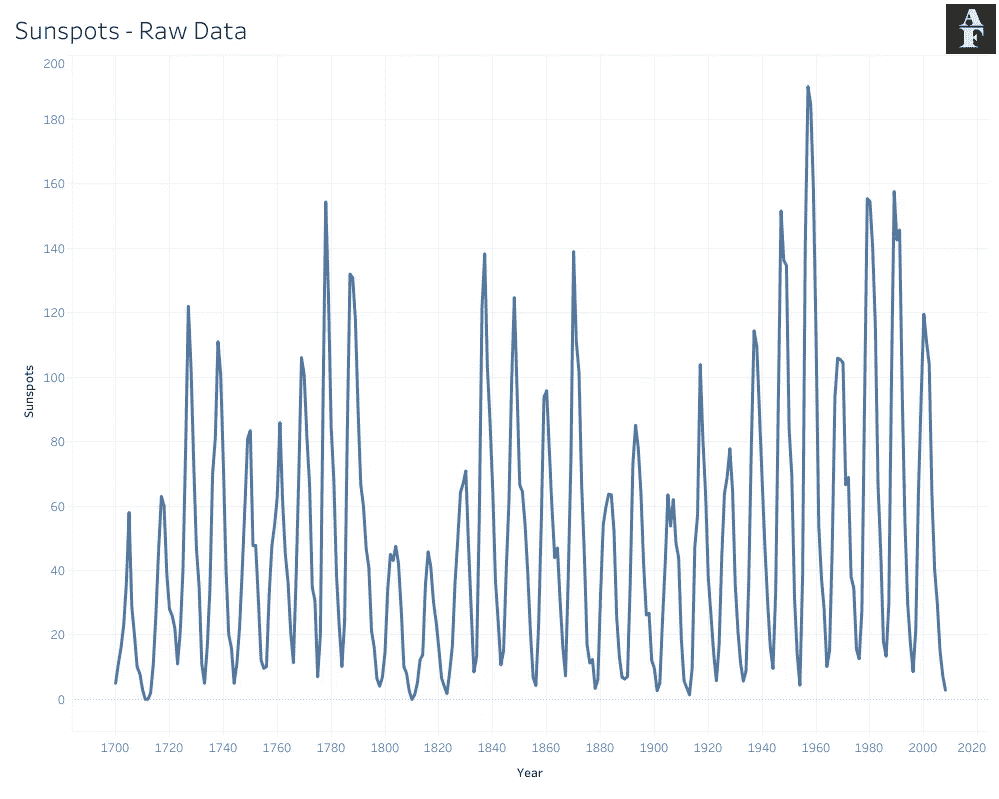
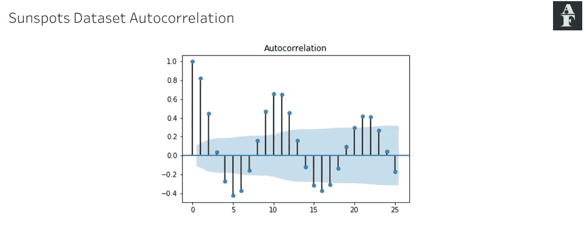

# 如何利用金融市场的自相关性

> 原文：<https://pub.towardsai.net/how-to-utilize-autocorrelation-for-the-financial-markets-f02edb46c39b?source=collection_archive---------2----------------------->

## [数据可视化](https://towardsai.net/p/category/data-visualization)

照片由 [**卢卡斯**](https://www.pexels.com/@goumbik?utm_content=attributionCopyText&utm_medium=referral&utm_source=pexels) 发自 [**派克斯**](https://www.pexels.com/photo/person-holding-blue-and-clear-ballpoint-pen-590022/?utm_content=attributionCopyText&utm_medium=referral&utm_source=pexels)

*如果你对以下内容感兴趣，我正在推出一份新的算法金融时事通讯，名为 Algo Fin，发表类似的工作。这篇时事通讯将探索数据科学和金融之间的联系，最初的重点是货币市场，但我希望在未来建立更多的途径。时事通讯目前是免费加入的，所以如果这听起来像是你可能感兴趣的东西，它绝对值得查看* [*这里*](https://algofin.substack.com/) *！。*

术语**自相关**用于指同一时间序列中观测值之间的相关性。本质上，自相关时间序列与其自身的滞后版本相关。

这对发现数据集中的周期性趋势非常重要。它帮助我们确定我们是否可以预测一个重复的潜在模式，并在此基础上增加我们的残差变异。这可以极大地帮助我们建立我们的预测，因为它提供了任何时间序列分析的基础-->趋势。

自相关是我们数据的汇总统计。为了定义它，我们必须讨论它的组成部分，这些组成部分本身也是汇总统计数据。

> 变量 x 的**期望**是该变量的平均值，用 E(x)或希腊符号 mu 表示。
> 
> 变量的**方差**是对数据分布的度量，具体来说是对均方偏差的期望，表示为 Var(x) = E[(x — mu) ]。
> 
> **标准差**是另一个更常见的数据分布度量，因为其单位与数据本身相同。它由希腊字母 sigma 表示，并计算为方差的平方根。
> 
> 协方差告诉我们两个变量一起变化了多少，或者说“共变”。这是理解两个变量如何相关的有用度量，并使用以下公式计算- > sigma(x，y) = E[(x — mu_x)(y — mu_y)]。

作者图片

我们的协方差度量的问题类似于方差的问题，因为这个度量不能给我们任何可比较的信息。作为一个例子，如果你把前一年的 GBPUSD 和 GBPCHF 价格，绘制在下面，并计算它们的协方差，我们得到一个数字 0.000382。这并没有告诉我们太多，并且没有值的限制。我们所能推断的是，这两个变量一起移动，因为我们的协方差大于 0。

作者图片

输入**相关性**，它通过除以我们两个标准差的乘积来标准化我们的协方差。这确保了我们的数字现在具有最小值-1，最大值+1，这使得我们更容易比较值。过去一年，GBPUSD 和 GBPCHF 之间的相关性为 0.7514，根据图表，这更有意义。

自相关需要一个参数，滞后 k，我们的原始时间序列移动的时间步长数，以创建我们的新时间序列。然后，我们使用刚才描述的相同方法计算这两个时间序列之间的相关性，返回一个数字，如前所述，在[-1，1]的范围内。

## Python 实现和可视化

在 Python 中，我们利用 *statsmodels* 包来运行自相关计算和可视化，缩写为 ACF plot。我们可以将参数*滞后*传递给 *plot_acf()* 方法，该方法设置我们希望计算自相关的最大滞后。下面的代码展示了它的实现。

自相关 Python 实现

蓝色阴影图显示了 5%的显著性界限。如果我们观察到该值之外的相关性，这表明我们有足够的证据表明我们的数据集中存在显著的自相关。

## 要点

来自自相关的推断不仅仅是找到具有最高相关数的滞后值那么简单。在分析 acf 图时，有几个概念是我们应该知道的。

每个滞后都包含相同的数据集，因此，如果我们有一个滞后(除 0 之外，因为其相关性始终为 1)的相关性明显超出了我们的边界，我们希望后续值也能如此，并显示出高相关性。对于我们这些分析师来说，这不是一个理想的情况。当你看下面的 GBPUSD ACF 图，这变得很明显。我们从每个时期之间的增量变化看了近 20 年的历史，结果是我们的腿都非常接近 1。

GBPUSD 自相关

我们上面看到的这种图表在建立预测方面没有给我们太多的指导，其原因是因为我们无法将任何自相关与外部变量联系起来。当我们看到一个时间序列显示出某些滞后的高度相关性时，我们需要能够从逻辑的角度理解为什么会出现这些滞后。如果我们无法解释这种相关性背后的原因，那么我们就没有可以建立的复杂模型，因为在这种情况下，我们所做的只是使用过去的数据来尝试和预测未来的数据，而没有任何额外的智能。

快速绕道，但为了进一步强调这一点，以下面可视化的数据集为例，该数据集测量了 3 个世纪(1700-2008)内每年太阳黑子的数量。大约每隔 11 年，太阳的磁场就会翻转一次，北极和南极基本上会互换位置。在每个周期的开始，太阳黑子的数量最少，而在周期的中期，太阳黑子的数量最多。这已经成为一种测量方法，用来确定太阳实际上在太阳周期中走了多远。

太阳黑子——原始数据(1700 年至 2008 年)

太阳黑子数据自相关

我试图通过这个例子提出的观点是，我们这里有一个外部原因。当我们查看自相关图表时，我们看到在滞后 10 和 11 处，然后是 21 和 22 处有显著的正相关。像我们在这里看到的图表对分析师来说更有益，因为我们有一个潜在的原因来解释为什么特定的滞后拒绝了我们最初的假设。

自相关并不总是保证能给你帮助你创建模型的洞察力。但是，检查您的时间序列是否在任何时间点重复过去的行为是很有用的，因为更深入的研究可能会揭示经济活动期间的更多相似之处，然后您可以使用这些相似之处进行未来的分析和预测。

本文的灵感来自迈克尔·霍尔斯·摩尔的《高级算法交易》第八章中关于序列相关性的内容。

*太阳黑子的信息由以下网站提供，关于* [*太阳周期*](https://spaceplace.nasa.gov/solar-cycles/en/#:~:text=Every%2011%20years%20or%20so,poles%20to%20flip%20back%20again.&text=Over%20time%2C%20solar%20activity%E2%80%94and,the%20number%20of%20sunspots%E2%80%94increases) *。*