# 我如何验证线性回归的假设？

> 原文：<https://pub.towardsai.net/how-to-verify-the-assumptions-of-linear-regression-54ba4d17c231?source=collection_archive---------3----------------------->

## 线性回归的假设有哪些？以及如何用 python 来验证它们？

照片来自 Unsplash，由 Thong Vo 上传

L 线性回归是用直线估计自变量和因变量之间关系的模型。然而，为了使用线性回归模型，我们必须验证一些假设。

线性回归的 5 个主要假设是:

1.  **因变量和自变量之间的线性关系。**
2.  **无/很少多重共线性。**
3.  **残差的正态性**
4.  **同质性**
5.  **无误差自相关**

让我们借助 python 代码来详细理解上面的每一个假设。

 [## 用 Python 编写复杂模式的简单方法，仅需 4 分钟。

### 用 python 编写复杂模式程序的简单方法

medium.com](https://medium.com/@gowthamsr37/pattern-programming-in-python-23d5af04211e) 

导入所需的库，并读取数据集。

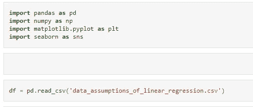

作者图片

分离从属和独立特征，并将数据分为训练集和测试集，如下所示。

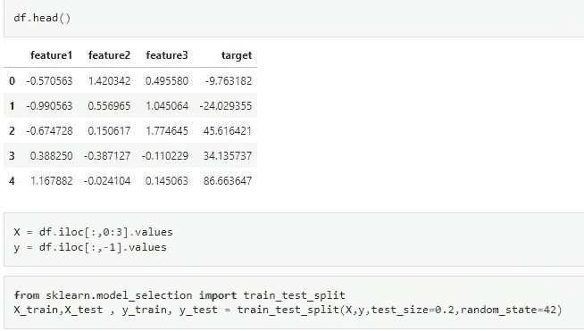

作者图片

创建线性回归模型并计算残差。

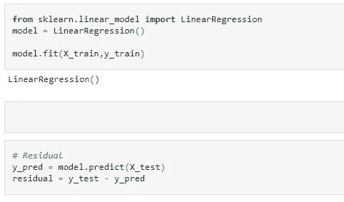

作者图片

让我们验证上述数据的线性回归假设。

 [## 一个完整的基于端到端机器学习的推荐项目

### 基于协同过滤和流行度过滤的机器学习推荐方案

pub.towardsai.net](/step-by-step-approach-to-building-a-recommendation-system-a65be5a54045) 

# 1.线性关系

为了执行线性回归，首要的假设是独立特征和从属特征之间具有线性关系。均值-随着 X 值的增加，y 值也应线性增加或减少。如果有多个独立特征，每个独立特征应该与从属特征具有线性关系。

我们可以使用下图所示的散点图来验证这一假设。

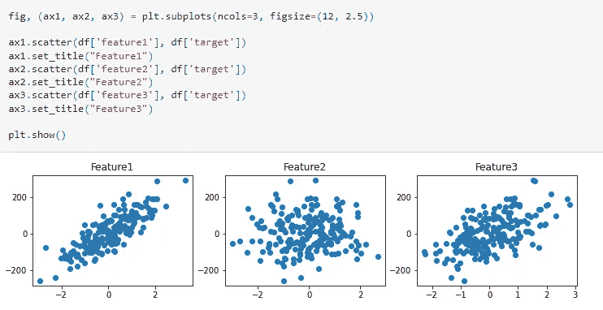

作者图片

在上面的散点图中，我们可以清楚地说，特征 1 和 3 与目标具有明显的线性关系。然而，特征 2 与目标没有线性关系。

# 2.多重共线性

多重共线性是两个独立要素高度**相关**的情况。那么，现在的问题是，什么是**相关性**？相关性是指两个变量之间有很强的相关性。

例如，如果我们有一个数据集，其中**年龄**和**年资**是数据集中的两个独立特征。很有可能随着年龄的增长，工作经验也会增加。所以，在这种情况下，年龄和经验年限**高度正相关。**

如果我们将年龄和剩余退休年限作为独立的特征，那么随着年龄的增加，剩余退休年限会减少。所以，这里我们说这两个特征**高度负相关。**

如果我们有上述任何一种情况(强正相关或负相关)，那么我们说存在**多重共线性。**

我们可以使用下图所示的相关矩阵或 VIF 来验证数据中是否存在多重共线性。

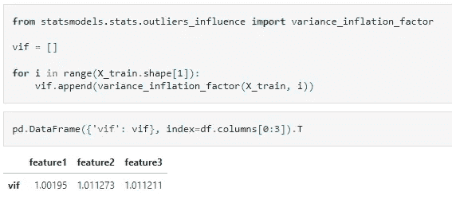

作者图片

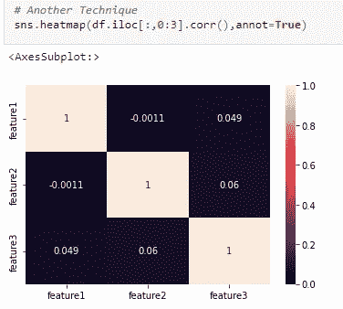

作者图片

从上面的 VIF 和相关矩阵，我们可以说，在我们的数据集中没有多重共线性。

如果你有兴趣详细了解多重共线性，请阅读我的博客[为什么多重共线性是一个问题](https://medium.com/@gowthamsr37/why-multicollinearity-is-a-problem-4c273d1d1f2e)

 [## 为什么多重共线性是一个问题？

### 什么是多重共线性？为什么我们要在创建机器学习模型之前处理多重共线性？

medium.com](https://medium.com/@gowthamsr37/why-multicollinearity-is-a-problem-4c273d1d1f2e) 

# 3.残差正态性

残差= **实际 y 值-预测 y 值**。残差为负意味着预测值太高，同样，如果残差为正，则意味着预测值太低。回归线的目的是最小化残差的总和。

假设是，如果我们画出残差，那么这个图应该是正态的，或者说是某种正态的。

我们可以借助 KDE 图和 Q-Q 图来验证这一假设，如下所示。

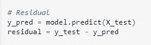

作者图片

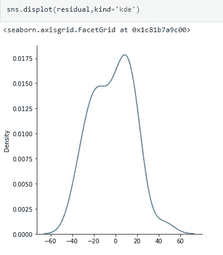

作者图片

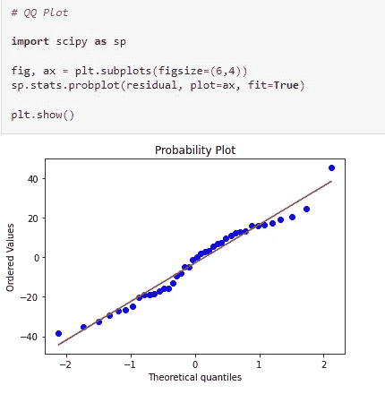

作者图片

# 4.同方差性

**Homo** 表示**相同**而**scedassity**表示**分散/扩散。**所以，同方差的意思就是有相同的散度。它意味着回归模型中残差或误差项的方差是常数的条件。

当我们绘制残差图时，分布应该是相等的。我们可以通过使用散点图来检查这一点，其中 x 轴表示预测值，y 轴表示残差，如下图所示。

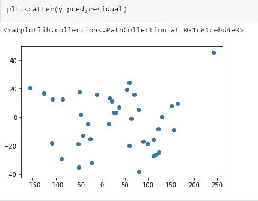

作者图片

残差是均匀分布的，这保持了同方差的假设。

# 5.没有误差的自相关

这个假设认为残差之间不应该有任何关系。这可以通过绘制下图所示的残差来验证。情节不应该导致任何特定的模式。

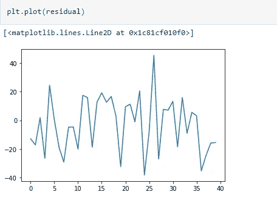

作者图片

 [## 任何可能出错的事情都会出错。

### 我们在日常生活中遇到的一些墨菲定律列表

medium.com](https://medium.com/@gowthamsr37/anything-that-can-go-wrong-will-go-wrong-2eb8b119c50f)  [## 用 Python 编写复杂模式的简单方法，仅需 4 分钟。

### 用 python 编写复杂模式程序的简单方法

medium.com](https://medium.com/@gowthamsr37/pattern-programming-in-python-23d5af04211e)  [## 标准化与规范化相比，哪种扩展技术更有特色

### 特征缩放是强制性的吗？什么时候使用标准化？何时使用规范化？会发生什么……

pub.towardsai.net](/which-feature-scaling-technique-to-use-standardization-vs-normalization-9dcf8eafdf8c)