# 如何目测检查你的聊天机器人的 NLU 模型的质量

> 原文：<https://pub.towardsai.net/how-to-visually-inspect-the-quality-of-your-chatbots-nlu-model-cecc52a2b23b?source=collection_archive---------0----------------------->

## 使用 PCA 和交互式图表

# 介绍

在本文中，我将分享一个视觉评估聊天机器人 NLU 模型质量的想法。目标是帮助 bot 开发团队中没有 ML 背景的人参与改进模型的性能。

重现结果的代码在[这个回购](https://github.com/hsm207/rasa-viz-diet)中。

我们将使用 [rasa](https://rasa.com/docs/) (以及它的默认机器人“moodbot”)来演示这个想法，但它确实适用于任何使用机器学习进行意图分类的聊天机器人平台，只要它们允许你查看引擎盖下的内容。

# 这个想法

rasa 中的默认意图分类器是[饮食分类器](https://arxiv.org/pdf/2004.09936.pdf)。它获取一段文本，将其转换为密集向量(默认:256 维)，并使用该向量表示将文本分类到给定的意图标签之一。

我们可以采用训练集的矢量表示，并将其投影到 2D 空间，以将其可视化为散点图。这些点可以用不同的颜色来表示它们的意图标签。

如果散点图是一个交互式图表，那么我们可以轻松地在 2D 特征空间中移动(平移、放大/缩小),感受一下模型“看到”了什么。一般来说，如果有 n 个意图标签，那么我们会期望 n 个不同的集群。与这一期望的偏差可能表明标签错误或措辞不当(例如含糊不清)的例子。

# 方法

## 提取矢量表示

下图显示了构成饮食分类器的组件:

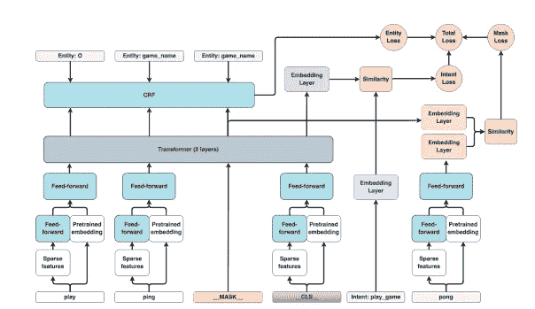

图 1:来自 https://arxiv.org/pdf/2004.09936.pdf 的饮食结构示意图

我们感兴趣的是在 _CLS_ 令牌通过变换器层之后得到它的矢量表示。这很容易通过解析在[版本 2.3.0](https://github.com/RasaHQ/rasa/blob/0698b83662a638b2543c5a5bee12dc38c618dc12/CHANGELOG.mdx#230---2021-02-11) 中引入的消息对象的`diagnostic_data`字段来完成。

## 投影到 2D 空间

有许多方法可以将高维向量投影到低维向量中。

我们就用[主成分分析](https://scikit-learn.org/stable/modules/generated/sklearn.decomposition.PCA.html)吧。

## 制作交互式散点图

我们将使用 [altair](https://altair-viz.github.io/) 库来构建交互式散点图。

# 结果

## 概观

我们将使用 4 种饮食配置来可视化 moodbot 的训练集在 2D 特征空间中的外观，以帮助可视化超参数调整的影响。

我们将这些配置称为基本、大、更大和最大。下图详细描述了各自的配置:

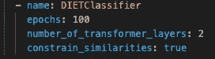

图 2:“基本”配置

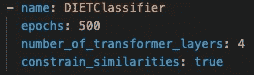

图 3:“大”配置

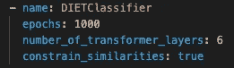

图 4:更大的配置

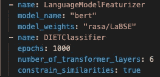

图 5:最大的配置

注意,“最大”配置和“更大”配置之间的唯一区别是前者使用 BERT 嵌入作为附加特性。

## 形象化

让我们在每个配置下训练一个模型 3 次，并可视化结果:

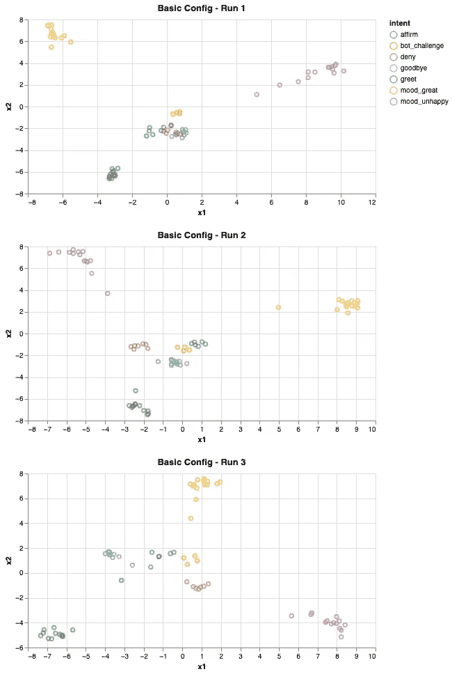

图 6:使用“基本”配置的 2D 特征空间中的训练集

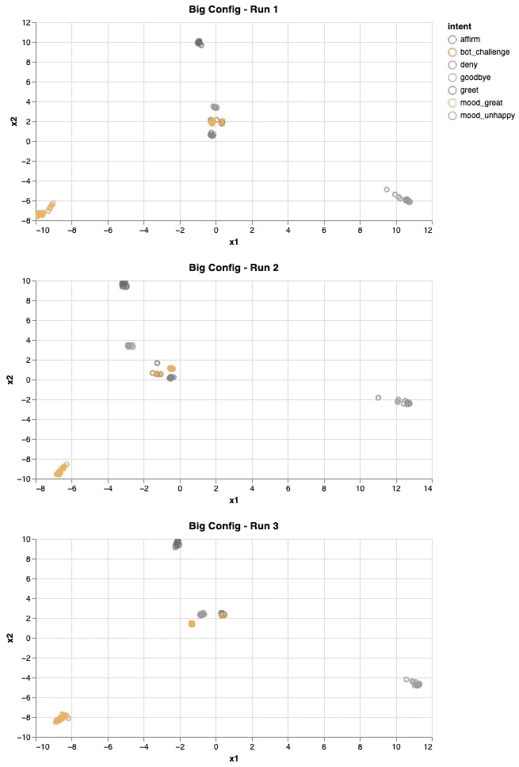

图 7:使用“大”配置的 2D 特征空间中的训练集

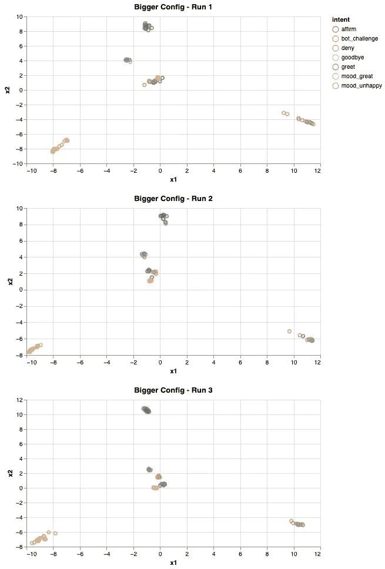

图 8:使用“更大”配置的 2D 特征空间中的训练集

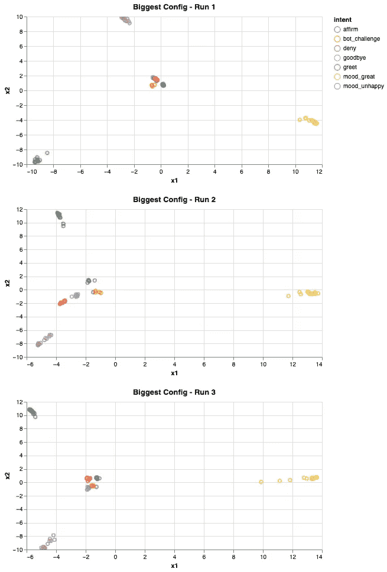

图 9:使用“最大”配置的 2D 特征空间中的训练集

## 分析

Moodbot 有 7 个意图。从图 6(“基本”配置)中可以清楚地看到，有 7 个不同的集群，但是这些集群并没有紧密地打包和分离。随着我们增加模型的复杂性，这种情况会发生变化。

以下是每种配置的交叉验证结果:

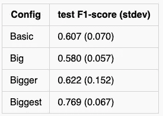

图 10:每个配置的交叉验证结果

直观上，聚类越明显和分离，模型就越容易使用更简单的几何图形“绘制”其决策边界，并避免过度适应训练集。

另一个有趣的观察是，有一个从“大”配置开始的持久模式:有一个意图“再见”(青色)的例子离它的集群很远。这是为什么呢？

这就是交互式图表变得有价值的地方。我们可以放大该区域，以了解该数据点与其集群中的其他成员有何不同:

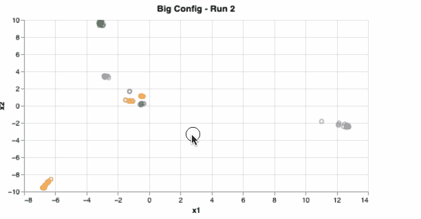

图 11:使用交互式数据可视化技术研究有趣的模式

图 11 显示了离群值的文本是“下午好”，这显然与“再见”意图中的其他示例不相似，例如“cu”、“稍后见”、“拜拜”等。因此，“下午好”被投射到远离其他标有“再见”意图的点是有意义的。通常，这是一个话语被贴错标签的迹象。在这种情况下，这真的是一个贴错标签的例子，正如在这个[公关](https://github.com/RasaHQ/rasa/pull/8497)中可以看到的。

# 真实数据

一个真正的聊天机器人可以有数十种意图。

将它们同时可视化是不可行的，因为图表会被各种颜色和/或点形状弄得杂乱无章，以表示意图。此外，真实的数据是杂乱的，一个刚刚开始 chatbot 开发之旅的团队可能会犯许多错误，这只会混淆模型，并使散点图看起来一片混乱。

尽管如此，我仍然发现这种方法很有用，因为它可以帮助聊天机器人开发人员看到他们的数据注释工作与模型性能之间的联系，快速识别令人困惑或糟糕的示例，并说服他们停止进行超参数调整，转而专注于提高数据质量。

# 结论

本文展示了如何使用交互式图表和降维方法来帮助直观地评估训练集的质量和 ML 模型的性能。

我希望你已经发现这是有用的。