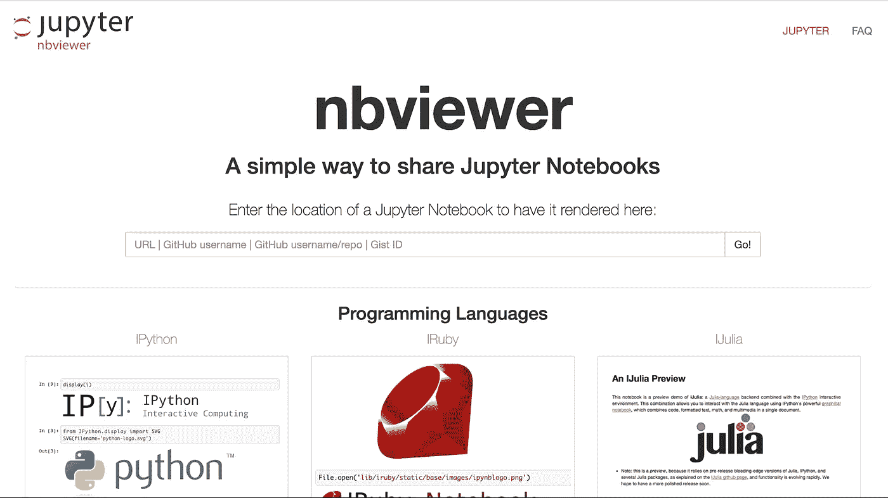

# 如何赢得数据科学竞赛

> 原文：<https://pub.towardsai.net/how-to-win-a-data-science-competition-57c8d1c5903d?source=collection_archive---------1----------------------->

这篇文章是关于面对面的数据科学竞赛，这些竞赛是从整体上进行评判的，而不是通过一些准确性指标(如 Kaggle)进行分级。我参加过两次数据科学竞赛(分别获得第四名和第一名)，并且在得克萨斯州 A&M 的首届[数据马拉松](https://2019.tamudatathon.com/)中担任过导师(与我合作的四个团队中有三个获得了奖项)。因此，我看到了许多项目，我注意到了赢家和输家之间的一些趋势。以下是我对提高你获胜几率的建议。

目前，我看到许多数据科学项目只是 Jupyter 笔记本。不幸的是，这些经常充满了代码单元，并且中间没有降价。花时间写出关于你的项目的高质量笔记是值得的。学习 markdown 的所有基础知识应该不到 5 分钟(这里有一个[链接](https://rmarkdown.rstudio.com/authoring_basics.html)来证明)。无论你的法官是在线还是亲自查看你的提交，他们都没有时间或耐心去弄清楚你的代码做了什么。如果法官不能理解你的代码，那么他们必须猜测它是好是坏，当被迫猜测时，他们会默认假设它是坏的。本质上，你只能根据法官理解的内容来评分，所以你的解释就是一切，尤其是如果法官不是数据科学技术专家的话。这包括报告关于准确性的指标。如果竞争对手有明确定义的指标来比较模型，就报告出来，如果没有，就使用平均绝对误差百分比、百分比准确度或其他容易解释的指标。即使你遵循了这些步骤，你也不可能充分利用 Jupyter 的所有特性。没有多少人知道你可以把笔记本变成幻灯片风格的演示文稿，其中每个单元格都是一张幻灯片，如果你想在线或亲自演示你的工作，这将非常有帮助。

除了在你的笔记本上做好评论，如果你通过 Devpost 提交你的作品，也在那里填写评论。甚至一些面对面的数据科学竞赛也只通过在线提交来评分。Devpost 也可以成为你工作的投资组合——一个大而高质量的投资组合是一笔巨大的财富。

把你的笔记本放在你的 GitHub 或者 [nbviewer](https://nbviewer.jupyter.org/) 上也是你简历上的一大亮点。除了在简历上有一个招聘人员可以看到的可点击链接(他们喜欢这样)之外，在简历顶部有一个装满项目的 GitHub 会让你看起来非常专业。在我看来，一个大的 GitHub 不仅仅可以弥补一份简短的简历。如果你已经在 GitHub 上放了几本笔记本，我建议你去看看 R Markdown，并学习如何在 [RPubs](https://rpubs.com/) 上发布一些东西。同样，这给了你一个可查看项目的可信度。虽然我认为 Python 是数据科学的行业标准，但 R 也有它的用处，让您的技能多样化总是一个很好的举措。

【https://nbviewer.jupyter.org/ 

我关于笔记本的最后一个注意，试着学习一些关于绘图的东西。真的增加了一些其他团体没有的东西。从 Matplotlib 或 ggplot 开始，但如果你想超越它们，使用 plotly、seaborn、high charter、bokeh 或其他工具，那就太好了。如果你正在使用 Matplotlib，我建议给情节添加一个主题。

我在我的第一次数据科学竞赛中输了(获得第四名)，当我看到第一名的团队出现时，我似乎很清楚我会输。我的团队只有一些非常基本的情节，这让我们进入了比赛的展示阶段。获胜的小组有一张芝加哥地图的 gif 图片，上面显示了我们正在模拟的一些实际路径。这与机器学习没有任何关系，而是与可视化有关。的确，数据科学竞赛更多的是关于沟通而不是其他任何事情。直到今天，他们的地图是我对他们(或其他任何人)的展示印象最深刻的东西。如果你想坚持使用笔记本，Matplotlib 仍然可以实现更好的可视化，我推荐你从这篇文章[开始。](https://towardsdatascience.com/animations-with-matplotlib-d96375c5442c)

因此，如果你已经实现了上述所有步骤，并希望超越基本笔记本，我建议从[闪亮](https://shiny.rstudio.com/)开始。很快，您就可以为您的项目创建一个工作前端。一个完全交互的项目是一个很好的展示，因为它有一种切实的感觉。不管你要展示的人是中学生还是博士，如果你给他们看一个互动的可视化，他们会玩的。我在 datathon 指导的一个团队制作了一个闪亮的应用程序，在他们的项目中没有使用任何机器学习(尽管他们使用了大量的数据科学技能)，最终赢得了高盛的奖项。Shiny 很容易学习，但是如果你更喜欢使用 Python，那么 flask 和 Django 是制作类似东西的好工具。如果有人能与你的作品互动，他们更有可能感兴趣，记住它，并认为它比竞争对手更胜一筹。