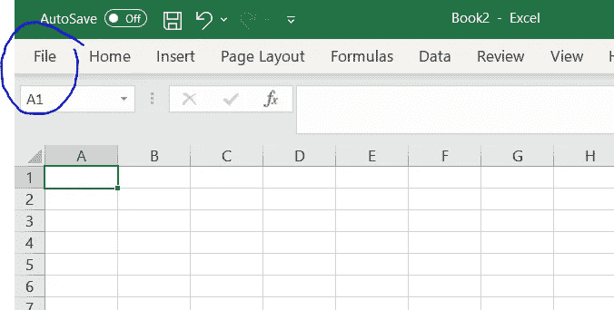
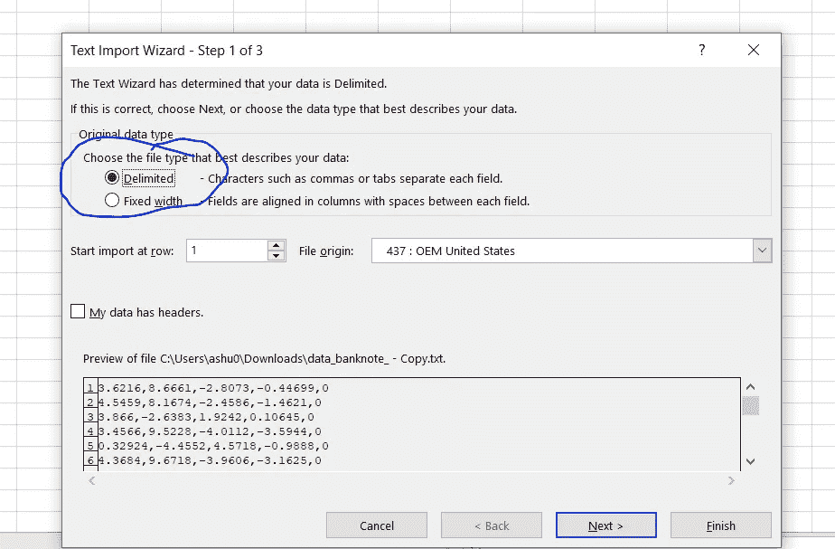
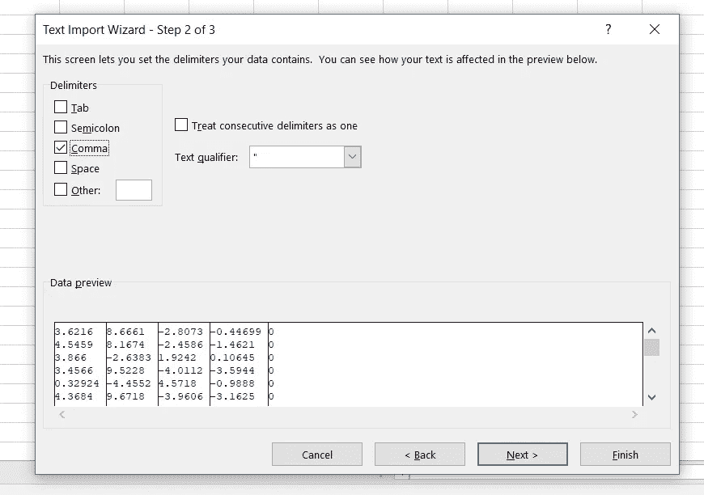
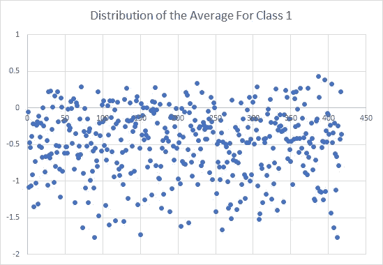
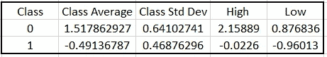
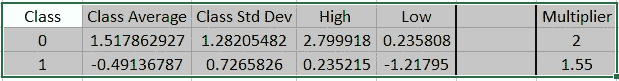
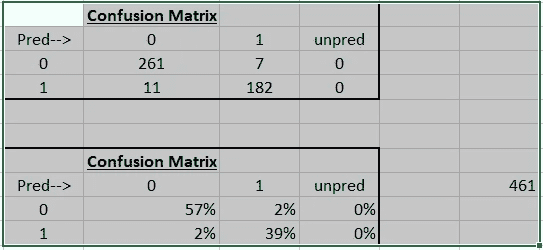

# 如何在 Excel 中写一个统计学习模型来预测一张钞票是不是假钞

> 原文：<https://pub.towardsai.net/how-to-write-a-statistical-learning-model-in-excel-to-predict-whether-a-bank-note-is-fake-or-not-992c996ef883?source=collection_archive---------5----------------------->


照片由[在](https://unsplash.com/@gobankingrates?utm_source=unsplash&utm_medium=referral&utm_content=creditCopyText) [Unsplash](https://unsplash.com/s/photos/bank-note?utm_source=unsplash&utm_medium=referral&utm_content=creditCopyText) 上的直播

## [机器学习](https://towardsai.net/p/category/machine-learning)

**数据集来源:**

这个数据集可以在 UCI 机器学习知识库的以下链接中找到:[https://archive . ics . UCI . edu/ml/datasets/banknote+authentic ation](https://archive.ics.uci.edu/ml/datasets/banknote+authentication)

这是所提供的数据集描述:

“数据是从真钞和伪钞样本的图像中提取的。对于数字化，使用通常用于印刷检查的工业相机。最终图像的像素为 400x 400。由于物镜和到所研究物体的距离，获得了分辨率约为 660 dpi 的灰度图像。小波变换工具被用来从图像中提取特征

## 数据

网站上列出了该数据集中的四种要素/属性及其类型:

1 .小波变换图像的方差(连续)
2 .小波变换图像的偏斜度(连续)
3 .小波变换图像的曲率(连续)
4 .图像的熵(连续)
5 .类别(整数)

## 任务:

任务是预测采用 0 或 1 形式的类别

将数据导入 Excel:

银行票据数据集来自一个. txt 文件。事实上，它是一个逗号分隔的 txt 文件。这意味着您可以像导入. csv 文件一样导入它。

单击 excel 左上角的文件按钮。



现在点击打开按钮


在这之后点击浏览按钮，并前往。txt 文件。当你打开文本文件时，它会给你一个菜单，像这样分割列。确保已选中“分隔”,然后单击“下一步”:



接下来你会看到下图。取消选中所有内容，但单击逗号框。它将拆分列:



单击 Finish，它会将数据导入到您的文件中。现在在顶部插入一行，并为四列逐个输入前面提到的标题。

# 为分析和预测准备数据:

## I .随机化和拆分您的数据:

为了使数据随机化，请在数据的开头插入一列。

现在将它输入到单元格 A2 中，这是数据开始的单元格(第一行应该是您的标题)。

```
=RAND()
```

这会以随机方式生成一个介于 0 和 1 之间的数字(伪随机发生器)

现在通过按 CTRL + A 突出显示全部数据。

单击 excel 顶部的数据功能区，然后单击“筛选”,或者您可以依次按 alt、a、t。这两种方法都会将筛选添加到数据的顶部。

使用第一列中的 filter 按钮，按任意顺序对数据集进行排序。因为数字是随机的，它会随机化你的数据。

**二。添加百分比列来拆分您的数据**

在 G 列中，写出以下公式:

```
=ROW()/COUNT($F$2:$F$1373)
```

此公式将告诉您，当您向下移动数据集时，包含的所有记录的百分比。

在监督学习分类任务中，通常可以使用 66%训练 33%测试的分割。

这就是我们将要做的。低头直到你得到 66%,然后把 66%之后的所有内容复制到数据的底部。剪切所有行并粘贴到一个新的选项卡中。复制列名，并将其添加到顶部。

**三世。使用探索性统计训练模型**

回到包含 66%行的第一个选项卡。在每一行上，用以下公式创建一列:

```
=AVERAGE(B2:E2)
```

一旦你有了每一行的平均值，让我们来看看第 1 类的平均值:



以下是 0 类的外观:


正如你所看到的，这两个类在范围上有一个分割，在 0 附近有一些重叠。类别 1 的平均值大多为负值，类别 0 的平均值为正值。

现在让我们对这些信息进行建模。

使用您的训练数据，获取以下信息:



桌子

获取此信息的方法示例:

```
=AVERAGE(FILTER(G:G,F:F=J3)) --> G:G is Averages, F:F is Class in the data and J3 is the class indicator 0
=AVERAGE(FILTER(G:G,F:F=J4))--> G:G is Averages, F:F is Class in the data and J4 is the class indicator 1
=STDEV(FILTER(G:G,F:F=J3)) --> G:G is Averages, F:F is Class in the data and J3 is the class indicator 0
=STDEV(FILTER(G:G,F:F=J4)) --> G:G is Averages, F:F is Class in the data and J4 is the class indicator 1
```

**四世。测试:**

将这些乘数与每个类别的标准偏差相加，得到这些高/低范围:



现在，您可以使用 if 语句对该类进行编码。本质上，如果它落在那个范围内，你就得到那个类作为预测。

现在转到您的**测试数据**选项卡，添加 if 语句以获得预测的类:

显示这一点的 IF 语句示例如下:

```
=IF(AND(G2<data_banknote_authentication!$M$3,G2>data_banknote_authentication!$N$3),data_banknote_authentication!$J$3,IF(AND(G2<data_banknote_authentication!$M$4,G2>data_banknote_authentication!$N$4),data_banknote_authentication!$J$4,"unpred"))
```

注意“未预测”是没有预测到的。3%的 1 最终未被选中。

我想对 unpreds 进行分类，而 3%只是 1，所以我在上面的语句后使用了另一个 if 语句:

```
=IF(H2=”unpred”,IF(G2<0,1),H2)
```

请注意，这不是必需的，但它有助于消除 3%的不可预测性，这是一个很低的数字。G2<0 condition is derived is from the distribution of 1s:


Now that we are done it is time to make the confusion matrix:



You can use countifs to make a matrix:

The confusion matrix above is made by the formula below in which F:F is the original class, I:I is the predicted class column. K and L, the criteria refer to the actual and pred class criteria value of 0 and 1.

```
Starting at top left, and moving right then down and right again:=COUNTIFS(F:F,$K4,I:I,L$3)=COUNTIFS(F:F,$K4,I:I,M$3)=COUNTIFS(F:F,$K4,I:I,N$3)=COUNTIFS(F:F,$K5,I:I,L$3)=COUNTIFS(F:F,$K5,I:I,M$3)=COUNTIFS(F:F,$K5,I:I,N$3)
```

When you divide these same values by 461, which is the number of testing records, you get the percentages.

Thank you for reading.

References:

1.  UCI Machine Learning Repository: BANKNOTE authentication data set. (n.d.). Retrieved March 08, 2021, from [https://archive . ics . UCI . edu/ml/datasets/banknote+认证的方式](https://archive.ics.uci.edu/ml/datasets/banknote+authentication)
2.  数据库所有者:Volker Lohweg(应用科学大学，Ostwestfalen-Lippe，Volker . loh weg**' @ '**hs-owl . de)
    数据库提供者:海伦·D÷洛克森(应用科学大学，Ostwestfalen-Lippe，海伦·多克森 **'@'** hs-owl.de)
    接收日期:2012 年 8 月