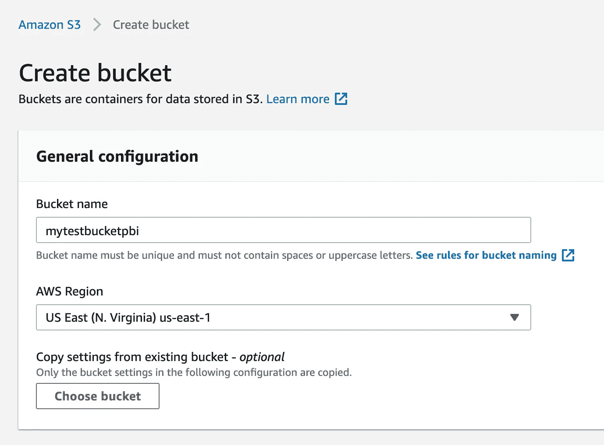
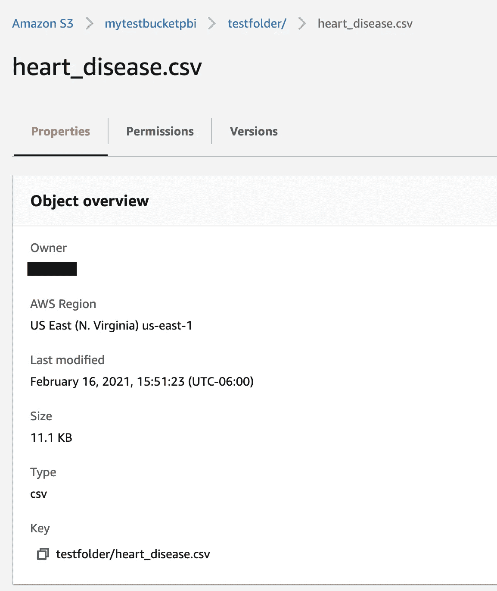
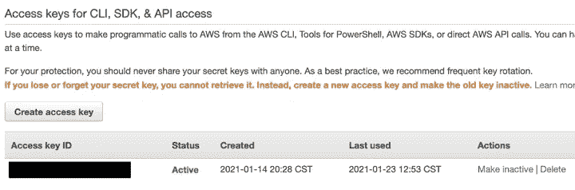
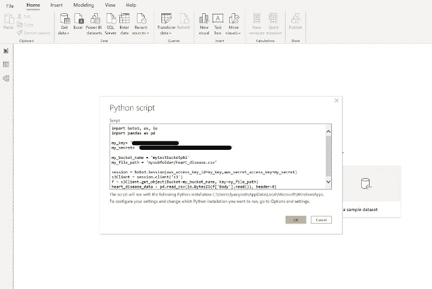
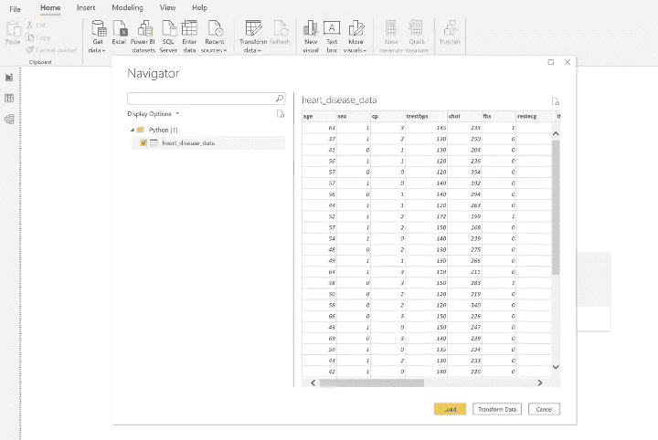

# 我们如何在 5 分钟内将 Amazon s3 连接到 Microsoft Powerbi…

> 原文：<https://pub.towardsai.net/how-we-connected-amazon-s3-to-microsoft-powerbi-in-5-minutes-18434524d4a4?source=collection_archive---------2----------------------->

## [云计算](https://towardsai.net/p/category/cloud-computing)

由[的**易勒雅斯的**的](https://www.linkedin.com/in/ilyasiyoob/)和[的**乌玛的**的](https://www.linkedin.com/in/umariyoob/)

PowerBI 已经迅速成为许多商业用户的默认仪表板工具，而 S3 仍然是技术用户的默认对象存储。因此，这两者之间看似毫不费力的联系却出人意料地不那么容易。让我们免去您的痛苦，直接带您进入我们的 5 分钟解决方案。

# 为什么选择 PowerBI？

[微软 PowerBI](https://powerbi.microsoft.com/en-us/) 作为仪表板的首选工具正在迅速发展，因为:

*   桌面版免费，
*   共享仪表盘只需 10 美元/用户/月，
*   (免费)众包可视化库正在快速增长(如单词云、方框图等)，并且
*   数据查询功能非常全面，足以取代对单独的数据工程工具的需求。

# 为什么是 S3？

[亚马逊 S3](https://aws.amazon.com/s3/) 是最受中小型企业欢迎的对象商店，因为:

*   上传文件到 S3 是免费的，
*   存储和检索文件的成本仅为 0.02 美元/GB/月
*   访问管理易于设置，并且
*   S3 的编程访问能力使其非常方便地嵌入到企业级应用中。

# 我们如何将两者联系起来？

虽然大多数在线解决方案都建议建立到 Redshift 或 Athena 的数据库连接，但这里有一个更简单的解决方法:

## 第一步:

在你的 AWS 账户中创建一个[亚马逊 S3 桶](https://s3.console.aws.amazon.com/s3/bucket/create?region=us-east-1)。

## 第二步:

将您的数据文件存储在此桶中。

## 第三步:

在 [Amazon IAM](https://console.aws.amazon.com/iam/home?region=us-east-1#/security_credentials) 中创建访问凭证来访问数据。

## 第四步:

打开 PowerBI desktop，选择获取数据>其他> Python 脚本。

## 第五步:

在下面插入[代码](https://github.com/incoob/incb-utilities/blob/main/connect_s3_powerbi.py)，指定您的 AWS 密钥、存储桶名称和文件路径。

请注意，在代码中嵌入凭证并不理想(即使这是在 PowerBI 中)，因此在实践中最好将凭证安全地保存为环境变量。

## 第六步:

点击 OK，看着你的数据文件以数据表的形式出现。

从现在开始，您的 PowerBI 查询应该像处理任何数据表一样工作。尽情享受吧！