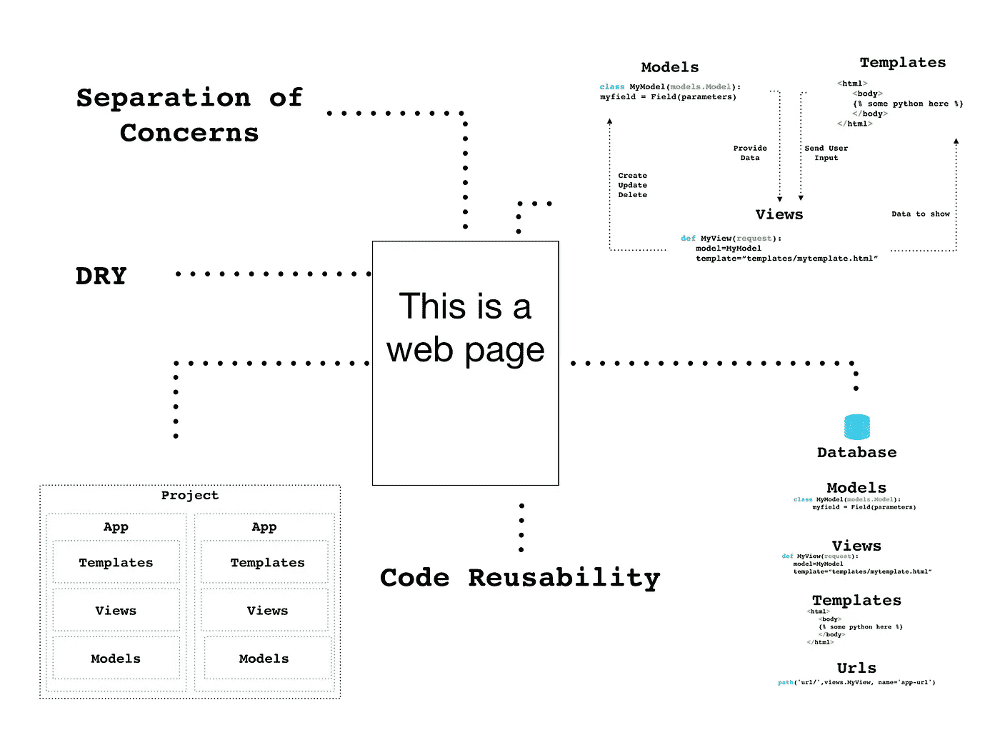
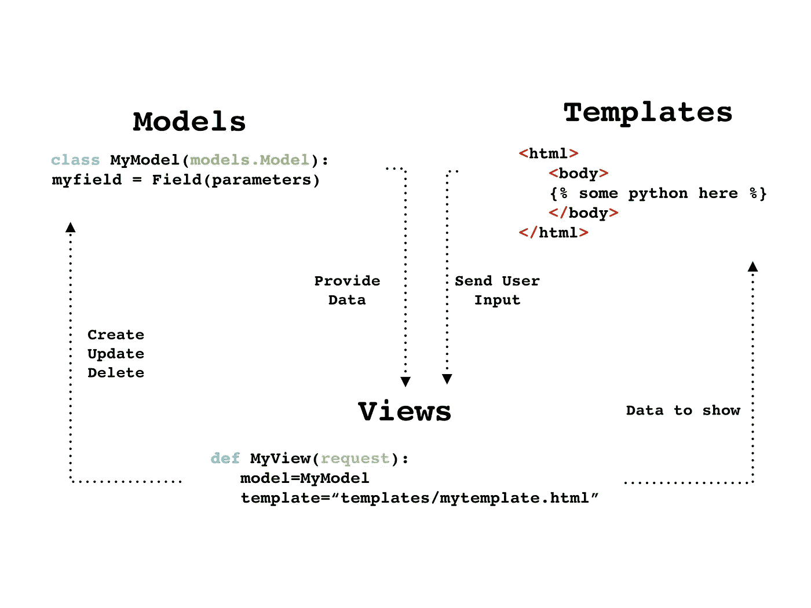
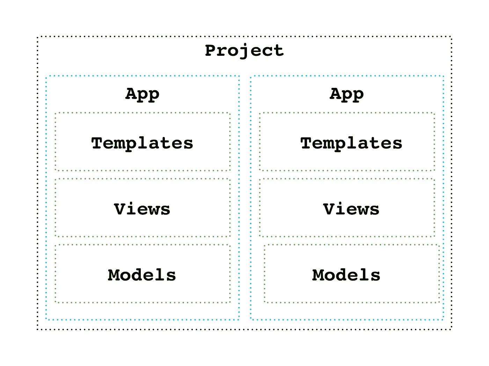
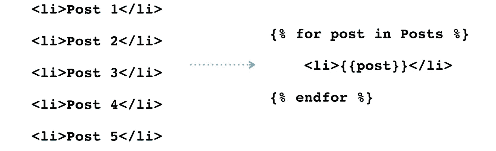

# Web 框架如何简化和组织网站

> 原文：<https://pub.towardsai.net/how-web-frameworks-streamline-and-structure-websites-51fea99c2add?source=collection_archive---------0----------------------->

## [编程](https://towardsai.net/p/category/programming)

## 在 MVT 架构上，URL 调度，模板化和把所有这些放在一起

Web 框架使得构建和部署 web 应用程序变得简单而高效。有了它们，我们不需要太多的技术知识就可以做出高水平的应用。尽管如此，能够理解甚至欣赏这些框架背后发生的事情仍然很重要。

在本文中，我回顾了 web 开发框架用来实现动态 web 应用程序的一些过程和概念。我通过一个流行的 Python web 框架 Django 来做这件事。尽管其中一些特性是 Django 特有的，但是底层的过程和概念在其他地方也可以广泛应用。因为在这个过程中，我们也可以获得更好的编程习惯和实践。

# MVT 建筑

Django 采用模型-视图-模板系统来构建我们的 web 应用程序，并保持代码的整洁。编程中的一个重要概念是关注点分离。这个原则仅仅意味着我们，作为开发者，应该保持我们的代码有条理——将后端和前端分开，等等。MVT 建筑让我们可以做到这一点。后端数据(模型)与请求处理(视图)和用户实际看到的前端页面(模板)是分开的。模型可以被认为是我们的应用程序使用的原始**数据**，而模板是我们的**用户可以看到的(大部分)HTML 和 CSS。当然，视图是两者之间的中介**函数**。**

MVT 架构的强大之处在于，它让我们的代码保持干燥(不要重复自己)，甚至可以重用。例如，模型只是类，因此它们可以在不同的视图中实例化。此外，Django 和其他框架允许整个应用程序被重用。Django 的“应用”是项目的一部分。但是这些应用程序可以彼此独立运行，因此可以在多个项目中使用。

MVT 的另一个主要优势是安全。我们不希望为潜在的恶意用户提供一条通向我们的模型和数据库的单向路径。中间的视图允许我们插入验证和确认。这些作为网关保护我们的网络应用，从而增加安全性。

> *💡* ***要点:***MVT 的建筑由可以独立运作的部分组成。这允许关注点分离、干代码和代码可重用性。

# Url 调度

在静态网站中，URL 指向在站点目录中检索要呈现的文件的位置。例如，mywebsite.com/blog/posts.html 指向博客文件夹上的 posts.html 页面。虽然这很好，但是也没有自定义我们的 URL 显示方式的选项，也没有办法给它们添加更多的功能。此外，如果我们希望每个帖子都有一个页面，我们需要为每个新帖子创建一个新文件。这既乏味又没有必要。

Url 调度解决了这两个问题。URL dispatcher 允许我们指定我们的 URL 将如何显示，以及它将呈现哪个视图。通过这样做，我们还可以根据传递的参数来使用变量。以博客文章为例。有了这个特性，我们可以简单地输入一个主键(post/1)或一个 slug (post/this-is-a-post)变量，根据参数呈现不同的页面。

作为开发人员，我们应该避免对 URL 进行硬编码。这是因为 URL 必然会改变，并且应该灵活应对。也就是说，当我们改变一个 URL 时，我们不想重新输入它的每一个实例。为了解决这个问题，Django 有一个名称参数，我们可以引用它来代替实际的路径。这允许我们改变我们的 URL 模式，而不必编辑它们被引用的地方

> *💡* ***关键提示:*** url 调度允许完全可定制的 Url 路径和参数，并且消除了硬编码的 Url。

# 模板

对于 URL 调度，我们提到了如何只用一条路径为多个页面创建 URL。但是我们还是要做一个新的。每个帖子的 html 文件，对吗？嗯，我们可以利用另一个叫做模板的特性。顾名思义，模板化允许我们为所有的文章页面创建一个单一的模板，并简单地用 python 变量代替信息，这些信息将由相关的视图提供。(再看 MVT 建筑之美？)

虽然上面的例子相对简单，但是模板非常强大。它们使得呈现表单和传递用户输入变得更加容易。有了模板，将后端功能集成到前端网页就简单多了。

> *💡* ***要点提示:*** 综上所述，模板化使我们的网站更加动态和高效

# 把所有的放在一起

要了解这一切是如何结合在一起的，让我们看看从 URL 到网页的整个过程。

## 全球资源定位器(Uniform Resource Locator)

在这里，我们的 URL 分配器将搜索到的 URL 与我们的路径进行匹配。

一旦找到，这个路径就将请求发送给相关的视图，同时发送 URL 中的参数(如果有的话)。

## 视图

视图然后将获取模板呈现网页可能需要的信息。这不仅包括模型，还包括表单类、用户认证和请求验证。视图不必做所有这些。这完全取决于请求的类型和网页的功能。

## 模型

然后我们的视图与模型交互，模型反过来从数据库获取数据。还记得从 URL 传递的参数吗？我们的模型可以利用这一点从一组数据中进行过滤，只提供所需的信息。

验证也发生在模型中。例如，字段具有某种类型，并且可以指定参数。用户输入仅在符合字段类型并符合参数时才有效。

## 返回视图

这并不完全准确，因为在基于类的视图中上下文的定义是不同的

然后，来自数据库和模型的信息被传递回视图，通常作为一个名为“上下文”的字典。视图还可以提供模板需要的其他信息或变量。

## 模板

最后，我们得到了模板。回想一下，我们的用户实际上可以在浏览器中看到的就是这个模板。模板中的占位符用从视图中获得的上下文中的值填充。

最终的网页已经准备好了。

终于！

像 Django 这样的框架及其背后的过程不仅允许任何人构建流线型的 web 应用程序，还允许任何人在此过程中养成良好的编码习惯。

# 术语表和注释

Django:一个流行的基于 python 的开源框架

MVC & MVT 架构:Django 使用 MVT 架构，而大多数其他框架使用类似的 MVC(模型-视图-控制器)架构。

Web 开发框架:提供服务和资源来帮助开发和部署 web 应用程序