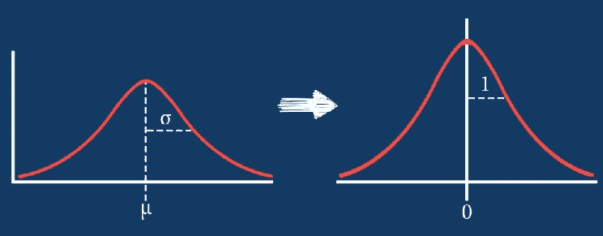
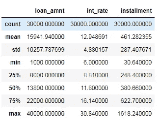
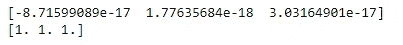
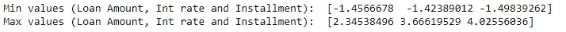
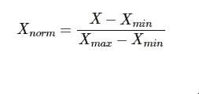
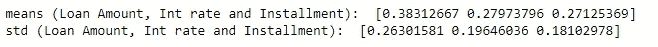
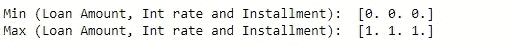
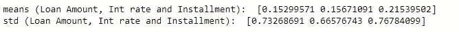
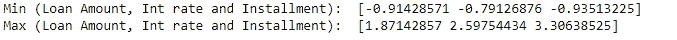

# 您应该如何、何时以及为什么对您的数据进行规范化/标准化/重新缩放？

> 原文：<https://pub.towardsai.net/how-when-and-why-should-you-normalize-standardize-rescale-your-data-3f083def38ff?source=collection_archive---------0----------------------->

## [数据科学](https://towardsai.net/p/category/data-science)



在深入这个主题之前，让我们先从一些定义开始。

**【重新调整】**向量意味着增加或减少一个常数，然后乘以或除以一个常数，就像您要改变数据的测量单位一样，例如，将温度从摄氏温度转换为华氏温度。

**【规格化】**一个向量最常见的意思是除以向量的一个范数。它还经常指通过向量的最小值和范围进行重新调整，使所有元素位于 0 和 1 之间，从而使数据集中所有数值列的值达到一个通用的范围。

**【标准化】**向量最常见的意思是减去一个位置的度量，再除以一个尺度的度量。例如，如果向量包含具有高斯分布的随机值，您可以减去平均值并除以标准差，从而获得平均值为 0、标准差为 1 的“标准正态”随机变量。

读完这篇文章后，你会知道:

*   为什么您应该标准化/规范化/扩展您的数据
*   如何使用标准标量将数值属性标准化为 0 均值和单位方差
*   如何使用最小-最大标量在 0 和 1 的范围内规范化数值属性
*   如何使用稳健标量进行规范化
*   何时选择标准化或规范化

让我们开始吧。

# 为什么应该标准化/规范化变量:

## **标准化:**

当我们比较具有不同单位的测量值时，将中心和 0 周围的要素标准化为标准偏差 1 非常重要。不同尺度下测量的变量对分析的贡献不同，最终可能会产生偏差。

例如，范围在 0 和 1000 之间的变量将比范围在 0 和 1 之间的变量更重要。使用这些没有标准化的变量将在分析中给出具有更大范围权重 1000 的变量。将数据转换为可比尺度可以避免这个问题。典型的数据标准化程序使范围和/或数据可变性相等。

## **正常化:**

同样，规范化的目标是将数据集中的数值列的值更改为一个通用的比例，而不会扭曲值范围的差异。对于机器学习来说，并不是每个数据集都需要归一化。仅当要素具有不同的范围时才需要。

例如，考虑一个包含两个特征的数据集，年龄和收入(x2)。年龄范围从 0 到 100，收入范围从 0 到 100，000 甚至更高。收入比年龄大 1000 倍左右。所以，这两个特征在非常不同的范围内。当我们做进一步的分析时，比如多元线性回归，归因收入会由于其更大的值而内在地影响结果。但这并不一定意味着它作为一个预测指标更重要。因此，我们将数据标准化，使所有变量都在同一范围内。

# 何时应该使用规范化和标准化:

**当您不知道数据的分布或知道分布不是高斯型(钟形曲线)时，标准化**是一种很好的技术。当您的数据具有不同的比例，并且您使用的算法不对数据的分布进行假设时，如 k-最近邻和人工神经网络，则规范化非常有用。

**标准化**假设你的数据具有高斯(钟形曲线)分布。严格来说，这并不一定是真的，但是如果您的属性分布是高斯分布，这种技术会更有效。当您的数据具有不同的比例，并且您使用的算法假设您的数据具有高斯分布时，标准化非常有用，例如线性回归、逻辑回归和线性判别分析。

## 数据集:

我使用了来自 Kaggle 的 [Lending Club 贷款数据集](https://www.kaggle.com/wendykan/lending-club-loan-data)来演示本文中的例子。

**导入库:**

```
import pandas as pd
import numpy as np 
import seaborn as sns
import matplotlib.pyplot as plt
```

**导入数据集:**

让我们导入三列——贷款金额、利息率和分期付款，以及数据集中的前 30000 行(以减少计算时间)

```
cols = ['loan_amnt', 'int_rate', 'installment']
data = pd.read_csv('loan.csv', nrows = 30000, usecols = cols)
```

如果导入整个数据，某些列中将会缺少值。您可以使用 pandas drop na 方法简单地删除缺少值的行。

**基本分析:**

现在让我们分析数据集的基本统计值。

```
data.describe()
```



不同的变量呈现不同的值域，因此具有不同的大小。不仅最小值和最大值不同，而且它们分布在不同宽度的范围内。

# 标准化(标准标量) :

正如我们之前所讨论的，标准化(或 Z 得分标准化)意味着将变量的中心定在零，将方差标准化为 1。该过程包括减去每次观察的平均值，然后除以标准偏差:

标准化的结果是要素将被重新缩放，以便它们具有标准正态分布的属性

```
μ=0 and σ=1
```

其中，μ是平均值，σ是平均值的标准差。

**代码:**

sci-kit-learn 的 StandardScaler 移除平均值，并将数据缩放至单位方差。我们可以从 sci-kit learn 导入 StandardScalar 方法，并将其应用于我们的数据集。

```
from sklearn.preprocessing import StandardScaler
scaler = StandardScaler() 
data_scaled = scaler.fit_transform(data)
```

现在让我们检查平均值和标准偏差值

```
print(data_scaled.mean(axis=0))
print(data_scaled.std(axis=0))
```



正如预期的那样，每个变量的平均值现在大约为零，标准偏差设置为 1。因此，所有的变量值都在同一范围内。

```
print('Min values (Loan Amount, Int rate and Installment): ', data_scaled.min(axis=0))
print('Max values (Loan Amount, Int rate and Installment): ', data_scaled.max(axis=0))
```



然而，最小值和最大值根据变量的分布程度而变化，并且受异常值的影响很大。

# 标准化(最小-最大标量) :

在这种方法中，数据被缩放到一个固定的范围—通常是 0 到 1。与标准化相反，拥有这个有界范围的代价是我们最终会得到更小的标准差，这可以抑制异常值的影响。因此，最小最大标量对异常值很敏感。

最小-最大缩放通常通过以下等式完成:



**代码:**

让我们从 Scikit-learn 导入 MinMaxScalar，并将其应用于我们的数据集。

```
from sklearn.preprocessing import MinMaxScaler
scaler = MinMaxScaler() 
data_scaled = scaler.fit_transform(data)
```

现在让我们检查平均值和标准偏差值。

```
print('means (Loan Amount, Int rate and Installment): ', data_scaled.mean(axis=0))
print('std (Loan Amount, Int rate and Installment): ', data_scaled.std(axis=0))
```



最小最大缩放后，分布不以零为中心，标准偏差不为 1。

```
print('Min (Loan Amount, Int rate and Installment): ', data_scaled.min(axis=0))
print('Max (Loan Amount, Int rate and Installment): ', data_scaled.max(axis=0))
```



但是最小和最大值是跨变量标准化的，这与标准化的情况不同。

# 稳健标量(缩放至中位数和分位数) :

使用中位数和分位数进行缩放包括减去所有观测值的中位数，然后除以四分位差。它使用对异常值具有鲁棒性的统计数据来缩放要素。

四分位差是第 75 个和第 25 个分位数之间的差:

```
IQR = 75th quantile — 25th quantile
```

计算缩放值的公式:

```
X_scaled = (X — X.median) / IQR
```

**代号:**

首先，从 Scikit learn 导入 RobustScalar。

```
from sklearn.preprocessing import RobustScaler
scaler = RobustScaler() 
data_scaled = scaler.fit_transform(data)
```

现在检查平均值和标准偏差值。

```
print('means (Loan Amount, Int rate and Installment): ', data_scaled.mean(axis=0))
print('std (Loan Amount, Int rate and Installment): ', data_scaled.std(axis=0))
```



如你所见，分布不是以零为中心，标准偏差也不是 1。

```
print('Min (Loan Amount, Int rate and Installment): ', data_scaled.min(axis=0))
print('Max (Loan Amount, Int rate and Installment): ', data_scaled.max(axis=0))
```



最小值和最大值也不像在 MinMaxScaler 中那样设置为某个上限和下限。

我希望这篇文章对你有用。快乐学习！

## 参考

1.  [https://www . udemy . com/feature-engineering-for-machine-learning/](https://www.udemy.com/feature-engineering-for-machine-learning/)
2.  [https://www . geeks forgeeks . org/python-how-and-where-to-apply-feature-scaling/](https://www.geeksforgeeks.org/python-how-and-where-to-apply-feature-scaling/)