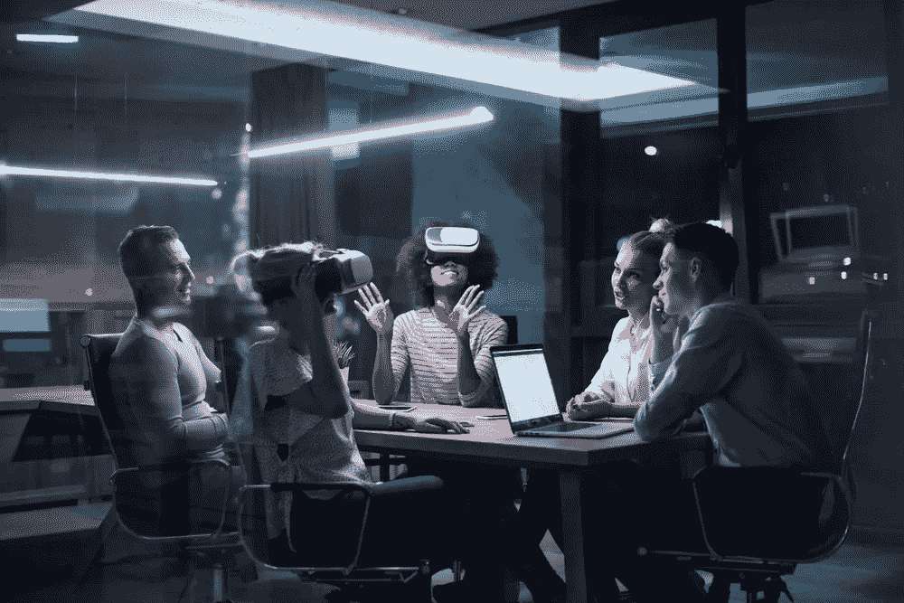
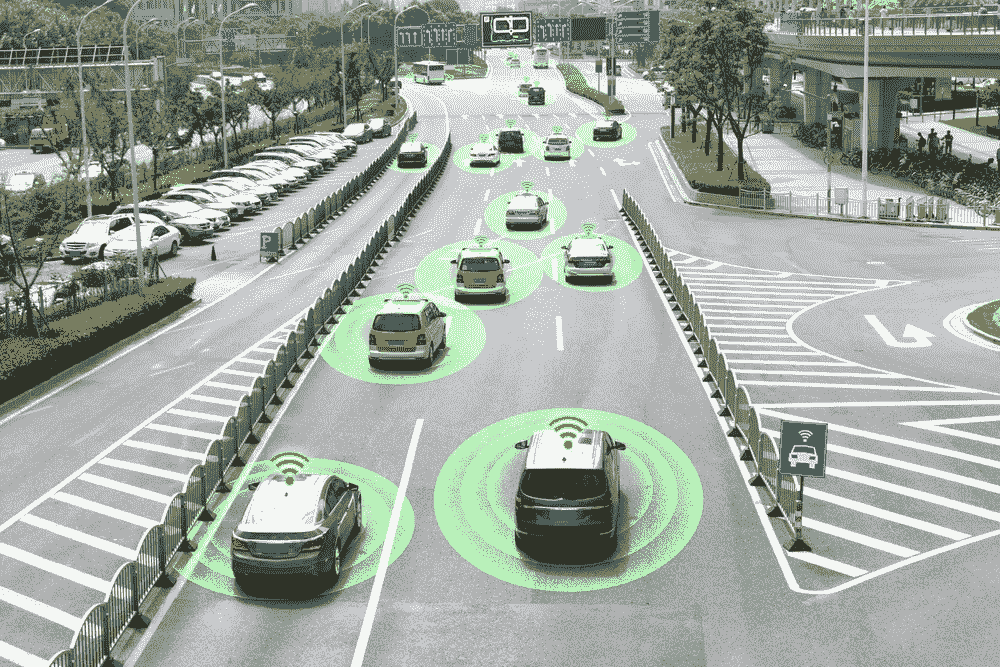
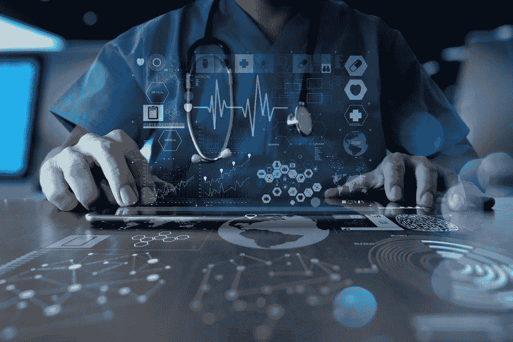
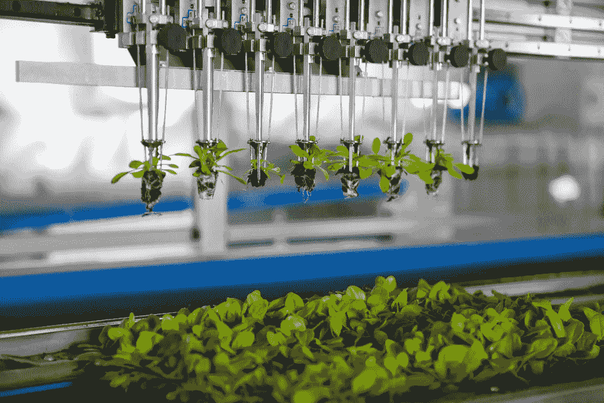
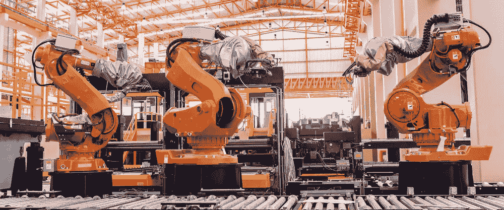

# 人工智能将如何改变未来？

> 原文：<https://pub.towardsai.net/how-will-artificial-intelligence-change-the-future-6e5dd1f46dc6?source=collection_archive---------3----------------------->

## [人工智能](https://towardsai.net/p/category/artificial-intelligence)，[未来](https://towardsai.net/p/category/future)

人工智能正在逐渐提高我们的生产力水平。这些包括像语音识别技术这样的东西，它为聊天机器人和个人助理设备提供动力。此外，用户对自动机器学习技术和内置人工智能机制的商业应用程序感兴趣。对作为服务交付的人工智能平台和相关云服务的需求不断增长。话虽如此，但有些应用，如完全自动驾驶汽车，短期内还不会出现。

来源: [Shutterstock](https://www.shutterstock.com/)

Gartner 的最新人工智能研究显示了企业中各种各样的人工智能应用。这应该不足为奇，因为它自己在 2019 年的调查显示，与去年相比，实施人工智能的组织比例从 4%增加到 14%。由于人工智能正在成为主流，我们决定看看它将如何影响未来。但是在我们展望未来之前，让我们回顾一下，看看人工智能的简史。

# 人工智能简史

人工智能系统的发展是在第二次世界大战后现代计算机出现后才成为可能的。20 世纪 50 年代，来自各个领域的科学家开始考虑创造人造大脑的可能性。随后神经科学领域的研究表明，大脑是一个神经网络，Alan Tuning 提出任何类型的计算都可以用数字形式表示，1951 年研究生马文·明斯基创建了第一个 SNARC 神经网络。到 1950 年，图灵开发了一种测试来确定机器行为与人类意识的相似程度，后来被称为图灵测试。“人工智能”这个名称是在 1956 年的达特茅斯会议上首次使用的，与此同时“人工智能研究”这门科学学科也出现了。

随后，许多机器被创造出来，它们能够理解人类的语言，能够就给定的话题保持对话，机器人玩棋盘游戏:计算机和卡斯帕罗夫在国际象棋中的著名比赛以机器的胜利而告终。现在人工智能在科学的发展中占据了重要的位置，尤其是在物联网概念的框架内，因为仅仅收集数据是不够的，还需要在一个人无法做到这一点的情况下进行处理、分析和行动。

现在我们已经了解了人工智能的简史，让我们来看看它的未来。

# 自动驾驶汽车

来源: [Shutterstock](https://www.shutterstock.com/)

既然我们在开头提到了自动驾驶汽车还需要一段时间才能问世，那么我们就先来看看这项技术。如果你想了解更多关于开发自动驾驶汽车的困难，这篇[文章](https://mindy-support.com/news-post/5-main-reasons-why-fully-autonomous-cars-are-not-on-the-roads-yet/)很好地解释了这一点。自动驾驶汽车最大的好处和承诺之一是，它们将使移动人员和物体变得更容易、更安全。基本想法是，有些人是真正的好司机，但许多人不是，一个充满自动驾驶汽车的世界可能比人类司机的世界安全得多。

对于不能或不想获得驾照的人来说，来自 Waymo 等公司的自动驾驶汽车可能是一个巨大的好处；使驾驶汽车变得困难或不可能的残疾人；而视力不好或者反应时间慢的老年人，使他们无法安全驾驶。无人驾驶技术在紧急情况下也能派上用场。例如，如果司机生病或残疾，无法驾驶，配备自动驾驶技术的车辆可以帮助他们变得机动，增加他们的独立性。所有阻碍自动驾驶汽车成为主流的问题都可以通过更多的训练数据来克服。对帮助准备数据集和训练机器学习算法的高质量[数据注释](https://mindy-support.com/news-post/using-data-annotation-to-solve-some-of-the-challenges-of-self-driving-vehicles/)的需求也将增加。

# 对话人工智能

对话式人工智能指的是一些广泛应用的技术，如语音助手、聊天机器人，它们以类似人类的自然方式与人互动。创建这样的人工智能系统非常复杂，但对几乎所有行业都非常有用。为创建对话式人工智能系统的公司提供数据注释服务的公司 [Mindy Support](https://mindy-support.com/) 的首席执行官 Evgenia Khimenko 谈到了创建该系统的过程:

“当我们看着创建一个对话式人工智能系统或任何人工智能产品的过程时，它类似于一个金字塔结构。在金字塔的底部，我们有创建系统所需的所有训练数据。然而，所有这些原始数据都需要通过各种过程来准备，这些过程都属于数据注释的范畴。就对话式人工智能而言，这包括自然语言处理，这需要用文本分类、情感分析和简单标记关键短语等技术来注释成千上万的文本。

所有这些带注释的数据都将被输入到系统中，这是金字塔的下一个阶段，在这里数据和技术开始相互作用。数据流经系统，经过充分的处理和训练后，我们就达到了分析级别，在这一级别可以从数据中收集见解。现在，如果我们不满足于简单地从数据中提取见解，而是希望系统在没有任何显式编程的情况下进行分析并应用它，这就是下一个阶段，即机器学习。机器学习算法通过经验不断改进，本质上是边学边用。

人工智能是金字塔的顶端，可以说是圣杯。这是机器能够复制人类思维过程的终极阶段。因此，即使机器学习是人工智能的一大部分，人工智能也是让机器产生语言理解等人类能力的东西。"

# 医疗保健中的人工智能

来源: [Shutterstock](https://www.shutterstock.com/)

随着医疗保健组织收集和处理大量医疗数据和其他信息，人工智能和机器学习在医疗保健领域具有巨大的潜力。机器学习可以帮助组织分析大型数据库，并在解决问题和完善治疗方案或业务流程的背景下识别最相关的医疗数据。高级分析有助于更好地制定决策，并刺激对新想法和竞争优势来源的探索。许多公司已经开始使用人工智能来改变医疗保健，每年都有新产品被开发出来。

在 21 世纪初人工智能被用于处理健康信息之前，预测性医疗保健模型只能解释准备充分的健康数据中有限的变量。使用人工神经网络来研究极其复杂的关系或深度学习技术的现代机器学习工具在执行医疗任务时，往往会超越人类的能力。人工智能系统能够解决现代临床服务中的复杂问题。这包括帮助减少人为错误等更高级的功能，如[预测患者患癌症的可能性](https://mindy-support.com/news-post/using-ai-to-predict-future-cancer/)。

# 农业中的人工智能

来源: [Shutterstock](https://www.shutterstock.com/)

农业中的人工智能不仅是软件解决方案，允许农民使用航空图像或视频来预测农田中的作物产量，以监控农场中牲畜的状况，而且还包括机器人系统，可以大大减轻农民的负担，使他们从日常操作中解脱出来。

然而，尽管农业综合企业采用技术的例子越来越多，但该行业仍然存在一些挑战，需要企业和政府共同努力。其中包括刺激对人工智能技术的需求，实施个体解决方案的高成本，国内人工智能产品和解决方案的缺乏，实施风险和许多其他考虑因素。

你可以期待看到人工智能在作物和牲畜生产中的应用，其中分析人类模式和分析动物模式等技术是相关的。分析动物模式可以让你主动应对健康问题，跟踪饮食和治疗。

# 智能家居

未来之家的愿景——已经有无数关于这个主题的科幻电影，也有许多关于这个主题的书籍和文章。今天，科幻作家的梦想——智能家居，其中计算机负责所有重要功能，正在成为现实。我们可以用几个词来概括这种房子的主要特征:舒适、实用和节能。智能家居适应你的习惯。当每个人都睡着了，它会关掉你房子里所有的灯，关掉不必要的电源插座，把它切换到经济模式，关上门，甚至保护你的房子不被窃贼偷走。它可以在早上给你的家加热，煮咖啡，用你最喜欢的旋律叫醒你，并照看你孩子的安全。你的家会更安全，因为它会监视每扇窗户，每扇门，它也可以是完美的管家，即宣布客人的到来。请记住，这只是所有可能性的一小部分。

许多这样的设备已经可以在市场上买到，所以你今天就可以开始享受这样的便利。然而，未来我们将看到更多的个性化和更先进的智能家居技术。

# 机器人学

来源: [Shutterstock](https://www.shutterstock.com/)

人工智能机器人正被各行各业的公司广泛用于完成各种任务。其中许多公司正在使用机器人技术来提高自动化水平，但还有许多其他公司正在重新设想工作的完成方式，以最大限度地发挥人和机器的价值，创造新的机会来更有效地组织工作，并重新定义劳动力的技能和职业。随着越来越多的组织试图拥抱这些技术，人工智能机器人工具的市场正在蓬勃发展。微软、IBM、脸书等领先企业和其他科技巨头都在积极投资这一领域。

今天，许多领先的公司都会同意，当这些技术增强人的能力而不是取代人的能力时，它们是最有效的。例如，亚马逊正在使用机器人将季节性员工的培训时间缩短至两天以内。沃尔玛最近推出了虚拟现实技术，以改善店内学习并有效模拟客户体验。空客和日产等制造商正在寻找使用协作机器人或“合作机器人”的方法，这些机器人在工厂里与工人并肩工作。

我们可以预计人类和机器人的这种结合将持续到不久的将来，只有单调和例行的任务变得自动化。

# 安全中的人工智能

来源: [Shutterstock](https://www.shutterstock.com/)

今天，安全摄像头被广泛用于防范窃贼，但还有许多其他功能，这种摄像头可以通过添加人工智能来服务。面部识别技术可用于识别房主，也可在办公室用于验证员工身份并允许他们进入房屋。这将使钥匙和身份证之类的东西过时。在未来，你可以预期这样的技术也将应用于银行领域。我们已经能够通过 Face ID 等技术登录我们的移动银行，但这将进一步扩展，以使各种银行服务变得更加安全，这样你就可以在自动取款机上取款，开立新的信用卡和许多其他服务。

# 我们未来可以期待什么

人工智能现在是未来全球领先的技术趋势。人工智能是当今技术革命的核心，预计不仅会彻底改变信息技术产业，还会改变汽车、银行、农业和医疗领域。商业的主要好处不是完全自动化，而是巧妙地将机器与人结合起来。经验表明，虽然有许多日常和平凡的工作可以自动化，但未来仍有人类工人的空间。

在银行、零售、工业和能源领域，全自动数据收集和初级分析将增加对具有管理能力和解决非标准任务能力的员工的需求。预期寿命的增长增加了对医疗领域专业人员的需求，根据 Kiplinger 的说法，在未来最受欢迎的职业排名中，他们占据了前十名的一半。如果自动化影响了高精度的外科手术和初级诊断，那么与患者沟通，就像今天一样，将需要人工智能尚不具备的技能。

如果人和机器一起工作，那么机器人和人工智能将创造更多的就业机会。