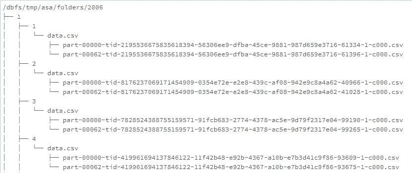
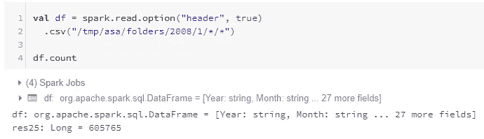
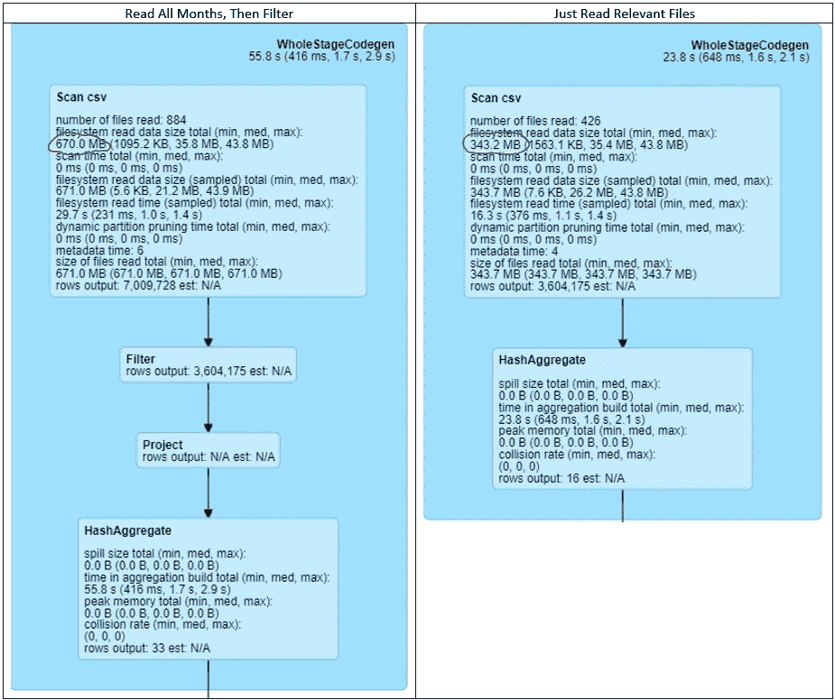
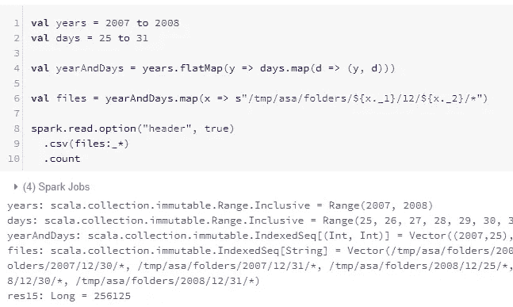
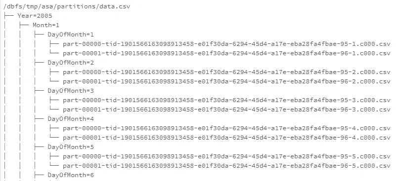
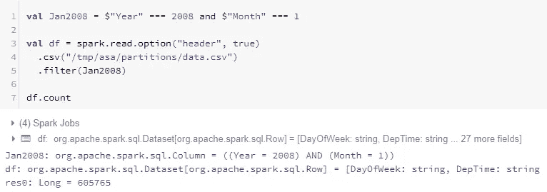
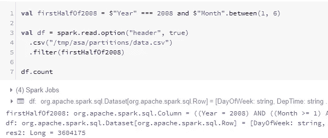
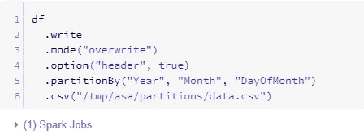

# 应该如何保存 Spark ETL 作业的输出(如果没有写入数据库)

> 原文：<https://pub.towardsai.net/how-you-should-save-the-output-of-your-spark-etl-jobs-if-you-are-not-writing-to-a-database-c95a113eef1?source=collection_archive---------0----------------------->

## 将 Spark ETL 作业的输出| [保存到 AI](https://towardsai.net)

# 介绍

在本文中，我将分享我对保存 Spark ETL 作业输出的最佳方式的想法，以便以后更容易进行分析工作。代码重现的例子可以在[这里找到](https://github.com/hsm207/blog-spark-save-files)。

# 集群设置

我在本文中用来运行代码的集群托管在 Databricks 上，配置如下:

*   集群模式:标准
*   Databricks 运行时版本:5.5 LTS ML(包括 Apache Spark 2.4.3 Scala 2.11)

有 8 个工作线程，工作线程和驱动程序都是 M4 . XL 大型实例(16.0 GB，4 个内核)。

# 个案研究

想象你在下面的场景中:

> 您刚刚加入了一家广受欢迎的在线零售商，其客户遍布全球。这家公司每年创造数十亿美元的收入。因此，您知道它每天生成如此多的事务性数据，只有使用像 Apache Spark 这样的分布式计算框架才能有效地处理这些数据。您的任务是建立一个模型来预测每日营业额，并决定从对过去的交易进行一些探索性的数据分析开始。
> 
> 数据工程团队友好地同意让您以平面文件的形式访问这些数据，这些文件被转储到位于云中的某个文件夹中。该团队非常注重客户满意度，因此他们更进一步，询问您希望如何组织该文件夹中的文件。
> 
> 你将如何回应？

一种常见的布局是将文件组织到具有 3 个层次的文件夹中，即“年”、“月”和“日”。“日”文件夹将包含与当天交易相关的文件。

下一节将说明为什么这种布局不是数据分析的最佳选择。

# 按年->月->日保存

为了更具体，我们将使用`asa/airlines`数据集作为本文剩余部分的运行示例。该数据集是 Databricks 的[公开可用数据集](https://docs.databricks.com/getting-started/databricks-datasets.html)的一部分。

以下是该数据集在此布局方案下的外观:

图 1:2006 年的目录结构

图 1 显示了一个名为“2006”的文件夹的目录结构，它表示 2006 年的所有事务。在这个文件夹中有另一组名为 1，2，…，12 的文件夹，代表一月，二月，…，十二月。这些文件夹又包含表示特定月份中某一天的文件夹。实际数据以包含多个相对较小的 csv 文件的另一个文件夹的形式存储在一个月中的某一天文件夹中，因为每天的数据非常大。

现在假设您想知道 2008 年 1 月的交易数量。这可以通过下面的代码片段轻松实现:

图 2:统计 2008 年 1 月的交易数量

请注意，使用通配符，即“*”符号可以轻松检索文件夹中的所有文件。

如果您想知道 2008 年 1 月前 6 个月的交易数量，该怎么办？将`/tmp/asa/folders/2008/*/*/*`作为调用`csv`的参数是行不通的，因为它将读取 2008 年的所有 12 个月。您可以读取所有这些文件，然后过滤它们，只显示相关月份，但是:

图 3:“真正过滤所有文件”和“只读取相关文件”方法的物理计划

图 3 显示，读取所有 12 个月的数据，然后过滤以仅返回前 6 个月的数据，结果是读取 670 MB 的数据，而不是仅读取前 6 个月的 343.2 MB。因此，前一种方法效率低，不可扩展，尤其是对于大型数据集。给定文件夹布局，我们将不得不编写一些代码，以编程方式构造相关文件的路径。有一种方法可以做到:

图 4:以编程方式构建相关文件路径的示例

图 4 显示，在我们继续分析之前，我们只需要多写一行代码。

让我们考虑这样一种情况，我们希望对过去两年中每年最后 7 天的交易进行计数，即获得 2007 年和 2008 年 12 月 25 日至 12 月 31 日之间的交易计数。生成路径可能有点棘手，因为现在路径有两个不同的部分:年份和月份。您可以创建一个年和日的列表，然后做一个笛卡尔积来得到一个(年，日)元组，然后您可以用它来创建文件路径，如下所示:

图 5:生成更复杂的文件路径

另一个解决方案是创建一个从 2007 年初到 2008 年底的日期列表，然后应用适当的过滤器。这比前一个解决方案更复杂，所以为了简洁起见，我在这里不做尝试。

无论如何，我不是这种文件读取方法的粉丝，原因如下:

*   **冗长:**在继续分析之前，您需要编写额外的代码。根据您的编码风格和习惯，生成文件路径的代码可能是晦涩的，这使得其他人很难理解您的分析。
*   **脆性:**这个方法隐含地假设一年中的每一天都有一个文件。由于许多原因，例如系统维护、系统故障、公共假日等，情况可能并非如此。当这种情况发生时，你会得到一个`Path does not exist`异常。

我们能做得比这种方法更好吗？

# 按分区保存

图 6:组织文件的更好方式

图 6 显示了为您的特定用例组织文件的理想方式。使用这种布局，您可以依靠 Spark 的`filter()`函数只检索您感兴趣的数据。例如，下面是计算 2008 年 1 月所有交易的方法:

图 7:统计 2008 年 1 月交易的更好方法

注意，您只需要定义一个谓词来表达您想要满足的条件(`Jan2008`)，然后将它传递给`filter`函数。

接下来的两个数字显示了在这种目录布局下，如何分别计算 2008 年前 6 个月以及 2007 年和 2008 年最后 7 天的交易数量:

图 8:统计 2008 年前 6 个月交易的更好方法

图 9:统计 2007 年和 2008 年最后 7 天交易的更好方法

很明显，这种方法产生了可读性更好的代码。您也不需要担心遇到`Path does not exist`异常。

我们是如何实现这种目录布局的？请看下图:

图 10:如何获得理想的目录布局

想象一下，您的数据工程团队在获得事务数据之前必须做一些复杂的预处理，例如将几个表连接在一起，添加一些派生的特性，等等。`df`代表最终可供您使用的数据。他们需要做的就是将它保存到指定的文件夹中。

实现图 6 所示布局的关键步骤是调用图 10 第 5 行中的`partitionBy`。图 10 的结果是创建一个名为`data.csv`的文件夹(保存为 csv 时我们指定的文件名)。您可以将`data.csv`视为一个大文件，它在内部被`Year`、`Month`和`DayOfMonth`列(即您在调用`partitionBy`时指定的列)中的值分解。

# 结束语

本文向读者介绍了`partitionBy`函数，它是 [DataFrameWriter](http://spark.apache.org/docs/latest/api/scala/#org.apache.spark.sql.DataFrameWriter) 类的一个方法。这里的关键思想是，当您编写 ETL 作业的输出时，您应该按照用户在进行分析之前经常过滤的列对其进行划分。这不仅大大加快了阅读时间，而且正如本文所示，用户不必编写复杂的代码来获取所需的数据。

请在评论中告诉我你对这种方法的看法。