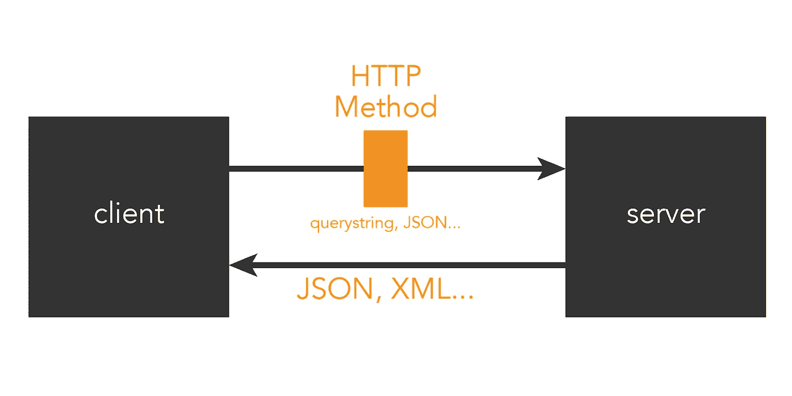

# HTTP API 与 REST API

> 原文：<https://pub.towardsai.net/http-api-vs-rest-api-f6004aa7821d?source=collection_archive---------0----------------------->

## [计算机科学](https://towardsai.net/p/category/computer-science)

## 计算机科学中最复杂也是最基本的语义谜语之一

 [## Michelangiolo Mazzeschi 的网站

### 单击此处了解我、我的项目和我的最新文章。

www . michelaangiolo . best](http://www.michelangiolo.best/) 

理解客户机-服务器模型的基本基准之一是理解什么是 API，以及 HTTP 和 REST API 之间的本质区别。然而，在谷歌上搜索这个问题(这对所有初学者来说都很常见)不太可能以一种直接的方式给你你正在寻找的答案，不管你会查看多少网站。我之所以直接得出这个结论，是因为我花了一段时间才明白两者的区别。

在本文中，我将从客户机-服务器模型开始解释这个概念，这可能是网络中最常见的模型。

## 客户机-服务器模型

在网络中，数据必须在相互连接的设备网络中传输。当一个应用程序部署在 web 上时，我们可以将客户端-服务器模型作为一种简单的方式来区分请求访问应用程序及其内容的网络分区(基本上是一些用户)、**客户端**，以及通过托管应用程序和管理其内容(包括计算能力)来提供服务的网络分区**服务器**。

通俗地说，一个 app 的客户端分区是指前端，而服务器是指后端。如果你是一个用户(**客户端**)，你只能通过一个 GUI(图形用户界面)门户与应用程序进行交互。而是在你管理 APP ( **服务器**)的时候，你需要控制你端的代码。

尽管 API 的概念可以扩展到比客户机-服务器模型更广泛的领域，但这将是一个完美的例子。

## 应用程序接口

API 是两个不同应用程序之间的连接(接口，甚至是桥，如果我们愿意的话)。在我们的例子中，在客户机和服务器之间。例如，如果我在我的电脑上运行一些代码(我是客户端),我想从 Google Maps 获取信息，我需要使用 API 连接这两个应用程序。

客户机-服务器模型的抽象表示:API 是桥梁

API 是软件开发中的一个常用工具，甚至在创建机器学习模型时也是如此，因为它可以用于访问数据库、下载或上传信息，甚至与云通信。API 是每个软件工程师课程中必不可少的工具。

## REST API 与 HTTP API

虽然这两个术语经常互换使用，但实际上，它们指的是两个不同的概念，彼此之间甚至没有可比性。

每当我们启动客户机和服务器之间的连接时，消息都是使用一组规则发送的:HTTP 协议。使用 HTTP 方法，我们可以通过 4 种常见方式与服务器通信:

*   得到
*   邮政
*   删除
*   放

我不会详细讨论它们中的每一个，这不是本文的目的。举个简单的例子，通过访问网页，我们通常使用 GET 方法来执行我们的请求:通过 URL，我们传递一些变量，服务器相应地做出响应，给我们可视化网页的信息。

相反，REST API 是连接的一种设计风格。正如我提到的，我们需要在客户机和服务器之间建立一个连接。设计这种连接有几种方法(我们可以添加认证要求，不同的协议，我们可以立即关闭连接或者在有限的时间内打开一个……)，REST API 只是其中的一种(最常见的一种)。

REST 和 HTTP 之间区别的抽象表示

为了用一个例子演示这一点，REST API 的一个替代方法是 WebSocket API。对于 REST API，我们要求每个请求都有一个新的连接。使用 WebSocket API，连接保持打开。

## 并没有就此结束

虽然我没有深入细节，但是当一些术语既指协议又指设计风格时，复杂性就开始了。肥皂就是一个很好的例子。

REST 和 HTTP API 也因我们使用的云而异，因为它们会不断更新。我们使用所谓的 API 网关来管理我们的 API。