# R 中的信用卡欺诈检测:最佳 AUC 得分为 99.2%

> 原文：<https://pub.towardsai.net/https-medium-com-mishtert-credit-card-fraud-detection-using-light-gbm-with-smote-data-in-r-fe28e63d5c6f?source=collection_archive---------2----------------------->


## 欺诈|异常检测

## 轻型 GBM 模型&不平衡数据集中的合成数据点

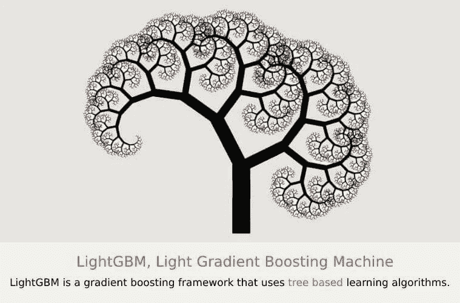

# 什么是轻 GBM

ight GBM 是一个高性能的梯度推进(GBDT、GBRT、GBM 或 MART)框架，用于分类、机器学习和排名相关的任务。

轻型 GBM 纵向生长树*而其他算法横向生长树*。**

**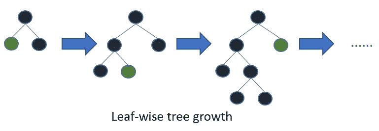**

**轻型 GBM**

**Light GBM 按叶生长树*而其他算法按层生长*。具有最大 delta 损失的叶子生长。通过生长相同的叶子，逐叶算法可以比逐层算法减少更多的损失。****

***Light GBM 因其速度而受到关注(Light GBM 中的 Light 这个名称意味着速度)，并且已知使用**低内存**和**专注于准确性**以及**支持 GPU 学习。*****

> *****优点:*****

*   ***训练速度更快，效率更高***
*   ***低内存使用率***
*   ***更高的精确度***
*   ***并行和 GPU 学习支持***
*   ***轻松处理大规模数据。***

***一般来说，不建议对小数据集使用轻量级 GBM，因为担心过度拟合。***

***在本文中，SMOTE 数据集上的 Light GBM 用于探索 AUC 相对于原始不平衡数据集如何提高。***

# *****关于数据*****

***本例使用的数据来自 [**Kaggle —信用卡欺诈检测**](https://www.kaggle.com/mlg-ulb/creditcardfraud)***

***数据集包含欧洲持卡人在 2013 年 9 月的信用卡交易。该数据集显示了两天内发生的交易，其中 284，807 笔交易中有 492 笔欺诈。***

***数据集高度不平衡，正类(欺诈)占所有交易的 0.172%。***

***它只包含作为 PCA 变换结果的数字输入变量。不幸的是，由于保密问题，原始特征和更多关于数据的背景信息没有提供。***

***V1、V2……v 28 是通过五氯苯甲醚获得的主要成分，唯一没有通过五氯苯甲醚转化的特征是“时间”和“数量”。特征“时间”包含数据集中每个事务和第一个事务之间经过的秒数。***

***特征“金额”是交易金额，该特征可用于依赖于示例的成本敏感学习。特征“类别”是响应变量，在欺诈的情况下取值 1，否则取值 0。***

# ***模型的准确性***

***鉴于类别不平衡率，建议使用精确度-召回曲线下的面积(AUPRC)来测量精确度。混淆矩阵精度对于不平衡分类没有意义。精确回忆曲线下的区域(AUPRC)***

***出于解释的目的，我在本文中捕获了 AUC。***

# ***加载库和读取数据***

```
***library(tidyverse) # metapackage with lots of helpful functions
library(lightgbm) # loading LightGBM
library(pROC) # to use with AUC
library(smotefamily) #create SMOTE dataset
library(RColorBrewer)#used for chart
library(scales) #used for chart***
```

***阅读数据和快速检查表明，数据是不平衡的，99%以上的数据被标记为非欺诈，而<1% tagged as fraud transactions.***

***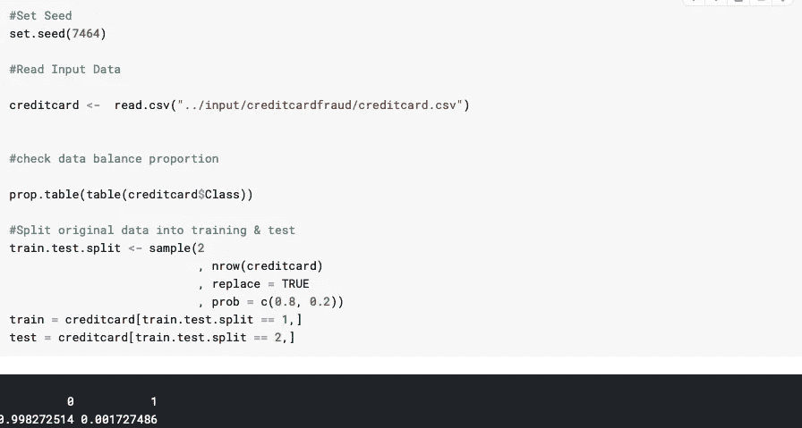***

***~99.83%% non-fraud transaction***

***Not much of EDA was performed since the data has been anonymized and doesn’t contain any explainable features except for Time (between transactions which cannot be used meaningfully in my opinion), Amount & Class.***

***So it was decided to directly get into training the model and to predict with the test set.***

***First, the model was trained and tested with original imbalance data to understand the performance.***

# ***Light GBM Parameters for Original Data***

> ***Parameter tuning or whole set of available parameters for Light GBM are not discussed here since it’s not in scope of this article***

***Selected “auc” as metric since confusion matrix may not be the right measure for accuracy for this dataset.***

***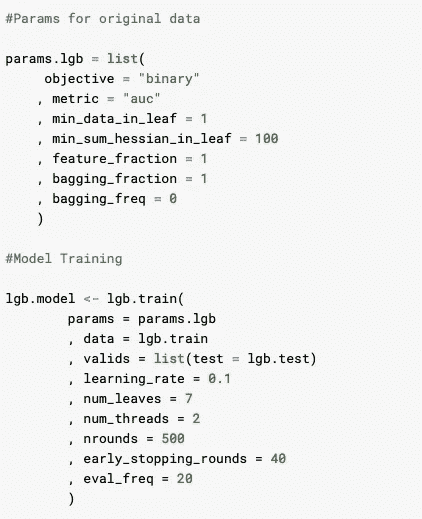***

***with simple parameter tuning, we were able to get 97.99% AUC with 13 features selected as important***

***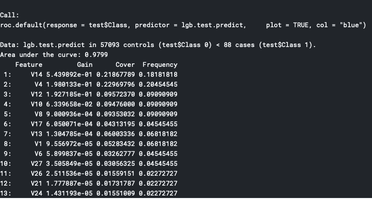***

***97.99% AUC with 13 features selected***

# ***Synthetic Minority Oversampling Technique (SMOTE)***

***是一种以平衡方式增加数据集中案例数量的统计技术。该模块通过从您作为输入提供的现有少数案例生成新实例来工作。新手可以阅读[这里](http://rikunert.com/SMOTE_explained)更好的理解。***

***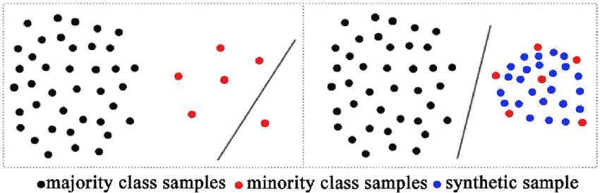***

***图片来自:[Advantages-SMOTE-Black-red-and-blue-dots-indicate-major-class-samples-minority . png](https://www.researchgate.net/publication/276039577/figure/fig1/AS:612936859000832@1523146943418/Advantages-of-SMOTE-Black-red-and-blue-dots-indicate-majority-class-samples-minority.png)***

# ***使用 SMOTE 技术创建数据***

***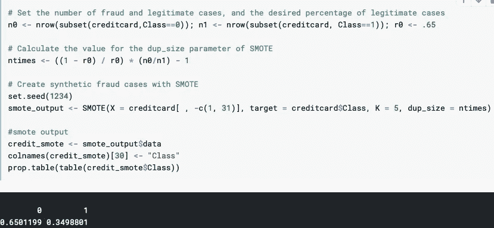***

***在上图中，代码的第一行表示，我们预计非欺诈交易数据占总交易的 65%，其余 35%为欺诈交易。***

***生成新的合成数据点后，数据集包含约 35%标记为欺诈的交易。实施 SMOTE 后，可以看到在实际欺诈交易附近生成了更多的合成数据。如果您已经看到了上面的代码行，我们选择了 K=5，这将解释新数据点集中在原始数据点周围的原因。***

# ***左:原始数据|右:SMOTE 数据***

***基于 SMOTE 数据的轻量级 GBM 参数和模型训练***

*********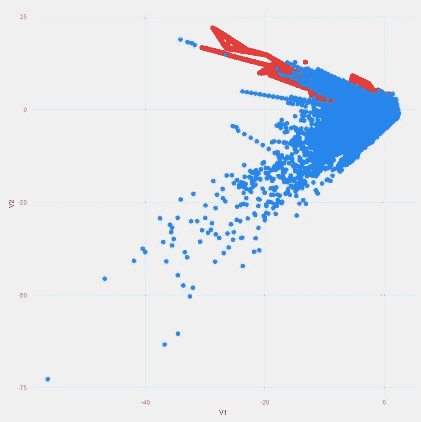

参数调整与用于提高 AUC 的原始数据略有不同。*** 

# ***“结果是 AUC 为 98.21%，最佳得分为 99.2%，7 个特征被捕获为重要特征，而原始数据为 13 个特征。”***

***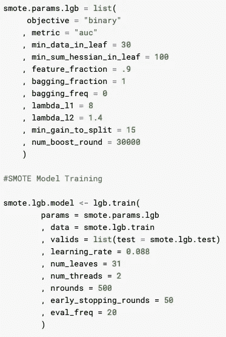***

***特征重要性比较***

***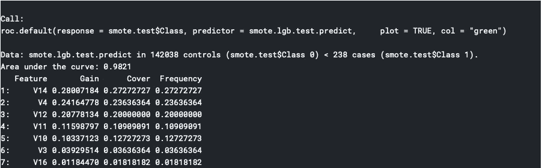***

> ***左:原始数据|右:SMOTE 数据***

# ***AUC、迭代和最佳分数的比较***

***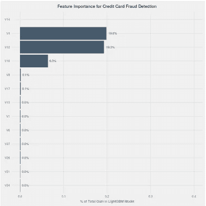******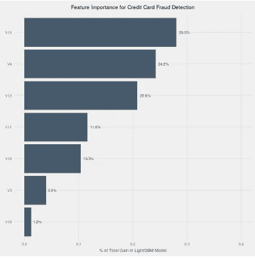

SMOTE 数据的最佳 AUC 评分为 99.2%对 98.2%*** 

# ***Comparison of AUC & Iteration & Best Score***

> ***The best AUC score for SMOTE data was 99.2% vs. 98.2%***

******