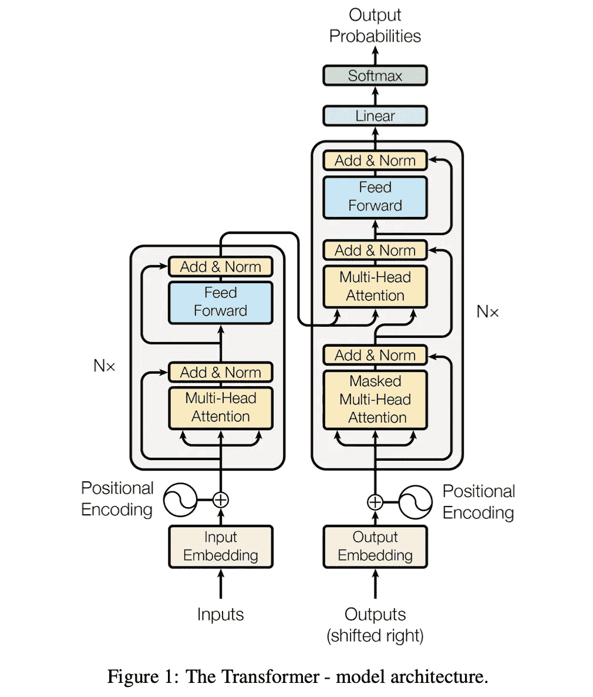

# 拥抱脸与天赋:比较“默认”情感分析管道

> 原文：<https://pub.towardsai.net/hugging-face-vs-flair-comparing-default-sentiment-analysis-pipelines-28d4d10e127f?source=collection_archive---------0----------------------->

## 使用 Transformer 的拥抱脸和天赋从零开始构建情感分析，以确定积极、消极和中立

由 Unsplash 的[附身摄影](https://unsplash.com/@possessedphotography)拍摄

# 变形金刚的拥抱脸

目前世界上最受欢迎的自然语言处理(NLP)库之一，基于注意力机制([免除递归和卷积](https://arxiv.org/pdf/1706.03762.pdf))，它提供了对大量强大模型的访问，以允许为 JAX、PyTorch 和 Tensorflow 构建 NLP 管道和最先进的机器学习。

专注于质量，同时更具并行性，需要更少的培训时间，它提供了无数(实际上是数千个)预训练模型来执行实施和任务，以支持您在各种形式上的用例，如视觉和音频，而不仅仅是文本。

转换器遵循这种整体架构，对编码器和解码器使用堆叠自关注和逐点全连接层，分别如图 1 的左半部分和右半部分所示。【https://bit.ly/3tinEw0 

一些应用包括:
—聊天机器人(intents)；
—垃圾邮件过滤；
—仇恨言论检测；还有
——社会科学

[Transformer 架构](https://arxiv.org/abs/1706.03762) [1]于 2017 年 6 月推出，主要关注对需要翻译的用例的原始研究。随后，新款上市，例如:

—2018 年 6 月:[第一个预训练的变压器模型 GPT](https://cdn.openai.com/research-covers/language-unsupervised/language_understanding_paper.pdf) 被用于在各种 NLP 任务上进行微调，并获得了最先进的结果；
—2018 年 10 月: [BERT](https://arxiv.org/abs/1810.04805) ，一个大型预训练模型，旨在产生更好的句子摘要；
—2019 年 2 月: [GPT-2](https://cdn.openai.com/better-language-models/language_models_are_unsupervised_multitask_learners.pdf) ，GPT 的改进型(也更大)；
—2019 年 10 月: [DistilBERT](https://arxiv.org/abs/1910.01108) ，速度快 60%，内存轻 40%，仍保留 97%的 BERT 性能的蒸馏版；
—2019 年 10 月: [BART](https://arxiv.org/abs/1910.13461) 和 [T5](https://arxiv.org/abs/1910.10683) ，两个使用与原变压器模型相同架构的大型预训练模型(第一个这么做的…)；
—2020 年 5 月， [GPT-3](https://arxiv.org/abs/2005.14165) ，GPT-2 的更大版本，无需微调(称为*零炮学习*)

# 天资

受解决神经语言建模和命名实体识别(NER)中的用例需求的启发，您可以将最先进的自然语言处理(NLP)模型应用于您的反馈(自由文本响应或评论)、NER、词性标注(PoS)、它们的“Flair 嵌入”、对各种嵌入的有效访问(例如 ELMo、GloVe)，同时 Flair 继续扩展到多种语言。

关于解决“再现性”的论文，(1)注意到在识别模型和只报告结果(但没有代码)的论文中再现性的一般无能，(2)注意到承诺发布但从未发布的代码，以及(3)注意到发布但“不可能”运行的代码，这是他们对再现性的“迫切需要”，以实现以下目标:

—快速设置(框架、数据集、模型)；
—模块化(易于理解什么做什么，易于切换组件，如用手套嵌入件替换 BERT 嵌入件)；
—适用于新的数据集/任务；和
—易于构建。

命名实体识别是一项任务，旨在定位非结构化文本中的命名实体并将其分类到预定义的类别中[2]，包括(但不限于取决于模型及其全面的深入研究)人名、位置或医疗代码。一般来说，NER 被视为单层序列标记问题[3]，其中每个标记都用一个标记来标记。

底线:它的基础反映了它的前提:( 1)易于复制的研究和(2)易于应用的研究。这些启发了开源 Flair 的开发，它是 PyTorch 生态系统的一部分。

# 第 1 部分:从头开始的实现管道

你可以在 Github 上找到我所有的代码:[https://bit.ly/3tfPiKj](https://bit.ly/3tfPiKj)

## 1.导入组类型。

完整的代码可以在这里找到:【https://bit.ly/3tfPiKj】T2

## 2.从 Kaggle 导入测试数据，并隔离十行进行实验。

2a。读取熊猫数据帧并检索信息()

完整的代码可以在这里找到:【https://bit.ly/3tfPiKj】T4

2b。隔离十行

完整的代码可以在这里找到:[https://bit.ly/3tfPiKj](https://bit.ly/3tfPiKj)

## 3.实施 Flair 并打印结果。

完整的代码可以在这里找到:[https://bit.ly/3tfPiKj](https://bit.ly/3tfPiKj)

## 4.实现拥抱脸和打印结果。

完整的代码可以在这里找到:[https://bit.ly/3tfPiKj](https://bit.ly/3tfPiKj)

## 5.重新组织列，依次堆叠天赋和拥抱脸预测，以便观察。

完整的代码可以在这里找到:[https://bit.ly/3tfPiKj](https://bit.ly/3tfPiKj)

# **第 2 部分:一些结果和后续步骤**

正如有成千上万的模型供您使用一样，这是事情变得有趣的地方，以便您最终决定使用什么模型。

有趣的是，即使对于这样一个简单的数据集，我们也注意到上面的***Id = 28***with Flair 预测它为正面，而拥抱脸为负面。请注意置信度得分的差异。

ID # 28 的语句如下:

> “我很高兴亚马逊有这些电池。我很难在其他地方找到它们，因为它们是如此独特的尺寸。我的车库开门器需要它们。物超所值。”
> 
> Flair 的预测(默认管道):**正**
> 抱紧脸预测(默认管道):**负**

重要的是要声明，我按照默认模型的代码激活了默认管道。例如，上面代码中激活的拥抱脸的默认管道模型是“***”distil bert-base-un cased-fine tuned-SST-2-English，“*** 一个更小更快版本的 BERT，具有来自斯坦福情感树银行的英语数据集。由于这是默认的模型参数，我们不需要在代码中显式调用它。

从这里开始，接下来的步骤有很多方法，我们可以通过这些方法构建一个具体的模型和具体的记号化器，并替换这个默认参数。自动化、简单性和最少的编码量肯定有很大的好处，这样我们可以快速激活模型，进行分析，并获得评估结果，从而得出结论性的结果。

当超越这种自动化或快速输出管道实现时，机会变得无穷无尽，特别是像 Hugging Face 以编程方式倡导的那样，它允许在 NLP 管道内开箱即用地轻松替换和自定义激活各种模型，以获得自定义的、更精确的、策划的结果。

已经有非常成功的定向情绪确定的实现，例如，您可以激活 Flair 或拥抱脸来确定该情绪(简单地是积极的、消极的或中性的)，引入 TextBlob(例如)来激活关于 ***该情绪有多积极或有多消极*** 的预测(由 Flair 和/或拥抱脸确定)，并通过情绪的大小进行排序。我创作了一个有效的用例，在员工体验洞察中被成功激活；该出版物可在此处找到:

 [## 事实上，你需要所有 3 对 1 的结果:NLP 情绪分析与 VADER，文本和天赋

### 整合 VADER、文本斑点和天赋来测量情绪和他们的感伤程度，以更准确地量化…

medium.com](https://medium.com/@AnilTilbe/actually-you-need-all-3-for-1-outcome-nlp-sentiment-analysis-with-vader-textblob-and-flair-51226744a05e) 

在一个特定的用例中，我觉得我必须使用基于我对各种模型的情感评估的天赋。为了让你了解这种情况，我需要分析 80，000 条自由文本评论，确定它们的情绪(天赋)，并通过 TextBlob 对它们的量化程度进行排序。我还使用 VADER 作为 TextBlob 的参考来评估 TextBlob 在“中性”范围内的表现。对于大小为 80k 的数据，使用特定 Flair 管道的设备，需要近 4 个小时来完成情绪管道确定(2015 年，双核 pc，可以说是通知此类工作最低效的笔记本电脑)。TextBlob 本身耗时约 180 秒(同一台 PC)。同样，成本效益、时间限制和我们工作的绝对性。

关于 TextBlob，特别是我之前在数据科学中如何引用它，下面是我撰写的一篇解决该问题的出版物:

 [## 如何量化情感以测量量级:使用 TextBlob 的 NLP

### 作为确定某事是积极还是消极的一部分，构建一个分析实现可能会很方便…

medium.com](https://medium.com/mlearning-ai/how-to-quantify-sentiment-to-measure-magnitude-nlp-with-textblob-27861559f7a5) 

我之所以特别提到 TextBlob，是因为除了准确性之外，我们还使用各种技术设备来进行预期的分析(比如源自云的 GPU，而不仅仅是您实际拥有的东西)。随着时间的限制，当我们没有几周或几个月的时间来确定最有效的模型来实现我们所寻求的特定类型的精度和/或准确性时，我发现非常有益的是，我可以求助于 VADER 和 TextBlob，同时与其他管道并行工作，在其允许的定制中进行短期和长期管道激活。

[1]:莫日德·盖尼、任翔和乔纳森·梅。2021.你所需要的就是交叉注意力:为机器翻译调整预训练的变压器。在*2021 年自然语言处理经验方法会议记录*，1754-1765 页，在线和多米尼加共和国蓬塔卡纳。计算语言学协会。
【2】:瓦斯瓦尼、阿希什&沙泽尔、诺姆&帕尔马、尼基&乌斯科雷特、雅各布&琼斯、利翁&戈麦斯、艾丹&凯泽、卢卡什&波洛舒欣、伊利亚、[《注意力就是你需要的一切》](https://arxiv.org/pdf/1706.03762.pdf)，2017。艾伦·阿克比克、塔尼亚·博格曼、邓肯·布莱思、卡希夫·拉苏尔、斯特凡·施韦特和罗兰·沃尔格拉夫。2019.FLAIR:一个易于使用的框架，用于最先进的 NLP。在*计算语言学协会北美分会 2019 年会议记录(示范)*中，第 54-59 页，明尼苏达州明尼阿波利斯。计算语言学协会。

flair Github:[https://github.com/flairNLP/flair](https://github.com/flairNLP/flair)
抱脸 Github:[https://github.com/huggingface/transformers](https://github.com/huggingface/transformers)
我的 Github 此代码发布的地方:[https://bit.ly/3tfPiKj](https://bit.ly/3tfPiKj)