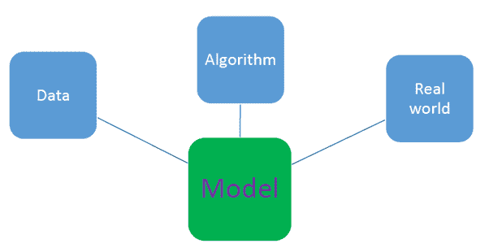

# 机器学习中的人的因素

> 原文：<https://pub.towardsai.net/human-component-in-machine-learning-2c8c990c77b1?source=collection_archive---------4----------------------->

## [数据科学](https://towardsai.net/p/category/data-science)，[机器学习](https://towardsai.net/p/category/machine-learning)

## 随着机器学习的自动化，人类仍然是在数据、算法和现实世界之间建立联系不可或缺的

照片由[安迪·凯利](https://unsplash.com/@askkell?utm_source=medium&utm_medium=referral)在 [Unsplash](https://unsplash.com?utm_source=medium&utm_medium=referral) 上拍摄

# 一.导言

随着自动化在机器学习领域越来越受欢迎，人们可能会想，人类在机器学习中的作用是否会在某个时候变得不重要。

在建立机器学习模型时，重要的是要记住，模型必须在现实生活中产生有意义和可解释的结果。这就是人类经验的用武之地。人类(合格的数据科学专业人员)必须检查算法和计算机产生的结果，以确保结果与现实世界的情况一致，然后才能推荐部署模型。随着机器学习的自动化，人类仍然是在数据、算法和现实世界之间建立联系不可或缺的。

在本文中，我们将讨论机器学习模型的 3 个基本组件，即:1)数据组件，2)算法组件，3)现实世界组件。最后，我们将检查人类(合格的数据科学专家)扮演的各种角色，以确保机器学习模型的 3 个组件以有意义和有益的方式相互交互。

# 二。机器学习模型的基本组件综述

机器学习模型有 3 个基本组成部分，如下图所示。

机器学习模型的三个基本组成部分。Benjamin O. Tayo 的图片

## 1.数据成份

该组件包含有关数据的所有内容，包括以下内容:

**i)数据来源**

本节涉及所有数据来源，例如

a)收集数据的实验或调查设计

b)从挖掘和存储大型数据集的组织购买数据

c)开放数据集的使用

d)模拟原始数据以将其与实际采样数据相结合

**ii)数据准备和转换**

它处理预处理原始数据，将其转换为可用于分析或模型构建的形式，包括以下主题

a)处理缺失数据

b)数据插补

c)编码分类数据

d)预测器特征和目标特征的识别

e)数据缩放，例如，特征标准化或规范化

f)特征选择和降维

g)先进的数据转换方法，如 PCA 和 LDA

可用于数据准备和转换的软件包括

*   熊猫套餐
*   擅长
*   稀有
*   计算机编程语言

## 2.算法组件

这些是应用于数据的算法，目的是从数据中获取有用且有洞察力的信息。这些算法可以分为描述性的、预测性的或规范性的。

**i)用于描述性分析的算法**

其中包括可应用于可视化数据的软件包，例如，生成条形图、线图、直方图、散点图、配对图、密度图、QQ 图等的算法。一些最常见的描述性分析包包括

a) Matplotlib

b) Ggplot2

c) Seaborn

**ii)预测分析算法**

这些是用于建立预测模型的算法。一些最常见的预测分析包包括

*   Sci-kit 学习包
*   插入符号包
*   张量流

预测分析算法可以进一步分为以下几组:

**a)监督学习(连续变量预测)**

*   基本回归
*   多元回归分析
*   正则回归

**b)监督学习(离散变量预测)**

*   逻辑回归分类器
*   支持向量机分类器
*   k 近邻(KNN)分类器
*   朴素贝叶斯
*   决策树分类器
*   随机森林分类器

**c)无监督学习**

*   Kmeans 聚类算法

**iii)用于规定分析的算法**

这些算法可用于根据从数据中获得的见解来指定活动的疗程。一些规定的分析算法包括

a)概率建模

c)优化方法和运筹学

c)蒙特卡罗模拟

## 3.真实世界组件

每个机器学习模型都必须在现实生活中产生有意义和可解释的结果。预测模型必须根据实际情况进行验证，才能被认为是有意义和有用的。因此，人类的输入和经验对于理解算法产生的结果总是必要和有益的。

# 三。分析建模中的人的因素

随着机器学习的自动化，人类仍然是在数据、算法和现实世界之间建立联系不可或缺的。在本节中，我们将讨论人类数据科学家在连接上面已经讨论过的机器学习模型的 3 个基本组件时所扮演的角色。

**a)检查数据的质量和可靠性**

数据是任何数据科学和机器学习任务的关键。数据有不同的形式，如数字数据、分类数据、文本数据、图像数据、语音数据和视频数据。 ***模型的预测能力取决于建立模型所用数据的质量*** 。因此，在将数据输入模型之前，由合格的专业人员检查数据的质量和可靠性是极其重要的，因为即使看起来完美的数据集也可能包含错误。有几个因素会降低数据的质量:

*   错误数据
*   缺失数据
*   数据中的异常值
*   数据冗余
*   不平衡数据
*   数据缺乏可变性
*   动态数据
*   数据的大小

欲了解更多信息，请参阅以下文章:[数据总是不完美的。](https://medium.com/towards-artificial-intelligence/data-is-always-imperfect-8611d667dd10)

**b)检查所用算法的类型和质量**

因为有几种不同类型的机器学习算法，合格的专业人员必须检查以确保选择使用的算法是合适的，并且是最佳的。因此，合格的专业人员必须评估算法的输出，以确定输出中的误差和不确定性水平。

**c)确保实施道德标准**

在数据科学和机器学习中，道德和隐私考虑是必须的。需要一名合格的专业人员来确保机器学习模型中使用的数据和算法不会故意在结果中产生偏差。从数据收集到分析，再到模型构建、测试和应用，在所有阶段都必须坚持道德标准。必须注意避免为了误导或操纵客户或公众而捏造结果。

**d)确保产出有益于公众**

作为这里的一个案例研究，机器学习模型可以用来设计活性化学成分，用于制造对抗某种疾病的疫苗。在这种情况下，将需要合格的人员通过进行临床试验来评估疫苗的效力，以确保疫苗是安全和准确的。

# 四。摘要

总之，我们已经讨论了在机器学习的自动化时代，人类(合格的数据科学专业人员)仍然不可或缺的几个原因。随着自动化在机器学习中越来越普及，人类仍将是不可或缺的，以建立数据、算法和现实世界之间的联系，并确保机器学习中的道德标准保持在较高水平。