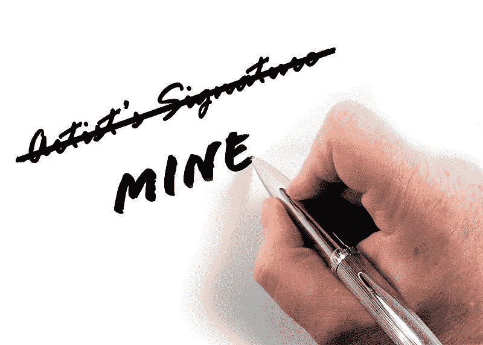
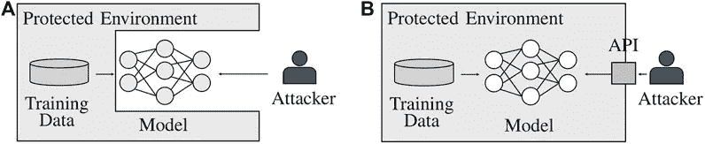
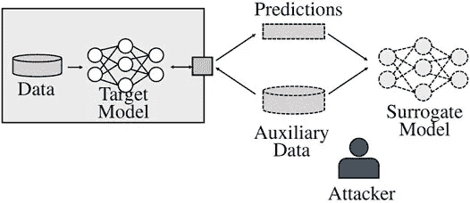
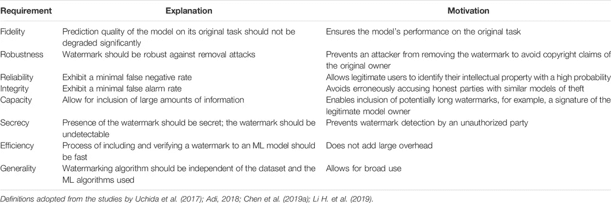

# OpenAI 正在给 GPT 加水印:不再抄袭

> 原文：<https://pub.towardsai.net/human-vs-gpt-methods-to-watermark-gpt-models-e23aefc63db8?source=collection_archive---------0----------------------->

在过去的几周里，GPT 三号、ChatGPT 和 InstructGPT 在互联网上掀起了一阵风暴。大语言模型(LLM)和变压器语言模型(TLM)在“创建”AI 生成的代码(OpenAI Codex)、AI 生成的文本(OpenAI GPT、ChatGPT、InstructGPT)、AI 生成的图像(OpenAI DALL-E)、甚至 AI 生成的 AI 模型(还没有！但是等一下)。这些模型一直在生成类似人类的输出，与真实的人类输出难以区分。

来源: [Pixabay (cc)](https://commons.wikimedia.org/wiki/File:Plagiarism_signature.jpg)

## 目前实施 GPT-3 / ChatGPT 的问题

GPT(或任何其他 LLM)可以用来在社交网络上创建类似人类的机器人。这些机器人可以被调整以生成有偏见的文本，从而引发真实人类的预期反应。下一个邪恶的逻辑步骤是生成这些模型，这些模型可以被调整为生成假新闻文章，以大规模传播虚假信息。其他新时代的问题是防止剽窃、为定性研究生成虚假研究数据、为学校作业生成论文等。

> U 唱出深度假唱、语音合成器和先进的人工智能文本生成的组合，政治演员可以试图诋毁他们的对手。——[来源](https://xnv.io/potential-uses-and-misuses-for-gpt-3/)

## “这是我的”证明知识产权

机器学习模型正变得越来越复杂。这些模型计算量大，使用大量数据。这些复杂的模型被认为是训练它们的人的知识产权。为了避免误用大型模型，我们需要一种机制来证明文本、艺术、新闻或其他任何东西的来源。识别未经授权的使用为被称为“数字水印”的概念打开了大门。

## 数字水印

> 数字水印是一种将信息嵌入到数字信号中的方法，这种方法很难去除，但可以被检测到。此信息可用于识别数字信号的来源，或防止未经授权的复制或篡改。数字水印通常用于保护数字媒体(如图像、音频或视频)的版权。—来源 ChatGPT

## 未经授权使用 ML 模型的媒介是什么

A.攻击者可以获得模型和重量

B.模型端点(API)被黑客攻击以无限制地访问模型

C.模型提取，攻击者使用模型来标记未标记的数据并生成代理模型

来源:[研究论文](https://www.frontiersin.org/articles/10.3389/fdata.2021.729663/full)

ML 模型的访问场景。(A)白盒设置允许攻击者完全访问模型及其所有参数，但(不一定)访问模型的训练数据。(B)在黑盒场景中，攻击者不能直接访问模型，而是通过应用程序编程接口(API)与之交互。

来源:[研究论文](https://www.frontiersin.org/articles/10.3389/fdata.2021.729663/full)

模型提取攻击的过程。攻击者持有来自与目标模型的训练数据相似的分布的辅助数据。通过查询访问，攻击者获得辅助数据的相应标签。基于该数据和标签，可以训练代理模型，该代理模型展示出与原始模型相似的功能。

 [## OpenAI 发布嵌入模型:text-embedding-ada-002

### 它功能强大、更便宜、更灵活！

ithinkbot.com](https://ithinkbot.com/openai-releases-embeddings-ai-3380dacfa3c5) 

## 对水印技术的要求

在过去的几年里，不同的团体已经制定了一些这样的要求( [Uchida 等人，2017](https://www.frontiersin.org/articles/10.3389/fdata.2021.729663/full#B51)；[阿迪，2018](https://www.frontiersin.org/articles/10.3389/fdata.2021.729663/full#B1)；[陈等，2019 a](https://www.frontiersin.org/articles/10.3389/fdata.2021.729663/full#B8)；[李 h 等，2019](https://www.frontiersin.org/articles/10.3389/fdata.2021.729663/full#B26) 。下面是上述系统综述的一个快速截图。

## 水印技术的类别

1.  **将水印嵌入到模型参数:**这些方法包括由[宋等人(2017)](https://www.frontiersin.org/articles/10.3389/fdata.2021.729663/full#B47) 提出的方法，该方法提出将关于训练数据的信息包括到模型参数中，【内田】等人(2017) 通过使用具有 T 比特串的显式水印串来扩展该方法，[王等人(2020)](https://www.frontiersin.org/articles/10.3389/fdata.2021.729663/full#B53) 通过开发嵌入参数 *X* 的替代方案来扩展该工作。， [Wang 和 Kerschbaum (2019)](https://www.frontiersin.org/articles/10.3389/fdata.2021.729663/full#B55) 提出了一种基于生成对抗网络(GANs)在白盒环境下生成不可检测水印的策略。，以及[范等(2019)](https://www.frontiersin.org/articles/10.3389/fdata.2021.729663/full#B13) 建议将*带数字签名的护照图层*嵌入 NNs 进行权属验证。最近， [Shafi 和 Vinod](https://arxiv.org/abs/2204.06974) 提出了一个密码学上不可检测的后门模型。
2.  **使用预定义的输入作为触发器:**这些包括由 [Le Merrer 等人(2020)](https://www.frontiersin.org/articles/10.3389/fdata.2021.729663/full#B24) 提出的方法，通过敌对再训练轻微移动决策边界，直接标记模型的动作本身，以便特定查询可以利用它。、【阿迪(2018) 、[张等(2018)](https://www.frontiersin.org/articles/10.3389/fdata.2021.729663/full#B60) 从密码学角度考虑水印。， [Rouhani et al. (2018a)](https://www.frontiersin.org/articles/10.3389/fdata.2021.729663/full#B40) 开发了一种方法，将水印作为一个 *T* 位串包含在不同网络层获得的数据抽象的概率密度函数( *pdf* )中， [Chen et al. (2019b)](https://www.frontiersin.org/articles/10.3389/fdata.2021.729663/full#B9) 提出将模型所有者的二进制签名作为神经网络的水印。
3.  **基于原始训练数据触发数据集创建:** [郭和 pot 魔芋(2018)](https://www.frontiersin.org/articles/10.3389/fdata.2021.729663/full#B15) ，[张等(2018)](https://www.frontiersin.org/articles/10.3389/fdata.2021.729663/full#B60) 描述了利用远程黑盒验证机制对用于图像分类的神经网络进行水印的算法。 [Sakazawa 等人(2019)](https://www.frontiersin.org/articles/10.3389/fdata.2021.729663/full#B43) 提出了对神经网络中的水印进行累积和可视化解码，这样嵌入到训练数据中的模式可以变得可视化，以供第三方认证。
4.  **鲁棒水印:**鲁棒水印不依赖单一方法来水印。这些避免了蒸馏攻击，如[paper not et al .](https://www.frontiersin.org/articles/10.3389/fdata.2021.729663/full#B39)和 [Yang et al. (2019)](https://www.frontiersin.org/articles/10.3389/fdata.2021.729663/full#B59) 所提出的。[贾等人(2021)](https://www.frontiersin.org/articles/10.3389/fdata.2021.729663/full#B22) 提出了一个类似的想法，依赖于“纠缠水印嵌入”纠缠被用于使模型提取代表原始任务的数据和编码水印并源于不同分布的数据的共同特征。[纳姆巴和佐久法史(2019)](https://www.frontiersin.org/articles/10.3389/fdata.2021.729663/full#B34) 描述了一种他们称之为“指数加权”的方法他们通过从训练分布中随机采样并为该样本分配错误的标签进行训练来生成水印触发器。 [Li H. et al. (2019)](https://www.frontiersin.org/articles/10.3389/fdata.2021.729663/full#B26) 开发了一种“零嵌入”，用于将水印包含到模型的初始训练中，使得攻击者无法移除它们或在顶部包含他们自己的水印。
5.  **唯一水印:** [陈等(2019a)](https://www.frontiersin.org/articles/10.3389/fdata.2021.729663/full#B8) 提出了一种面向白盒设置的端到端共谋安全水印框架。[徐等(2019)](https://www.frontiersin.org/articles/10.3389/fdata.2021.729663/full#B57) 在 NNs 中嵌入序列号，用于车型所有权识别。
6.  **指纹图谱:** [赵等(2020)](https://www.frontiersin.org/articles/10.3389/fdata.2021.729663/full#B61) 用对立的例子作为阻断可转移性的 NNs 的指纹图谱。 [Lukas et al. (2019)](https://www.frontiersin.org/articles/10.3389/fdata.2021.729663/full#B32) 为了验证 ML 模型的所有权，还利用了对抗性例子的可转移性。

 [## OpenAI 刚刚发布了 GPT-3 文本-达芬奇-003，我把它和 002 进行了对比。结果令人印象深刻！

### OpenAI GPT-3 文本-达芬奇-003 产生更好的质量结果(写作质量，格式，语法，和被…

ithinkbot.com](https://ithinkbot.com/openai-just-released-gpt-3-text-davinci-003-i-compared-it-with-002-the-results-are-impressive-dced9aed0cba) 

## OpenAI 是否实现了任何保护模型的方法？是

虽然 OpenAI 对安全功能保持沉默，但他们正在努力保护他们价值数十亿美元的知识产权。Scott Aaronson 已经证实 OpenAI 正在进行一些实现。核心问题是，对日常用户来说，重要的是这些系统将能够知道相对于其他系统的 GPT 输出。OpenAI 发现，在 175 亿个标记中，只需要大约 10 万个标记就可以创建一个足够强的签名，从而可以识别文本的来源。

对于一个普通用户来说，随机和伪随机之间的区别是察觉不到的。然而，在几个 n-gram 的输出签名上，模型将能够拾取识别模型所有者的模式。OpenAI 已经有了工作原型，它可能会部署在 GPT4 的下一个版本中。鉴于 2023 年 2 月的某个时候发布的时间表，在 GPT 4 之前不太可能会有 GPT 3.6。

 [## 什么是 GPT-4(什么时候？)

### GPT-4 是一个自然语言处理模型，由 openAI 作为 GPT-3 的继承者开发

pub.towardsai.net](/what-is-gpt-4-and-when-9f5073f25a6d) 

## 水印是不是万无一失？

不是很好，但是很好。人们可以使用 GPT 模型生成输出，然后使用另一个模型改写输出。替换几个单词仍然有可能保持 GPT、ChatGPT 和 InstructGPT 生成的文本中的签名。类似的实现可以部署在 DALL-E 模型中，称为[剪辑表示](https://www.assemblyai.com/blog/how-dall-e-2-actually-works/)。然而，鉴于 DALL-E 中的数据表示是像素格式，它具有更高的复杂性和不同的最终用户考虑。从这个角度来说，水印是一个通用的概念，可以用在所有深度神经网络中。网络的深度越浅，就越容易去除或逃避水印。使用一组单独的节点进行“标记”的水印技术也相对容易移除。

最有可能的是，证明知识产权的滥用和盗窃是一项艰巨的任务，需要盗窃者生成大量的输出来证明知识产权是被犯罪者盗窃和复制的。无论如何，在学校里要证明一个学生剽窃了一些文章是非常困难的。在短期内，我预计水印将在保护大规模部署、法律文件、科学期刊和其他深度神经网络的大型商业用例中流行。

## 结束语

我们在人工智能中听到很多关于伦理的说法。这是一个模糊的概念。但是 IP 更具体。人工智能中的知识产权监管与人工智能本身一样重要。它需要一个具体的框架。密码学、人工智能和知识产权保护领域的专家所做的研究对于保护一个潜在的万亿美元产业来说是非常宝贵的。

声明:当我阅读和写这篇文章时，我还在学习这一切。

***引用合并***

1.  **GPT-3 的几种潜在用途(和误用)**
2.  *[*https://scottaaronson.blog/?m=202211*](https://scottaaronson.blog/?m=202211)*斯科特·阿伦森的博客**
3.  *[*推特帖子*](https://twitter.com/krebs_adrian/status/1600430135919882242?cxt=HHwWhMCttdWu77UsAAAA) *作者阿德里安·克雷布斯**
4.  *[*阿迪(2018)*](https://www.frontiersin.org/articles/10.3389/fdata.2021.729663/full#B1)*
5.  *[*刘等 2018*](https://www.frontiersin.org/articles/10.3389/fdata.2021.729663/full#B30)*
6.  **模型参数嵌入水印:* [*宋等(2017*](https://www.frontiersin.org/articles/10.3389/fdata.2021.729663/full#B47) *)**
7.  *[*Uchida 等(2017)*](https://www.frontiersin.org/articles/10.3389/fdata.2021.729663/full#B51)*NNs 中第一个显式水印方案。**
8.  *[*王等(2020)*](https://www.frontiersin.org/articles/10.3389/fdata.2021.729663/full#B53) *提出了嵌入参数 x 的替代方案**
9.  *[*王和 Kerschbaum (2018)*](https://www.frontiersin.org/articles/10.3389/fdata.2021.729663/full#B54) *表明这些方法都不满足保密要求。**
10.  *[*Wang and Kerschbaum(2019)*](https://www.frontiersin.org/articles/10.3389/fdata.2021.729663/full#B55)*基于生成对抗网络(GANs)在白盒设置中创建不可检测水印的策略。**
11.  *[*范等(2019)*](https://www.frontiersin.org/articles/10.3389/fdata.2021.729663/full#B13) *将带有数字签名的护照图层嵌入 NNs 进行权属验证。**
12.  *[*Le Merrer 等人(2020)*](https://www.frontiersin.org/articles/10.3389/fdata.2021.729663/full#B24) *通过对抗性再训练稍微移动决策边界，直接标记模型的动作本身，以便特定查询可以利用它。**

*支持我🔔 ***鼓掌*** | ***跟随|*** [***订阅***](https://ithinkbot.com/subscribe)***|***[***成为会员***](https://ithinkbot.com/membership) **🔔***

*检查我的其他作品—*

* [## GitHub CoPilot 遭遇第二起诉讼

### 第二次集体诉讼已于 11 月 10 日提交

ithinkbot.com](https://ithinkbot.com/github-copilot-hit-with-2nd-lawsuit-ed537c0b2c9a)  [## 谈判的艺术:西塞罗·艾

### 西塞罗·艾在外交的游戏中比人类更能谈判。就像深蓝代表国际象棋，五号代表…

pub.towardsai.net](/the-art-of-negotiation-cicero-ai-6e04354fe990)  [## 人工智能中的领导力:你的领导力适合数据科学吗？

### 可能已经转变为数据科学领导的非技术人员领导通常不熟悉…

pub.towardsai.net](/leadership-in-ai-is-your-leadership-fit-for-datascience-d0e9296be2d6)*