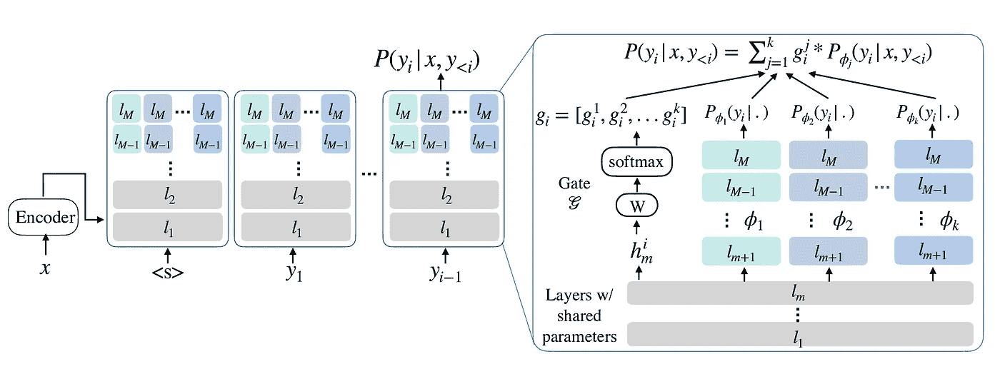
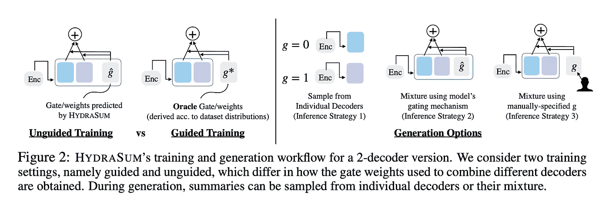
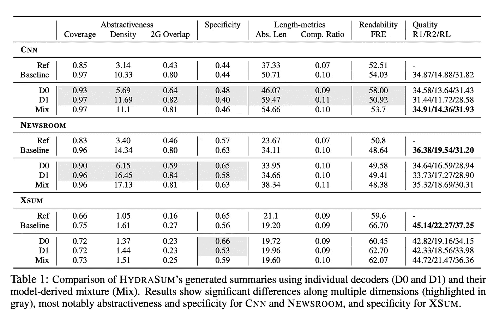
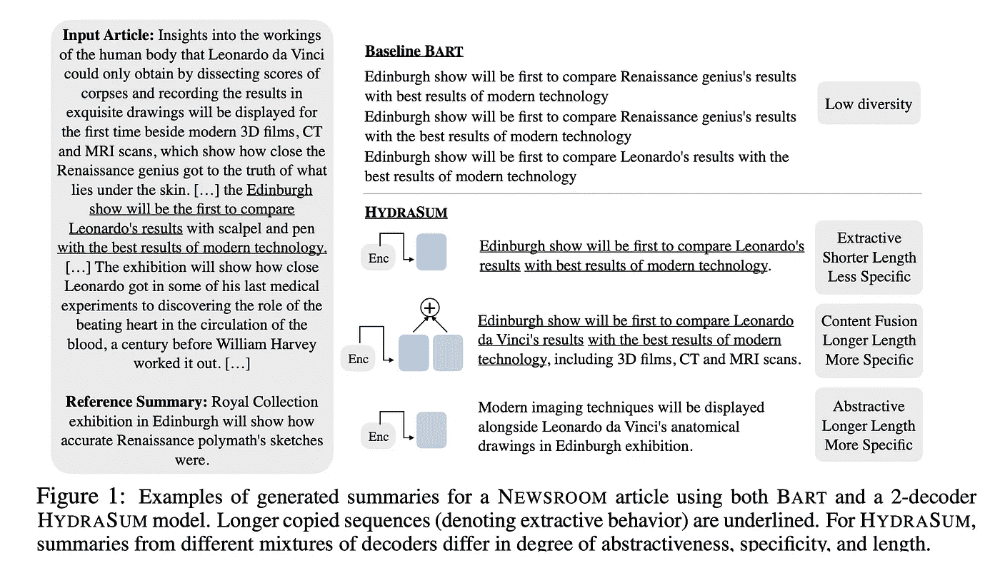

# HydraSum:解开文本摘要中的文体特征…(论文综述/描述)

> 原文：<https://pub.towardsai.net/hydrasum-disentangling-stylistic-features-in-text-summarization-paper-review-described-a885dd501f06?source=collection_archive---------4----------------------->

*有没有可能用 transformer 架构训练一个模型来学习生成不同风格的摘要？*

图一。多解码器架构方案。(图片来自[1])

虽然深度学习(特别是 transformer architecture)确实不断推高 SOTA 分数，但它们有一个明显的缺点。不，我不是在说它们的内存使用情况！我们知道如何训练他们，但我们无法控制他们将**学到什么。例如，控制输出设置*长度*或*样式*是文本摘要模型中缺少的特性。让我们看看我们能做些什么…**

# 本文想解决什么问题？

本文主要关注文本摘要任务，并试图给模型的最终用户一种控制预测的感觉。他们特别提出了一种控制抽象性和特殊性的方法。它使用多解码器架构，其中每个解码器将捕获数据集的风格特征。该模型使用解码器输出的加权平均值(称为 gate)来生成具有特定风格的摘要。

# 贡献

本文通过一个 *k* 解码器架构探索了上述想法，其中前 *m* 层的参数在 *k* 解码器之间共享，其中 *k=2* 和 *m=8。(图 1)* 还有一个门控机制( *g* )，基本上是 *k* 解码器输出的加权和。上述共享层的输出将被传递给前馈层+ softmax 以分配权重。现在，我们来看看在**训练**和**推理**过程中它是如何工作的。

## 培养

他们提出了两种方法来研究设置门机制权重的不同方式。(图 2)值得注意的是，学习目标通常是最小化交叉熵损失。

*   *:让模型在训练时决定最优权重，以达到每个解码器对最终摘要的最优贡献。我们将通过模型优化固定权重 g 和 1-g。*
*   ****引导*** :这种方法需要多加注意，因为作者需要精选大量样本(我找不到他们用了多少样本！)并手动分配权重。例如，如果我们希望解码器**从输入中学习复制/粘贴**，我们可以选择摘要中有大量文章常用词的样本。然后，我们将为第一个解码器的输出分配更高的权重，以推动第一个解码器学习上述特征。*

## *推理*

*作者尝试用不同的组合对输出进行采样。(图 2)*

*   ****单独解码器*** :表示只关注一个解码器。按照相同的复制/粘贴示例，用户可以将 1 分配给第一个解码器(因此，将 0 分配给其余的解码器)，以获得摘要来加强提取性。*
*   ****混合*** :让*型号*决定！显然，只有当我们使用非制导方法训练模型时，它才是可访问的。*
*   ****手动混合*** :让*用户*决定！用户可以混合不同的风格，以获得更理想的输出。例如，如果第一个解码器学习了复制/粘贴风格，而第二个解码器学习了释义。可以更强调解释像[0.3，0.7]这样的旁路权重。*

**

*图二。左图)引导式与非引导式训练方法；对)不同的推断方法。(图片来自[1])*

# *结果*

*作者做了一个很好的分析来说明不同的解码器会学习不同的风格。他们在抽象性、特异性、长度、可读性和质量(ROUGE)等指标上对这些方法进行了比较。如果你感兴趣的话，我推荐你去读这篇文章的“结果”部分，因为我不会涵盖所有的观点。*

**

*图 3。结果表根据上述指标比较了单个和混合解码器。(图片来自[1])*

*本文详细介绍了每一列及其含义。例如，可以看出，第一(D0)和第二(D1)解码器在捕捉 XSum 数据集中的抽象性方面没有不同。有人认为，数据集的性质会严重影响这种方法。此外，很明显，解码器的混合比单个解码器执行得更好，因为每个解码器学习最适合某些样本而不是整个数据集的风格。如图 3 所示，您可以看到使用单个解码器和它们的组合生成的摘要示例。第一个解码器(蓝色)专注于预测简短的 extravice(从文章中复制短语)摘要，而第二个解码器可以编写较长的抽象(模型使用自己的单词)输出。这两个解码器的组合将生成一个具有两种特征的摘要！*

**

*图 3。展示单个和混合解码器的功能。(图片来自[1])*

*对我来说，论文中最后一个有趣的发现是，他们表明独立训练解码器并在推理过程中混合它们以生成不同风格的文本是可能的。*

*附录中有附加实验，使用 3 解码器架构和不同数量的共享层，即 6 层和 10 层。以及与基线(BART)相比更倾向于 HydraSum 汇总的**人工评估**流程。*

# *最后的话，*

*作者使用了一个简单的想法来添加对生成的摘要的风格特征的控制。我不认为这种方法会成为文本摘要的新标准，仅仅因为我们在网络中增加的参数数量会增加内存的使用！但是，我相信这是一个很好的起点。*

> *我每周给 NLP 的书呆子发一份时事通讯。如果您想了解自然语言处理的最新发展，可以考虑订阅。
> [阅读更多，订阅](https://nlpiation.github.io/) —加入酷孩子俱乐部，立即报名！*

## *参考*

*[1]t . Goyal，n . f . Rajani，刘，w .，& kry ciński，W. (2021)。HydraSum:使用多解码器模型解开文本摘要中的风格特征。arXiv 预印本 arXiv:2110.04400。*