# 超参数:机器学习中的 RandomSeachCV 和 GridSearchCV

> 原文：<https://pub.towardsai.net/hyper-parameters-randomseachcv-and-gridsearchcv-in-machine-learning-b7d091cf56f4?source=collection_archive---------1----------------------->

## [深度学习](https://towardsai.net/p/category/machine-learning/deep-learning)

## 提高算法精确度的技术

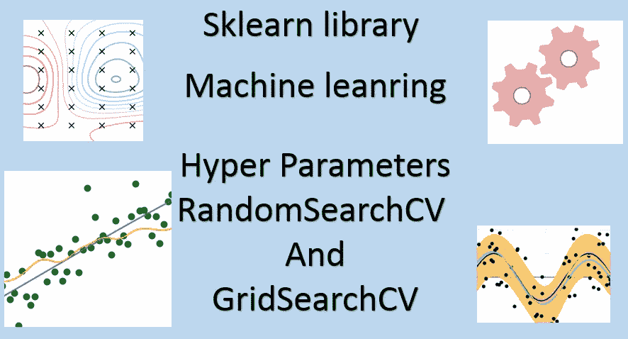

作者的照片

> ***超参数调谐***

在本文中，我们将讨论超参数调优。当我们谈论提高机器和深度学习模型的准确性时，我们首先想到的是调整参数。

> ***要涵盖的主题***

```
1\. What is hyper-parameter tuning?
2\. Why do we need hyper-parameter tuning?
3\. Hyper-parameter Types
4\. Techniques of hyper-parameter tuning
   a. GridSearchCV
   b. RandomizedSearchCV
5\. Bayesian Optimization -Automate Hyper-parameter Tuning(Hyper-
   optimization)
```

> ***什么是超参数调谐？***

“超参数调整就是为学习算法选择一组最优的超参数”。我们对不同的机器学习模型使用不同的输入参数。这些输入参数被命名为**超参数**或超参数，其值用于控制学习过程。超参数是可以在模型中更改以获得最合适值的参数。例如，我们决定选择隐藏层和每层中节点的数量。模型性能在很大程度上取决于超参数。**超参数整定**也称为**超参数优化。**

不同模型中不同类型的超参数技术

*   决策树的最大深度
*   随机森林中的树木数量
*   K 中的 K-最近邻
*   梯度下降中的学习速率
*   支持向量机中的 c 和 sigma
*   逻辑回归分类器中的惩罚，即 L1 或 L2 正则化
*   训练神经网络的学习速率

[](/fully-explained-k-nearest-neighbors-with-python-ebbe27f93ba9) [## 用 Python 完整解释 K 近邻

### 数据科学中解决真实案例的机器学习分类算法研究。

pub.towardsai.net](/fully-explained-k-nearest-neighbors-with-python-ebbe27f93ba9) [](/regression-and-classification-metrics-in-machine-learning-with-python-6d9fcd8b73aa) [## Python 机器学习中的回归和分类度量

### 使用度量 API 进行回归和分类的模型评估

pub.towardsai.net](/regression-and-classification-metrics-in-machine-learning-with-python-6d9fcd8b73aa) 

> ***我们为什么需要超参数调优？***

超参数调整的主要目的是获得建模中使用的所有参数的优化值，以获得更高的精度。它用于防止过度配合。

***过度拟合:*** 当我们训练模型时，训练数据的准确性变高，但当我们在新点上测试模型时，准确性变得非常低，这种情况称为过度拟合。为了防止这种情况，我们使用**超参数调谐。**

> ***超参数类型***

超参数有一种类型的数据值，我们试图将它们固定在如下所示的范围内:

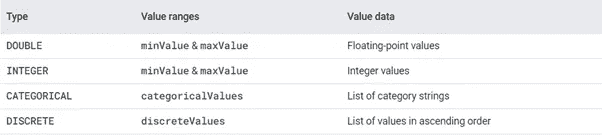

作者的照片

> ***超参数整定技术***

## **GridSearchCV**

该库用于为我们的模型寻找最佳超参数，以获得更好的精度。这种方法被称为 GridSearchCV，因为它从超参数值网格中搜索最佳超参数集。如上所述，这是执行超参数调整以确定给定模型的最佳值的过程。交叉验证方法用于找到目标估计器(模型)的训练和测试集。

当我们需要为目标模型和数据集调整参数时，GridSearchCV 非常有用。在该方法中，通过交叉验证测试多个参数，并且可以提取最佳参数以应用于预测模型。在模型中实现调谐参数后，我们得到精度和损失值，因此，我们试图找到具有更高精度和最小损失值的最佳参数。

GridSearchCV 是 Scikit-learn 模型选择包中的一个函数

```
(**from** **sklearn.model_selection** **import** GridSearchCV)
```

GridSearchCV 方法中使用的参数数量。

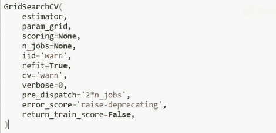

作者的照片

在这个过程中，我们将 hyper-parameter 的预定义值传递给 GridSearchCV 函数。我们制作一个字典，并提及参数及其值。

下面是一个例子:

在这项技术中，我们将学习如何使用 sklearn 的 GridSearchCV 为以下数据集找出支持向量机的最佳参数:

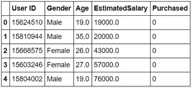

作者的照片

支持向量机的可调参数:{'c '，' gamma '，' kernel'}

**GridSearchCV 的例子**

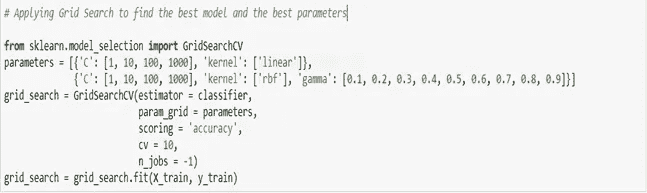

{ 'C' : 1，' gamma' : 0.7，' kernel' : 'rbf' }是上述数据集的 SVM 模型的最佳超参数值。对于其他数据集，SVM 估计器的调整参数具有不同的值。

[](/fully-explained-svm-classification-with-python-eda124997bcd) [## 用 Python 全面解释了 SVM 分类

### 如何用一个真实的例子解决分类问题。

pub.towardsai.net](/fully-explained-svm-classification-with-python-eda124997bcd) 

## **RandomizedSearchCV**

随机搜索 CV 是寻找最佳超参数的另一个例子。此方法用于实现“fit”和“score”方法。除了这两个之外，它还实现了“预测”、“预测概率”、“决策函数”、“变换”和“逆变换”，如果它们被使用的话。这种方法与网格搜索 CV 的不同之处在于，它不尝试调整所有参数，而是调整分布中的一些指定参数。当我们调整所有参数时，我们会列出一个列表，如果我们只选择一个参数，那么它也来自分布。

在这种方法中，当我们使用连续参数时，我们也应该在调整中选择连续分布。

RandomSearchCV 改进了 GridSearchCV 的缺点，因为它也适用于有限数量的超参数。这种搜索方法在网格中以随机方式设置最佳参数。这种方法降低了不必要的计算复杂度

RandomizedSearchCV 是 Scikit-learn 模型选择包中的一个函数


作者的照片

让我们检查一下 RandomSearchCV 中使用的所有参数，以及需要调优的参数有哪些。

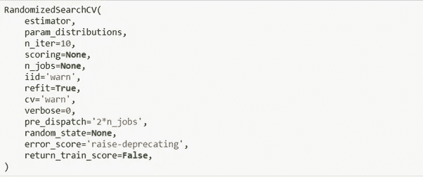

作者的照片

随机搜索的示例

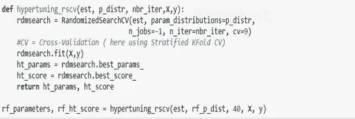

作者的照片

> ***【贝叶斯优化-自动化超参数调优(Hyper-optimization)***

这种优化方法用于自动调整参数，并使用贝叶斯方法寻找目标函数的最小值和最大值。在这种情况下，我们找到了一个函数的最合适的输入值，它可以给出最低可能的输出值。这种技术在评估复杂和有噪声的数据时很有用。

***贝叶斯优化中的一些常用术语***

**样本:**样本通常被定义为 n 维空间中预定义范围的变量向量。

**目标函数:**定义损失函数以最小化

**域空间:**定义函数输入值的范围

**成本:**通过目标函数计算的样本数值

**库** — *远视*

这个开源库用于大规模优化。该库用于通过串行和并行技术优化真实、条件和离散维度。Hyper-opt 使用贝叶斯优化的形式进行参数调整，从中我们可以获得给定模型的最佳参数。

[](/data-preprocessing-concepts-with-python-b93c63f14bb6) [## Python 中的数据预处理概念

### 一种为机器学习估值器准备数据的稳健方法

pub.towardsai.net](/data-preprocessing-concepts-with-python-b93c63f14bb6) 

**用于贝叶斯优化的 hyper-opt 中的一些函数:-**

**搜索空间:** hyper-opt 具有不同的功能来指定输入参数的范围。

```
hp.choice (label,options)
hp.randint(label,upper)
hp.uniform(label,low,high)
```

**fmin:** 该函数用于最小化目标函数，并通过迭代不同的估值器及其调整参数进行优化。

```
parameters :- fmin**(**fn**,** space**,** algo**,** max_evals**=9223372036854775807,** trials**=None)**
```

**试验:**用于保存所有关于超参数、损耗和其他信息的记录。

```
from hyperopt import Trials
trials = Trials()
```

**要遵循的步骤**

*   **导入库及其功能**

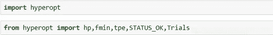

作者的照片

*   **定义优化的参数空间**

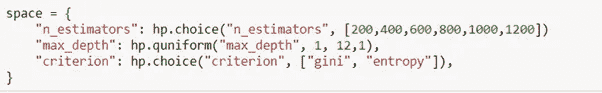

作者的照片

*   **定义一个函数来最小化**

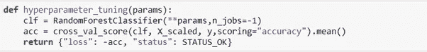

作者的照片

*   **微调模型**

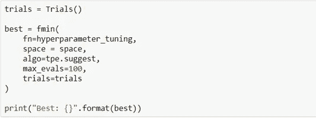

作者的照片

*   **Trail 对象正在分析结果**

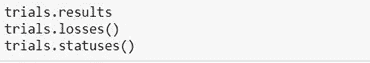

作者的照片

**结论**:这是一篇关于超参数调整的文章，用于提高机器学习模型的准确性。

我希望你喜欢这篇文章。通过我的 [LinkedIn](https://www.linkedin.com/in/data-scientist-95040a1ab/) 和 [twitter](https://twitter.com/amitprius) 联系我。

# 推荐文章

[1。NLP —零到英雄用 Python](https://medium.com/towards-artificial-intelligence/nlp-zero-to-hero-with-python-2df6fcebff6e?sk=2231d868766e96b13d1e9d7db6064df1)
2。 [Python 数据结构数据类型和对象](https://medium.com/towards-artificial-intelligence/python-data-structures-data-types-and-objects-244d0a86c3cf?sk=42f4b462499f3fc3a160b21e2c94dba6)
3。[Python 中的异常处理概念](/exception-handling-concepts-in-python-4d5116decac3?source=friends_link&sk=a0ed49d9fdeaa67925eac34ecb55ea30)
4。[为什么 LSTM 在深度学习方面比 RNN 更有用？](/deep-learning-88e218b74a14?source=friends_link&sk=540bf9088d31859d50dbddab7524ba35)
5。[神经网络:递归神经网络的兴起](/neural-networks-the-rise-of-recurrent-neural-networks-df740252da88?source=friends_link&sk=6844935e3de14e478ce00f0b22e419eb)
6。[用 Python 充分解释了线性回归](https://medium.com/towards-artificial-intelligence/fully-explained-linear-regression-with-python-fe2b313f32f3?source=friends_link&sk=53c91a2a51347ec2d93f8222c0e06402)
7。[用 Python](https://medium.com/towards-artificial-intelligence/fully-explained-logistic-regression-with-python-f4a16413ddcd?source=friends_link&sk=528181f15a44e48ea38fdd9579241a78)
充分解释了 Logistic 回归 8。[concat()、merge()和 join()与 Python](/differences-between-concat-merge-and-join-with-python-1a6541abc08d?source=friends_link&sk=3b37b694fb90db16275059ea752fc16a)
9 的区别。[与 Python 的数据角力—第一部分](/data-wrangling-with-python-part-1-969e3cc81d69?source=friends_link&sk=9c3649cf20f31a5c9ead51c50c89ba0b)10。[机器学习中的混淆矩阵](https://medium.com/analytics-vidhya/confusion-matrix-in-machine-learning-91b6e2b3f9af?source=friends_link&sk=11c6531da0bab7b504d518d02746d4cc)