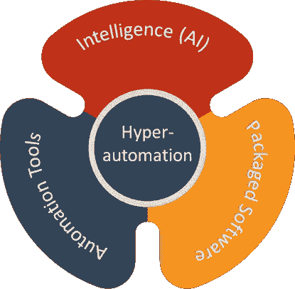
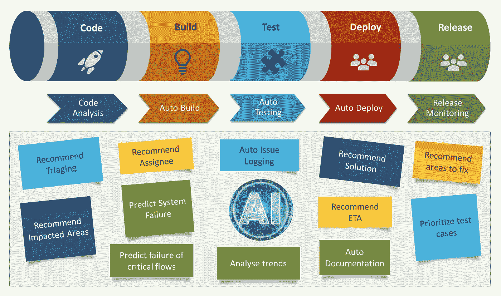

# 超自动化——人工智能的新时代自动化

> 原文：<https://pub.towardsai.net/hyperautomation-new-age-automation-with-ai-d663fbb48af3?source=collection_archive---------0----------------------->

## [人工智能](https://towardsai.net/p/category/artificial-intelligence)

## 改进产品工程流程，加快交付速度

图片来自 [Piqsels](https://www.piqsels.com/en/public-domain-photo-jqsrr)

活跃的头脑寻求消除单调。这是有史以来最伟大的想法的种子。导致进步、成长和从手工做事中解脱出来的想法。在过去的几十年里，科技的进步给了我们最好的礼物，时间。是时候专注于我们的创造性努力，让机器来执行我们大脑现在认为平凡的任务了。作为一个物种，我们一直在努力让我们的生活变得更简单、更方便。

虽然“自动化”的核心含义保持不变，但随着时间的推移，这个词的用法确实发生了变化。从手动打开吊扇到各地空调的自动温度控制，我们已经走过了漫长的道路。几年前我们认为是“自动化”的东西，变得越来越自动化，使用起来也越来越方便。这主要是由于多年来技术的进步。多年前，我们从未想过有一天我们可以通过 Alexa 这样的自动语音识别设备下购物订单，通过可穿戴设备进行即时支付或使用无人驾驶汽车。自动化给了我们一种新的自由感。选择如何支配时间和做什么的自由。这反过来导致我们做的或想做的每一件事都有更大的进步。

## 遇见超自动化

Gartner 最近将“超自动化”作为顶级战略趋势之一。这意味着今天任何可以自动化的东西都应该自动化。它是关于使用多种工具和技术来自动化端到端的业务流程和操作，而不仅仅是任务级的自动化。很多时候，在任何过程中都会涉及到某种程度的人为决策。超自动化旨在减少业务流程中的人工干预，并将其完全自动化，以优化效率和生产率。智能流程自动化最基本的要素是人工智能(AI)、机器人流程自动化(RPA)、物联网(IoT)和业务流程管理(BPM)。

大多数组织专注于开发自动化文化。在这种文化中，鼓励 it 部门将今天手动完成的任何事情自动化。一种新的思维模式，认为任何需要经常做的事情都不值得手动去做。集思广益，投入时间和精力来实现 it 自动化。实现特定任务自动化的工具并不缺乏，这通常会提高生产力。用户只需通过界面点击一个按钮，就能完成大多数事情。将系统中的各种任务自动化会创建自动化系统，而将一整套流程自动化会创建不需要人工干预并自行运行的自治系统。将自动化系统转变为自治系统的过程被称为超自动化。

## 人工智能在超自动化中的作用

人工智能为整个自动化过程提供了正确的推动力。它被有效地用于在合理的准确度水平上模仿人类的决策。自然语言处理(NLP)、计算机视觉和 ML 算法通常与 OCR、RPA 等结合使用。创建能够从图像、视频、文档中查看、读取和处理信息并执行所需工作的数字工作者。过去几年人工智能的进步确实有助于释放巨大的自动化机会。因此，人工智能被认为是实现超自动化的精髓。

作者图片

## 产品工程中的超自动化

超自动化正在被许多行业迅速采用。软件业以多种方式利用高度自动化的力量。许多产品工程团队专注于自动化整个构建管道，以便在没有任何人工干预的情况下编译、部署和测试代码。还集成了安全测试、性能基准测试、预定的自动化部署。这对于大多数组织来说并不陌生，但是在当今的环境下还有更多的事情可以做。

作者图片

决策是任何软件开发过程中固有的。这些决定大多依赖于人类的经验和直觉。开发人员、管理人员、测试人员合作做出多个决策来管理交付的风险。一个人必须对与资源可用性、技能、成本、交付时间和涉众需求相关的各种约束有很好的背景和理解。为了开始自动化决策的旅程，它需要使用人工智能来访问与过去所做决策相关的数据。

在“ **DevOps 管道、**的每一个阶段，都会重复产生大量数据。每天都要完成多个代码构建。执行多个测试循环。测试用例被执行(手动或自动),错误被分别记录相关细节。开发人员修复 bugs 缺陷，并贡献更多关于缺陷修复的数据。这些数据可以被存储，并在以后用于训练多个人工智能模型。

首先，人工智能模型可以被训练来潜在地增强人类的决策能力。最终，精确的人工智能模型将开始为过去发生的常见问题开出解决方案。他们可以建议首先修复什么缺陷，由谁来修复。开始估计修复缺陷所需的工作量。推荐由于高缺陷密度而需要紧急关注的区域。他们可以根据变更代码的影响，推荐自动化测试套件要执行的测试用例，并对其进行优先级排序。推荐需要加强安全性的重构区域，或者确定可能的性能瓶颈。

人工智能模型甚至可以用来分析部署后的趋势，以监控系统的行为，并在需要时发出警报。他们可以预测系统中的关键功能何时开始表现不佳。根据最终用户使用它们的频率，它们可以提供有关重要业务流程的信息。他们甚至可以创建与系统相关的必要文档。在软件行业中，在过去的几十年中，以上大部分都消耗了大量的手工劳动。考虑到项目的限制，自动化可以自动化的东西才是有意义的。

在软件开发的背景下，高度自动化之旅的下一个阶段肯定是制造更加自治的系统，这些系统能够自我修复、自我监控、自我测试、自我部署、自我记录，但更重要的是，能够自我进化。

## 深谋远虑

在许多可能的未来中，高度自动化的未来是不可避免的。技术进步的“超高速”创造了更多“超自动化”的机会。我们可以更有创造力，创新自动化的新方法。有人可能想知道高度自动化之旅的最终目的地是哪里？应该什么时候结束？什么时候我们应该假设事情是完全自动化的，而没有任何进一步自动化的范围？

我的最佳猜测是——永远不会…