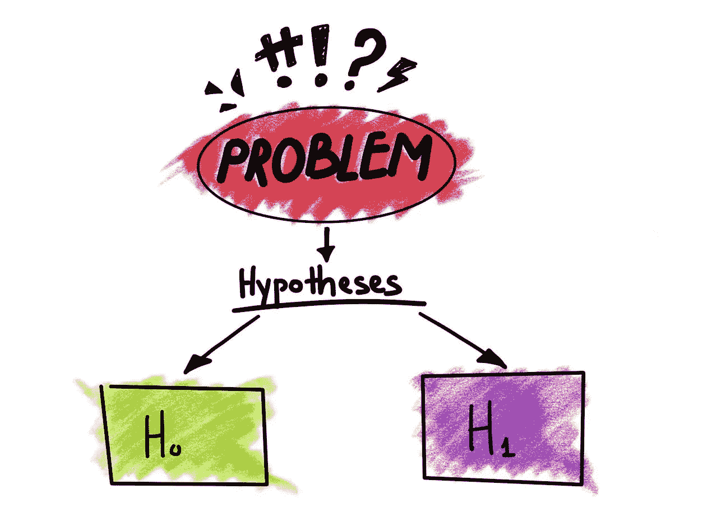
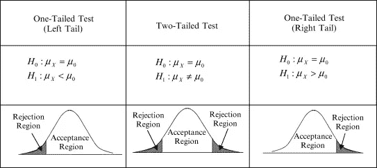
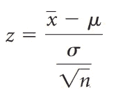
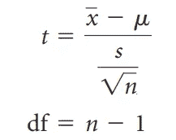
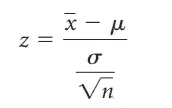
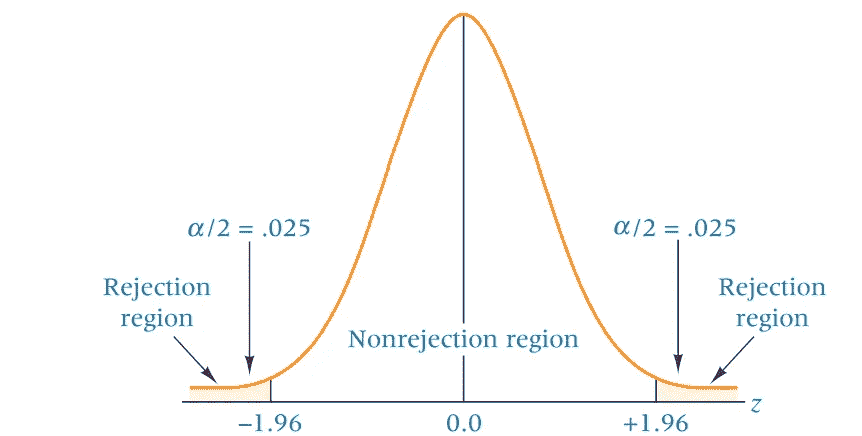
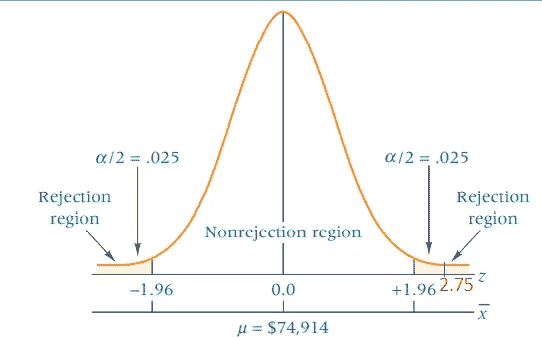
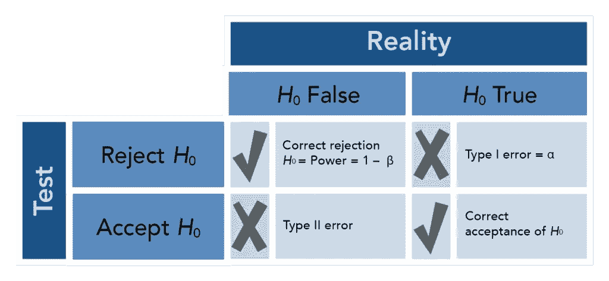
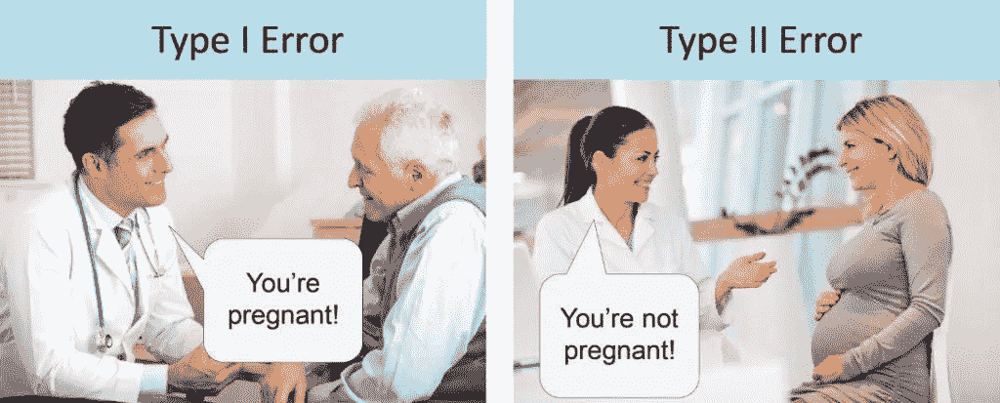
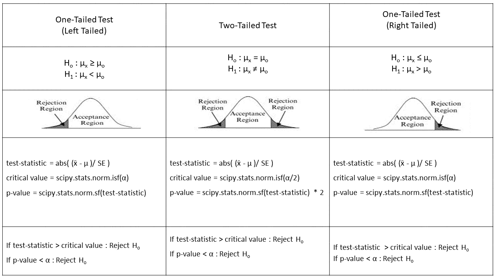

# 用 SciPy 进行假设检验

> 原文：<https://pub.towardsai.net/hypotheses-testing-with-scipy-b5ba86430d74?source=collection_archive---------1----------------------->

## [编程](https://towardsai.net/p/category/project-management)

## 学习使用 python 代码进行商业决策的基础知识

www.luminousmen.com

W 随着数据科学领域的大肆宣传，我们大多数人都直接跳入机器学习模型和算法来做出商业决策。所有可用的在线课程都没有教授决策的最基本知识。假设检验是决策的基本组成部分之一，也是最古老的。最早使用假设检验是在 18 世纪，由约翰·阿巴斯诺特用来检验男性和女性生育的可能性是否相等。

在本文中，我们将讨论初级水平的假设测试，以及使用 SciPy 包的 python 代码。**不要错过本文最后的总结部分**。

## 什么是假设检验？

到目前为止，我们已经知道这是一种使用样本数据进行商业决策的方法。但是怎么做呢？首先，我们来看看什么是假设。假设是在有限证据的基础上提出的理论或想法。这是进一步调查的起点。然后，我们通过收集相关数据来测试它，并找到拒绝或未能拒绝假设(新想法)的证据。这类似于法庭审判中的嫌疑人，并根据收集的证据证明他有罪或无罪。

可以回答的问题类型有:

1.  运输产品时，什么样的集装箱最经济、最可靠？
2.  哪种管理方法最能激励零售业的员工？
3.  如何使公司的退休投资金融投资组合多样化以获得最佳业绩？
4.  链接客户端数据库以快速检索有用信息的最佳方式是什么？

## 让我们来谈谈技术

每个假设检验都由两部分组成，一个无效假设和一个替代假设。**零假设**代表一个旧的/现有的理论，而**替代假设**代表一个人试图证明的新理论/想法。无效假设和替代假设是完全相反的。

> 示例 1:
> 
> 钢铁厂的经理说，所有生产的钢棒平均长度为 26 厘米。现在一个检查员声称平均钢棒长度不是 26 厘米，他想证明这一点。该实验的零 hypothesis(H₀是杆的平均长度为 26cm。另一个 hypothesis(H₁是杆的平均长度不是 26 厘米。
> 
> h₀:μ= 26 厘米
> 
> H₁: μ ≠ 26cm

这里现有的理论是杆的平均长度是 26 厘米。因此它进入了零假设，我们试图证明的是平均长度不是 26 厘米，所以它进入了另一个假设。

> 示例 2:
> 
> 一家茶叶公司的经理声称一袋茶叶的重量少于 3.5 克。食品控制部门想要验证这一说法。本实验的零 hypothesis(H₀是绿茶袋的平均重量大于或等于 3.5 克。另一个 hypothesis(H₁是绿茶袋的平均重量小于 3.5 克
> 
> H₀: μ ≥ 3.5g
> 
> H₁: μ < 3.5g

Here the one we are trying to prove is that the average weight of a green tea bag is less than 3.5g, so it goes into the alternative hypothesis, and the opposite is the null hypothesis.

Formulation of the null and the alternative hypothesis is the crucial step, so be careful before you formulate. One **有效公式的诀窍**是等号(=)只出现在零假设中，替代假设与零假设相反。

## 假设检验的类型

1.  **双尾检验**:在假设中总是使用=和≠。意味着它们没有方向。在钢棒示例中，检查员可能得出平均长度不是 26 厘米的结论，但不知道它是小于 26 厘米还是大于 26 厘米。
2.  **单尾测试:**总是有方向性的。备选假设使用大于号(>)或小于号(<)。在茶袋的例子中，研究人员将确切地知道绿茶袋的平均重量是小于还是大于 3.5 克

[https://www.sciencedirect.com](https://www.sciencedirect.com/topics/mathematics/tailed-test)

## 检验假设的 HTAB 系统

测试假设的过程包括 8 个步骤，分为 4 个主要任务:

任务 1。假设大小:建立假设

任务 2。 **T** est:进行测试

任务三。**行动:采取统计行动**

任务 4。B 业务:确定业务含义

肯·布莱克的商业统计

看起来势不可挡。我们将在本文的后面一个接一个地解释这些任务。

## 检验统计量

在假设检验中，我们要么拒绝零假设，要么不能拒绝零假设。为了得出结果，我们将计算测试统计数据，并与计算出的阈值(临界值和 p 值)进行比较。有两种类型的测试统计。

1.  **z 统计量**:已知总体标准差时计算

> x̄-样本均值
> 
> μ-总体平均值
> 
> σ-总体标准偏差
> 
> n-样本量

2.t 统计量:当总体标准差未知时计算

> x̄-样本均值
> 
> μ-总体平均值
> 
> s 样本标准偏差
> 
> n-样本量
> 
> df-自由度

## **检验假设的临界值法**

还记得我们说过的阈值吗？这是其中之一。它是分布上的一个点，与检验统计量进行比较，以决定是否拒绝零假设。如果检验统计量的绝对值大于临界值，我们声明统计显著性并拒绝零假设。它是使用显著性水平(α)计算的。现在，显著性水平是什么？它决定了所做决策的风险百分比。我们总是以某种置信水平拒绝或未能拒绝零假设。例如，我们可以说我们以 95%的置信度拒绝了零假设，那么显著性水平(α)将是 1–0.95 = 0.05。显著性水平是在我们提出假设之前决定的。我们将使用 Python 的 SciPy 包来计算临界值。

就拿我们的钢棒例子来理解一下吧。

> 问题陈述:
> 
> 一项对全美注册会计师的调查发现，独资注册会计师的平均净收入为 74，914 美元。因为这项调查已经进行了十多年了，一位会计研究员想通过随机抽取 112 名美国独资会计师来测试这个数字，以确定净收入数字是否随着 **95%的置信度**而变化。假设独资注册会计师净收入的总体标准差为 14，530 美元[1]。

**假设**:在**步骤 1** ，假设必须成立，我们已经在上面做了，因为测试试图证明平均注册会计师是 74，914 美元，这进入了替代假设。

h₀:μ= 74914 美元

h₁:μ≦74914 美元

**测试:步骤 2** 是确定合适的统计测试。因为我们知道总体标准差，所以我们使用 z 统计量。

**步骤 3** 是指定 alpha(α)值。由于给定的置信区间为 95%，我们将α计算如下:

α = 1-置信区间

= 1–0.95

= 0.05

**第四步**是计算临界值。因为问题是双尾的，临界值在分布的两端，正如我们已经讨论过的。因此我们用α/2 计算临界值。

z_critical = +或-1.96

肯·布莱克的商业统计

**步骤 5** 是采集样本数据。

**第六步**分析样本数据。已知样本数据大小为 112，样本均值为 78，695 美元。

z_stat = 2.753

**动作** : **第七步**是得出一个统计结论。由于 z 统计值大于临界值，我们拒绝零假设。

**商业暗示:第 8 步**是进行商业暗示。通过拒绝零假设，我们以 95%的置信度得出结论，平均注册会计师不等于 74，914 美元，因此，会计研究者需要采取适当的措施。

## 检验假设的 p 值法

在假设零假设是正确的情况下， *p* 值是获得至少与实际观察到的结果一样极端的测试结果的概率。简单地说，p 值是检验统计的概率。如果 p 值小于α，那么我们拒绝零假设。如果 p 值大于α，我们无法拒绝零假设。

以同一个注册会计师为例，除了**步骤 4、**我们建立决策规则之外，所有步骤都是一样的。当然，在这种方法中，决策规则在 p 值中。

注意，我们将 p 值乘以因子 2，因为这是一个双尾检验。得到的 p 值为 0.00588，小于我们的α值(0.05)。因此，我们拒绝得出平均注册会计师不等于 74，914 美元的零假设。

## 单尾检验:左尾

> 问题陈述:
> 
> 一位生物学家有兴趣确定用小长春花根提取物处理的向日葵幼苗是否会导致向日葵幼苗的平均高度低于 15.7 厘米的标准高度。这位生物学家用这种提取物处理了随机抽样的 33 株幼苗，随后得到的平均高度为 13.664，标准偏差为 2.544。用 95%的置信区间[【2】](https://online.stat.psu.edu/statprogram/reviews/statistical-concepts/hypothesis-testing/examples)检验假设。

**假设**

H₀: μ ≥ 15.7

H₁: μ < 15.7

How to identify that it is left tailed? After the formulation of hypotheses, if there is a < sign in alternative hypothesis it is left tailed test.

We do not know the population standard deviation; hence we go with a t-statistic.

**临界值法**

z_stat 4.59 大于 z_critical 1.28。因此，我们拒绝零假设。综上所述，向日葵幼苗的高度小于 15.7。

**p 值法**

p_value 3.1884575460121404e-05 小于α值 0.01；因此，我们拒绝零假设。综上所述，向日葵幼苗的高度小于 15.7。

## 单尾检验:右尾

> 问题陈述:
> 
> 一名工程师测量了 25 件亚临界退火的球墨铸铁的布氏硬度，平均硬度为 176.3，标准偏差为 2.06。工程师假设所有这种球墨铸铁件的平均布氏硬度大于 175。用 95%的置信区间检验假设[【2】](https://online.stat.psu.edu/statprogram/reviews/statistical-concepts/hypothesis-testing/examples)。

**假设**

H₀: μ ≤ 175

H₁: μ > 175

如何识别它是右尾？假设公式化后，如果备选假设中有>符号，则为右尾检验。

我们不知道总体标准差；因此我们用 t 统计量。

**临界值法**

z_stat 3.155 大于 z _ critical 1.64 因此，我们拒绝零假设。总之，所有这种球墨铸铁件的平均布氏硬度都大于 175。

**p 值法**

p_value 0.00213 小于α值 0.05；因此，我们拒绝零假设。总之，所有这种球墨铸铁件的平均布氏硬度都大于 175。

## 第一类和第二类错误

[www.courses.lumenlearning.com](https://courses.lumenlearning.com/wm-concepts-statistics/chapter/introduction-to-hypothesis-testing-5-of-5/)

为了解释这一点，我们将举一个法庭审判的标准例子。假设零假设是一个人在法庭审判中是无辜的，我们已经知道我们总是认为零假设是正确的，直到我们找到足够的证据来拒绝它。

**正确拒绝:**当我们在一个人已经实际犯罪的情况下拒绝零假设。

**正确接受**:当一个人实际上没有犯任何罪的时候，我们无法拒绝零假设。

**第一类错误**:如果我们在一个人没有犯罪的情况下拒绝零假设，

**第二类错误**:如果我们在一个人实际犯了罪的时候没有拒绝零假设。

有一种病毒迷因很好地解释了错误。

[www.statisticssolutions.com](https://www.statisticssolutions.com/to-err-is-human-what-are-type-i-and-ii-errors/?__cf_chl_jschl_tk__=0e5dc8edd3332dee180665f90beb14fdaa6d0991-1607258884-0-ARzXOwEdoa8RFFdb9bkWQPFuJc6iFVVm1NMEcnwl3N19CO2PyOZSDvApa9iJM_-y-oHYFr5KLjB5BNC52v7UIC5SohQ2-Hrg7xD3S7UPiNVUrak-8Z4ZaktlQbKSJQjQoaKOt9IZ9SW6KBXMrlHSVvvPKl0XHXH08iB_mTUo5FyEKSR6Cr_GPD0dAexOZhWqjxGxsNiZd0AQuteiyyg5eiGkbmH6mJEIKzhlbyjTgQTuTgjkbKmeRNkyS2arjebgZvXqvbxJnZ5Hh8XPGXcMqdHR3Mtp6xvjP2uhWGWfM8ZirL_YjgkQY-mcrfyVfGC8le34nvzfeHrKjhmZoS4Ydp196bnjLM6PsgBilIxJ1GKiLa27zqv7PZHTlO6O_PGe9Q)

**如何控制误差？**

当我们试图控制一个错误时，另一个就会失控。所以，我们需要同时控制两者。一种方法是增加样本量。

## 摘要

## 参考

[1]Ken Black 的《当代决策的商业统计》

[2][https://online . stat . PSU . edu/stat program/reviews/statistical-concepts/hypothesis-testing/examples](https://online.stat.psu.edu/statprogram/reviews/statistical-concepts/hypothesis-testing/examples)

**我们来连线**

 [## Sujan Shirol - Python 开发人员- 3x Kaggle 专家| LinkedIn

### 我相信教学是最好的学习方式。技术作家在媒体的最大出版物的启动，走向人工智能&…

www.linkedin.com](https://www.linkedin.com/in/sujan-shirol/)