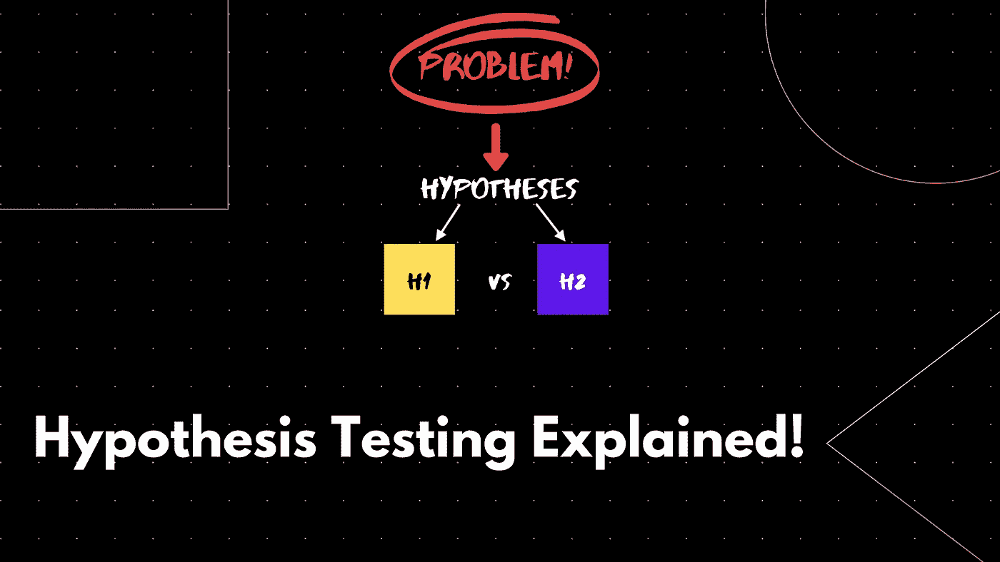
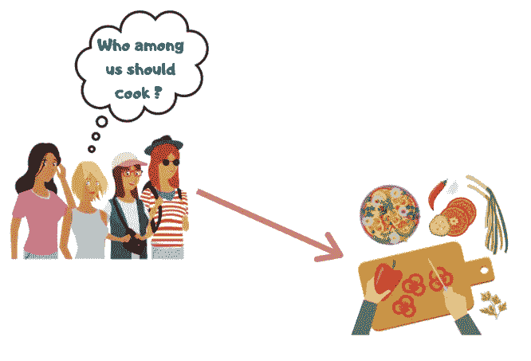
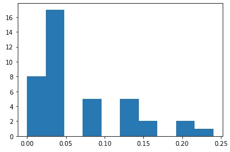

# 假设检验解释完毕！

> 原文：<https://pub.towardsai.net/hypothesis-testing-explained-83fea2ee03f4?source=collection_archive---------0----------------------->

## [数据科学](https://towardsai.net/p/category/data-science)

## 让我们试着理解广泛使用的假设检验和 p 值的概念。

使用 Canva 设计。

让我们假设您被要求测试您公司网站主页上新创建的导航栏是否比以前吸引了更多的用户。你将如何处理这个问题？你怎么能确定你网站流量的变化是因为增加了导航条，而不是巧合呢？这就是假设检验发挥作用的地方。

## 简单的例子

使用 Canva 设计。

让我们考虑四个朋友 A、B、C 和 D，他们正处于选择每天做饭的人的两难境地。所以他们把自己的名字写在 4 张纸条上，每天挑选一张。在被挑选的便签上有他名字的人是在那一天将要做饭的人。4 天后，A 没有机会做饭。朋友们起了疑心，试图找出 A 在 4 天内没有机会做饭的概率

3/4 * 3/4 * 3/4 * 3/4 = 81/256 = 0.31 = 31%(因为 3/4 是个人 A 在某一天没有被选中的概率，即。在 4 个总结果中，有 3 个结果没有选择人 A)

31%的几率连续 4 天没有被选中，这对朋友来说似乎没什么，因此他们继续以同样的方式。但是 16 天后，A 仍然没有机会做饭。现在，朋友们再次决定找出 A 在 15 天内没有机会做饭的概率，即(3/4 乘以 15 次)= 0.01 = 1%。

现在，朋友们真的对 A 没有机会做饭产生了怀疑，因为这种可能性只有 1%(不到 5%)，并得出结论认为 A 有作弊行为。

好吧…**为什么我在括号里提到少于 5%？**

一般来说，统计学家会为偶然发生的事情设定一个阈值。如果概率小于阈值，他们得出结论，没有随机发生的机会。与 4 个朋友的情况一样，4 天后 A 没有机会做饭的情况可能是随机发生的，31%的概率表示这一点。但是 15 天后，概率变成了 1%,这大大减少了没有机会烹饪的情况。这里 5%的值被称为**显著性值**。4 天的 *31%值*和 15 天的 *1%值*称为 **p 值**。这里，

**零假设**—A 人没有得到做饭的机会纯粹是因为随机的机缘，没有作弊。

**替代假设**——甲没有得到做饭的机会，不是因为偶然的机会，而是被骗了

对于 4 天方案，由于 p 值 31%大于显著性值 5%,我们不拒绝零假设。

对于 15 天的情况，由于 p 值 1%小于显著性值 5%,我们拒绝零假设。

> 上面的例子很幼稚。现实生活中假设检验不是这样进行的。它只是用来对主题有一个大概的了解。

# 术语

## **假设**

一个**假设**是一个可以借助数据来检验的想法。让我们考虑一个平均花费 20 分钟在网站上的网站。我们的假设是，网站背景颜色的改变导致在网站上停留的时间增加。

**零假设**将是花在网站上的平均时间等于 20 分钟。

另一个假设是花在网站上的平均时间超过 20 分钟。

**测试统计量**是一个汇总数据的值。

## **P 值**

让我们考虑一下，我们从所有访问者中抽取了 100 个访问者的样本，发现平均花费的时间是 25 分钟。让我们假设我们进行了 1000 次相同的实验，取不同的 100 个访问者，其中零假设为真。这 1000 次中平均花费时间大于 25 分钟的概率就是 **p 值**(概率值)。

(你可能会想为什么是 25 分钟而不是 20 分钟。但是一般来说，p 值是使用第一个观察值作为基准来计算的。这里 25 分钟是从第一个样本收集的值)

p 值=(次数平均值> 25) / 1000

如果 P 值小于 0.05，我们拒绝零假设。

如果 P 值大于 0.05，我们不拒绝零假设。

这里的显著性水平是 0.05 或 5%。在大多数情况下，显著性水平为 5%。

> 在 4 个朋友的例子和上面的网站例子中，我们注意到 p 值倾向于改变我们对零假设的信念。

# 案例研究

萨姆读到一篇文章，文章称美国总人口的 6%是素食者。但是他认为他所在的州有超过 6%的人是素食者。为了检验他的理论，萨姆从他的城市中抽取了 100 个人作为样本，发现其中 20%的人是素食者。

为了了解这种情况发生的可能性有多大，他进行了一次模拟。他模拟了来自他所在城市的 100 个人的 40 个样本，并记录了每个样本中素食者的百分比。样本比例如下

萨姆想测试一下

ho-素食者= 6% **对**Ha-素食者> 6%

Ho(零假设)-素食者的比例是 6%。

ha(alternative hypothesis)——素食者的百分比大于 6%。

现在，P 值将是素食者在模拟中大于 20%的概率。我们可以看到，在 40 个模拟中，只有 3 个模拟的百分比大于 20，这意味着

p 值= 3/40 = 0.075，高于 0.05 的典型显著性水平。

因此，我们无法拒绝零假设，可以证实，山姆的想法是不对的。

# 结论

在本文中，我们通过适当的例子讨论了广泛使用的假设检验和 p 值的概念。请随时分享反馈！

如果你想联系，请在 [**LinkedIn**](https://www.linkedin.com/in/saiteja-kura-49803b13b/) **上**联系我。****