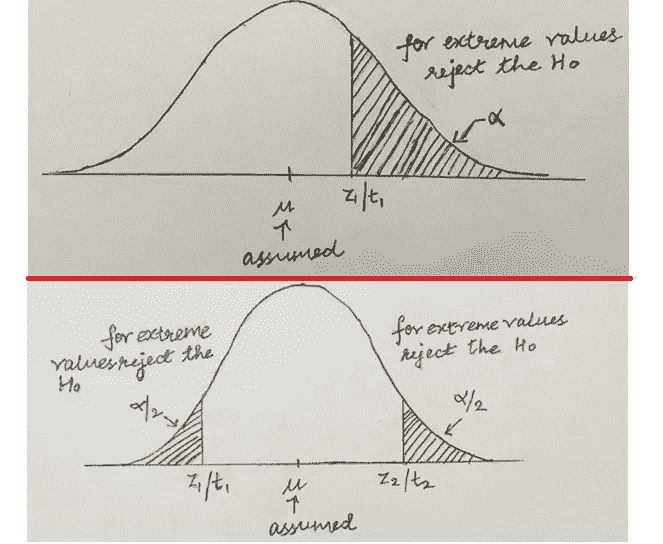
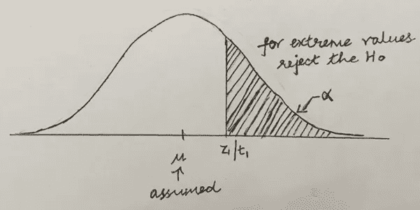
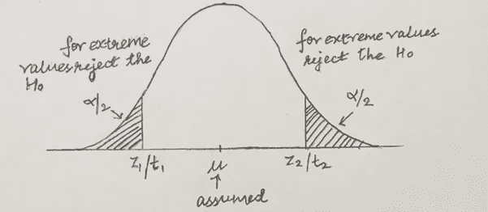
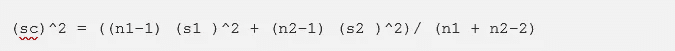

# 用 T 检验和方差分析对已知和未知总体进行假设检验

> 原文：<https://pub.towardsai.net/hypothesis-testing-for-known-and-unkown-population-with-t-test-and-anova-8a00b457c48f?source=collection_archive---------1----------------------->

## [机器学习](https://towardsai.net/p/category/machine-learning)

## 两个及两个以上独立样本，具有标准偏差



作者的照片

> ***检测人群是指***

对于统计学家来说，检验两个或更多人口的平均数是否相等是很常见的。根据遇到的不同数据情况，可以采用不同的方式来完成。

我描述的主题如下所示:

## 两个独立的样本

*   总体的标准偏差是已知的
*   总体的标准偏差是未知的

## 两个以上的独立样本

*   方差分析

为了测试上述数据情况，通常的步骤流程是假设测试。为简单起见，我将它们指定如下:

1.  提及假设陈述，H0 和 H1，以及显著性水平(α)，例如，5 %。
2.  根据具体情况计算检验统计量。
3.  计算 p 值。
4.  如果 p 值< α, then we have sufficient evidence to reject the test. If p-value > α，那么我们没有足够的证据来拒绝测试。
5.  根据具体情况进行解释。

**注:**以上步骤为单边测试。在双边检验的情况下，p 值被 2*p 值代替，以便与α进行比较。

我在下面提到的具体例子有关于检验统计量的信息，以及它在不同数据情况下遵循的统计分布。这些都可以按照上述步骤来解决。



单边假设检验。作者的照片



双边假设检验。作者的照片

**注:**上面两张图中提到的表达式 zi/ ti 不是指 zi 除以 ti，而是指 zi 或 ti。zi 和 ti 是用于测试的测试统计量。

> ***现在我们将详细讨论上面提到的案例***

## 两个独立的样本

设两个种群:X1，X2。让 X1 遵循具有平均₁和标准偏差ϭ1.的正态分布类似地，假设 X2 遵循均值为 2 且标准差为ϭ2.的正态分布另外，考虑从这些总体中分别抽取大小为 n1 和 n2 的两个样本。

```
For simplicity: 
X1 ~ N (µ₁, (Ϭ1 )^2), X2 ~ N (µ2, (Ϭ2 )^2)
```

让 X̅1 表示来自 X1 的样本的样本平均值，X̅2 表示来自 X2 的样本的样本平均值。同样，设 s1 和 s2 分别为样本的标准差。

可以使用假设检验来检验两个总体均值，其中我们检验总体均值之间的差异

```
H0: µ₁ — µ₂= 0H-alt: µ₁ — µ₂ > 0 or H-alt: µ₁ — µ₂ < 0 or H-alt: µ₁ — µ₂ ≠ 0
```

测试可以基于不同的属性和关于数据的可用信息来完成，如下所述。

*   已知总体标准偏差的两个独立样本。
*   总体标准偏差未知的两个独立样本。

**已知总体标准偏差的两个独立样本**

测试统计，

z =((x̅1—x̅2)—(₁—₂))/)(√((ϭ1 )^2/n1+(ϭ2 )^2/n2))服从标准正态分布。

**两个独立样本，总体标准偏差未知**

在我们开始测试之前，有必要提一下自由度。

自由度:在数据样本中，独立特征的数量。它用于查找 p 值和测试统计值。

这种情况下的测试统计量为 t =((x̅1—x̅2)—(₁—₂))/)sc(√( 1/n1+1/N2)，并遵循自由度为(n1+N2–2)的 t 分布，其中



对于大样本(即 n>30)，t 分布可以近似为 z 分布或标准正态分布，因此 t 分布统计量变成了 z 统计量。

[](/chi-square-test-examples-with-r-da05dc90b76e) [## 带 R 的卡方检验示例

### 变量关联与分布分析

pub.towardsai.net](/chi-square-test-examples-with-r-da05dc90b76e) [](/introduction-to-mlops-for-data-science-e2ca5a759f68) [## 面向数据科学的 MLOps 简介

### 持续集成、持续开发和持续测试的一部分

pub.towardsai.net](/introduction-to-mlops-for-data-science-e2ca5a759f68) 

## 多于两个样本:方差分析

到目前为止，我们已经讨论了用于检验仅来自两个总体的总体均值的等效性的标准正态检验和 t 检验。但是我们也可能想要检查两个以上群体的等价性。

如果我们使用上面提到的相同的测试，我们最终会进行大量的测试，并且将它们全部完成是一项非常繁琐的工作。对于这类问题，使用像方差分析这样的方法。

ANOVA 代表方差分析。顾名思义，我们将在假设检验的帮助下分析方差并得出关于总体均值的结论。

在我们开始之前，需要对人口做一些假设。我们开始吧:

1.  人口呈正态分布。
2.  总体有一个共同的标准差。
3.  所有的样本都是随机选取的。因此是相互独立的。

我们将在方差分析中使用的一些符号符号如下:

让我们假设我们有 k 个这样的样本或群体，它们来自 k 个不同的群体。设 1 是第一个总体的总体平均值，2 是第二个总体的平均值，直到第 k 个总体的平均值。每个组包含 ni 个观测值(ith 是组号)。

设 N = n1 + n2 + n3 + … + nk。这意味着总共有 N 个来自所有组的观察值。

**脚步紧跟**

我们将陈述假设陈述，并进一步研究检验统计所需的各种成分——可变性、方差和 F 比率。然后我们将进行方差分析测试。

*   **假设陈述**

因为我们已经提到过方差分析是一个假设检验，所以在开始时陈述假设是值得的。

```
H0: µ1 = µ2 = ……. = µkH-alt: At least two of the means µ1, µ2, …., µk are unequal.
```

请注意替代假设陈述。如果一组人口平均数不相等，那就意味着所有的平均数都不相等。

上面我们讨论了我们要分析方差。

*   **可变性**

我们将从可变性开始，并使用它来计算方差。

让我们考虑总可变性，ST =∑∑(xij-x̅).注 j 是该组中的元素数，X̅代表总体平均值。这种总可变性可分为 Sb 和 Sw。

```
St = Sb + Sw
```

sb =∑ni(x̅i——x̅t)^2)是总体均值和各组均值之间的变异性

Sw = St — Sb，是每个组内可变性的总和

这意味着总可变性等于总体平均值和每组平均值之间的可变性之和以及每组内可变性之和。

*   **方差**

现在我们有了可变性分割，我们可以计算方差。方差是我们进行方差分析所需要的。

就像可变性如何在组之间划分一样&组内自由度(DoF)和方差也是如此。

```
DoF for between groups = k — 1DoF for with-in groups = N — k
```

MSb:组间方差

```
MSb = Sb / (k — 1)
```

MSw:组内方差

```
MSw = Sw / (N — k)
```

因此，如果我们从上面注意，我们会看到方差只是可变性除以各自的自由度。

*   **F 比率**

```
F ratio, F = MSb / MSw
```

f 比率是之间的均方与内的均方之比。这是方差分析检验的统计量。它被称为 F 比率，因为它遵循 f 分布。

F 统计量的自由度是(k-1)，(N-k)，它们也分别是 MSb 和 MSw 的分母。

**方差分析测试**

ANOVA 测试背后的逻辑是测试其中一个方差 MSb 如何受不同组平均值之间的总体差异影响，而另一个方差 MSw 如何不受影响。

MSw 是对总体方差的一个很好的估计，但 MSb 由总体方差和样本间差异产生的附加方差组成。这意味着 MSb 可以等于 MSw，也可以大于 MSw。

因此，如果样本间的方差大于样本内的方差，则 F 比率大于 1，当两者相等时，F 比率变为 1。

这使得方差分析测试偏向右边。

**方差分析测试**

对于较大的 F 比率值，检验将被拒绝，因此得出不相等的总体均值。

对于 F 比率的小值，测试不会被拒绝，因此得出相等总体均值的结论。

> ***结论***

利用样本统计量推断总体参数是统计学的一个非常重要的分支。统计学的这一分支被称为推断统计学。而且，很多时候统计学家想要对总体均值进行推断和比较。我已经试图通过我的文章用一组不同的情况来解释这一方面。在处理这类数据时，它非常方便。

我希望你喜欢这篇文章。通过我的 [LinkedIn](https://www.linkedin.com/in/data-scientist-95040a1ab/) 和 [twitter](https://twitter.com/amitprius) 联系我。

# 推荐文章

1.[8 Python 的主动学习见解收集模块](/8-active-learning-insights-of-python-collection-module-6c9e0cc16f6b?source=friends_link&sk=4a5c9f9ad552005636ae720a658281b1)
2。 [NumPy:图像上的线性代数](/numpy-linear-algebra-on-images-ed3180978cdb?source=friends_link&sk=d9afa4a1206971f9b1f64862f6291ac0)3。[Python 中的异常处理概念](/exception-handling-concepts-in-python-4d5116decac3?source=friends_link&sk=a0ed49d9fdeaa67925eac34ecb55ea30)
4。[熊猫:处理分类数据](/pandas-dealing-with-categorical-data-7547305582ff?source=friends_link&sk=11c6809f6623dd4f6dd74d43727297cf)
5。[超参数:机器学习中的 RandomSeachCV 和 GridSearchCV](/hyper-parameters-randomseachcv-and-gridsearchcv-in-machine-learning-b7d091cf56f4?source=friends_link&sk=cab337083fb09601114a6e466ec59689)
6。[用 Python](https://medium.com/towards-artificial-intelligence/fully-explained-linear-regression-with-python-fe2b313f32f3?source=friends_link&sk=53c91a2a51347ec2d93f8222c0e06402)
7 全面讲解了线性回归。[用 Python](https://medium.com/towards-artificial-intelligence/fully-explained-logistic-regression-with-python-f4a16413ddcd?source=friends_link&sk=528181f15a44e48ea38fdd9579241a78)
充分解释了 Logistic 回归 8。[数据分发使用 Numpy 与 Python](/data-distribution-using-numpy-with-python-3b64aae6f9d6?source=friends_link&sk=809e75802cbd25ddceb5f0f6496c9803)
9。[机器学习中的决策树 vs 随机森林](/decision-trees-vs-random-forests-in-machine-learning-be56c093b0f?source=friends_link&sk=91377248a43b62fe7aeb89a69e590860)
10。[用 Python 实现数据预处理的标准化](/standardization-in-data-preprocessing-with-python-96ae89d2f658?source=friends_link&sk=f348435582e8fbb47407e9b359787e41)