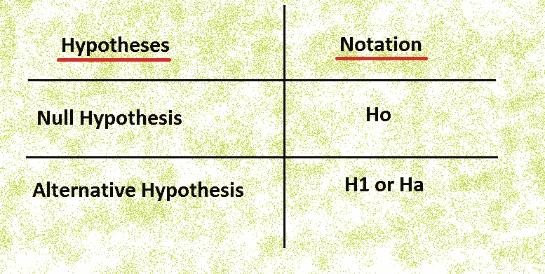
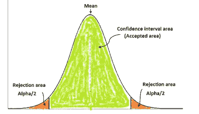
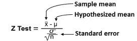
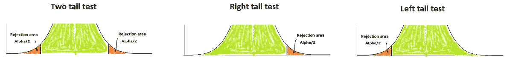
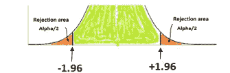
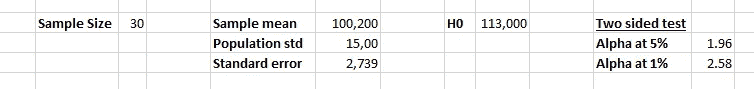
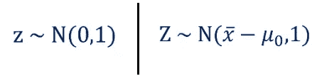
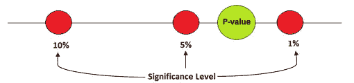

# 统计学中的假设检验及实例

> 原文：<https://pub.towardsai.net/hypothesis-testing-in-statistics-with-examples-844d698d99d5?source=collection_archive---------1----------------------->

## [统计数据](https://towardsai.net/p/category/statistics)

## 数据驱动决策的统计学概念

作者的照片

这篇文章对所有读者来说都会很有趣

假设检验是一种在观测数据点上进行统计检验的思想。这都是关于猜测哪些事情可以或不可以产生有意义的结果。

一个好的假设包含“如果”和“那么”两个词。例如，**如果**温度升高**，那么**固体就会融化。

## **本文的先决条件:**

*   描述性统计知识
*   推断统计学的知识

## **决策涉及的步骤如下:**

*   阐明一个假设
*   找到正确的测试
*   执行测试
*   决定

当我们总是做假设时，我们必须知道什么是我们的零假设。例如，如果我们说汽油价格更高，那么这只是一种陈述。如果我们说，一个州的汽油价格比另一个州高 2 卢比。所以，这种说法表明，在我们有一些数据可供分析的情况下，可以做一个假设。

示例:

经理的平均工资(或零假设)约为 10 万英镑，另一个假设是平均工资不在 10 万英镑左右。所以，我们必须检查零假设是否为真。

如果平均工资接近 100K，那么我们将接受零假设，如果不是，那么我们将拒绝零假设。

作者的照片

上述分布显示了均值落在其下的置信区间区域和由α表示的拒绝区域，即显著性水平区域。如果假设为真，alpha 值表示拒绝零假设的概率。α的典型值为 0.1、0.5、0.01，即 10%、5%、1%，最常用的值为 5%。

在上图中，我们可以看到平均值位于形状的中间，数据点呈正态分布。为此，我们进行 Z 检验，公式如下所示:

作者的照片

如果样本均值接近假设均值，并且如果样本均值等于假设均值，则 Z 变为零，则该测试旨在标准化或缩放样本均值。在这些情况下，我们会接受零假设。

 [## Z-统计量，T-统计量，P-统计量还在迷惑你？

### 机器学习统计学中的定义和概念

pub.towardsai.net](/z-statistics-t-statistics-p-statistics-are-still-confusing-you-87557047e20a) 

但是，Z 的值是多少才能拒绝零假设，为此我们已经不得不看到单侧和双侧尾检验。

作者的照片

5%拒绝区域的 alpha 值为“-1.96”和“+1.96”。该值来自(1-alpha) Z 表。

这意味着如果我们在 Z 检验中得到的值低于“-1.96”或高于“+1.96”，我们将拒绝零假设。

## 到目前为止我们讨论的要点

*   计算统计平均值
*   用 Z 测试来衡量它
*   检查 Z 是否在剔除区

## **例子**

作者的照片

在上面的照片中，我们给出了样本数据，所以我们将使用标准误差。

*   样本均值
*   假设平均值
*   样本量
*   标准误差
*   显著性值为 5%和 1%

现在，我们将使用 Z 测试公式来计算 Z 得分。不要把大写的 Z 和小写的 Z 搞混了，大写的 Z 说的是 Z 分，小写的 Z 说的是表中的临界值。与均值和方差相关的差异如下所示:

作者的照片

好的，在把所有的值输入 Z 后，分数是“-4.67”。由于值为负，在这种情况下，我们应该使用绝对值 Z 值。虽然，标准正态分布是围绕 0 对称的那么 Z 的负值< negative z is equal to the positive Z >正 Z

5%显著性水平的值|-4.67| > 1.96 — →我们将拒绝零假设。所以，没有统计证据表明平均值是 113，000。

1%显著性水平下的值|-4.67| > 2.58 — →即使在这个显著性水平下，我们也会拒绝零假设。

进一步不拒绝零假设的标准是什么？

因此，有一种特殊的技术使我们无法拒绝零假设，它被称为 ***p 值*** 。

**P 值**是在样本数据中观察到的，与最小α值相比较，以拒绝或不拒绝零假设。

作者的照片

**举例:**

在上面的示例中，Z 值为|-4.67|但是这个值太大了，很难在表中找到，所以我们选择 Z 表的(1-alpha)表的最后一个值，即 0.9990，并且与此相关的 p 值为 0.0001。

p 值=(1-表格中的数字)

拒绝零假设的条件是 p 值< alpha. So, in this case, we reject the null hypothesis at all 10%, 5%, 1% significance levels.

**我们再举一个例子:**

假设 Z 值为 2.12，在 Z 表中对应的值为 0.9830。单侧检验的 p 值为 0.017，双侧检验的 p 值为 0.034。在这种情况下，我们拒绝 10%和 5%的零假设，但不能拒绝 1%显著性水平的零假设。

如果 p 值达到 0.000，结果将更加显著。

 [## 统计学中的相关性及其类型

### 统计学有助于理解机器学习中的行为

pub.towardsai.net](/correlation-and-its-types-in-statistics-7a723dcfd12d) 

## 结论:

本文是假设概念的基础，并以方差已知为例。

我希望你喜欢这篇文章。通过我的 [LinkedIn](https://www.linkedin.com/in/data-scientist-95040a1ab/) 和 [twitter](https://twitter.com/amitprius) 联系我。

# 推荐文章

[1。NLP —零到英雄与 Python](https://medium.com/towards-artificial-intelligence/nlp-zero-to-hero-with-python-2df6fcebff6e?sk=2231d868766e96b13d1e9d7db6064df1)
2。 [Python 数据结构数据类型和对象](https://medium.com/towards-artificial-intelligence/python-data-structures-data-types-and-objects-244d0a86c3cf?sk=42f4b462499f3fc3a160b21e2c94dba6)3 .[数据预处理概念同 Python](/data-preprocessing-concepts-with-python-b93c63f14bb6?source=friends_link&sk=5cc4ac66c6c02a6f02077fd43df9681a)
4。[用 Python 进行主成分分析降维](/principal-component-analysis-in-dimensionality-reduction-with-python-1a613006d531?source=friends_link&sk=3ed0671fdc04ba395dd36478bcea8a55)
5。[用 Python 全面讲解 K-means 聚类](https://medium.com/towards-artificial-intelligence/fully-explained-k-means-clustering-with-python-e7caa573176a?source=friends_link&sk=9c5c613ceb10f2d203712634f3b6fb28)
6。[用 Python](https://medium.com/towards-artificial-intelligence/fully-explained-linear-regression-with-python-fe2b313f32f3?source=friends_link&sk=53c91a2a51347ec2d93f8222c0e06402)
7 全面讲解了线性回归。[用 Python](https://medium.com/towards-artificial-intelligence/fully-explained-logistic-regression-with-python-f4a16413ddcd?source=friends_link&sk=528181f15a44e48ea38fdd9579241a78)
充分解释了 Logistic 回归 8。[用 Python 实现时间序列的基础知识](https://medium.com/towards-artificial-intelligence/basic-of-time-series-with-python-a2f7cb451a76?source=friends_link&sk=09d77be2d6b8779973e41ab54ebcf6c5)
9。[与 Python 的数据角力—第一部分](/data-wrangling-with-python-part-1-969e3cc81d69?source=friends_link&sk=9c3649cf20f31a5c9ead51c50c89ba0b)
10。[机器学习中的混淆矩阵](https://medium.com/analytics-vidhya/confusion-matrix-in-machine-learning-91b6e2b3f9af?source=friends_link&sk=11c6531da0bab7b504d518d02746d4cc)