# 假设检验-均值、方差、比例的检验

> 原文：<https://pub.towardsai.net/hypothesis-testing-test-of-mean-variance-proportion-77ec2bfdd749?source=collection_archive---------0----------------------->

## [统计数据](https://towardsai.net/p/category/statistics)

## p 值法、临界值法、置信区间法

照片由来自 [Pexels](https://www.pexels.com/photo/two-yellow-emoji-on-yellow-case-207983/?utm_content=attributionCopyText&utm_medium=referral&utm_source=pexels) 的 [Pixabay](https://www.pexels.com/@pixabay?utm_content=attributionCopyText&utm_medium=referral&utm_source=pexels) 拍摄

# 假设检验

假设检验用于确定是否应该拒绝关于总体参数值的假设。

人口参数，如人口平均值、人口方差、人口比例等。

有不同类型的假设检验和不同的方法来执行假设检验。
让我们在这篇文章中详细了解一下。

# 假设检验的步骤

1.  阐明零假设和替代假设
2.  指定重要性级别
3.  确定检验类型
    a)单样本或双样本检验
    b)单尾/双尾检验
    c)均值/方差/比例检验
4.  计算测试统计量
5.  使用 p 值方法/临界值方法/置信水平方法做出决定→拒绝或不拒绝零假设

## 假设检验的类型

1.  零假设→不挑战现状
2.  另类假设→挑战现状

现状是指现在的情况。现状/公认规范。

# 制定无效和替代假设

零假设总是以假设为真的方式表述的。如果我们未能拒绝零假设，意味着不需要采取后续行动。

**例:**牛奶包标签为 500 ml。但是客户抱怨数量少于 500 毫升。

零假设是根据公认的规范制定的。这里的牛奶包装标注为 500 毫升。

**零假设 Hₒ → μ= 500**

零假设总是有一个等号

[因此，如果我们未能拒绝零假设，就不需要后续研究。公司不需要采取进一步的行动。但是如果我们拒绝了无效假设，公司必须采取纠正措施]

**另类假设 Hₐ → μ！=500**

> 假设检验的第一步:制定零假设和替代假设

# 错误类型

1.  **I 型错误→** 在不应该拒绝的时候拒绝零假设。用 **α** 表示

**2。第二类错误→** 在应该拒绝零假设的时候没有拒绝。用 **β** 表示

# 显著性水平，置信水平

**显著性水平**用 **α表示。**这是我们在犯第一类错误时的容许水平，这意味着当假设为真时拒绝零假设的概率。

大多数情况下， **α** 设定为 0.05

置信水平= 1- **α。**

**信心水平**表明你对决策的确定程度或信心。如果 **α** 为 0.05 均值，置信水平= 1–0.05→0.95。
置信度为 95%。

> 步骤 2 在假设检验中，指定 **α值**

# 假设检验的类型

在阐明假设检验之后，我们必须检查检验的类型。

1.  一个样品/两个样品
2.  均值、方差、比例检验
3.  一条尾巴/两条尾巴

## 一条尾巴/两条尾巴

单尾或双尾检验取决于替代假设的符号。

*   如果交替假设均值中没有等号，这就是双尾检验。否则，这是一个单尾测试
*   一个尾巴测试可以是左尾巴/右尾巴。
*   如果另一个假设有一个大于号，这是一个上尾/右尾测试。
*   如果另一个假设有一个小于号，这是一个低尾/左尾测试。

总体均值的检验将采用三种形式中的一种。

1.  **零假设→总体均值等于假设均值→双尾检验**

**Hₒ → μ= μₒ
Hₐ → μ！= μₒ**

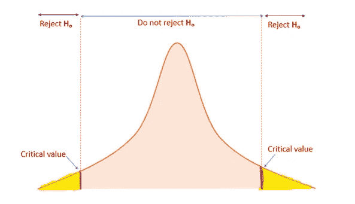

作者图片

在这里，我们必须检查两边。拒绝区域在两侧。

**2。零假设→总体均值小于或等于假设均值→单尾检验/右尾检验**

**hₒ→μ≤μₒ
hₐ→μ>μₒ**

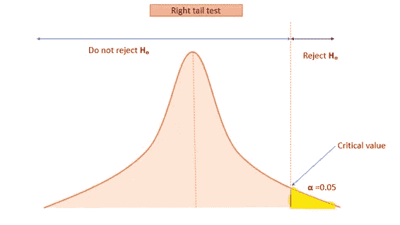

作者图片

在这里，在替代假设中，我们有大于符号。所以，拒绝区在右边。所以，这是一个右尾测试。

**3。零假设→总体均值大于或等于假设均值→单尾检验/左尾检验**

**hₒ→μ≥μₒ
hₐ→μ<μₒ**

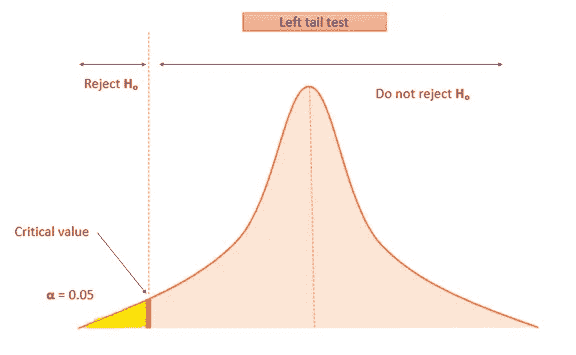

作者图片

这里，在另一个假设中，我们有小于符号。所以，拒绝区在左边。这是一个左尾测试。

# 一个样本/两个样本测试

1.  **一个样本**
    一个样本测试是对一个样本进行的测试，将它的值与总体参数进行比较。
2.  **双样本检验**两种类型的双样本检验

*   独立样本——双样本测试是对从两个不同人群中独立抽取的两个随机样本进行的测试
*   成对样本——在治疗前后对同一组进行双样本测试。
    举例。参加健身房前后的人的体重。[同一组人]

# 感兴趣参数

接下来，我们必须检查感兴趣的参数。

1.  均值检验
2.  方差检验
3.  比例检验

> 步骤 3:确定测试的类型。
> 
> 【举例。一个尾部，均值检验，一个样本检验]

# 检验统计量

我们必须从样本数据中计算检验统计量。在假设检验中，我们处理三个总体参数。[平均值/方差/比例]

## 1.均值检验

*如果已知总体标准偏差，使用 Z 检验计算检验统计量*

**Z 测试**

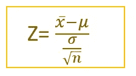

一个样本— Z 检验

x̅ →样本均值
μ →总体均值
σ →总体标准差
n →样本量

*如果总体标准差未知，使用 t 检验计算检验统计量*

**t 检验**

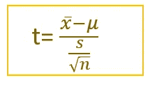

一个样本— t 检验

x̅ →样本均值
μ →总体均值
s →样本标准差
n →样本量

检验统计量遵循具有 n-1 个自由度的 t 分布。

当样本增加时，t 检验类似于 Z 检验。

## 2.比例检验

**Z 测试**

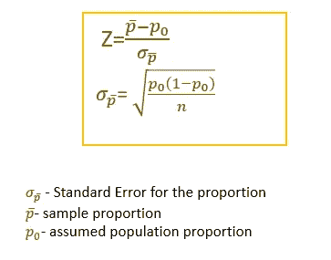

## 3.方差检验

**卡方检验**

n→样本量
s →样本方差
σ→总体方差

> 在假设检验中，计算检验统计量

# 假设检验的三种方法

1.  p 值方法
2.  临界值方法
3.  置信区间法。

# p 值方法

1.  使用公式计算 Z(如果总体方差已知或使用 t 检验)
2.  为计算出的 Z 值寻找 p 值
3.  将 p 值与 **α** (显著性水平)进行比较

**示例:一个样本—均值检验—左尾**

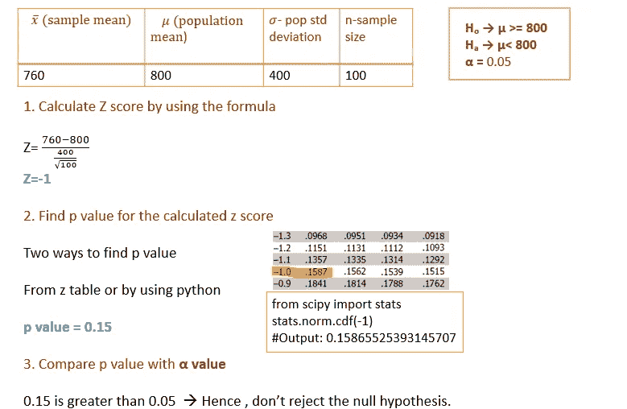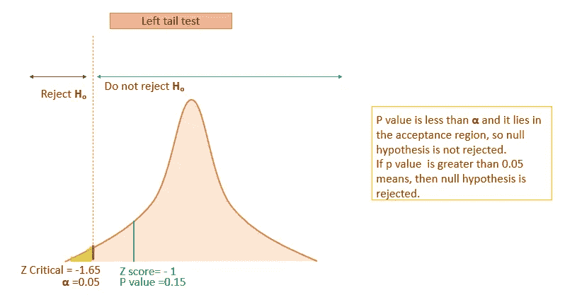

作者图片

# 临界值方法

1.  找出 **α** 的 z 临界值(显著性水平)。这就是所谓的临界值。
    a)对于左尾测试，计算 z 临界对于**α
    b)对于右尾测试，计算 z 临界对于 1-α
    c)对于双尾测试，计算 z 临界对于α/2 和 1-α/2**
2.  然后使用公式计算 Z 值(如果人口标准差已知或使用 t 检验)
3.  现在将临界值与计算出的 z 值进行比较

**示例:一个样本的均值检验—右尾检验**

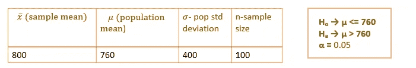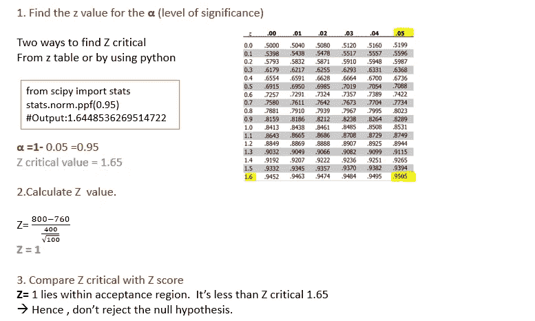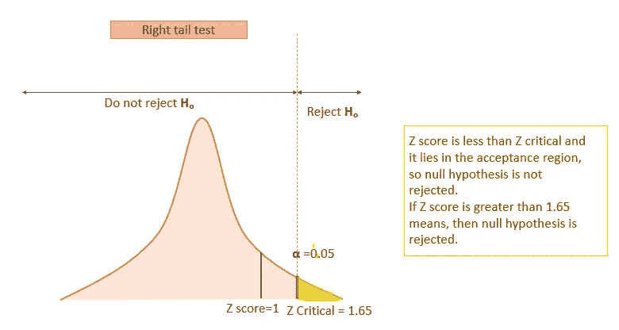

作者图片

## p 值与临界值方法

1.  在 p 值方法中，通过比较概率值来决定是否拒绝零假设。[ p 值与α值之比]
2.  在临界值方法中，通过比较计算的 Z 值和临界值来做出决定。

这两种方法的最终结果是一样的。

# 置信区间方法

置信区间是总体参数可能出现的值的范围。这种方法主要用于双尾检验。

**置信区间= x̅ Z *标准误差**

标准误差= σ/√n

1.  首先，计算 z 临界
2.  计算标准误差
3.  计算上限范围 **x̅ + Z *标准误差**
4.  计算下限范围 **x̅ — Z *标准误差**
5.  检查总体平均值是否在此范围内。这意味着不要拒绝零假设。

示例:均值检验—双尾检验—一个样本

> 第五步:使用 p 值法或临界值法或置信区间法来做决定

# 比例检验

示例:比例检验—双尾检验—一个样本检验

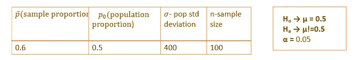

**使用 p 值法**

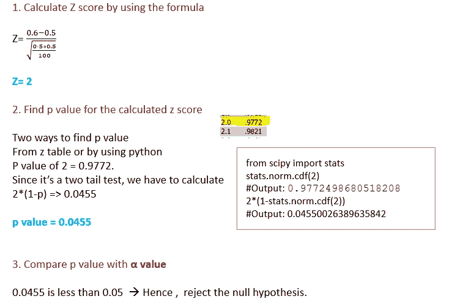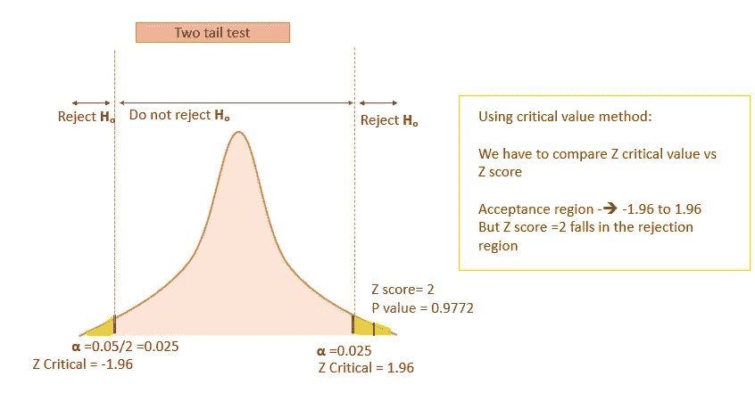

作者图片

# 方差检验

## 方差的卡方检验

我们知道均值的抽样分布遵循正态分布。

但是方差的抽样分布并不遵循正态分布。它遵循取决于自由度的卡方分布。

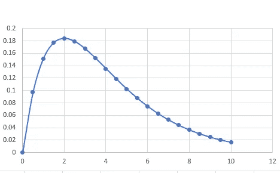

4 度卡方分布[图片由作者提供]

累积概率函数从右向左运行。当自由度增加时，方差减小，当样本量接近总体时，方差趋于服从正态分布。

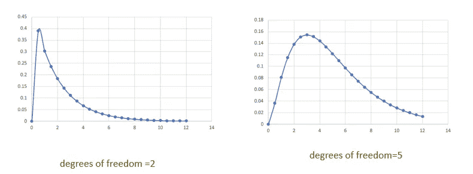

作者图片

**两种类型的测试**

1.  独立性检验
2.  适合度

**举例:**

**使用临界值方法**

示例:方差测试—右尾

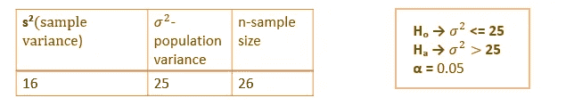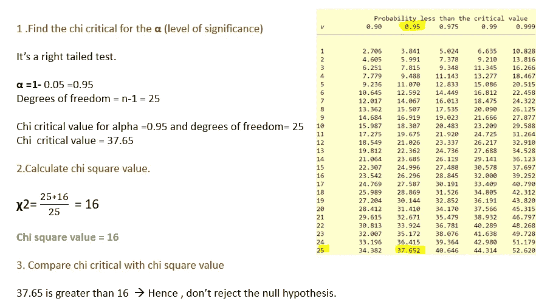

# 关键要点。

1.  **p 值逼近**
    a)右尾检验→ (1-p) vs alpha 值
    b)左尾检验→ p vs alpha 值
    c)双尾检验→ 2(1- p) vs alpha 值【如果样本均值在分布均值的右侧)
    d)双尾检验→ 2(p) vs alpha 值【如果样本在分布均值的左侧】
2.  **临界值逼近** a)右尾检验→求 1- **α** 的临界值并与检验统计量
    比较 b)左尾检验→求 **α** 的临界值并与检验统计量
    比较 c)双尾检验→求 **α/2 和 1-**α/2 的临界值并与检验统计量比较

# 结论:

在本文中，我介绍了使用不同方法(p 值、临界值、置信区间方法)进行假设检验的步骤。

我希望你们都喜欢它，并感谢阅读！

# **我的其他统计博客**

 [## 中心极限定理——解释清楚

### 抽样分布，标准误差

towardsdatascience.com](https://towardsdatascience.com/central-limit-theorem-clearly-explained-4fe60def52d6)  [## 数据科学的推断统计学

### 概率基础，概率分布

pub.towardsai.net](/inferential-statistics-for-data-science-91cf4e0692b1)  [## 使用熊猫和海牛探索描述性统计

### 定量方法和直观方法

pub.towardsai.net](/exploring-descriptive-statistics-using-pandas-and-seaborn-1b8501e1f27f)  [## 统计学中的重要术语-机器学习

### 统计和概率概念

medium.com](https://medium.com/analytics-vidhya/important-terms-in-statistics-machine-learning-4bfa5962e9be) 

*如果你喜欢看我的更多教程，就关注我的* [***中***](https://medium.com/@IndhumathyChelliah) ，[***LinkedIn***](https://www.linkedin.com/in/indhumathy-chelliah/)***，***[***Twitter***](https://twitter.com/IndhuChelliah)***。***

*点击这里成为中等会员:*[*https://indhumathychelliah.medium.com/membership*](https://indhumathychelliah.medium.com/membership)