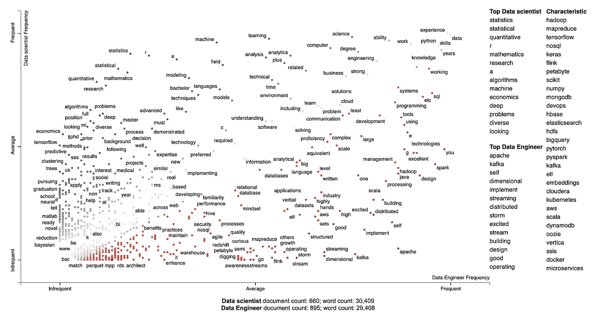
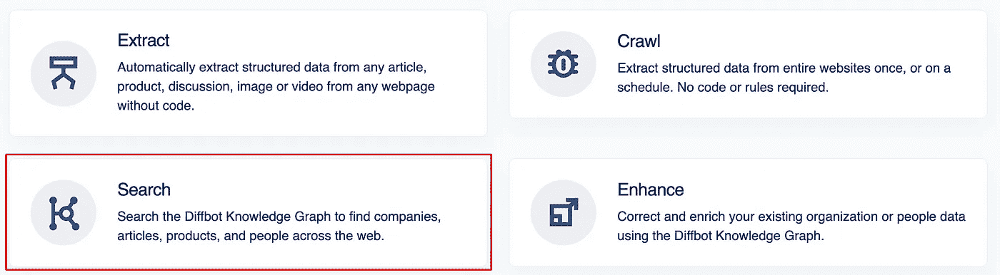
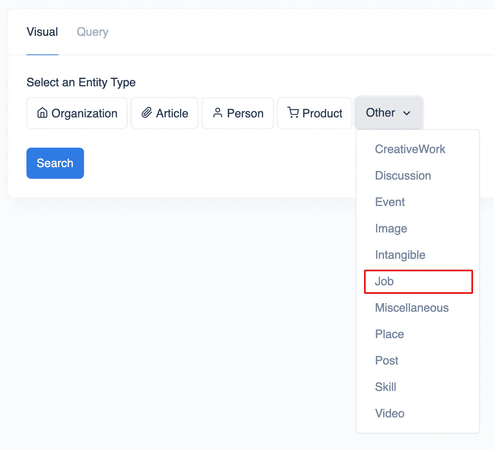
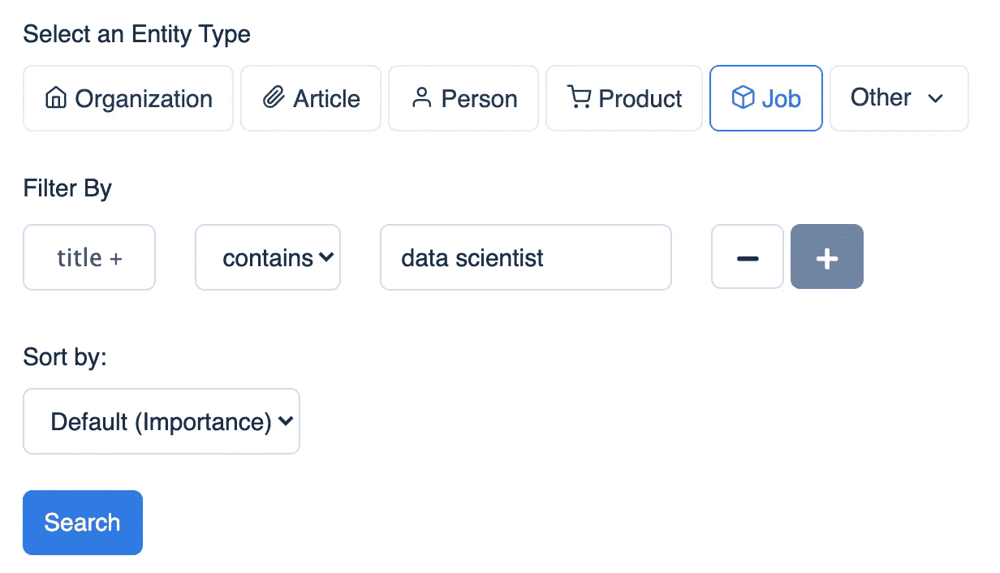
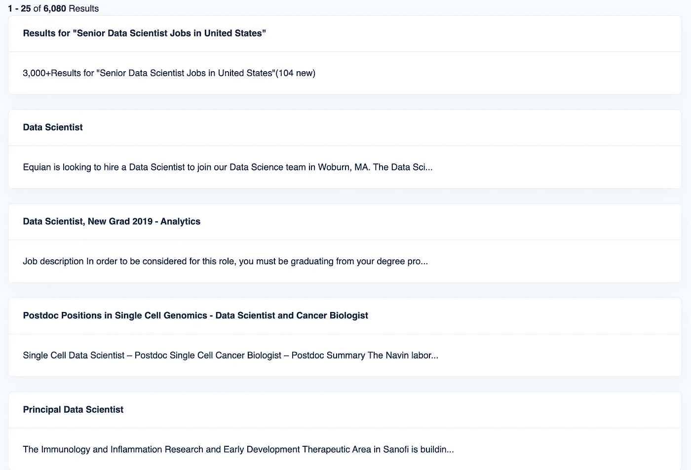
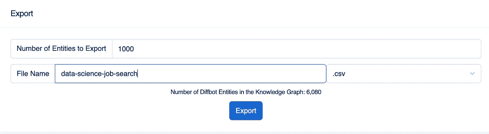
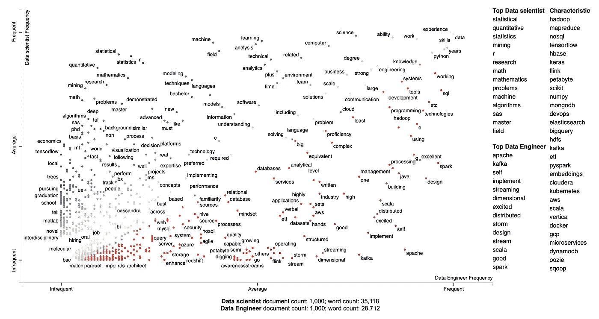
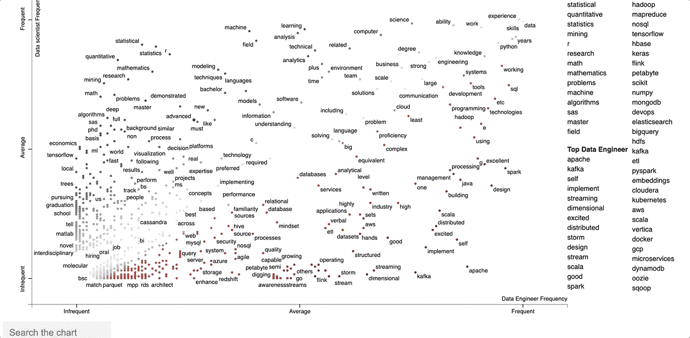
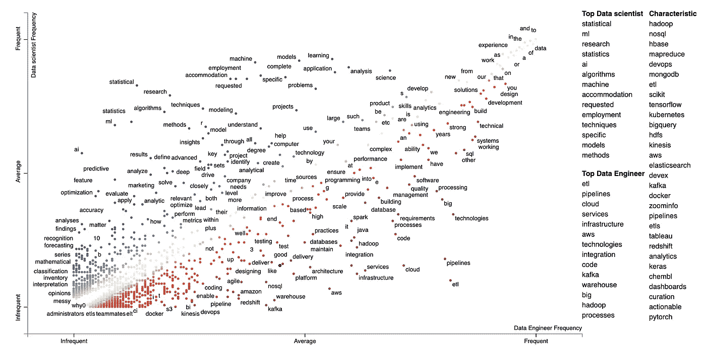

# 我分析了 2k 数据科学家和数据工程师的工作，这是我的发现

> 原文：<https://pub.towardsai.net/i-analyzed-2k-data-scientist-and-data-engineer-jobs-and-this-is-what-i-found-1ed37f98a704?source=collection_archive---------0----------------------->

## [职业](https://towardsai.net/p/category/careers)

## 利用你的 Python 技能来理解你理想工作的技能和要求

# 动机

你有没有想过数据科学家和数据工程师的工作要求有什么区别？与其通过许多工作需求来找出答案，为什么不使用一个工具来一次获得所有数据科学家和数据工程师工作的描述呢？

这时 Diffbot 就派上用场了。在本文中，您将了解如何一键提取与数据科学家和数据工程师相关的 2k 个职位，并使用散点图可视化这两个职位之间的关键字差异。



作者图片

# Diffbot 是什么？

Diffbot 是一个工具，可以让你在不到 1 秒钟的时间里，通过一次点击，从网络上提取出万亿个相关的事实。

从 Diffbot 开始，[注册 14 天免费试用。](https://app.diffbot.com/get-started/)这项免费试用将让您能够搜索世界上最大的知识图表，并允许您从任何网页中提取数据，而无需创建规则。

然后单击搜索选项来搜索 Diffbot 知识图。



作者图片

看到搜索页面后，从选择一个实体开始。由于我们要搜索作业，我们将选择实体作业:



作者图片

接下来，选择`title` `contains`带有`data scientist`字样的职位，然后点击搜索。



作者图片

在不到 1s 的时间内，您应该会看到如下所示的内容！



作者图片

更好的是，我们可以通过单击屏幕右上角的 CSV 按钮来下载搜索结果的 CSV 数据:


作者图片

查看数据，然后单击导出以导出 CSV 文件。



作者图片

重复上述步骤，得到标题`data engineer`的搜索结果。

你也可以使用`gdown`访问我从 Diffbot 下载的数据:

```
pip install gdown
```

# 分析和处理数据

从读取数据开始:

您的`data_scientist`数据帧应该如下所示:

不同网站中杂乱的数据被整理成`name`、`pageUrl`、`requirements`、`summary`、`tasks`、`text`、`title`。多酷啊。

接下来，我们添加一个名为`title`的附加列，指定该工作是寻找数据科学家还是数据工程师，然后合并两个数据帧:

接下来，过滤掉没有任何`text`的作业:

# 首页来源

最常见的页面来源是什么？从使用 [yarl](https://github.com/aio-libs/yarl) 提取页面源开始:

```
pip install yarl
```

然后想象前 20 页:

# 可视化文本

为了理解与数据科学家和数据工程师相关的工作中的常用词，我们将可视化`text`列中的短语。首先使用 [texthero](https://texthero.org/) 清理文本:

```
pip install texthero
```

然后使用 wordcloud 可视化所有文本:

```
pip install wordcloud
```

酷！正如我们可以从与数据工程师和数据科学家相关的工作描述中看到的，诸如“数据工程师”、“数据科学家”、“大数据”、“数据分析”、“数据驱动”等短语非常常见。

# 数据科学家和数据工程师的要求有什么区别？

我们真正感兴趣的是数据科学家和数据工程师的工作要求的区别。用[散文本](https://github.com/JasonKessler/scattertext)可以很容易地找到。

从安装分散文本开始:

```
pip install scattertext
```

然后处理`requirements`列:

建立语料库:

接下来，我们得到每个类别中每个术语的[标度 F 值](https://github.com/JasonKessler/scattertext#understanding-scaled-f-score)。

获得最高数据科学家 F 分数的术语:

```
['quantitative', 'statistics', 'r', 'machine', 'analysis', 'field', 'science', 'ability', 'computer', 'mathematics', 'analytics', 'work', 'techniques', 'degree', 'research', 'engineering', 'business', 'mining', 'environment', 'time', 'knowledge', 'python', 'experience', 'problems', 'skills', 'years', 'math', 'team', 'languages', 'bachelor']
```

```
['apache', 'kafka', 'self', 'implement', 'spark', 'dimensional', 'design', 'scala', 'storm', 'excellent', 'stream', 'building', 'java', 'g', 'operating', 'management', 'flink', 'growth', 'processing', 'hands', 'others', 'mapreduce', 'aws', 'pipelines', 'sets', 'datasets', 'e', 'perfect', 'enemy', 'ambiguity']
```

啊哈！与数据科学家头衔和数据工程师头衔联系最紧密的术语看起来没错。

光看课文没意思。让我们用散点图来形象化这两个职位之间的区别。

运行上面的代码后，打开文件`data_science_vs_data_engineer_requirements_terms.html`，您应该会看到如下内容:



作者图片

酷！点击[这里](https://khuyentran1401.github.io/Data-science/nlp/diffbot_examples/data_science_vs_data_engineer_requirements_terms.html)探索自己上面的剧情。

对以上情节的解释:

*   一个点越蓝，它就越与数据科学家这个头衔联系在一起
*   圆点越红，就越与数据工程师这个头衔联系在一起
*   右下角的术语在数据工程师中出现频率高，在数据科学家中出现频率低
*   左上角的术语在数据科学家中出现频率高，在数据工程师中出现频率低
*   特征术语是与数据科学家和数据工程师联系最紧密的术语

你看到一般的模式了吗？

*   对数据科学家的要求似乎主要集中在数学、统计学、定量科学、可视化、研究、硕士和博士学位等方面。
*   对数据工程师的要求似乎主要集中在数据工程师工具上，如 Apache Kafka、Scala、Spark、NoSQL、Hive、Hadoop。
*   Python 在数据科学家和数据工程师中很常见

要了解哪些文档包含特定的术语，请在散点图中单击该术语[。](https://khuyentran1401.github.io/Data-science/nlp/diffbot_examples/data_science_vs_data_engineer_requirements_terms.html#d3-div-1-snippets)



作者 GIF

# 比较数据科学家和数据工程师的任务

我们可以[将类似的方法](https://github.com/khuyentran1401/Data-science/blob/master/nlp/diffbot_examples/data_scientist_vs_data_engineer_task.ipynb)应用于`task`栏，以比较数据科学家和数据工程师之间的任务差异。

下面是结果:



作者图片

你可以在这里自己探索剧情[。你看出这两种职业的要求和任务之间的区别了吗？](https://khuyentran1401.github.io/Data-science/nlp/diffbot_examples/data_science_vs_data_engineer_task_terms.html)

# 结论

恭喜你！您刚刚学习了如何使用 Diffbot 抓取与数据工程师和数据科学家相关的工作描述，以及如何使用散点图创建散点图来比较这两种工作。

获得一份适合你技能和兴趣的工作需要你理解它的期望和任务。既然用 Diffbot 和 Python 不需要花太多力气就能得到上面这样的洞见，为什么不试一试呢？

在这里，您可以随意使用本文的代码:

[](https://github.com/khuyentran1401/Data-science/tree/master/nlp/diffbot_examples) [## 数据科学/NLP/diff bot _ master khuyentran 1401/数据科学示例

### 收集有用的数据科学主题以及代码和文章-数据科学/NLP/diff bot _ master 上的示例…

github.com](https://github.com/khuyentran1401/Data-science/tree/master/nlp/diffbot_examples) 

我喜欢写一些基本的数据科学概念，并尝试不同的算法和数据科学工具。你可以在 LinkedIn 和 Twitter 上与我联系。

如果你想查看我写的所有文章的代码，请点击这里。在 Medium 上关注我，了解我的最新数据科学文章，例如:

[](/visualize-gender-specific-tweets-with-scattertext-5167e4600025) [## 用分散文本可视化特定性别的推文

### 区分推文中的性别，并在交互式 HTML 散点图中呈现

pub.towardsai.net](/visualize-gender-specific-tweets-with-scattertext-5167e4600025) [](https://towardsdatascience.com/pyvis-visualize-interactive-network-graphs-in-python-77e059791f01) [## Pyvis:用 Python 可视化交互式网络图

### 只需要几行代码

towardsdatascience.com](https://towardsdatascience.com/pyvis-visualize-interactive-network-graphs-in-python-77e059791f01) [](https://towardsdatascience.com/i-scraped-more-than-1k-top-machine-learning-github-profiles-and-this-is-what-i-found-1ab4fb0c0474) [## 我收集了超过 1k 的顶级机器学习 Github 配置文件，这就是我的发现

### 从 Github 上的顶级机器学习档案中获得见解

towardsdatascience.com](https://towardsdatascience.com/i-scraped-more-than-1k-top-machine-learning-github-profiles-and-this-is-what-i-found-1ab4fb0c0474) [](https://towardsdatascience.com/top-6-python-libraries-for-visualization-which-one-to-use-fe43381cd658) [## 可视化的 6 大 Python 库:使用哪一个？

### 对使用哪种可视化工具感到困惑？我为你分析了每个图书馆的利弊

towardsdatascience.com](https://towardsdatascience.com/top-6-python-libraries-for-visualization-which-one-to-use-fe43381cd658)