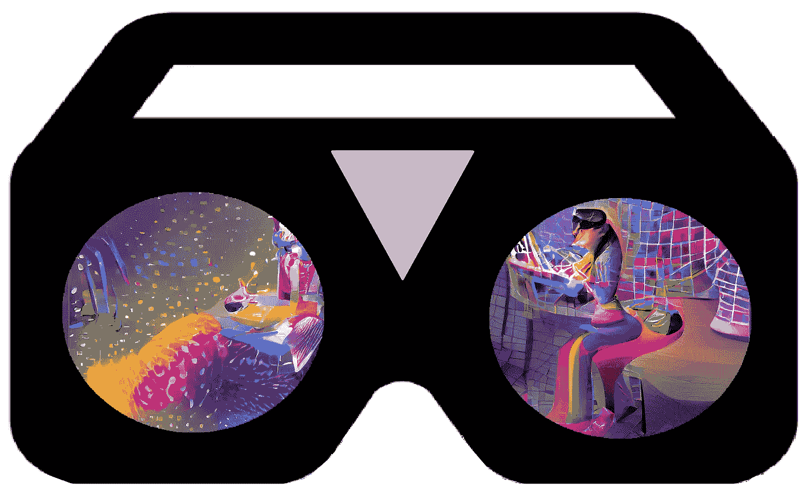

# 我迫不及待地期待 Meta 的下一款虚拟(和增强)现实耳机，以及它将如何改变工作和教育的未来

> 原文：<https://pub.towardsai.net/i-cant-wait-for-meta-s-next-virtual-and-augmented-reality-headset-and-how-it-might-change-the-c7e1899e68ed?source=collection_archive---------4----------------------->

## Meta 将其即将推出的耳机作为新的工作工具，正如他们所说，它将“取代你的笔记本电脑”。由于彩色的穿透相机，它不仅是 VR，也是 AR。

作者创作的图形。

马克·扎克伯格(Meta 的联合创始人兼首席执行官，前脸书)最近与投资者分享了新的信息([此处为该事件的完整文字记录](https://s21.q4cdn.com/399680738/files/doc_financials/2022/q1/Meta-Q1-2022-Earnings-Call-Transcript.pdf))，在活动期间，该公司还透露了一些关于即将推出的虚拟/增强现实(VR/AR)耳机的线索，并作为“Cambria 项目”的一部分进行开发。

值得注意的是，Meta 的新设备主要用于工作用例，而不是我们通常在 VR 和 AR 领域习惯的游戏和娱乐。这正是我非常希望的，因为正如你可能已经看到的那样，我指导了一些项目，这些项目涉及开发用于化学和生物学领域沉浸式工作和研究的未来工具——虚拟现实和增强现实是这些领域的核心:

 [## 化学和生物教育使用商品网络增强现实-在任何设备！

### 感谢现代教育内容在我们的分子网站和互联网上使用了基于网络的增强现实技术

medium.com](https://medium.com/geekculture/chemistry-and-biology-education-using-commodity-web-augmented-reality-in-any-device-9fa9fdc4ab35)  [## 网络浏览器上增强现实中的分子图形和模拟

### 瑞士化学杂志 Chimia 刚刚发表了我们的同行评议文章，描述了我们的最新补充…

medium.com](https://medium.com/age-of-awareness/molecular-graphics-and-simulations-in-augmented-reality-on-your-web-browser-9e79c7b75a04) 

即将推出的设备根本不是 Quest 2 的继任者，而是一款全新的产品。它将更加昂贵，并将包括一些新的特殊的东西(细节在下一节)。事实上，传言称 Oculus Quest 2 的应用程序甚至无法在新设备上运行。然而，原则上，WebXR 内容仍然应该兼容这两种设备，因为基于网络的 AR 和 VR 的核心理念要求:

 [## 元宇宙？不确定，但是 WebXR？太好了。

### 未来互联网的核心技术之一，我们已经将其应用于娱乐之外的领域。

medium.com](https://medium.com/age-of-awareness/metaverse-not-sure-but-webxr-hell-yes-12af5b302e08) 

这对于我的工作来说非常棒，因为我们所有的开发都是为 web 上的 AR 和 VR 准备的，利用了 WebXR API！

## Meta 的下一代 XR 耳机的特点

新设备将具有眼睛和面部跟踪功能，以便化身可以显示用户的面部表情，同时在人体工程学方面也有一些改进，并且，对我们的开发最感兴趣的是，我认为对工作至关重要的是，除了常规的 VR 之外，还有可能提供彩色的 AR。但这种 AR 不会像微软的 HoloLens 和类似设备那样“自然”,这些设备将虚拟物体的全息图投影到真实的世界视图上；相反，它将简单地投影一些彩色摄像机的输入。这不会感觉很自然，也无法与“真实世界的分辨率”相匹配，但这远比完全没有 ar 或 Oculus Quest 2 上可实现的简单灰度 AR 要好。

我认为，为了让耳机在工作中有用，增强现实是必不可少的，对于教育来说可能更是如此，这样学生就不会“疏远”纯粹的虚拟世界，与课堂脱节。

正如你所看到的，我对这种新产品感到非常兴奋。我希望我能很快试用它，它符合我的期望，也许会给我更多的惊喜。

## 几个进一步的阅读

Meta 的收益电话会议，会上发布了以下信息:

VRScout 对它做了一个非常简短的总结:

 [## Meta 的下一款 VR/AR 耳机将“取代你的笔记本电脑”——VR scout

### 在 Q1 2022 年收益电话会议上，Meta(前脸书)联合创始人兼首席执行官马克·扎克伯格分享了新信息…

vrscout.com](https://vrscout.com/news/metas-next-vr-ar-headset-will-replace-your-laptop/) 

www.lucianoabriata.com*我写作并拍摄我广泛兴趣范围内的一切事物:自然、科学、技术、编程等等。* [***成为媒介会员***](https://lucianosphere.medium.com/membership) *访问其所有故事(我免费获得小额收入的平台的附属链接)和* [***订阅获取我的新故事***](https://lucianosphere.medium.com/subscribe) ***通过电子邮件*** *。到* ***咨询关于小职位*** *查看我的* [***服务页面这里***](https://lucianoabriata.altervista.org/services/index.html) *。你可以* [***这里联系我***](https://lucianoabriata.altervista.org/office/contact.html) ***。***