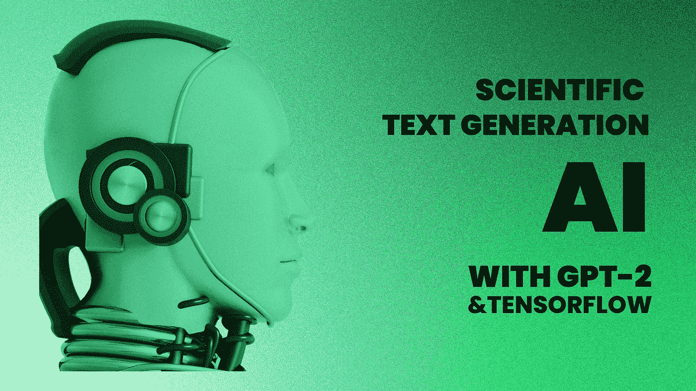
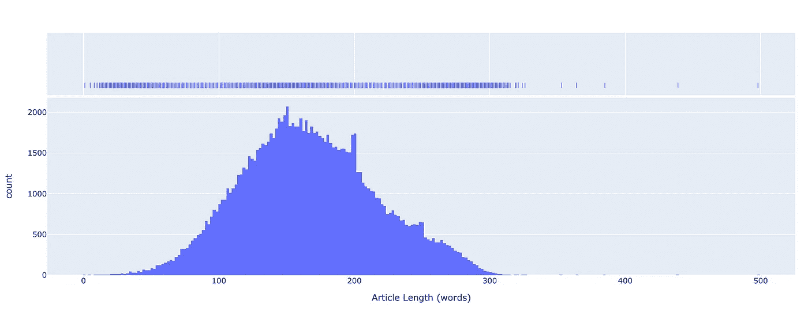
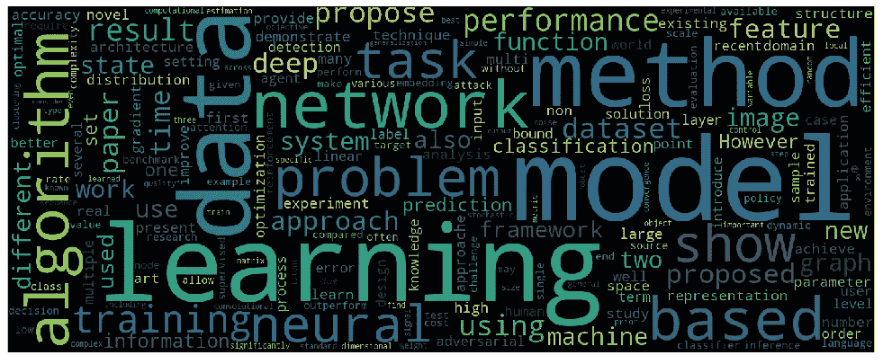
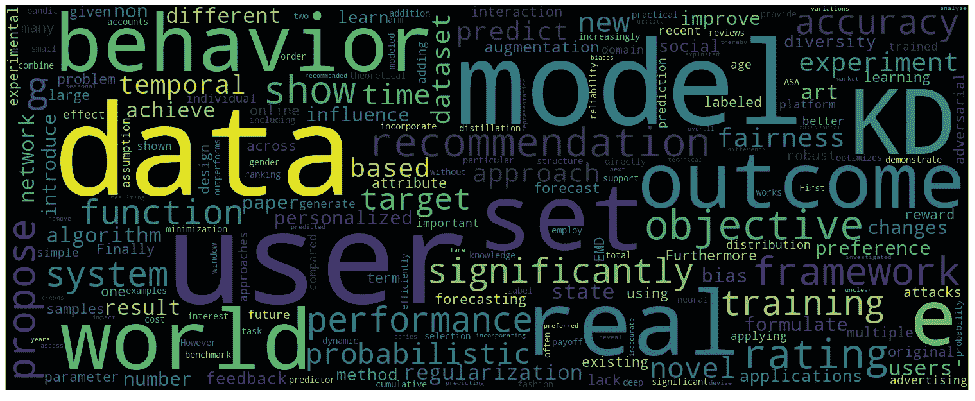
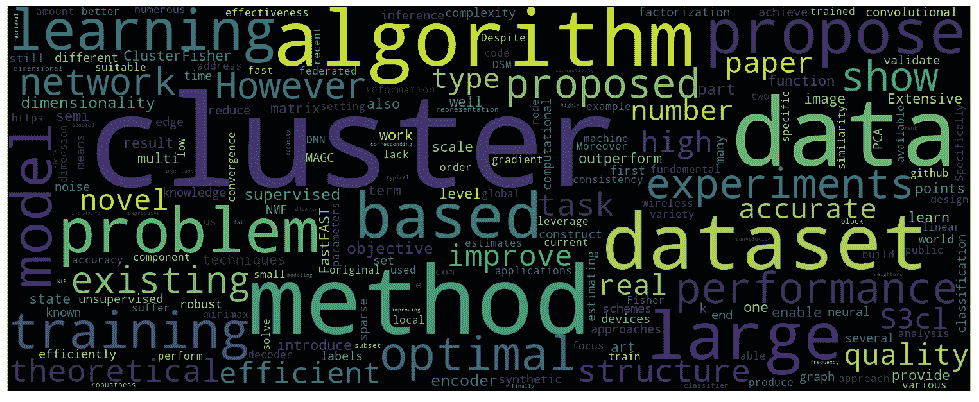
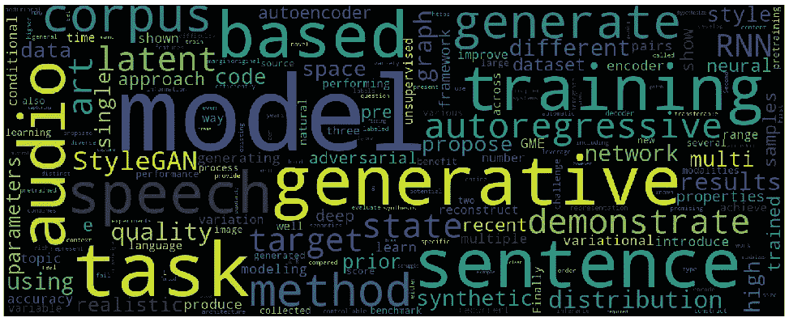

# 我在 11 万篇科学论文上微调了 GPT-2。这是结果

> 原文：<https://pub.towardsai.net/i-fine-tuned-gpt-2-on-110k-scientific-papers-heres-the-result-9933fe7c3c26?source=collection_archive---------0----------------------->

## AI 写内容很常见，但是一个 AI 有可能写技术论文吗？



用人工智能生成科学文本。图片由作者提供。

**人工智能**如今被广泛使用，能够**在多项任务中实现超人的表现**。**文本生成**是人工智能的新兴应用之一，被用于**几种场景**。自由形式的文本生成、Q & A 和抽象摘要只是其中的一部分。

为了调查一个**人工智能是否可以写技术论文，**我在大约 **100K 的机器学习论文**上训练了一个随意语言模型。

*结果质量如何？提议的方法有什么局限性？有可能让 GPT-2 写一篇完整的论文吗？这些是我将尝试回答的问题。*

## 介绍

**生成式预训练变压器** (GPT) 2 是由 **OpenAI** 于 2019 年开发的人工智能，允许多种用途:**文本摘要**、**翻译**、**问答**、**文本生成**。GPT-2 是在大型英语数据语料库上预先训练的**，此外，可以针对特定任务**进行**微调。**

在本文中，我将使用**hugging face****distilted-gp T2**(distil GPT 2)模型。 **DistilGPT2** 拥有**8200 万个参数**，是由**知识蒸馏**、**、**开发的**，而且**、**比 GPT-2 的**轻**、**快**。**

## 1.导入工具

我从导入所有需要的**工具**和**库**开始。

## 2.导入基线模型和标记器

然后，我使用`TFAutoModelForCasualLM`和`AutoTokenizer`来**自动**加载基于特定**检查点**的**正确模型**。检查点包含预训练模型的**重量。**

在本例中，我导入了 **DistilGPT-2 检查点。我还将**序列结束标记**设置为填充标记。**

## 3.导入数据

用于**微调**操作的数据集在 **Huggingface Hub** 上可用，并且它是托管在 **Kaggle** 上的更大数据集的一个**子集。**

由**康奈尔大学**发布的原始数据集包含 **1.7M 的**标题**和**摘要**以及属于 **STEM 类别的**科学论文。**托管在 Huggingface Hub 上的子集包含关于属于**机器学习类别**的大约 **100K 篇论文**的信息。

我决定**只在**摘要**上微调** DistilGPT-2。我从从 Huggingface Hub 加载数据集开始。

数据集由 **117592 行**组成，有 **4 列**(其中两列无用)。

经过这一步，我决定用直方图可视化出摘要的**长度** **分布** **(以字为单位)。**



摘要长度分布。图片由作者提供。

大多数摘要的长度在 100 到 250 字之间，只有少数超过 300 字的摘要是 T42 的。具体来说:**众数** =150，**均值** =167，**中位数** =164。

除了给出关于数据集的信息之外，直方图还允许我**确定输入到模型的输入**的最大长度。

我决定将**最大输入长度**设置为 **300 个令牌**:超过这个**的摘要将被截断**。这是因为所有的输入都必须用**填充到相同的长度**，长的文本序列**会大大增加** **的训练时间**。

## 4.分为训练集和验证集

接下来，我**将数据集**分割成**训练**和**验证** **集合**和`train_test_split()`。也可以用参数`test_size`指定分区的大小。

`train_test_split()`返回一个`Datasets`的字典，以前是一个`DatasetDict`。虽然可以用一个`DatasetDict`工作，但我更喜欢使用两个独立的`Datasets` : `train`和`val`。

## 5.用高频标记器标记数据

为了对数据进行标记化，我定义了一个**通用标记化函数**，然后我**通过使用`map()`将这个函数应用于所有的样本**。在标记化函数内部，我使用了一开始导入的**标记化器**。

记号赋予器有一些**重要参数需要设置**:

1.  **列对*列进行标记化。***在这种情况下“抽象”。
2.  ***填充*** 。在这种情况下，**的= " max _ lenght "填充一个序列**到由 max_length 参数指定的**最大长度**。
3.  ***截断*** 。如果为真，**截断长度超过最大长度**的序列**，最大长度由 max_length 参数指定。**
4.  ***最大 _ 长度*** 。指定序列的**最大长度**。

请注意，默认情况下，`map()`方法发送 1000 份样本。

## 6.向训练集和验证集添加标签

在随意语言建模中，标签是**输入标记** (input_ids) **右移**。这个操作**是由 Huggingface transformer 自动完成的，**因此I 用令牌 (input_ids)的**副本在数据集中创建了一个*标签*列。**

在此操作之后，训练和验证集有**三列**:来自**标记化**过程的`input_ids`和`attention_mask`，以及来自`create_labels()`过程的`labels`。

## 7.将训练集和验证集转换为 TF 数据集

接下来，我**将数据集**转换为`tf.data.Dataset`，这样 **Keras 就可以自然理解**；为此，我使用了`Model.prepare_tf_dataset()`。

关于`Dataset.to_tf_dataset()`方法，`Model.prepare_tf_dataset()`可以**自动**确定**使用哪些列名作为输入**，提供了一个**默认数据整理器。**

注意，我只对火车数据进行了**混洗。经过一番实验，我发现**最优批量= 16** 。**

## 8.编译、拟合和评估模型

在拟合模型之前，我设置了一个**学习率调度器**和**优化器**。我使用了 Keras**的`ExponentialDecay`调度器和 Huggingface** 的`AdamWeightDecay`优化器。

**学习率衰减**是一种技术**随着时间的推移降低学习率**。随着**指数衰减**，学习率以**指数方式降低**。

接下来我**编译了模型**。变压器模型通常**在内部计算损耗，**并且不需要指定损耗参数。对于**语言建模，**选择的损失是**交叉熵**。

此时，我设置了一个对 Huggingface Hub 的**回调，以**保存微调后的模型**。**

我还设置了一个对 Tensorboard 的**回调。**

最后，我**通过调用`fit()`方法来拟合模型**。我指定了**序列**和**验证**集合和**周期数**。

在训练步骤之后，I **对模型**进行评估，并在验证集上得到其**交叉熵损失**。

**损失=2.2371** 。一般来说，语言模型的**质量是用“**困惑度**来衡量的。为了将交叉熵转换为困惑，我简单地将**提高到交叉熵**损失的幂。**

这种情况下，**困惑=9.37** 。

## 9.使用管道生成文本

在这一点上，我利用 Huggingface 提供的`pipeline`功能来**查看运行中的模型**。

我建立了一个**文本生成管道，**指定了**微调过的** **模型、****分词器、**和**框架**来使用**。** `max_new_tokens`除了提供初始提示外，允许指定生成的**最大令牌数**(字数)。

两行代码足以让**用管道**生成文本:

`pipeline`不是**使用模型的唯一方式:可以用**手动标记提示**，**生成新的标记**，**将标记**解码为自然语言。这里有一个例子:**

## 12.结果分析

在对模型进行微调后，我想了解**模型学到了什么**以及**生成的文本如何受到**论文摘要用于训练**这一事实的影响**。

首先，我使用*“推荐系统的角色”*作为提示生成了一个样本文本。这是模型生成的**输出:**

```
'the role of recommender systems in the real-world is still largely to be demonstrated by the lack of data and the need for data. Hence, for many recommendation systems such as Amazon or Spotify, it is necessary to provide a user knowledge of the content that has been clicked during the recommendation and provide a user knowledge of the user preferences. The previous works attempt to exploit data related to items they have clicked during an appropriate time frame. But little attention has been paid to the problem of item classification where a suitable time-frame is available for user prediction. In this paper, we propose a multi-task learning approach to address the problem of item classification. For each task, we apply the contextual cues introduced by the user, and then learn to predict the user's purchased items' interests.   Since the contexts of user preferences, we consider the feature that the user's preference (the time-frame) is present at the time of recommendation. In particular, we propose an alternative method for attribute-aware learning that utilizes the contextual cues in the sequence and the user's preferences to learn a classifier that classifies the user according to the contextual cues. This is done by maximizing the mutual information between the user's rating and the content-aware prediction task. The experimental results show that our model achieves better accuracy than the existing state-of-the-art methods, achieving up to 33.6% more accuracy on real-world recommendation tasks compared to the state-of-the-art methods. Our source code is available at [http://github.com/J-medylerFashion/jmedian.github.'](http://github.com/J-medylerFashion/jmedian.github.')
```

这个结果听起来似乎是从一个现有的摘要中复制粘贴的，但是在用一些**反抄袭**解决方案检查后，我意识到它是 **100%独特的**。

在学习过程中，模型**捕捉到摘要**的共同特征，并学习**如何复制它们**，同时仍然**生成新的文本**。有趣的是，该模型使用了**科学语言**和**常用表达方式** : *前人著作…* ，*本文…* ，*我们提出…* 实验结果。

该模型还了解到，有时一个**存储库被添加到抽象中:**在这个例子中，生成的文本包含一个到 GitHub 存储库的 **URL。URL 和存储库不存在，因此**已经由模型**生成(并且没有被复制)。**

作为第二个实验，我通过使用“*集群*”作为提示生成了一个样本文本。在这种情况下，提示只由**一个单词**组成，因此文本生成不是由**附加上下文**驱动的。这是**输出:**

```
'clustering can be used to extract clusters from data points. However, in many real-world scenarios, data points often appear in non-Euclidean relaxations, which allows different clusters to be discovered simultaneously without the need for specific optimization. In this paper, we consider a class of applications where clustering methods are applied. A common example is that in image selection problems, we show to the optimizer that the expected improvement will be obtained by minimizing the average performance of the clustering method. Our main contribution is a characterization of optimization problems with respect to clustering methods. Specifically, we present a generalization of the optimal transport method for which our special bounds in terms of the maximum number of clusters are derived. We apply this algorithm to classification of human brain tumors, showing that it is computationally efficient. We show that based on our analysis of a particular type of tumor, our analysis leads to faster convergence to the optimal solution.'
```

同样在这种情况下，文本被报道为**独特的**并且有**常见表达** : *在本文中……*，*我们的主要贡献……*，*我们呈现……*。

第三个实验，我用的是*“文本生成的变形金刚”*。结果如下:

```
'transformers for text generation are becoming increasingly popular in computer vision, and so are the prevalent datasets that contain high-dimensional representations without manual feature engineering. We propose two algorithms for image generation from convolutional networks. We give the first procedure to remove important parts of this architecture and propose a novel architecture dubbed Multi-scale Text Generation Network (MTVGNet). Our MTVGNet-like architecture produces a compact set of representations without changing the model architecture or the pre-trained convolutional network. The resulting representation is compact and can be used as both training examples in training and inference in inference. Extensive numerical experiments on image synthesis and computer vision demonstrate that MTVGNet-like improves generative model performance by up to 32% over state-of-the-art methods for unconditional image generation, while incurring only 20% higher frame quality.'
```

即使在第三个例子中，也有多个**元素为科学摘要所共有，**且整体质量**略好于前一个**。

引用的*多尺度文本生成网络(MTVGNet)* 似乎是模型的**“发明”，因为我在文献中找不到参考。**

我想用一些**单词云**来结束这部分。第一个代表数据集中所有摘要中**最频繁出现的单词。其他的描绘了从**不同提示**产生的**10 个文本样本中**最常见的单词。**

可以立即注意到数据集**摘要**和**生成样本**之间的**词语相似度**。



所有摘要中出现频率最高的词。图片由作者提供。



10 个人工智能生成的文本样本中最常用的单词。提示:推荐系统的作用。图片由作者提供。



10 个人工智能生成的文本样本中最常用的单词。提示:聚类。图片由作者提供。



10 个人工智能生成的文本样本中最常用的单词。提示:用于文本生成的转换器。图片由作者提供。

## 结论

在本文中，我对科学论文摘要的一个转换器进行了微调。 *结果的质量如何？* *这种方式有什么局限性？有可能让 GPT-2 写一篇完整的论文吗？*

模特已经学会了**摘要一般是怎么写的**并试图**复制同样的*风格*** 。**成绩还不错，**考虑到**可用数据**和**只有一个训练历元**。

该模型似乎能够**生成关于不同机器学习主题的技术文本**，但结果**并不总是完全有意义，**有时**会有错误**。

当然，这种方法有一些限制，其中之一是生成文本的 T2 长度。虽然有可能通过**生成多个文本块**来克服这个问题，但是在某些时候，将**所生成的不同部分进行逻辑连接**会很困难。

总之，即使模型**不能写出一篇完整的技术文章**，我仍然惊讶并确信**一些可实现的结果**仍然可以成为**鼓舞**或**暗示**。

*感谢阅读！*

## 额外资源

*   E.比安奇，[用 Tensorflow 微调 GPT-2 进行文本生成](http://colab.research.google.com/drive/1APs0b3PaLYj77IVRY3qX_5VwOzQDBg_r?usp=sharing) (2022)，谷歌合作实验室
*   抱脸*、*、[文档](http://huggingface.co/docs) (2022)
*   抱脸，[蒸馏 2](http://huggingface.co/distilgpt2) (2022)
*   康奈尔大学，Kaggle 上的 arXiv 数据集
*   CShorten，[ML-ArXiv-论文数据集](http://huggingface.co/datasets/CShorten/ML-ArXiv-Papers) (2022)
*   维基百科贡献者，[困惑](http://en.wikipedia.org/wiki/Perplexity) (2022)
*   [维基百科撰稿人，交叉熵](http://en.wikipedia.org/wiki/Cross_entropy) (2022)
*   维基百科撰稿人， [GPT-2](http://en.wikipedia.org/wiki/GPT-2) (2022)
*   Keras 团队， [Keras 文件:指数衰减](http://keras.io/api/optimizers/learning_rate_schedules/exponential_decay) (2022)