# 我花了 15 美元的 DALL E 2 信用创造了这个人工智能图像，这是我学到的东西

> 原文：<https://pub.towardsai.net/i-spent-15-in-dall-e-2-credits-creating-this-ai-image-and-heres-what-i-learned-52f352912025?source=collection_archive---------0----------------------->

## 是的，那是一只美洲驼在扣篮。总结了 DALL E 2 封闭测试版的过程、局限性和经验教训。

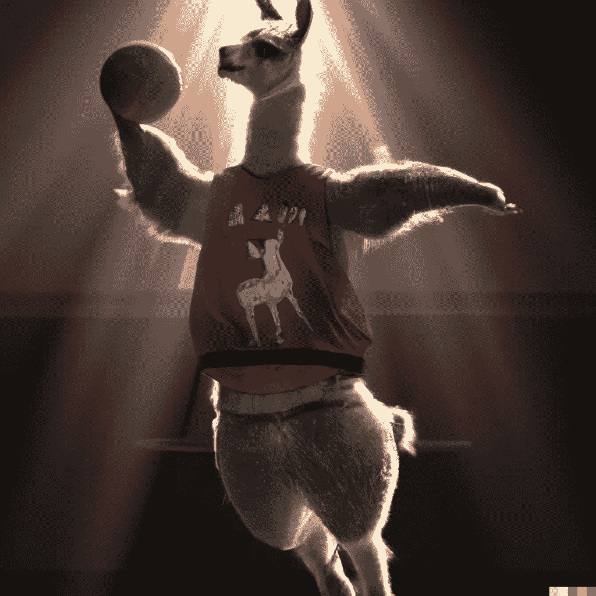

骆驼打篮球，由作者使用 DALL E 2 生成。

自从我第一次看到这张“柴犬便当盒”的人工生成图像后，我就一直渴望尝试 DALL E 2。

***哇——这才叫颠覆性技术。***

对于那些不熟悉的人来说， **DALL E 2 是 OpenAI 创建的一个系统，它可以从文本中生成原始图像**。

它目前处于封闭测试阶段——我在 5 月初注册了候补名单，并在 7 月底获得了访问权。在测试期间，用户将获得积分(第一个月免费 50 积分，之后每个月 15 积分)，每次使用需要花费 1 积分，每次使用会产生 3-4 张图像。你也可以花 15 美元购买 115 个积分。

> P.S .如果你迫不及待想试试，就免费试一试 [**DALL E mini**](https://huggingface.co/spaces/dalle-mini/dalle-mini) 吧。然而，它的图像质量通常较差(产生了大量的 DALL E memes )，每次提示大约需要 60 秒(相比之下 DALL E 2 只需要 5 秒左右)。

你可能已经在网上看到了各种精选的图片，展示了 DALL E 2 的能力(提供了正确的创意提示)。在这篇文章中，我分享了一个从零开始为主题创建一个可用图像的坦率的演练:“打篮球的美洲驼”。如果你想亲自试用 DALL E 2，或者你只是想了解它的能力，你可能会发现它很有用。

# 起点

知道什么时候给孩子喂食是一门艺术和科学。举例来说，下面是“*美洲驼打篮球”*的结果:

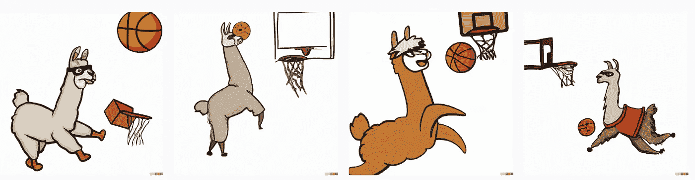

作者使用 DALL E 2 生成的图像带有提示“美洲驼打篮球。”

为什么 DALL E 2 对于这个提示倾向于生成卡通形象？我认为这与训练中缺乏美洲驼打篮球的真实图像有关。

我试图更进一步，添加了关键词“*的真实照片”:*

*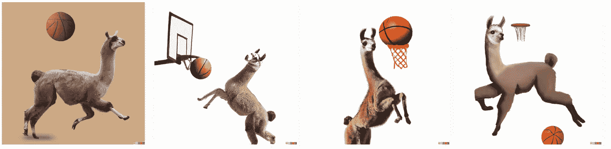*

*作者使用 DALL E 2 生成的图像带有提示“*美洲驼打篮球的真实照片**

*那只美洲驼看起来更加逼真，但整个图像开始看起来像是一个拙劣的 Photoshop 作品。在这种情况下，DALL E 2 显然需要一些牵手来创造一个有凝聚力的场景。*

# *快速工程，也就是精确指定你想要什么的艺术*

*在 DALL E 的上下文中， **prompt engineering 指的是设计提示给你想要的结果的过程。***

*[**DALL E 2 提示书**](https://dallery.gallery/the-dalle-2-prompt-book/) 就是这方面的绝佳资源。它包含了一个使用摄影和艺术关键词的提示灵感的详细列表。*

*为什么这样的事情是必要的？**因为从 DALL E 2 获得可用的输出是很挑剔的**(尤其是当你不确定 DALL E 2 有什么能力的时候)。以至于一家新的创业公司正在创建一个收费 1.99 美元的市场，来帮助你节省时间和金钱。*

*我个人最喜欢的发现是“*戏剧背光*”:*

*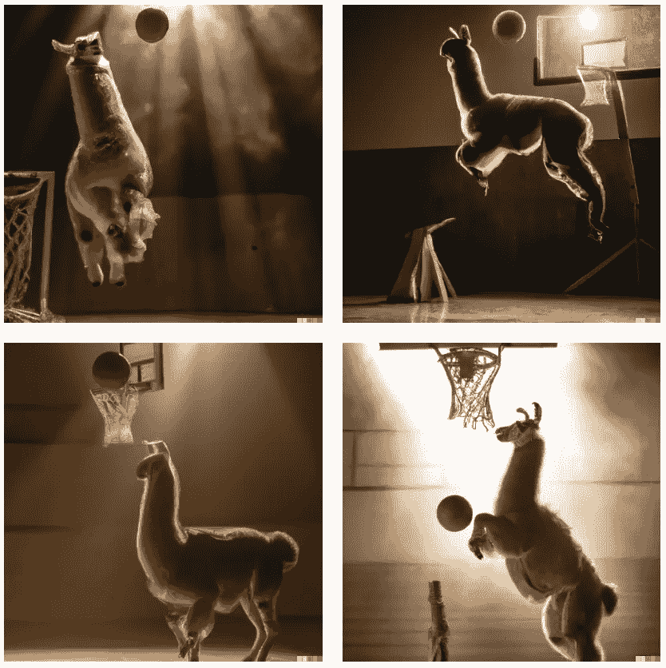*

*现在我们正在谈话！作者使用 DALL E 2 生成的图像，带有提示:“*美洲驼扣篮的电影剧照，低角度，超长镜头，室内，戏剧性的背光。”**

*明确告诉 DALL E 2 **你想要什么很重要。显然，从上下文来看，这只美洲驼不太适合这种场合。DALL E 2 很好地实现了这一幻想场景，然而，当指定“*美洲驼穿着球衣*”时:***

*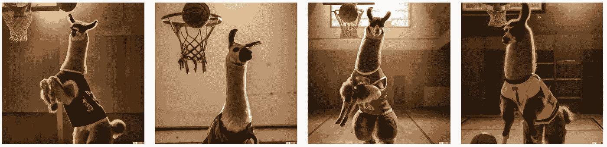*

*篮球扣篮骆驼，现在有球衣。作者用 DALL E 2 使用提示生成的图像:“*一张羊驼穿着运动衫，扣篮的电影剧照，低角度，长镜头，室内，戏剧性的背光，高细节。**

*它不止于此。为了给图像增加一些戏剧性，让这只美洲驼真正飞起来，我需要指定一些短语，比如“*灌篮*”、“*动作镜头……*”或者我个人最喜欢的:“… *穿着运动衫的美洲驼像迈克尔·乔丹一样灌篮*”:*

*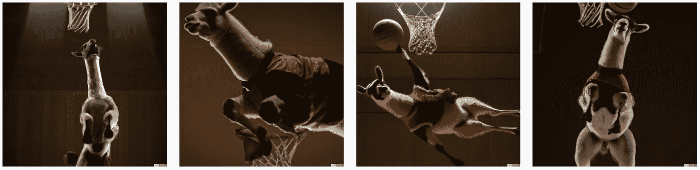*

*迈克尔·乔丹——如果他是一只美洲驼，根据 DALL E 2。作者用 DALL E 2 使用 prompt " *生成的图像是一张美洲驼穿着运动衫像迈克尔·乔丹一样扣篮的电影剧照，低角度，从下面看，倾斜帧，35°，荷兰角度，超长镜头，高细节，室内，戏剧性背光。*”。*

> ****提示:DALL E 2 只在你的历史标签中存储前 50 代。请确保保存您喜爱的图片。****

# *你可能已经注意到了:DALL E 2 不擅长作曲。*

*你可能会认为，从“扣篮”的上下文来看，美洲驼、球和篮圈的相对位置应该是显而易见的。通常情况下，美洲驼扣篮的方式是错误的，或者球的位置使得美洲驼没有成功的希望。尽管提示的所有元素都在那里，DALL E 2 并没有真正“理解”它们之间的关系。 [本文更深入地探讨了这个话题](https://www.unite.ai/is-dall-e-2-just-gluing-things-together-without-understanding-their-relationships/)。*

*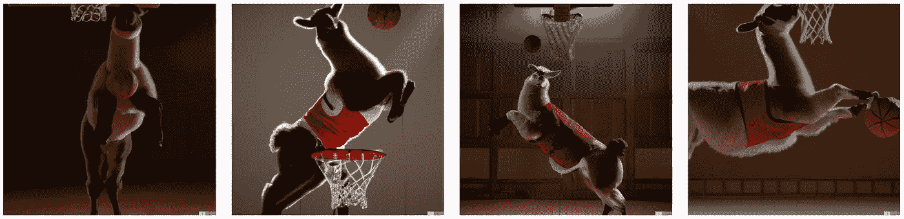*

*作者使用 DALL E 2 生成的图像，并带有提示:“一幅美洲驼穿着运动衫像迈克尔·乔丹一样扣篮的电影剧照，低角度，从下面拍摄，倾斜帧，35°，荷兰角度，超长镜头，高细节，室内，戏剧性的背光。”*

*DALL E 2 没有真正“理解”场景的另一个原因是纹理中偶尔出现的混淆。在下图中，网是由毛皮制成的(想想就觉得这是一个病态的场景):*

*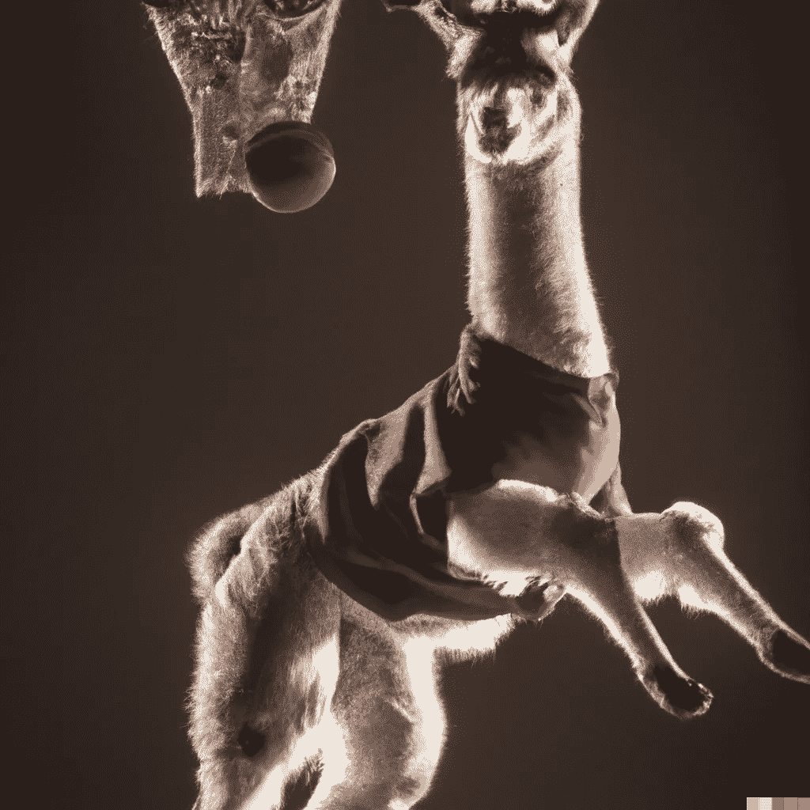*

*作者使用 DALL E 2 生成的带有提示的图像:“*富有表现力的照片，一只美洲驼穿着运动衫像迈克尔·乔丹一样扣篮，低角度，超广角镜头，室内，戏剧性的背光，高细节。**

# *DALL E 2 努力生成逼真的人脸*

*[根据一些消息来源](https://spectrum.ieee.org/openai-dall-e-2)，这可能是为了避免产生 deepfakes 的故意尝试。我以为这只适用于人类，但显然，它也适用于羊驼。*

*有些结果简直令人毛骨悚然。*

*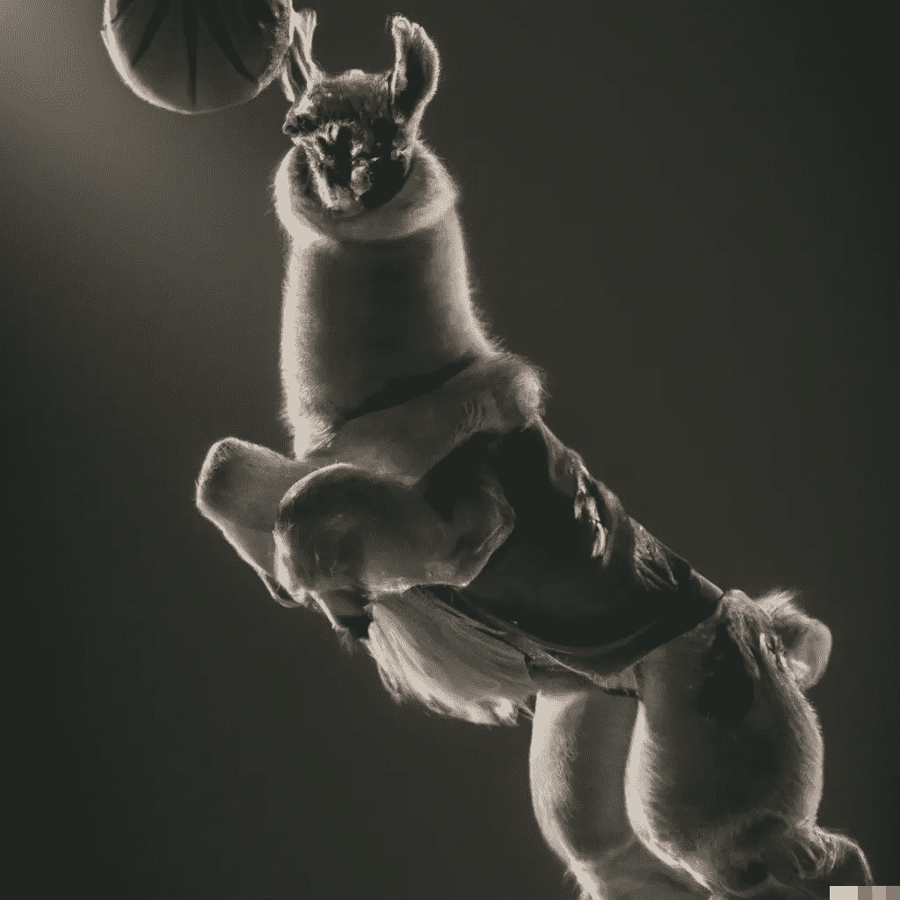*

*作者使用 DALL E 2 生成的图像，带有提示:“*一张美洲驼穿着运动衫像迈克尔·乔丹一样扣篮的生动照片，低角度，广角镜头，室内，生动的背光，高细节。*”*

# *DALL E 2 的其他一些限制*

*以下是我经历的其他一些小问题:*

## ***角度和镜头解释不严谨***

*无论我用了多少种不同的*距离*或*极端长镜头*，都很难找到整个美洲驼在画面中的位置。*

*在某些情况下，框架完全被忽略了:*

*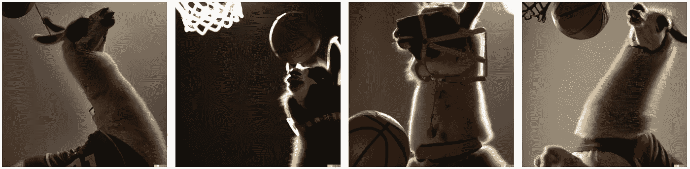*

*作者使用 DALL E 2 生成的图像，带有提示:“*一幅美洲驼穿着运动衫扣篮的戏剧电影剧照，低角度，从下面拍摄，倾斜帧，35°，荷兰角，超长镜头，室内，戏剧背光，高细节。**

## *DALL E 2 不会拼写*

*我想这不应该太令人惊讶，因为 DALL E 2 很难“理解”组件之间的关系。然而，它能够在正确的上下文中尝试一些完全形成的字母:*

*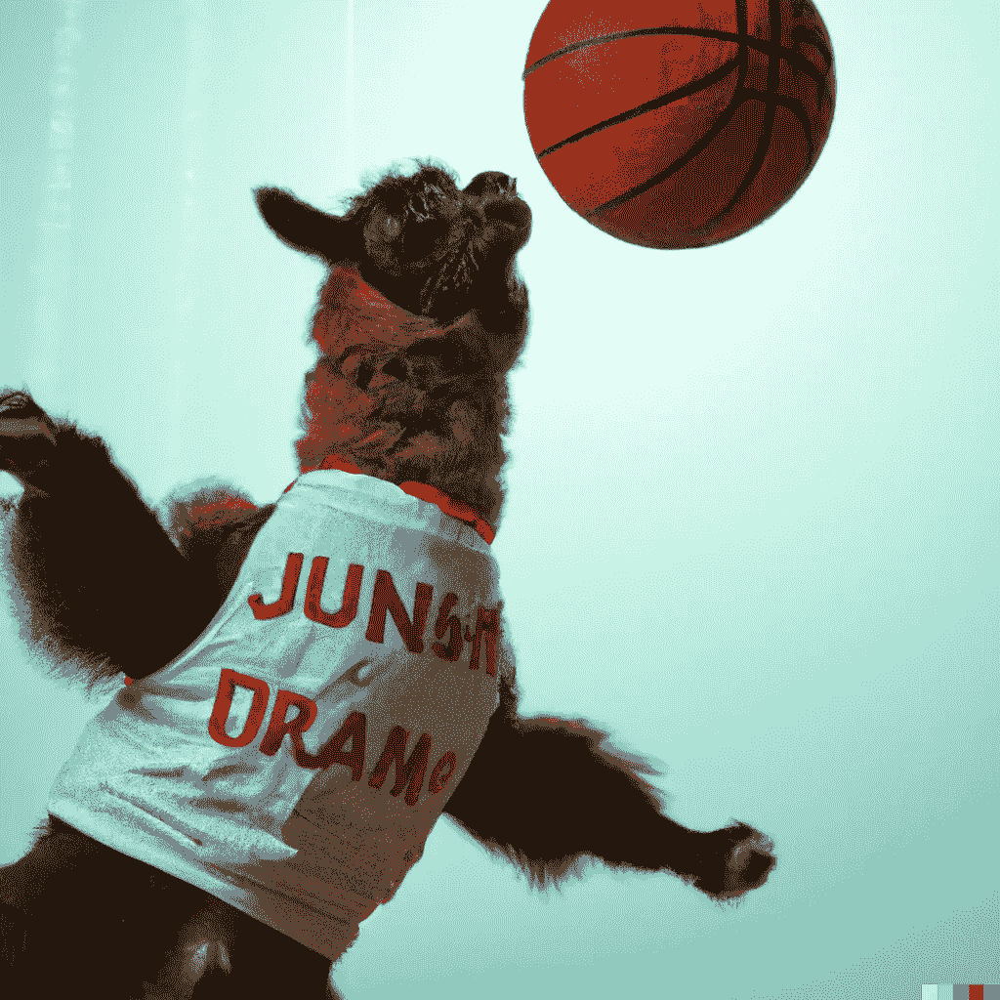*

*作者使用 DALL E 2 生成的图像，带有提示:“一张毛绒绒的美洲驼穿着运动衫像迈克尔·乔丹一样扣篮的电影剧照，低角度，从下面拍摄，倾斜帧，35°，荷兰角度，超长镜头，高细节，室内，戏剧性的背光。”*

## *DALL E 2 可能会因复杂或措辞不当的提示而变化无常*

*偶尔，添加关键字或以特定方式表达提示会导致与预期完全不同的结果。*

*在这种情况下，提示的真正主题(穿运动衫的美洲驼)被完全忽略了:*

*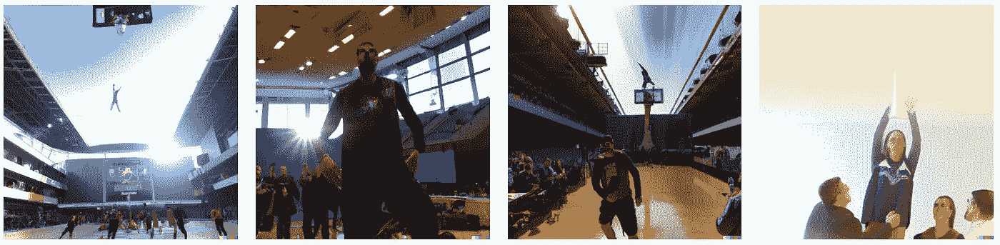*

*这是一个令人印象深刻的扣篮。作者使用 DALL E 2 生成的图像，带有提示:“*低角度，长镜头，室内，戏剧性的背光，穿着球衣的美洲驼的专业照片，扣篮。**

*即使加上“蓬松”这个词，也会导致性能显著下降，而且在很多情况下，它看起来就像 DALL E 2 刚刚……*打破了*:*

*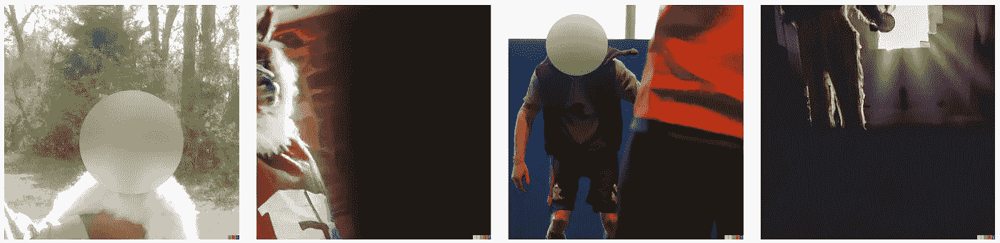*

*作者使用 DALL E 2 生成的图片，带有提示:“一个毛绒绒的美洲驼穿着运动衫像迈克尔·乔丹一样扣篮的电影剧照，高细节，室内，戏剧性的背光。”(有意修改图像以模糊和隐藏人脸)。*

*在使用 DALL E 2 的过程中，重要的是要明确你想要什么**，而不要过多或添加多余的单词。***

# *DALL E 2 转移风格的能力令人印象深刻*

*你需要试试这个！*

*一旦你有了你的关键词主题，你就可以用大量其他艺术风格生成图像。*

## *…的抽象画。*

*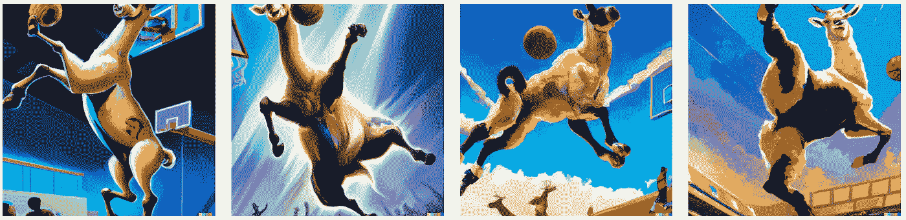*

*作者使用 DALL E 2 生成的图像，带有提示:“*抽象绘画一只穿着球衣的美洲驼像迈克尔·乔丹一样扣篮，从下面拍摄，倾斜帧，35°，荷兰角，超长镜头，高细节，戏剧性的背光，室内。背景是一个挤满了人的体育场。”**

## *“蒸汽波”*

*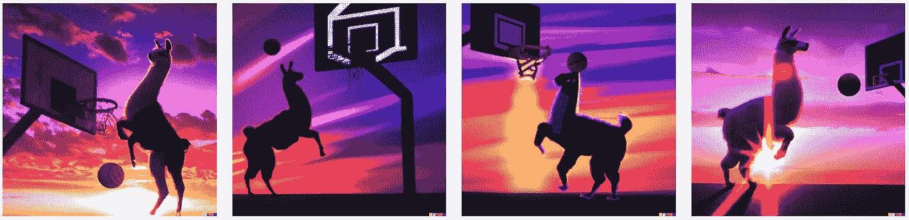*

*作者使用 DALL E 2 生成的图像，带有提示:“*一张美洲驼穿着运动衫像迈克尔·乔丹一样扣篮的电影剧照，戏剧性的背光，充满活力的日落，蒸汽波。*”*

## *“数字艺术”*

*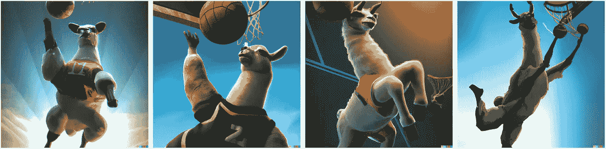*

*作者使用 DALL E 2 生成的图像，带有提示:“穿着球衣的骆驼像迈克尔·乔丹一样扣篮，从下面拍摄，倾斜画面，35°，荷兰角，超长镜头，高细节，戏剧背光，史诗，数字艺术”*

## *宫崎骏动画电影的截图*

*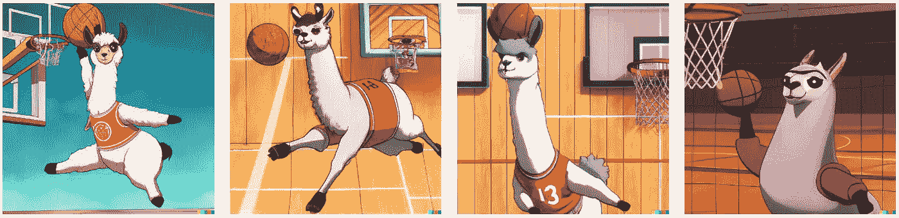*

*作者使用 DALL E 2 生成的图片，带有提示:“穿着运动衫的美洲驼像迈克尔·乔丹一样扣篮，来自宫崎骏动画电影的截图”。感谢本文中[的提示。](https://www.lesswrong.com/posts/uKp6tBFStnsvrot5t/what-dall-e-2-can-and-cannot-do#Art_style_transfer)*

# *最后的想法*

*经过 100 多个学分(约 13 美元)和大量的试错，这里是我的最终图像:*

*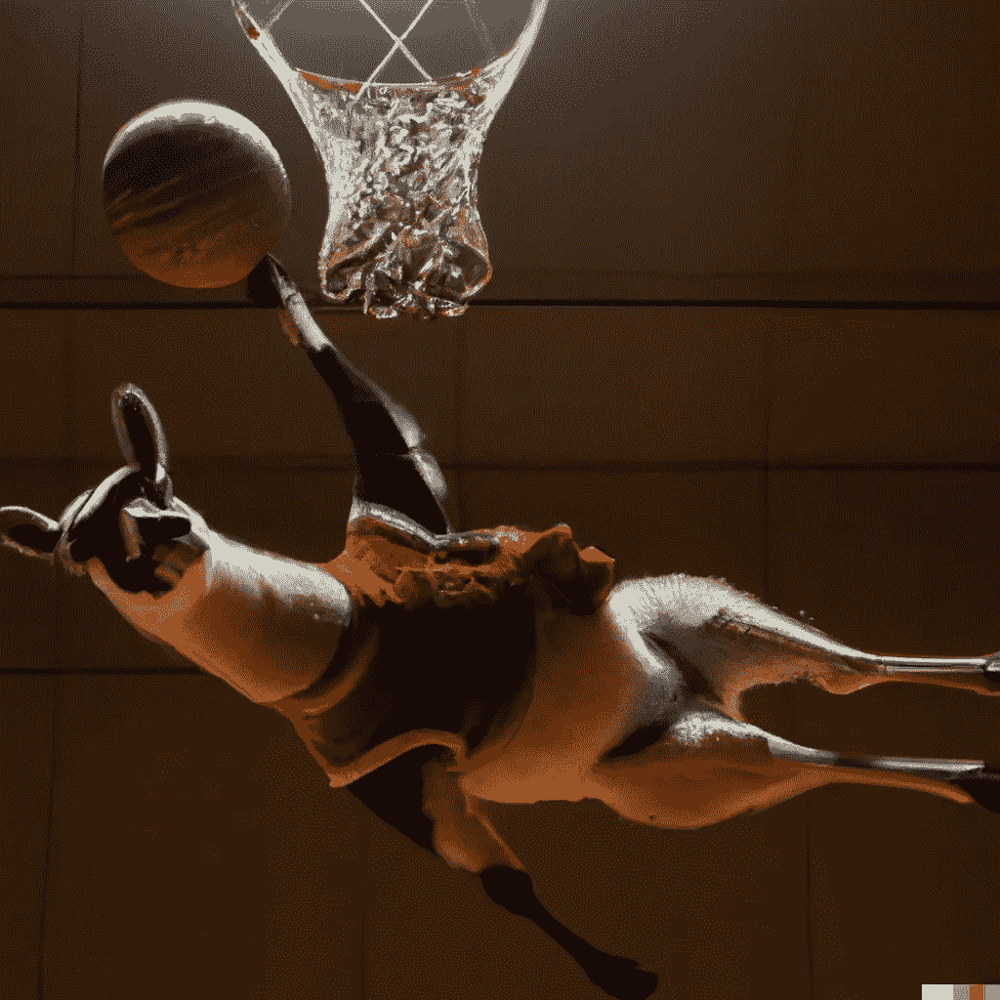*

*我的获奖形象。[https://labs.openai.com/s/HYv3Kp8ElKDAWKHq2vs76VXu](https://labs.openai.com/s/HYv3Kp8ElKDAWKHq2vs76VXu)*

*图像并不完美，但 DALL E 2 设法完成了大约 80%的简介。*

*大部分功劳都花在了尝试将风格、脸型和构图完美结合在一起。*

*根据 [OpenAI 的 dalle announcements](https://openai.com/blog/dall-e-now-available-in-beta/#fn1)t，*

> *“…用户获得完全的使用权，将他们用 DALL E 创建的图像商业化，包括重印、销售和商品的权利。”*

*预计许多用户会反复无常地玩这些规则。*

*作为一个内容创建者，DALL E 2 将最有助于为博客和网站创建简单的插图、照片和图形。我将使用它作为 Unsplash 的替代，来创建看起来和其他人不一样的博客封面图片。*

*如果你打算亲自试用 DALL E 2，这里有一个**TL；博士开始前的提示:***

*   *查看一下 [DALL E 2 提示书](https://dallery.gallery/the-dalle-2-prompt-book/)！(还有风扇自制的[提示工程单](https://www.reddit.com/r/dalle2/comments/v3jxud/me_and_someone_else_have_created_a_prompt/))。*
*   *准备好做一些尝试和错误来得到你想要的。15 个免费学分听起来很多，但实际上并不多。预计使用**至少** 15 个信用点来生成一个可用的图像。DALL E 2 是**不是**便宜。*
*   *不要忘记保存你喜欢的图片。*

***感谢阅读！我很想听听你对 DALL E 2 的体验，并欢迎任何想法或反馈。***

*如果你喜欢读这篇文章，这里有一些你可能也会喜欢的其他作家的文章:*

*   *[**我是如何使用 DALL-E 2 为 Jacob Martins 的 OctoSQL**](https://jacobmartins.com/posts/how-i-used-dalle2-to-generate-the-logo-for-octosql/) 生成徽标的*
*   *[**我如何用人工智能重新想象阿尔贝托·罗梅罗的 10 幅著名风景画**](https://towardsdatascience.com/how-i-used-ai-to-reimagine-10-famous-landscape-paintings-3e2924e03f79)*
*   *[**DALL-E2 能做什么不能做什么**](https://www.lesswrong.com/posts/uKp6tBFStnsvrot5t/what-dall-e-2-can-and-cannot-do) by Swimmer963*