# 我尝试了 Oculus Quest 2 VR 耳机及其支持 VR 的网络浏览器

> 原文：<https://pub.towardsai.net/i-tried-the-oculus-quest-2-vr-headset-and-its-vr-capable-web-browser-9f8a2285f22b?source=collection_archive---------3----------------------->

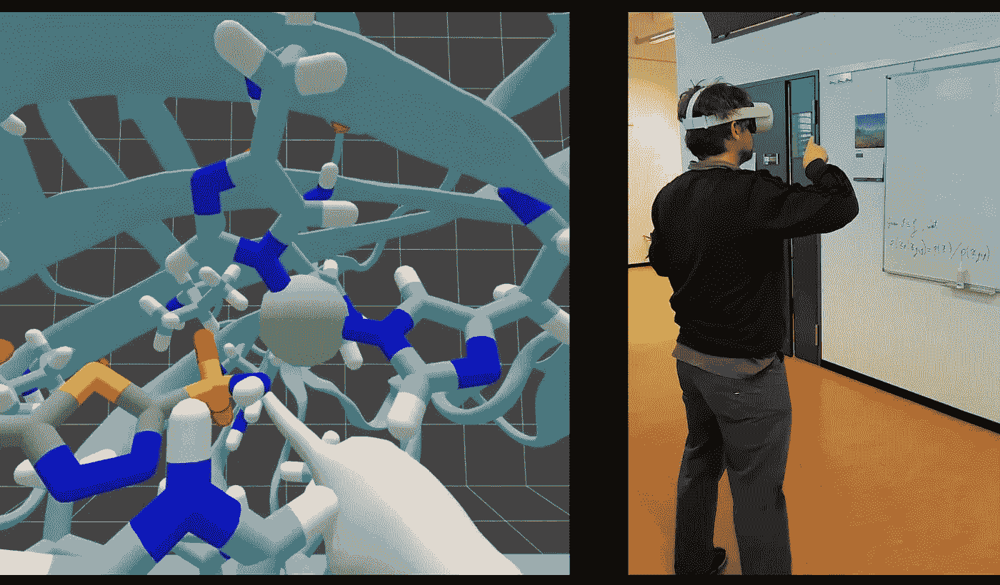

用一种抑制剂(一种磺酰胺)结合其活性位点来操纵一种蛋白质(人碳酸酐酶)。这款 WebXR 应用的开发者[法比奥·科尔特斯](https://medium.com/u/15e939a09b4a?source=post_page-----9f8a2285f22b--------------------------------)的视频截图。右边显示的人是这篇文章的作者 Luciano Aubrieta。

## [计算机视觉](https://towardsai.net/p/category/computer-vision)

## 我一直觉得 VR 设备的准入门槛非常高。你知道，戴着头盔，理解控制器，呆在外部摄像头的限制内，连接到计算机，需要安装应用程序才能运行…所有这些都令人沮丧。我想我不是唯一一个抱怨这一切的人…出于某种原因，虚拟现实和相关设备从未真正起飞。现在，400 欧元，这款名为 Oculus Quest 2 的设备解决了所有这些问题，让我拥抱了 VR 技术。来看看我的体验，非常积极，尤其是在使用它的 VR 兼容网络浏览器时，并找到我认为我们接下来需要的功能和修复。

我在这里提到的设备是 Meta(以前是脸书)的 Oculus Quest 2，这家公司现在投入了大量资金为*元宇宙*开发明确的虚拟现实工具。我不打算讨论元宇宙；相反，我在这里向您展示使用这款设备是多么容易，它创建的令人惊叹的虚拟现实场景，一些基于网络的虚拟现实应用程序的示例程序，以及一些明显的改进空间。

## 对设备的快速浏览

与旧设备不同，Oculus Quest 2 主要由 VR 耳机本身组成，你可以通过肩带调整到你的头部。你不需要任何外部摄像头或电脑，因为一切都在设备本身上运行。它可以非常准确地识别你的手的位置和姿态，所以你可以徒手与它的软件进行交互。对于某些应用，您可以(或必须)使用我在照片括号内显示的手持设备:

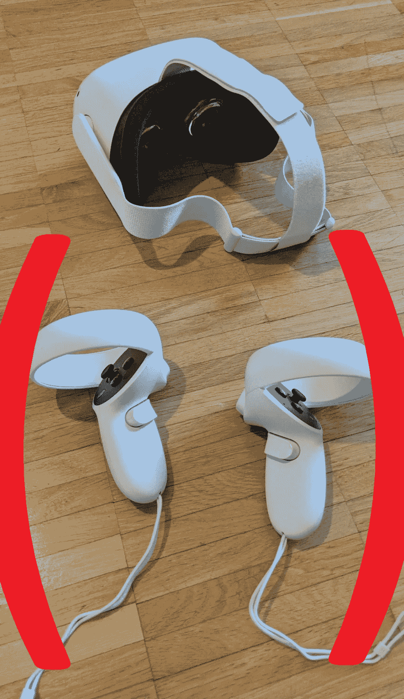

VR 头戴式耳机和只需用手就能更换的手持控制器(但有些软件确实需要控制器)。作者 Luciano Abriata 的照片。

这是虚拟现实耳机和手持控制器的另一个视图:

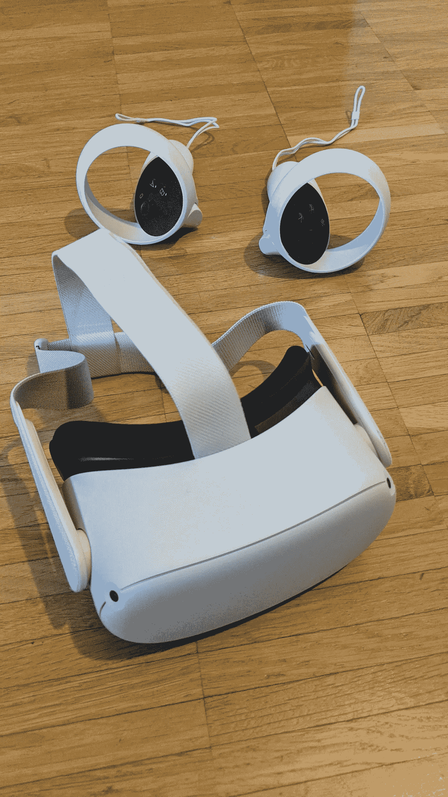

VR 头戴式耳机和控制器的另一个视图。(这里有人有幻觉吗？).作者 Luciano Abriata 的照片。

为了有效开发该设备的软件和内容，您最好通过电缆将其连接到您的计算机。然而，该设备还连接到 WiFi 网络，因此对于虚拟现实体验的网络编程的简单实验，您可能只需在您的计算机上的在线编辑器中编写代码，然后在 Oculus 的网络浏览器中重新加载页面来测试您的程序:

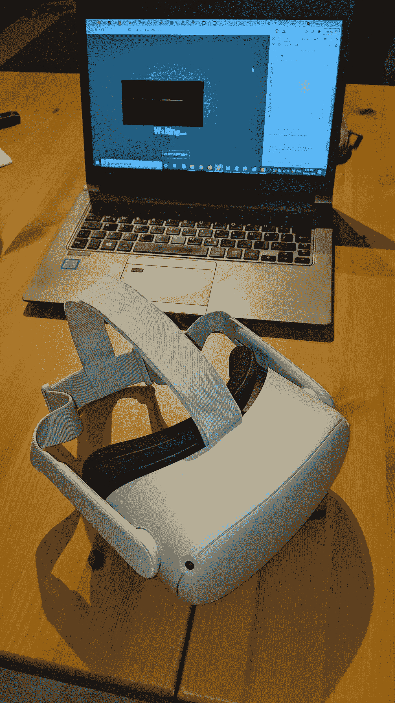

在电脑上编写和测试一个 WebXR 应用，在 Oculus 上实际使用。作者 Luciano Abriata 的照片。

# 测试设备的主界面和一些预装程序

这是设备的虚拟“大厅”或“大厅”，在普通计算机中扮演“桌面”的角色。这是一个非常棒的、轻松的设备入口点:

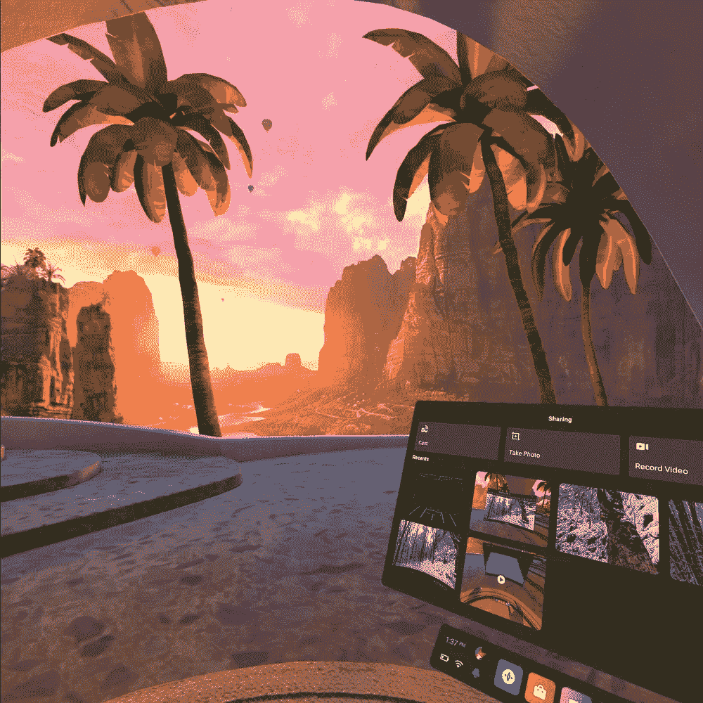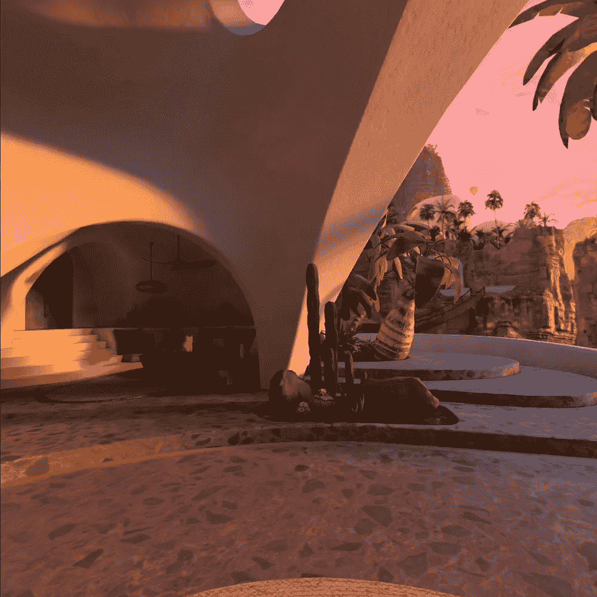

从这里你可以访问所有的软件。类似于电脑和平板电脑的“桌面”。作者 Luciano Abriata 截图。

第一张照片上的菜单收集了所有应用和文件的链接，很像 Window 的“开始”按钮。例如，在这里我启动了我的网络浏览器，那里有我的电子邮件，一张基于网络的 360 度照片，我将在本文稍后讨论，我稍后也评论了 MoonRider WebXR 游戏，我的 dropbox 帐户在其他人共享的文件中打开。真的就像你在电脑上使用的浏览器一样-但是等着看下面当你访问 VR 网页时会发生什么吧！：

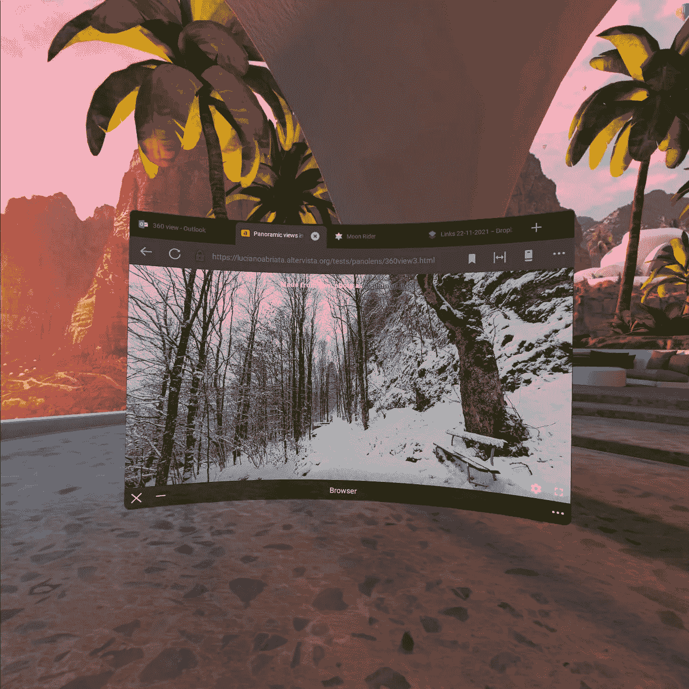

Oculus 的内置网络浏览器。作者 Luciano Abriata 截图。

## 在 YouTube VR 上观看身临其境的视频

设备自带一些预装应用，其中我认为 YouTube VR 是最好的一个。这里我在一个乐队演奏音乐的 360 度视频里…真的感觉我就站在那里！

在 VR YouTube 上看一个视频。我真的感觉就像是在这个房间里，有这个乐队为我演奏！作者 Luciano Abriata 截图。

要了解更多，请参见[https://vr.youtube.com/watch/](https://vr.youtube.com/watch/)你会发现，你甚至不需要像 Oculus 这样的虚拟现实设备来体验这些视频，这些视频也可以在智能手机上运行——你可以插入纸板护目镜，获得更身临其境的感觉。由于我喜欢这些低成本的替代品，我必须承认，整体体验远远不是实际的虚拟现实护目镜…

Oculus 预装了一些更基本的应用，如运动跟踪器、网飞应用和应用提供商的链接。最棒的是，我认为，一个可以运行虚拟现实内容的网络浏览器，我将在下一节专门介绍它。

# 基于 WebXR 的 VR 应用，沉浸式互联网和元宇宙的核心

## 值得一玩的 WebXR 游戏:MoonRider.xyz

在这个游戏中，你“在歌曲中穿梭”,用两把军刀(手持控制器)随着音乐的节拍和节奏打碎分散在整个轨道上的盒子。玩起来很有趣，也很简单——至少在简单模式下是这样的！

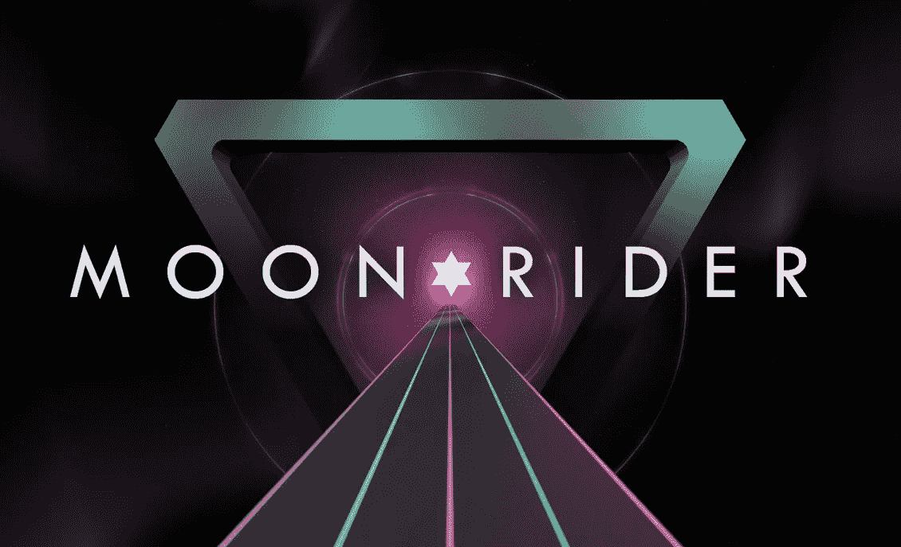

入门页面官方截图，来自游戏的 GitHub 账号。

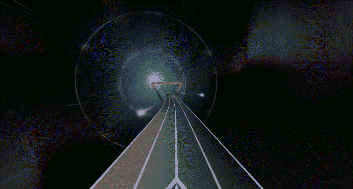

游戏进行过程中的示例视图，取自 GitHub 自己的帐户。

你可以在[https://moonrider.xyz/](https://moonrider.xyz/)玩游戏。开发这个游戏的主要网站在 https://github.com/supermedium/moonrider[的](https://github.com/supermedium/moonrider)

## 只需在浏览器中即可在线查看您自己的 360 度照片，方便与他人分享

通过使用像 Panoles.js 这样的 JavaScript 库，你可以很容易地在网页上嵌入球形和全景照片。虽然你可以在普通的智能手机、平板电脑和电脑上看到它们，如果设备有方位传感器，甚至可以通过移动设备来导航它们，但如果你用 Oculus 访问网页，体验会更加身临其境。

看这里这个例子，你只需点击一下就可以试用:[https://lucianoabriata . alter vista . org/tests/pano lens/360 view 3 . html](https://lucianoabriata.altervista.org/tests/panolens/360view3.html)

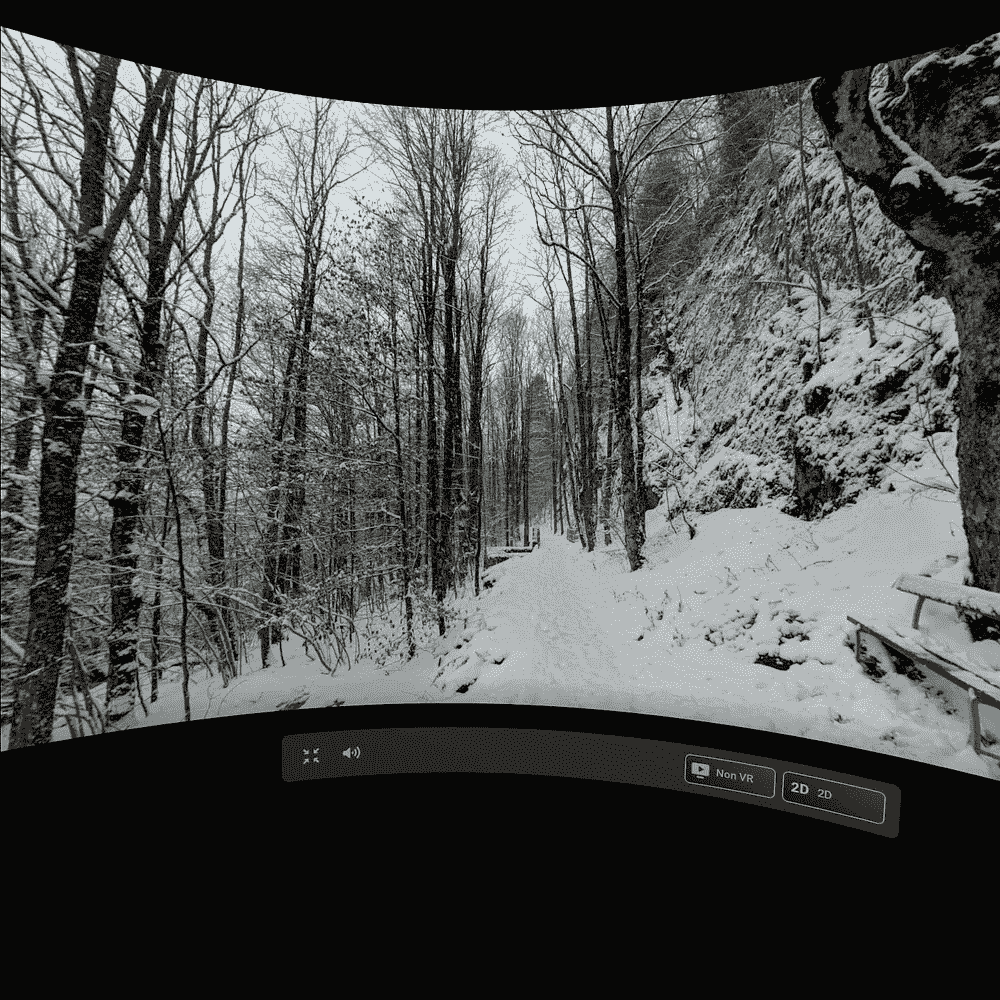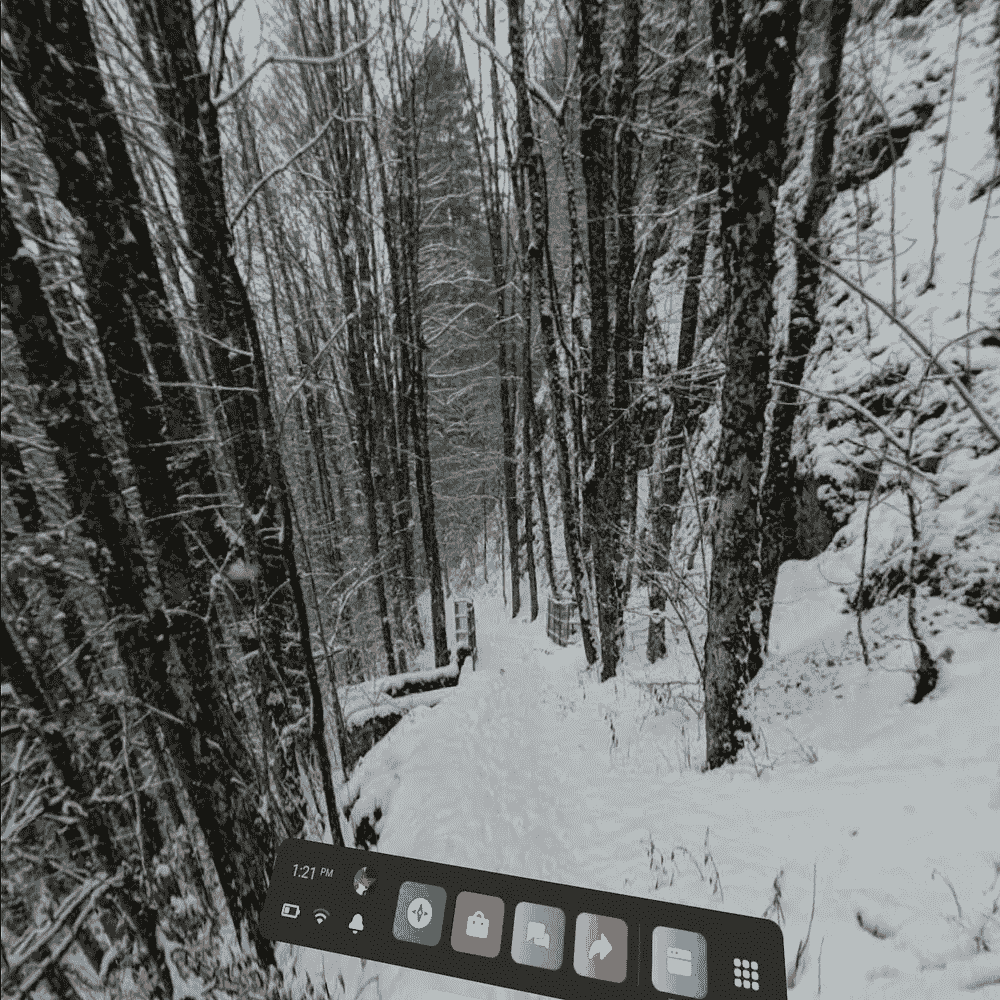

我用智能手机拍摄的 360 度照片，在 Oculus Quest 2 的网络浏览器中以投影模式和 VR 模式显示。作者 Luciano Abriata 截图。要了解更多关于这些照片的信息，请查看[这个照片故事](https://medium.com/snap-shots/winter-walk-around-an-altitude-mountain-lake-e19268a6d404)。

## 来自 moleculARweb 的 WebXR 视图

这是 WebXR 工程师 Fabio Cortes 的杰作，他和我一起在@EPFL 的学术实验室研究所有这些进展。这里我用手移动一个 DNA 分子:

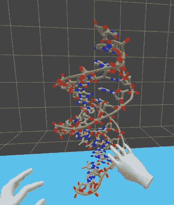

徒手操纵一个 DNA 分子。作者 Luciano Abriata 截图。

在这里，我解释了一个临床使用的小分子是如何与蛋白质结合的，它调节蛋白质的功能以达到治疗效果——你也可以在右边看到我:

用一种抑制剂(一种磺酰胺)结合其活性位点来操纵一种蛋白质(人碳酸酐酶)。这款 WebXR 应用的开发者[法比奥·科尔特斯](https://medium.com/u/15e939a09b4a?source=post_page-----9f8a2285f22b--------------------------------)的视频截图。右边的人是作家卢西亚诺·阿布利亚塔。

你可以在这个视频中看到上面的例子:

## 一种加密货币的虚拟股票市场

通过将 WebXR 与对数据提供商的 web API 调用集成，您可以创建这种身临其境的虚拟股票市场，实时显示一些加密货币的价格，这里是比特币:

 [## 网上虚拟现实环境中加密货币数据的实时显示

### 一种“虚拟股票交易中心”

towardsdatascience.com](https://towardsdatascience.com/live-display-of-cryptocurrency-data-in-a-vr-environment-on-the-web-af476376d018) 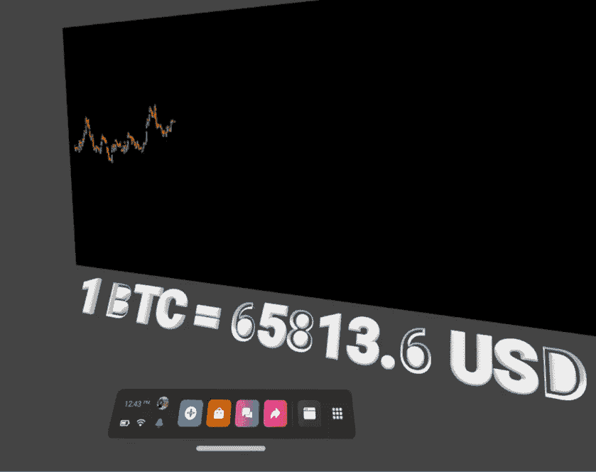

一段时间内比特币的价格，取自一个开放的 API，用 VR 呈现。作者 Luciano Abriata 截图。

# 改进的余地

我在介绍中对旧设备的所有主要批评都在 Oculus Quest 2 中得到了解决。但是我们仍然可以强调一些明显的限制，以及用户和开发人员都希望看到的特性:

*   首先，仍然没有太多的内容，而且现有的内容还没有充分发挥这项技术的潜力。虽然视频内容已经相当丰富，但交互式应用仅限于简单的游戏、带有轶事应用的小应用，并没有太多内容。随着元宇宙的发展，这种情况应该会很快改变。
*   让我印象深刻的一点是，Oculus 没有任何内置的语音识别功能。这种技术在今天得到了广泛的发展，并且对于在这种用户的手有点忙的环境中工作是必不可少的！我没有看到任何关于此事的评论，但我希望它会得到解决…
*   另一个问题是对虚拟现实的限制和对增强现实的不支持。实际上，有一个新的直通 API，程序员可以用它把来自红外摄像机的信息投射到虚拟现实屏幕上；然而，这只是在灰度和相当多的失真，无论如何是无法访问的网络浏览器，所以它不能用于基于网络的内容，这是什么，正如我所展示的，最吸引我。
*   工作记忆有点有限，正如我们在试图显示具有许多细节的较大分子时看到的那样。

你试过这个设备吗？你觉得怎么样？你希望看到哪些程序和网络应用程序出现在虚拟现实中？

*我是一个自然、科学、技术、编程和 DIY 爱好者。生物技术专家和化学家，在潮湿的实验室和电脑前。我写我广泛兴趣范围内的所有东西——“luciano sphere”。查看我的* [*列表*](https://lucianosphere.medium.com/lists) *了解更多故事。* [***成为中等会员***](https://lucianosphere.medium.com/membership) *访问其所有故事和* [***订阅获取我的新故事***](https://lucianosphere.medium.com/subscribe) ***通过电子邮件*** *(我为其获得小额收入的平台的原始附属链接，无需向您支付特殊费用)。*

*各种类型的询盘，* [***联系我这里***](https://lucianoabriata.altervista.org/office/contact.html) *。对于* [***小工作***](https://lucianoabriata.altervista.org/services/index.html) *(关于编程、数据分析、加密货币、biotech+bio info 项目评估、科学推广+传播、分子数据分析与设计、分子图形、摄影、moleculARweb 教程、科学教学与辅导等。)查看我的* [***服务页面这里***](https://lucianoabriata.altervista.org/services/index.html) *。*