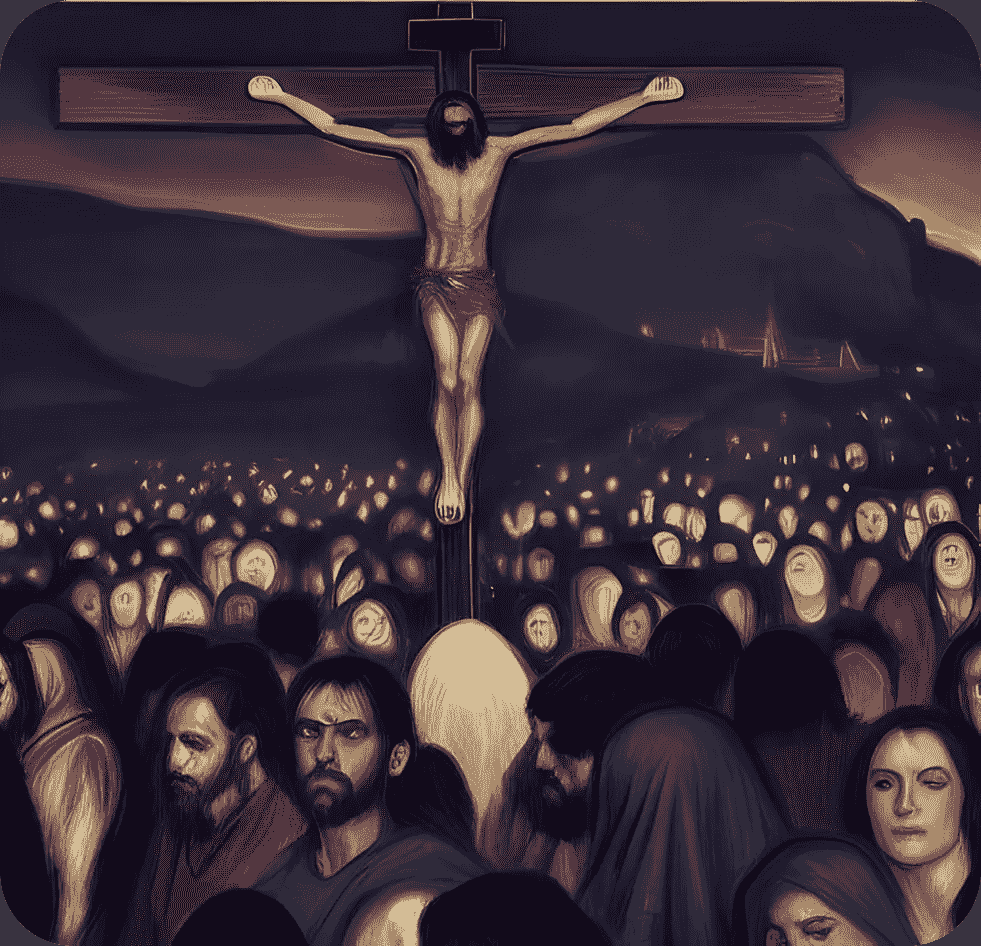
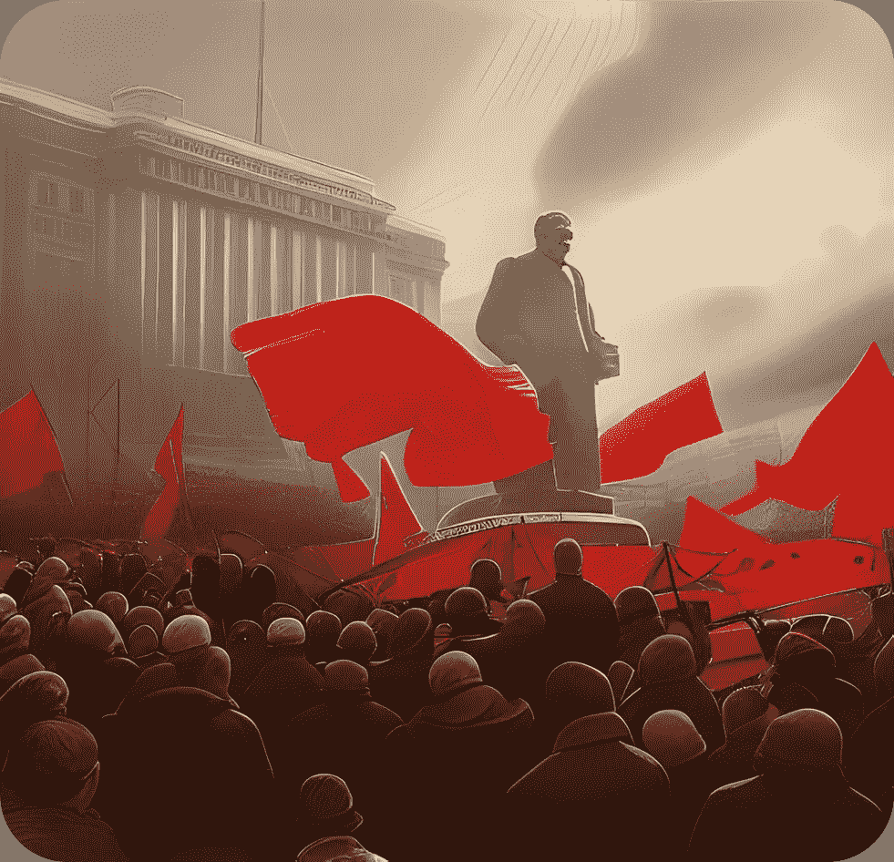
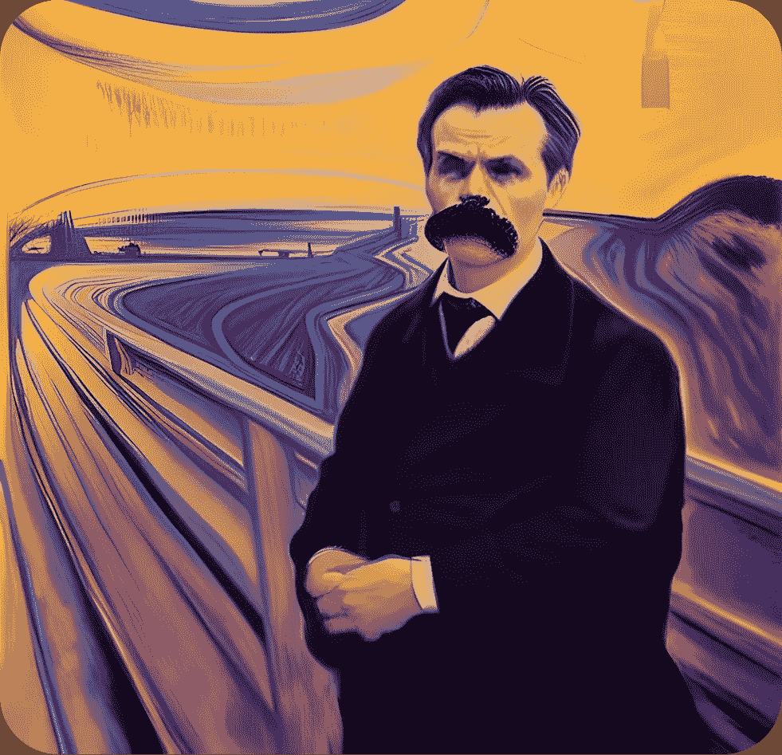
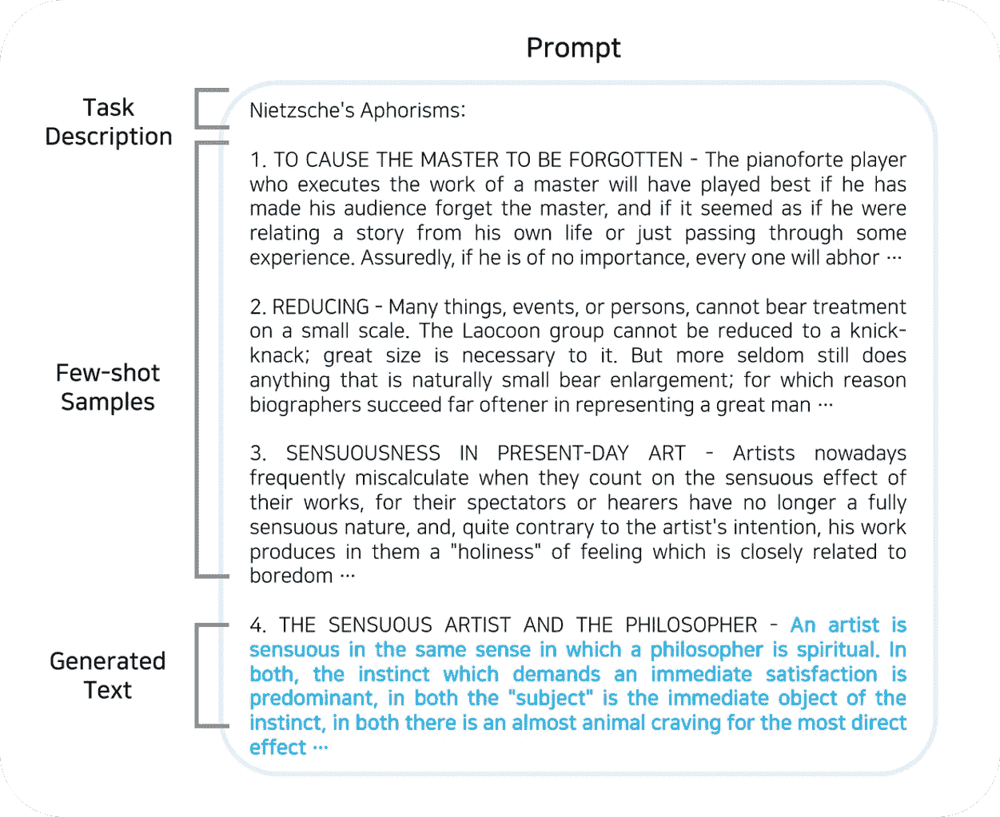
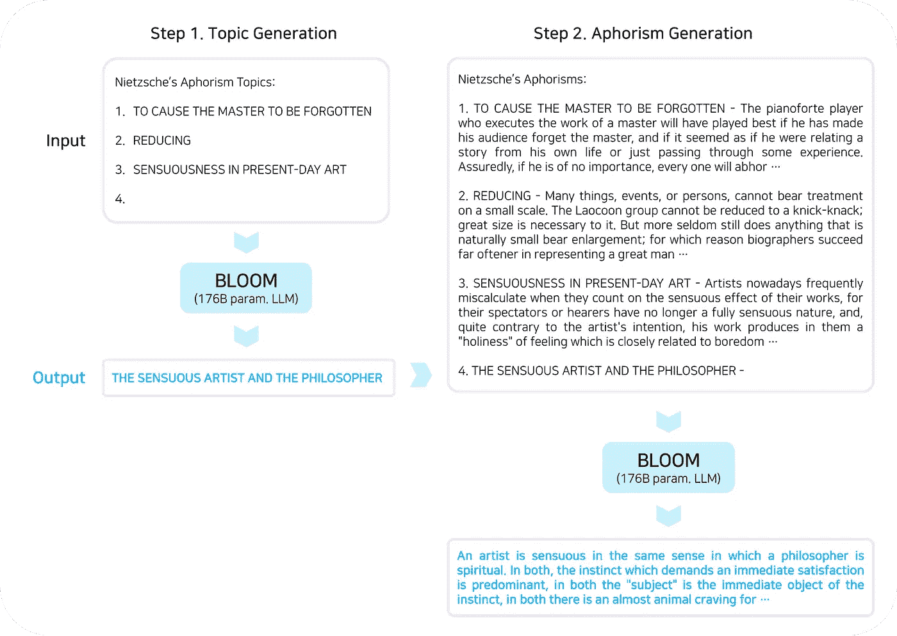

# 我用人工智能生成尼采的格言

> 原文：<https://pub.towardsai.net/i-used-ai-to-generate-nietzschean-aphorisms-d18a79df30a5?source=collection_archive---------3----------------------->

## 大型语言模型能帮助人类克服现代世界的虚无主义危机吗？

自从 OpenAI 发布了基于大量文本数据训练的大型语言模型(LLM)GPT-3 以来，自然语言处理社区一直对使用这项技术进行计算创造性(例如，生成博客帖子、小说或诗歌)的潜力感到兴奋。我个人认为，LLM 不仅是合成媒体内容或撰写文学作品的方便工具，而且有可能解决一个更严重的问题:**现代世界虚无主义的出现导致的意义危机**。

## 上帝死了——尼采，虚无主义的先驱

根据以预言上帝死亡而闻名的 19 世纪德国哲学家弗里德里希·尼采的观点，现代文明被虚无主义所困扰；生命中所有价值结构和意义的丧失。当尼采宣布“上帝死了”时，他不仅仅是在观察宗教的衰落，而且还指出，几个世纪以来一直是西方文明基石的普世价值不再具有任何意义，因此每个人都不得不自谋生路，试图理解一个似乎越来越混乱和充满苦难的世界。



随着上帝的死亡，现代文明被虚无主义所困扰(作者创造&稳定扩散)

虽然启蒙时代和科学革命在引领信仰的丧失方面发挥了重要作用，但尼采主要将现代人精神上的衰弱归咎于当时占主导地位的世界观，即柏拉图唯心主义、基督教和乌托邦主义。对尼采来说，这些哲学是一种逃避现实的形式，因为它们基于对完美的理想主义世界的信仰(例如，柏拉图式的，天堂，共产主义乌托邦等等)。)它独立于物质世界，并高于物质世界，在物质世界中，我们常常感到我们的生活是残酷的，严酷的，痛苦的短暂。他们的功能是提供**对“真实世界”**的宏大叙事，并给予希望，即生活中有比我们尘世的存在更重要的东西，但这种观点最终是颓废的，因为它提供了虚假的希望，并鼓励人们从生活和现实世界中抽身。当这些对现实的理想主义观点被证明是错误的(它们不可避免地是错误的)时，它们所支撑的整个价值结构就会崩溃，导致精神危机和生活意义的丧失。这就是尼采所说的**虚无主义**，他将其视为对西方文明的最大威胁。



意识形态旨在通过创造一个乌托邦(由作者创造&稳定传播)来终结历史

尼采关于虚无主义危险的警告被证明是预言性的，因为 20 世纪的标志是两次世界大战和数百万人的可怕种族灭绝，这主要是由法西斯主义、极权主义和共产主义推动的；旨在通过创造乌托邦终结历史的意识形态，无论是基于种族、民族还是阶级的。根据哲学家朱利安·杨的说法，虽然他们中的大多数人拒绝形而上学的观点，但他们仍然是伪装的“真实世界”哲学，其中物理和形而上学之间的旧区别被重新解释为现在和未来之间的区别。现代人，在上帝死亡和随之而来的灾难之后，留下了荒谬和无意义的感觉，需要一个新的宏大叙事，或者更好的是，克服对这种叙事的依赖。

# 重估所有价值——用法学硕士创造格言

人类如何完成克服虚无主义的任务？尼采提出，我们必须首先仔细检查我们认为理所当然的伦理规范，他称这个过程为对所有价值的**重估**。这个过程揭露了这些“真实世界”的宏大叙事是如何促进颓废的，这样人类就可以不依赖这种否定生命的哲学而创造自己的价值。对尼采来说，重估价值的方法是写格言——简短、精辟、高度浓缩的陈述，识别价值体系背后的谱系和心理动机，以及它们掩盖人类生存状况的不确定性的徒劳尝试。



通过 AI 技术从疯狂的深渊召唤尼采(作者创作&稳定扩散)

最近，我读了很多尼采的作品——我被他用格言写作的风格以及他如何用这种文学形式来揭示现代性宁愿隐藏的真相所吸引。我认为这是一种耻辱，自从尼采在 44 岁时遭受了严重的精神崩溃后，他再也不能创作出杰出的作品。这让我想到:如果我们能把尼采从疯狂的深渊中召唤出来，通过人工智能技术让他复活，会怎么样？具体来说，如果我们可以使用 LLM 来生成以前闻所未闻的尼采格言会怎么样？

NLP 爱好者已经表明，只需提供少量的例子，就可以让 OpenAI 的 GPT-3 生成特定诗人风格的诗歌作品。这种方法被称为**少数镜头学习**，其中 LLM 能够在推理时间内从少量数据(又名**少数镜头样本)**中学习执行某项任务。这些少拍样本包含在输入文本中(又名**提示)**，通常以编号列表的形式。LLM 是一个主要为自然语言完成任务而训练的模型，然后它将生成符合所提供样本的格式和风格的文本。我想没有理由为什么同样的方法不能用来产生尼采的格言。



尼采格言生成的提示(由作者创建)

尼采格言生成的主要思想如下:我用一堆尼采的格言，以特定的方式格式化它们，然后把它们输入一个 LLM。然后，该模型将“学习”尼采格言的风格和内容，并生成新的、从未见过的格言，这些格言与尼采的格言难以区分(至少在原则上)。希望这些格言能够提供对人类状况的深刻见解。

# 人类，太人类了——尼采格言的少量学习教程



Nietzschean 警句生成工作流概述(由作者创建)

我使用尼采的<human all="" too="" human="">作为少量样本的来源，因为它以格言集的形式出现。古腾堡计划提供了完整的英文翻译文本，这是一个包含大量经典文学作品的巨大资源。因为文本文件的格式不适合 NLP 操作，所以预处理步骤是必要的。解析文本文件后，我生成了两个列表；一个用于格言本身，另一个用于相应的章节标题。稍后，章节标题将用作格言主题。下面是将整个文本文件转换成格言及其主题列表的代码。</human>

```
def preprocessing(file_dir):

    # read text file into book_text variable
    book_text = open(file_dir, 'r', encoding='utf-8').read()

    topic_data = [] # list for storing section titles (used as topics)
    aphorism_data = [] # list for storing aphorism texts

    # aphorism sections are seperated by '\n\n\n' strings
    for chunk in book_text.split('\n\n\n'):

        chunk = chunk.split('\n\n')[-1] # remove section number
        chunk.replace('\n', ' ') # remove newline characters
        chunk.replace('_', '') # remove underscores

        # topic (section title) and aphorisms are seperated by '.--' strings
        topic, aphorism = chunk.split('.--')

        topic_data.append(topic.upper()) # capitalize topics
        aphorism_data.append('.--'.join([topic.upper(), text.aphorism()]))

        return topic_data, aphorism_data
```

生成过程是双重的。首先，LLM 生成一个新的格言主题，给出一个随机选择的主题示例列表。第二，在给定由随机选择的主题-格言对和前一步中生成的主题组成的提示的情况下，LLM 生成新的格言。所以需要两个提示:题目提示和警句提示。以下是提示工程的代码。

```
# I used 30 topic samples
def topic_prompt(topic_samples):

    prompt = 'Nietzsche\'s Aphorism Topics:\n' # task description

    # numbered list of few-shot samples
    for n, topic in enumerate(topic_samples):
        prompt += f'\n{n+1}. {topic}'

    prompt += f'\n{len(topic_samples)+1}.'
    return prompt

# I used only 3 aphorism samples due to LLM context length
def aphorism_prompt(aphorism_samples, generated_topic):

    prompt = 'Nietzsche\'s Aphorism:\n' # task description

    # numbered list of few-shot samples
    for n, aphorism in enumerate(aphorism_samples):
        prompt += f'\n{n+1}. {aphorism}'

    # append the generated topic to the prompt
    prompt += f'\n{len(aphorism_samples)+1}. {generated_topic}.--'
    return prompt
```

在这个项目中，我使用了开源的 176B 参数 LLM [BLOOM](https://huggingface.co/bigscience/bloom\) ，它可以通过 [Huggingface 推理 API](https://huggingface.co/inference-api) 免费访问。注意，任何足够强大的 LLM(例如，GPT-3、PaLM 等。)能够执行少镜头学习。如上所述，生成过程是双重的——首先，我们生成主题，然后是格言。下面是用 BLOOM 生成尼采格言的代码。

```
import requests

def generate(prompt, max_new_tokens):

    API_URL = "https://api-inference.huggingface.co/models/bigscience/bloom"
    headers = {"Authorization": "Bearer YOUR_HF_TOKEN_HERE"}

    payload = {
        "inputs": prompt, # prompt should be less than 1000 tokens

        # the following decoding setting yields coherent results
        "parameters": {"max_new_tokens": max_new_tokens, 
                       "do_sample":True, 
                       "top_p":0.9, 
                       "repetition_penalty":2.0, 
                       "temperature":0.85, 
                       "return_full_text":False, 
                       "use_gpu":True, 
                       "wait_for_model":True}
        }
    response = requests.post(API_URL, headers=headers, json=payload)
    output = response.json()

    return output[0]['generated_text']

# step 1\. generate topic
prompt = topic_prompt(topic_samples)
generated_topic = generate(prompt, 16).split(f'{len(topic_samples)+1} ')[-1].split('\n')[0].strip()

# step 2\. generate aphorism
prompt = aphorism_prompt(aphorism_samples, generated_topic)
generated_aphorism = generate(prompt, 250).split(f'{len(aphorism_samples)+1} ')[-1].split('\n')[0].strip()
```

# 结果

该模型产生了令人印象深刻的结果。它能够在几分钟内成功地生成符合尼采写作风格和主题的格言。虽然产生的格言绝非完美，但我相信它们成功地刻画了“尼采式”的特征。下面是一个提示及其完成方式的示例(粗体文本):

```
Nietzsche’s Aphorisms:

1\. TO CAUSE THE MASTER TO BE FORGOTTEN - The pianoforte player who executes the work of a master will have played best if he has made his audience forget the master, and if it seemed as if he were relating a story from his own life or just passing through some experience. Assuredly, if he is of no importance, every one will abhor the garrulity with which he talks about his own life. Therefore he must know how to influence his hearer’s imagination favourably towards himself. Hereby are explained all the weaknesses and follies of "the virtuoso."

2\. REDUCING - Many things, events, or persons, cannot bear treatment on a small scale. The Laocoon group cannot be reduced to a knick-knack; great size is necessary to it. But more seldom still does anything that is naturally small bear enlargement; for which reason biographers succeed far oftener in representing a great man as small than a small one as great.

3\. SENSUOUSNESS IN PRESENT-DAY ART - Artists nowadays frequently miscalculate when they count on the sensuous effect of their works, for their spectators or hearers have no longer a fully sensuous nature, and, quite contrary to the artist’s intention, his work produces in them a "holiness" of feeling which is closely related to boredom. Their sensuousness begins, perhaps, just where that of the artist ceases; they meet, therefore, only at one point at the most.

4**. THE SENSUOUS ARTIST AND THE PHILOSOPHER - An artist is sensuous in the same sense in which a philosopher is spiritual. In both, the instinct which demands an immediate satisfaction is predominant, in both the "subject" is the immediate object of the instinct, in both there is an almost animal craving for the most direct effect; both are only just as little consistent as is the animal in this respect. The difference between them consists in this, that in the artist the sensuousness is always the most active principle, while in the philosopher it is only the most passive; in the artist the sensuousness is determined by a certain narrow sphere of the sensuous, while in the philosopher it is determined by a certain narrow sphere of the spiritual. Thus the sensuousness of the artist and that of the philosopher are in direct antithesis to each othe**r.
```

附录中有更多的格言。这个项目有一些限制，最大的限制是由于 BLOOM 的上下文长度限制，我只能使用三个少量拍摄的样本。我希望通过微调一个更小的语言模型来改进当前的框架，而不是依赖 BLOOM 的少量学习能力。

# 附录

```
**THE EARTH AND THE WORLD’S POWER** - Whoever desires to maintain that the earth was created by God, is not only doing violence to his own thought, but also insulting science, in so far as he affirms that there is something which is incomprehensible, that there is anything which we are not able to comprehend, and which therefore must have been produced by a superhuman force. But whoever, like us, looks at the earth from the point of view of science, regards the earth as a world-body, subject to the same laws as other world-bodies, and he will never be able to understand how an incomprehensible, spiritual, supernatural, or what not, can have produced anything out of nothing. The geological science, which has only been perfected within the last few hundred years, has taught us that the earth has always existed, and that the time since it has existed is only a few thousands of years. 

**THE PASSION OF THE INDIVIDUAL** - What is called the passion of the individual is a wish to be something. It is the pleasure of an individual to feel himself as a person, and to be as much as possible something. In the whole history of the world this is a most unusual and at the same time a most noble feeling, and it has the same value for an individual as a whole as the feeling of existence has for a world. It is because of this feeling that the individual is not entirely annihilated in the family and in the state. Every one who has felt this feeling must have had a great pleasure in acting alone and independently, in feeling himself as a person, and in being able to speak and to think. This feeling is so uncommon that it may be called the passion of the individual. 

**COMPARING ONE’S SELF TO THE AVERAGE** - It is only a defective man who compares himself with others. The healthy man does not seek in others what he can have himself. The healthy man knows that the real goal is his own person, and that there are others only in order that he may know himself. Therefore the real man does not go about seeking others, but he seeks himself. Therefore he who compares himself to the average does not go about seeking himself.

**HONOUR AND DUTY** - We are used to consider honour as a kind of property, as something belonging to us. It is indeed a peculiarly sensitive property, and therefore in our eyes a special source of enjoyment. The feeling of honour, however, is a purely artificial one, and is not more natural than a king’s crown. As the very idea of property is derived from exchange, so the idea of honour is derived from recognition. Honour is the feeling of property in a man’s own value, in a property which has been recognised by a third party, a feeling which must be acknowledged as independent of all other possessions, and as the highest of all possessions. The idea of honour is the idea of a property, which, as soon as it is in the possession of a man, must be recognised by every one else as his property, and as such must be treated. Honour is not a virtue but a good, not a moral but a legal property. Honour and duty are two different expressions for the same idea, for the relation of a man to himself, to his own special value. 

**THE DECADENCE OF ART** - The decadence of art is also the decadence of the understanding. The latter may be defined as the impossibility of creating a system of ideas and forms by which the manifold appearance of things could be expressed in a new way. The decadence of art is, therefore, not only the decadence of art, but that of the whole mental development.
```