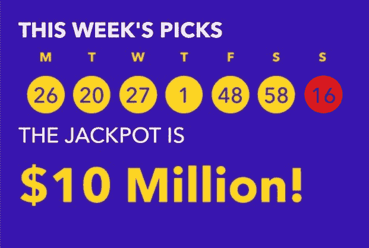
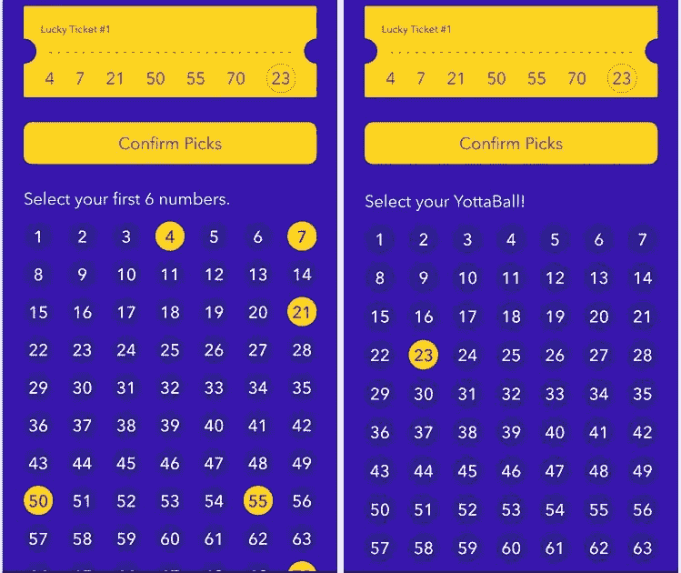
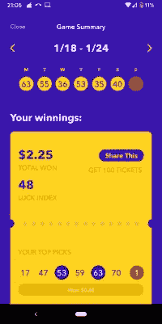
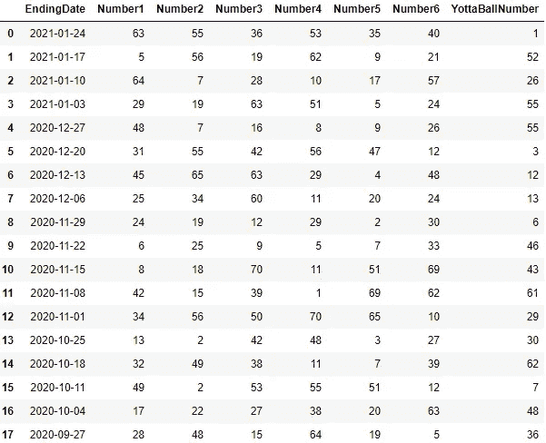
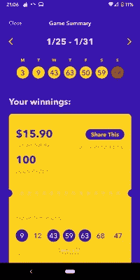
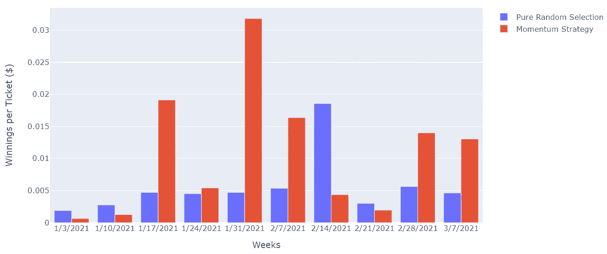
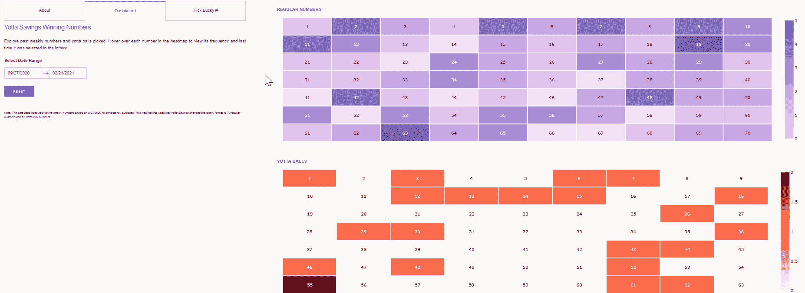

# 使用数据分析赢得彩票

> 原文：<https://pub.towardsai.net/i-used-data-analytics-to-play-the-free-lottery-and-won-578e618e2711?source=collection_archive---------2----------------------->

## [数据分析](https://towardsai.net/p/category/data-analytics)

## 一个以数据为中心的策略，你可以用它在 Yotta 彩票中挑选号码

作者使用 GIFMaker 创建的图像

彩票应该基于概率和随机性。你可以选择你的*幸运*号码，但它们真的不重要。你赢的机会应该和你让猴子帮你摘一样。这更像是一种心理现象，所以当你真的随机中奖时，你可以将其归因于你的“幸运”号码，从而密封你的确认偏差。

但是，如果有一种方法仍然可以选出那些比随机选择更好的*幸运数字*呢？不是基于特定的感觉或你的出生日期，而是基于模式、趋势和总体概率。成为一名数据呆子——这正是我尝试用 Yotta Savings 做的事情。

## 背景

Yotta Savings 是一个相对较新的与奖金挂钩的储蓄账户，它通过允许你免费玩彩票来激励你存钱。他们的前提很简单。你将钱存入他们的 FDIC 保险账户，账户余额每增加 25 美元，你就可以获得一张每周一次的彩票。每张彩票让你参加每周一次的抽奖，奖品从几美分到 1000 万美元不等。除此之外，你的钱还能获得相对不错的 0.20%的利率。总体而言，普通用户可以看到大约 2%的有效 APY，根据之前的[研究](https://www.asksebby.com/banking/yotta-savings-review)得出的结果，甚至更高。

就像任何其他彩票一样，你可以为每张彩票选择自己的幸运号码，或者让他们为你随机选择。你可以选择 6 个每日号码(1-70)和一个最终的约塔球号码(1-63)。

为 Yotta 彩票选择幸运数字的过程的手机截图

注册后的头几周，我选择了随机策略，挑选了几张幸运票。但我很快厌倦了在我的选择中使用幸运数字 7、我的生日和我的年龄的组合，只看到平均或较差的奖金。

所以我决定使用光学字符识别(OCR)，一些趋势的数据分析，以及编程来帮助我想出一个玩 Yotta 彩票的新策略。下面是我经历的过程和结果。

## 收集数据

我做的第一件事是从移动应用程序收集数据，这是前几周的所有中奖号码。虽然约塔彩票从 2020 年 7 月就有了，但我只收集了 2020 年 9 月 27 日的数据。这是出于一致性的目的，因为此时 Yotta [将数字选择](https://www.doctorofcredit.com/yotta-savings-review-get-steady-interest-lottery-chances-at-big-win/)扩展为其当前格式。

总共有 18 周的时间我必须收集数据。数量如此之少，我本可以轻松地在 Excel 中手动整理数据集，但我选择了使用 OCR。说你用了 OCR 就酷多了😉。

OCR 的工作方式是，它允许您“抓取”屏幕或图像，以提取字符并将其转换为结构化格式。在这种情况下，我的图像是来自我的移动应用程序的每周中奖号码的截图。

Yotta 应用程序中每周中奖号码的手机截图示例

正如你所看到的，这些图像很难处理，因为中奖号码周围有许多颜色、形状和噪声。

使用 Tesseract OCR 引擎和 Python，我采取了以下步骤将数字提取到数据框中:

1.  已将图像转换为灰度。
2.  对图像应用开放的形态学[变换](https://docs.opencv.org/master/d9/d61/tutorial_py_morphological_ops.html)。这使得提取具有噪声背景的字符变得更加容易。
3.  将每个数字裁剪成自己的图像。
4.  应用 OCR 从每个裁剪的图像中提取文本。
5.  将每个文本转换为数字并存储在数据框中。

这是最终的数据框。

## 分析数据——模式和观察

有了可访问形式的数据，我有了一些我感兴趣探索的初始问题。有没有更幸运的数字？哪些数字还没有被选中？重复的数字多久出现一次？每周第一次抽取多少号码？当然，我知道这些答案意义不大，因为每个数字每周都有均等的机会被选中。尽管如此，我的好奇心依然存在。

总的来说，我能够得出一些具体有趣的观察结果:

*   对于最后 8 周或数据集的后半部分，每周挑选的 6 个每日数字在最近挑选的(高动量)数字和低动量数字之间分成大约 3 比 3。有时是 4 比 2，但总体趋势是对半分。我将*高动量*定义为在最近一半的数据集中至少被选中一次的任何数字。其他的都是*低动量*。

原始 18 周数据集的高动量和低动量数值示例

*   选中的约塔球只在 55 这个数字上重复了一次(奇怪的是，是在连续几周内——没有双关的意思)。
*   Yotta 球从来都不是和日常数字一样的数字。
*   平均每周出现 2.88 个新的(从未挑选的)数字，如果只看最近几周，这个数字甚至更低。

## 建立一个挑选幸运数字的程序

接下来，我根据观察到的一些趋势编写代码，有策略地为每张票选择号码。具体来说，对于每张彩票，程序会随机抽取相应的号码:

> 1.正好 3 个高动量和 3 个低动量数字
> 
> 2.只有从未被选中的 Yotta Balls 号码
> 
> 3.与日常数字相比，约塔球必须是独一无二的

我称这种选择方式为:**动量策略**。剩下要做的唯一一件事就是运行代码，生成总共 500 张 2021 年 1 月 25 日至 1 月 31 日*这一周的门票。*

## 成功了吗？结果呢

结果呢？出乎意料的成功。那一周我总共赢了**15.90 美元**，这相当于实现的年度有效 APY 约为**7–8%**(假设我在未来几周赢了相同的金额)。相比之下，在那之前，我平均每周赢 2 美元。

获奖结果截图—作者提供的照片

> 我很激动。当然，这只是初学者的运气。我破解了挑选号码的密码了吗？

感觉积极，但不确信，我想继续使用这个策略，但…我不想花时间在应用程序上挑选我所有的票。这不值得我浪费时间。但是我可以做的是使用同样的策略，追溯和向前，假设计算我将会赚到的和我实际赚到的。我有模拟这种情况所需的所有数据。以下是 10 周的结果:

由于我持有的彩票数量每周都在变化，我将赢的钱标准化，以记录每张彩票的平均收入。如上所述，我最幸运的一周运用了我的动量策略，因为当时两种方法的收益差距最大。此外，这种策略在其他几周表现得更好或没什么不同。唯一的例外是 2 月 7 日的那个星期，我用完全随机选择的方法中了一张幸运的 10 美元的彩票。此外，在我动量策略表现平平的那几周，高动量和低动量数字的比例不是很平衡，所以从每组中选择 3 个数字可能没有帮助。

## 我会继续使用我的动量策略吗？

乍一看，这个策略似乎比随机选择帮我赢了更多的钱。但是没有足够的试验或显著的结果来排除这种可能性。对于统计爱好者来说，这个实验的 [**p 值**](https://www.scribbr.com/statistics/p-value/) 是 0.89。换句话说，不太重要。

在一天结束的时候，这个实验对我来说再次强调了彩票随机性背后的基本原理。无论我们对我们的“幸运数字”有多少感情，或者支持它们，它实际上只是基本的概率。赔率告诉你，在大多数彩票中，让计算机挑选你的号码并不比你自己挑选号码好多少。

然而，有一些有趣的事情可以解释为什么我*可以用这种方法*赢得更多:

*   因此，我排除了一些特定的极不可能发生的事件，让我有更大的机会从更可能发生的情况中选出数字。
*   我的号码仍然是随机选择的，只是方式不同。许多人在玩乐透时，经常选择一些通常挑选的幸运数字(3、7、21 等。).当他们最终赢得一个更大的累积奖金时，奖金在每个赢家之间分配。因此，如果他们的幸运数字更常见，更多的人也有可能拥有这些数字，他们的个人奖金会更少。

我会继续这种方法吗？我可能每周只玩 50-100 张票，除非 Yotta 增加了批量上传你的选择的功能。但是有些事情可能需要调整。当高动量数与低动量数的比率变得更加不平衡时，当前的策略可能不是有利的。因此，我将调整我选择的代表组大小的高值和低值的数量。此外，Yotta 球的大多数号码最终都会被挑选出来，所以只让*挑选新号码是不明智的。我会给从未选择过的数字更多的权重，或者换成完全随机的方法。*

## 摘要

为了帮助你以相似或不同的方式选择你的 Yotta 号码，我创建了一个交互式 Dash-Plotly 仪表板来跟踪号码频率。它还允许您为 Yotta 彩票生成自己的幸运数字！我计划每周更新一次。你可以使用我的动量策略，选择你自己的高动量与低动量的比值，改变选择 Yotta 球的策略，或者简单地随机选择一切。仪表盘位于[这里](https://yotta-analytics.herokuapp.com/)——祝你好运！😉

Yotta 仪表板演示—由作者制作

## 参考资料和资源

[1] — Yotta Analytics [仪表盘](https://yotta-analytics.herokuapp.com/)

[2] — [生成的门票&于 2021 年 1 月 31 日](https://drive.google.com/file/d/1DOdk7BCQOT0W3gshtQUXAZEp7Z4wbfLn/view?usp=sharing)开始发售

[3]——“第 23 章——彩票的统计。”*体育和彩票市场手册*，唐纳德·b·豪施和 w·t·齐姆巴著，爱思唯尔/北荷兰，2010 年。

[4]——亚当·库恰尔斯基。"一群麻省理工学院的学生如何赢得马萨诸塞州的彩票."*大西洋*，大西洋传媒公司，2016 年 2 月 23 日，[www . The Atlantic . com/business/archive/2016/02/how-MIT-students-gamed-The-lottery/470349/。](http://www.theatlantic.com/business/archive/2016/02/how-mit-students-gamed-the-lottery/470349/.)

[5] — [对 Yotta 储蓄的平均有效 APY 范围进行研究](https://www.asksebby.com/banking/yotta-savings-review)

> 有关 Yotta Savings 的更多信息，请点击此处查看他们的网站[。](https://www.withyotta.com/)
> 和[使用邀请代码**数据**注册](https://members.withyotta.com/register?code=DATA)，您将获得第一周的 100 张免费门票！