# 我希望我是梵高…

> 原文：<https://pub.towardsai.net/i-wish-i-were-van-gogh-6bf474899ff2?source=collection_archive---------1----------------------->

## 人工智能一切皆有可能！

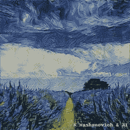

薰衣草田(图片由作者提供)

# 内容

*   艺术和科学
*   科学视角:神经类型转移
*   艺术透视:名画与背后的故事
*   让它发生
*   当梦想成真

# 艺术和科学

前段时间 Gatys 等人[1]的一篇标题为*艺术风格的神经算法*的科学论文引起了我的注意。作者试图回答这个研究问题:**人工智能能否产生杰作**？他们通过开发神经风格转移(NST)算法证明了这一点。神经风格转移算法是一种人工智能系统，能够在图像的内容和风格之间产生一种特殊的“化学反应”，从而创作出与伟大艺术家风格相似的杰作。基于深度神经网络的 NST 算法是科学和艺术之间巨大协同作用的一个例子。

在本文中，您将了解更多关于艺术风格的神经算法，看到一些使用该算法生成的惊人示例，并阅读一些用作造型模板的名画背后的有趣故事。

# 科学视角:神经类型转移

Gatys 等人的论文[1]的中心主题是图像数据的内容和风格重建，为此，他们使用了卷积神经网络(ConvNets)。ConvNets 受到人类神经元对人脑视野中刺激的反应的启发。ConvNets 是专门为二维图像设计的深度神经网络，通过多个过滤器、通道和层处理视觉数据。过滤器的目的是提取某些图像特征。应用于图像数据(即，像素)的过滤器产生回旋层的特征图，并且每个图是输入图像的不同版本。卷积网络可以为单个图像并行编排数百个过滤器。图像通道代表颜色，它们为滤镜添加了第三个维度，即深度。通常，对于每种红、绿、蓝颜色，每个滤镜有 3 个通道。卷积网络也有层次。分层排序的层以前馈方式处理视觉信息。ConvNet 架构由不同类型的层组成。

通常，ConvNet 配置从不同的卷积层开始，每个卷积层都定义了激活函数、大小和输出数量。这些图层中的一些已经通过用于提取主要特征和抑制噪声的汇集图层得到了“加强”。该架构以完全连接的层结束，这些层将图像转化为适合于使用 [Softmax 函数](https://en.wikipedia.org/wiki/Softmax_function)进行分类的[多层感知器](https://en.wikipedia.org/wiki/Multilayer_perceptron)的形式。每一层都可以通过重建相应的特征图来可视化。在此，较高级别是特别感兴趣的，因为它们可以捕捉图像的上下文，从而在概念级别提取图像。

有几种具有不同架构的预训练模型，包括 NST 算法中使用的 VGG 模型[3]。VGG 是一个建立在 [ImageNet](https://www.image-net.org/) 上的物体识别模型，ImageNet 是一个大规模的图像数据库，拥有超过 1400 万张图像，分为 2 万多个类别。VGG 模型本身是在 ImageNet 的一个子集上训练的，ImageNet 有 130 万张图片，分成一千个类别[4]。VGG 模型已经在 Python 的 [Keras](https://keras.io/) 和 [PyTorch](https://pytorch.org/) 深度学习框架中实现。VGG 有几种配置，其中 VGG-16(图 1)和 VGG-19 是最常见的，分别有 16 和 19 个卷积层。

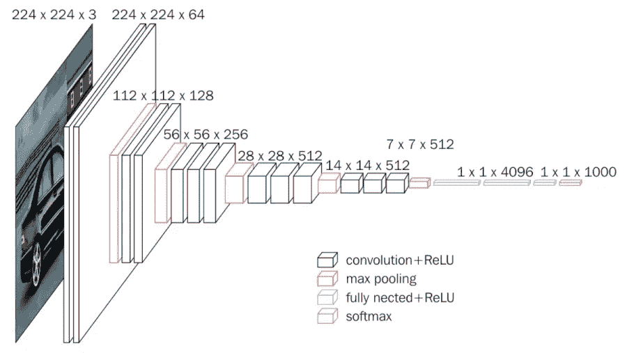

*图一。VGG16 卷积网络架构(图片来自*[*neuro hive . io*](https://neurohive.io/en/popular-networks/vgg16/)*)*

NST 算法利用了 ConvNet 的能力，通过从该层的特征图中重建图像来可视化该层的图像。Gatys 等人的主要发现是，ConvNet 中的内容和样式表示是可分离的，因此一个图像的内容可以与另一个图像的样式相结合，以产生具有两者特征的子图像(图 2)。

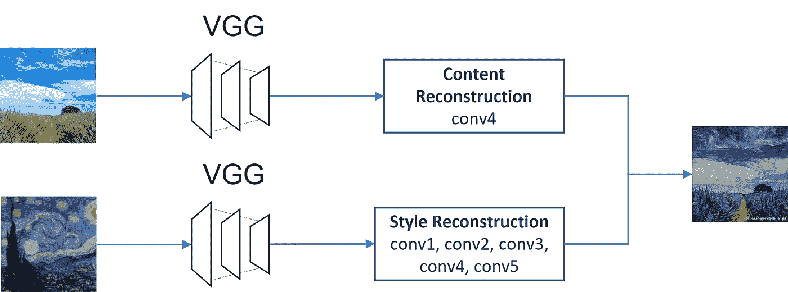

*图二。神经风格转移概念(图片由作者提供)*

该算法的第一部分是对内容和风格图像的分析。对于内容重构，使用网络中的较高层，对于风格重构，多个层的滤波器响应之间的相关性起着重要作用。该算法的第二部分是子图像的合成，它基于两个术语——内容和风格——的最小损失函数。内容和风格重建之间的相对权重表明我们对风格或内容表示的重视程度。最佳比率应根据经验指定，如果选择的值太低，则只能捕获样式，如果值太高，则相反。

NST 算法在 VGG 网络架构中仅利用两种类型的层:卷积层和池层。具体地，对于内容表示，提取了 conv4，对于风格表示，使用了卷积层 1 至 5。Gatys 等人的 PyTorch 实现的 NST 算法在 [Github](https://github.com/leongatys/PytorchNeuralStyleTransfer) 上公开发布。

# 艺术透视:名画与背后的故事

## 星光灿烂的夜晚

不可能不包括世界上最具标志性的画作之一——文森特·梵高的代表作*《星夜》*！这幅画是他在 1889 年画的，当时他在法国的一家精神病院住院，在经历了一次严重的精神崩溃后被收治入院。这幅画描绘了一棵柏树的景观，透过他病房的窗户可以看到柏树。在一个神奇的夏夜，他在清晨和日出前观察天空，捕捉到了星星、月亮和行星金星。最神秘的是闪烁的夜空从画布上生动地照亮。艺术家、历史学家和科学家一直在猜测，这些神奇的漩涡笔触是否反映了他混乱的精神状态，或者是他油画颜料中发现的铅中毒的结果，导致视网膜肿胀，从而导致物体周围出现光圈的视觉。或者像一些人争论的那样，它们可能是他的天才头脑找到了一种表现星系或彗星螺旋的方法的结果。一些天体物理学家最近提出的理论之一是，这幅画与通过美国宇航局望远镜看到的发光星尘有着神秘而惊人的相似之处。物理学家们还研究了梵高的技术与流体湍流之间的关系([ted](https://ed.ted.com/lessons/the-unexpected-math-behind-van-gogh-s-starry-night-natalya-st-clair))。

## 阿黛尔·布洛赫·鲍尔的肖像

阿黛尔·布洛赫-鲍尔是一个富有的大亨的妻子，他委托古斯塔夫·克里姆特为他的妻子画了两次画。她第一幅也是更著名的肖像画，也被称为*黄金女郎*或*黄金女郎*克里姆特完成于 1907 年。它是以金银叶为主的油画。他从拜占庭镶嵌画和埃及艺术中找到了这幅杰作的灵感。阿黛尔的第二幅肖像是布面油画，完成于 1912 年。两幅画像都在二战期间被纳粹偷走。战后，这些画一直在维也纳的一家画廊展出，直到 2006 年，经过长时间的审判，它们才被归还给合法的主人。审判后不久，两幅画都在佳士得以当时创纪录的价格售出。这个非凡的故事在三部纪录片和一部故事片[中讲述。](https://www.imdb.com/title/tt2404425)

## 戴珍珠耳环的女孩

> 北方的蒙娜丽莎

这幅由弗米尔创作的 17 世纪的画作通常被称为，从那时起就吸引了美术崇拜者的兴趣。这幅画有什么如此迷人和神秘的地方？维米尔对戏剧风格灯光的掌握；女孩凝视的神秘；她带着蓝色和黄色头巾的异国情调的服装；巨大的闪闪发光的珍珠(或者可能是抛光的金属)耳环；她性感的嘴唇；女孩身份不明；这幅画是一个虚构人物的肖像还是一个虚构人物的肖像，这种两难境地一直是许多艺术家的灵感来源。一部小说和一部由斯嘉丽·约翰逊主演的同名[电影](https://www.imdb.com/title/tt0335119/)都是直接从弗米尔的画作中获得灵感，它已经被用在了许多艺术书籍和文物的封面上。

## 艺术家弗里达·卡罗

弗里达·卡罗是一位墨西哥艺术家，她以 55 幅色彩大胆而鲜明的自画像而闻名。她说:

> 我画自画像是因为我经常独自一人，因为我是我最了解的人。

弗丽达的绘画反映了她童年时因小儿麻痹症而饱受折磨的个人生活；她在十几岁时遭遇了一次公共汽车事故，造成了她终生的痛苦和 30 次手术；因为她和丈夫的不稳定关系，她和丈夫结过两次婚。泰特现代美术馆认为卡罗是

> 二十世纪最重要的艺术家之一。

她的个人生活和作品启发了许多文学、音乐和电影领域的艺术家。

## 脑筋急转弯

猜一猜！在下图的四个角落里，都有弗丽达画的自画像。剩下的图像是弗里达的照片，其中四张是用 NST 算法生成的。将 NST 生成的照片与相应的角画配对。

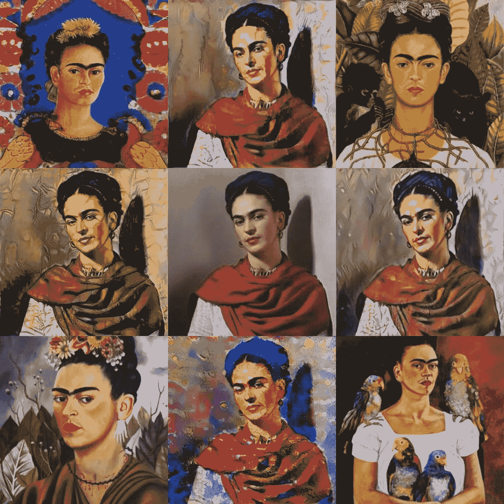

*弗里达·卡罗自画像(图片来自:* [*左上*](https://www.fridakahlo.org/self-portrait-the-frame.jsp)*[*右上*](https://en.wikipedia.org/wiki/File:Frida_Kahlo_(self_portrait).jpg)*[*左下*](https://www.fridakahlo.org/self-portrait-dedicated-to-dr-eloesser.jsp)*[*右下*](https://www.fridakahlo.org/me-and-my-parrots.jsp)*[*居中*](https://www.fridakahlo.org/) *)*****

# **让它发生**

**NST 算法的 PyTorch 实现有很多，比如 [L. Gatys](https://github.com/leongatys/PytorchNeuralStyleTransfer) 和[a . jack](https://pytorch.org/tutorials/advanced/neural_style_tutorial.html)。PyTorch 中提供的 VGG 模型作为预训练的深度学习模型，已用于特征提取和可视化的算法中。NST 算法[2]由以下步骤组成:**

## **步骤 1:设置 NST 输入参数**

1.  **通过将内容和样式图像调整到相同的尺寸并标准化输入值以与 VGG 模型兼容来预处理内容和样式图像。**
2.  **使用 ImageNet 数据集的预训练权重创建 VGG 模型的实例。**
3.  **指定迭代次数。**
4.  **指定内容和样式图像表示之间的相对权重。**

## **步骤 2:创建模型并计算损失**

1.  **重构 VGG 网络以访问网络的中间层(例如 Conv2d、ReLU、MaxPool2d、AvgPool2d)并选择感兴趣的卷积层。**
2.  **对于内容重构，提取单个卷积层。建议使用中间层(例如 conv_4 或 conv_5)。计算卷积层的特征图和原始内容图像的特征图之间的内容损失。**
3.  **对于样式重建，提取多个感兴趣的 VGG 图层并利用图层之间的要素相关性。将总样式损失计算为每个卷积层(即，conv_1 到 conv_5)的损失之和。**
4.  **为样式和内容表示创建一个由提取的层组成的新模型实例。**

## **步骤 3:执行神经类型转移**

**从 PyTorch 库中选择一个梯度下降优化算法。**

**对于 1.3 中规定的每次迭代，执行以下步骤:**

1.  **在作为内容图像副本的输入图像上训练新模型(来自步骤 2.4)。**
2.  **从步骤 2.2 和 2.3 中计算的内容和风格损失计算总损失的总和。**
3.  **通过应用步骤 1.4 中的相对权重来修改总损失。**
4.  **运行优化算法，使用标准反向传播对修正的总损耗计算梯度；优化器找出应该更新的模型参数。**
5.  **最后，用计算的梯度迭代更新输入图像，直到它同时匹配一个图像的风格和另一个图像的内容。**

**返回新的(转换后的)图像。**

# **当梦想成真**

**我们来实验一下！**

**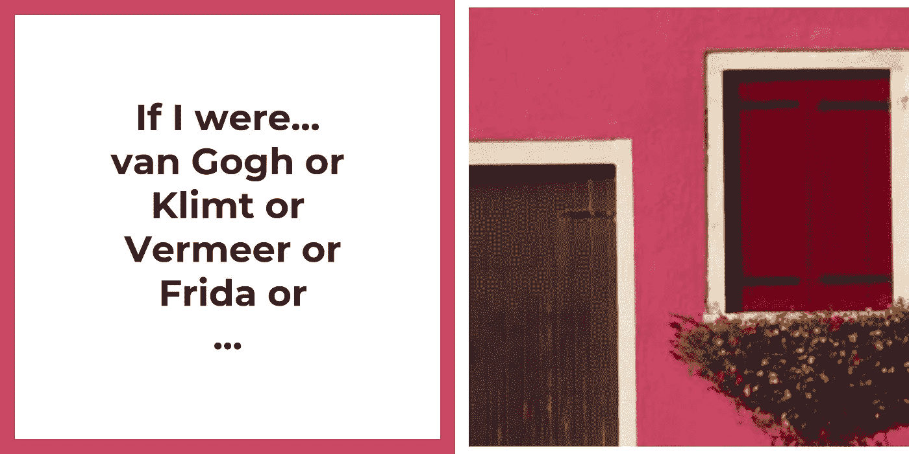**

**N·马沙诺维奇的威尼斯之家，2018 年**

**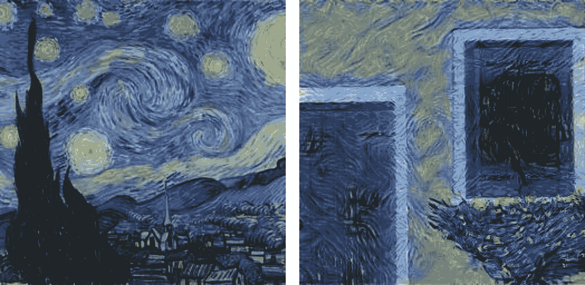**

**梵高的《星夜》，1889 年，纽约现代艺术博物馆(左图来自[维基共享资源](https://commons.wikimedia.org/w/index.php?curid=25498286))**

**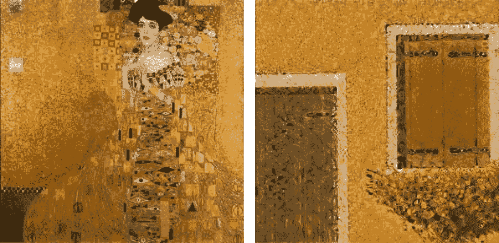**

**《金衣女子》，克里姆特，1907，纽约新美术馆(左图来自[维基共享资源](https://commons.wikimedia.org/w/index.php?curid=153485))**

**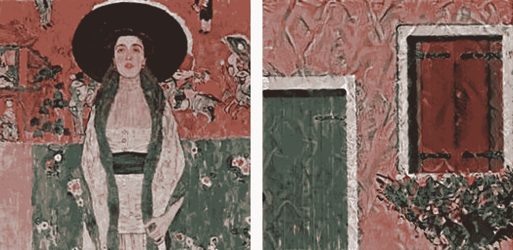**

**克利姆特 1912 年创作的阿黛尔·布洛赫-鲍尔二世肖像，私人收藏(左图来自[维基共享资源](https://commons.wikimedia.org/wiki/File:Gustav_Klimt_047.jpg))**

**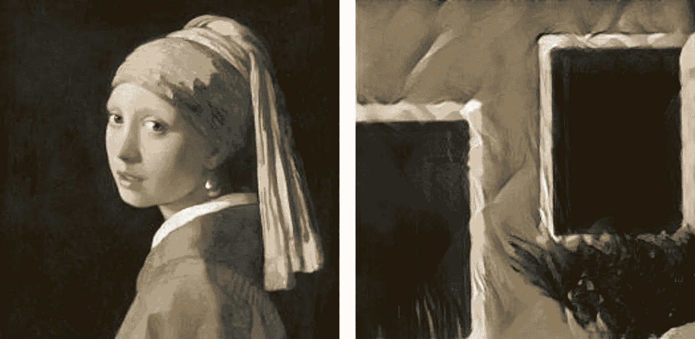**

**1665 年，海牙 Mauritshuis，维米尔的《戴珍珠耳环的女孩》(左图来自[维基共享资源](https://commons.wikimedia.org/w/index.php?curid=55017931))**

**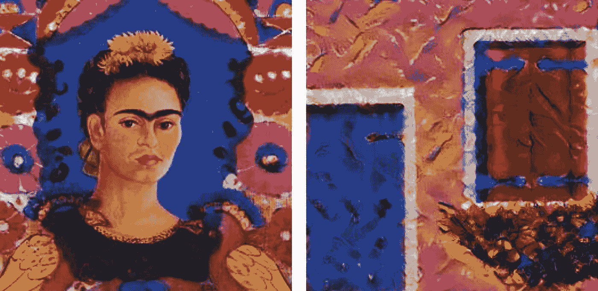**

**由弗里达·卡罗于 1939 年在巴黎国家现代艺术博物馆装帧(左图来自[fridakahlo.org](https://www.fridakahlo.org/self-portrait-the-frame.jsp))**

**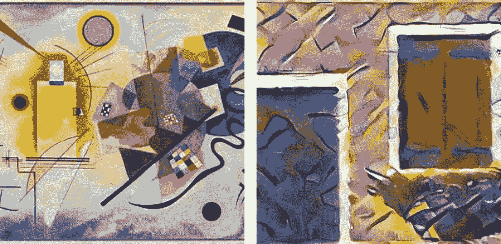**

**《黄红蓝》，康定斯基，1925 年，巴黎国家现代艺术博物馆(左图来自[维基共享资源](https://commons.wikimedia.org/w/index.php?curid=38658125))**

**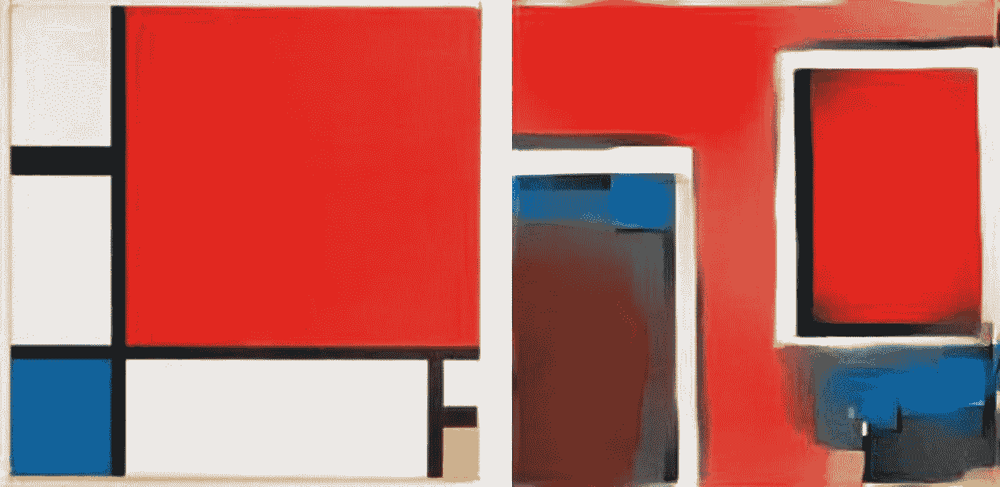**

**《红蓝黄》，蒙德里安，1930 年，苏黎世美术馆(左图来自[维基共享资源](https://commons.wikimedia.org/w/index.php?curid=37642803))**

**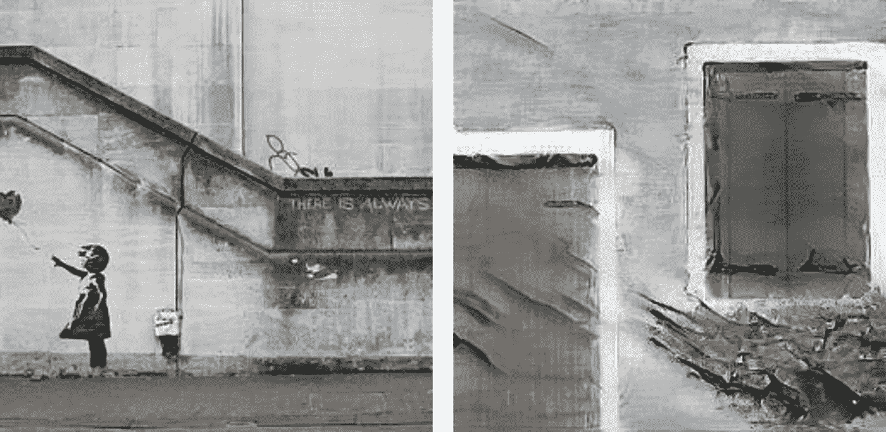**

**《永远有希望》(班克斯女孩和心气球)，Dominic Robinson，2004，伦敦南岸(左图来自[维基共享资源](https://commons.wikimedia.org/w/index.php?curid=73570221))**

## **参考**

**[1] A. Gatys，A. Ecker 和 M. Bethge，[一种艺术风格的神经算法](https://arxiv.org/abs/1508.06576) (2015)**

**[2] A. Gatys，A. Ecker 和 M. Bethge，[使用卷积神经网络的图像风格转换](https://www.cv-foundation.org/openaccess/content_cvpr_2016/papers/Gatys_Image_Style_Transfer_CVPR_2016_paper.pdf)，IEEE 计算机视觉和模式识别会议论文集(2016)**

**[3] K. Simonyan 和 A. Zisserman，[用于大规模图像识别的极深度卷积网络](https://arxiv.org/abs/1409.1556) (2014)**

**[4] A. Krizhevsky、I. Sutskever 和 G. Hinton，[使用深度卷积神经网络的 ImageNet 分类](https://proceedings.neurips.cc/paper/2012/file/c399862d3b9d6b76c8436e924a68c45b-Paper.pdf) (2012)**